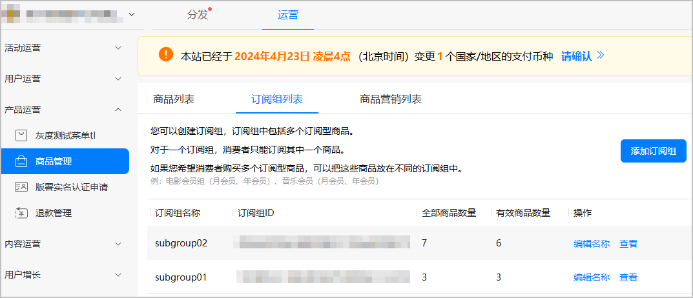
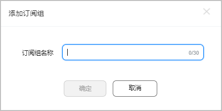

# 管理订阅组

每个自动续期订阅商品必须属于某个订阅组。一个订阅组中可以包含多个订阅型商品。用户订购自动续期订阅商品时，对于一个订阅组，只能订阅其中一个商品。如果希望用户购买多个订阅型商品，可以把这些商品放在不同的订阅组中，例如电影会员组（月会员、年会员）、音乐会员组（月会员、年会员）。

## 前提条件

* 您已在商品管理[新增商品](/docs/distribute/app-dist/game-center/game-center-operation-0000001239502315/game-center-goods-management-0000001194462390/game-center-creating-product-0000001239502323)。
* 建议使用Google Chrome浏览器访问商品管理服务，最低版本为62.0.3202.62。

## 新增订阅组

1. 登录[AppGallery Connect](https://developer.huawei.com/consumer/cn/service/josp/agc/index.html)，选择“APP与元服务”。
2. 在应用列表中点击需要新增订阅组的应用。
3. 选择“运营”页签，在左侧导航栏选择“产品运营 &gt; 商品管理”。
4. 选择“订阅组列表”页签，点击“添加订阅组”。

   

5. 在对话框中输入订阅组名称，完成后单击“确定”。

   