import MergeTable from "@site/src/components/MergeTable";

# 修改应用内商品

在商品管理新增商品后，您可以根据需要修改商品的基本信息或价格。您还可以对商品设置促销价格，以提高商品购买量。

## 前提条件

* 您已在商品管理[新增商品](https://developer.huawei.com/consumer/cn/doc/app/game-center-creating-product-0000001239502323)。
* 建议使用Google Chrome浏览器访问商品管理服务，最低版本为62.0.3202.62。

## 修改单个商品

###非订阅类商品

1. 登录[AppGallery Connect](https://developer.huawei.com/consumer/cn/service/josp/agc/index.html)，选择“APP与元服务”。
2. 在应用列表中点击需要修改商品的应用。
3. 在“运营”页签下的左侧导航栏中，选择“产品运营 > 商品管理”。
4. 在商品列表中，点击待编辑的非订阅类商品对应“操作”列的“编辑”。

   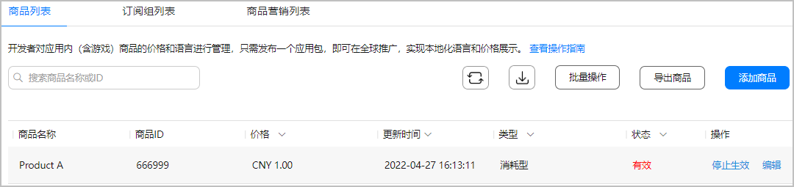

5. 如需修改商品基本信息，完成后点击“保存”。
6. 如需修改商品销售范围，点击商品编辑页面的“修改销售范围”。

   

   * 如后续新增国家或地区时，您希望商品自动支持在新国家或地区销售，请保持勾选“新国家或地区”选项。
   * 如您的订阅商品正在生效中，移除原销售国家/地区后，原销售国家/地区的用户将无法购买，生效中的现有订阅者将无法续期 。
   * 如消耗型/非消耗型/非续期订阅商品正在生效中，移除原销售国家/地区后，原销售国家/地区的用户将无法购买。

   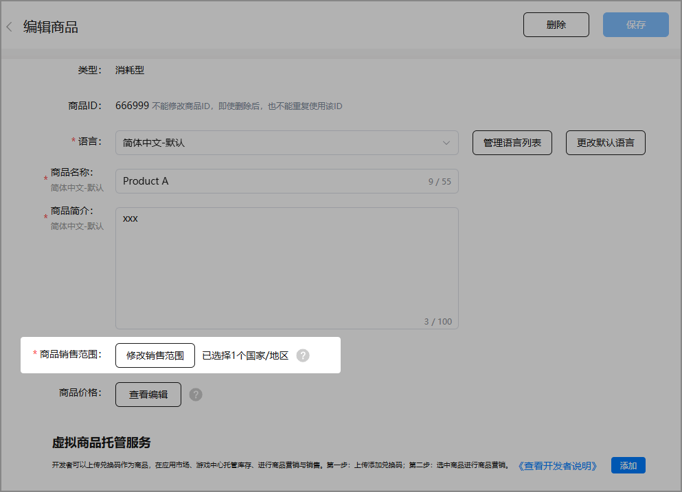
7. 如需修改商品价格，点击商品编辑页面的“查看编辑”。

   
8. 修改商品价格。
   * 不同国家/地区的商品价格

     a）在“商品价格”页面，点击右上角“编辑”。

     

     b）修改“汇率换算基准价格”，勾选排序规则，在列表中选择使用汇率刷新价格的国家/地区，点击“刷新”同步更新商品价格。如果您需要对指定国家/地区的商品价格进行调整，还可以手动填写来修改该国家/地区对应的商品的用户支付价格（含税）。

     

     + 当进行切换“汇率换算基准价格”选项（含税或不含税）时，如果该商品存在未开始或者正在进行中的促销活动，需要先删除/结束促销活动后才能切换成功。切换成功后之前计算出的所有国家/地区的价格将被清空，需选中所有国家/地区点击刷新重新计算。
     + 当华为支付新增上线国家后，如果开发者未重新确认保存商品价格，新上线国家的价格会受到汇率变动而变动（已上线国家价格不受影响）。只有当您重新确认保存商品价格后，新上线国家的价格才会固定下来，不再受汇率变动影响。

     
   * 商品促销价格

     您还可以根据您的促销策略设置商品促销价，详情请参见[设置促销价格](#section94711378421)。

9. 完成修改后，点击“保存”。

###自动续期订阅商品

1. 登录[AppGallery Connect](https://developer.huawei.com/consumer/cn/service/josp/agc/index.html)，选择“APP与元服务”。
2. 在应用列表中点击需要修改商品的应用。
3. 在“运营”页签下的左侧导航栏中，选择“产品运营 > 商品管理”。
4. 在商品列表中，点击待编辑的自动续期订阅商品对应“操作”列的“编辑”。

   

5. 如需修改商品基本信息，完成后点击“保存”。
6. 如需修改商品销售范围，点击商品编辑页面的“修改销售范围”。

   

   * 如后续新增国家或地区时，您希望商品自动支持在新国家或地区销售，请保持勾选“新国家或地区”选项。
   * 如您的订阅商品正在生效中，移除原销售国家/地区后，原销售国家/地区的用户将无法购买，生效中的现有订阅者将无法续期 。
   * 如消耗型/非消耗型/非续期订阅商品正在生效中，移除原销售国家/地区后，原销售国家/地区的用户将无法购买。

   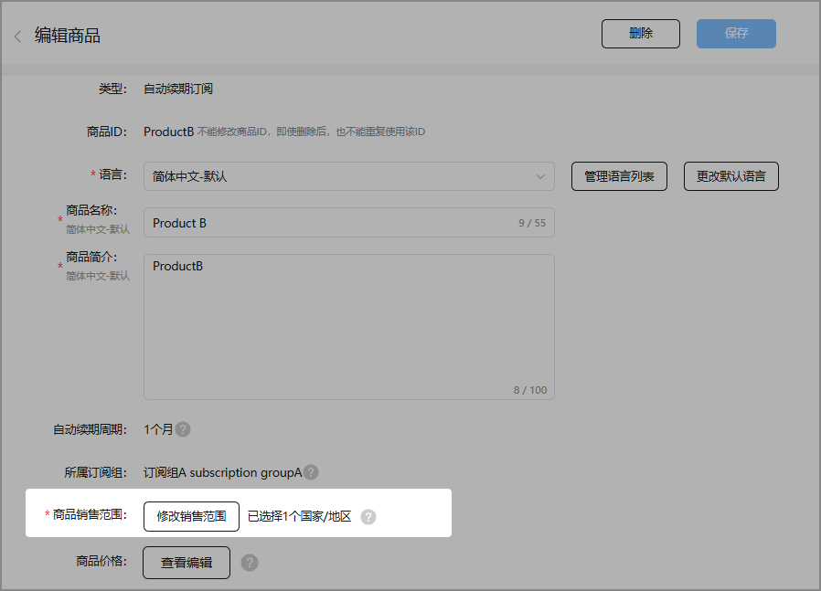
7. 如需修改商品价格，点击商品编辑页面的“查看编辑”。

   
8. 修改商品价格。
   * 不同国家/地区的商品价格

     a）在“商品价格”页面，点击右上角“编辑”。

     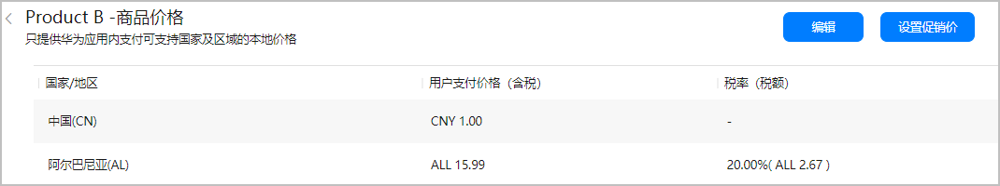

     b）修改“汇率换算基准价格”，勾选排序规则，在列表中选择使用汇率刷新价格的国家/地区，点击“刷新”同步更新商品价格。如果您需要对指定国家/地区的商品价格进行调整，还可以手动填写来修改该国家/地区对应商品的用户支付价格（含税）。

     

     + 当进行切换“汇率换算基准价格”选项（含税或不含税）时，如果该商品存在未开始或者正在进行中的促销活动，需要先删除/结束促销活动后才能切换成功。切换成功后之前计算出的所有国家/地区的价格将被清空，需选中所有国家/地区点击刷新重新计算。
     + 如果对商品进行涨价，且对当前订阅者生效，系统会对已订阅用户发送涨价通知，如用户未进行确认将不再自动续期。降价则不需要用户确认。
     + 当华为支付新增上线国家后，如果开发者未重新确认保存商品价格，新上线国家的价格会受到汇率变动而变动（已上线国家价格不受影响）。只有当您重新确认保存商品价格后，新上线国家的价格才会固定下来，不再受汇率变动影响。

     

     点击“保存”后，需在如下弹窗中确认新价格的生效对象，默认选择只针对新用户生效（对已有订阅老用户保持原价）。你可选择将涨价后的新价格应用于已有的订阅用户。

     

     将涨价后的新价格应用于已有的订阅用户将触发系统涨价通知消息，如果用户没有进行确认，将自动取消订阅。

     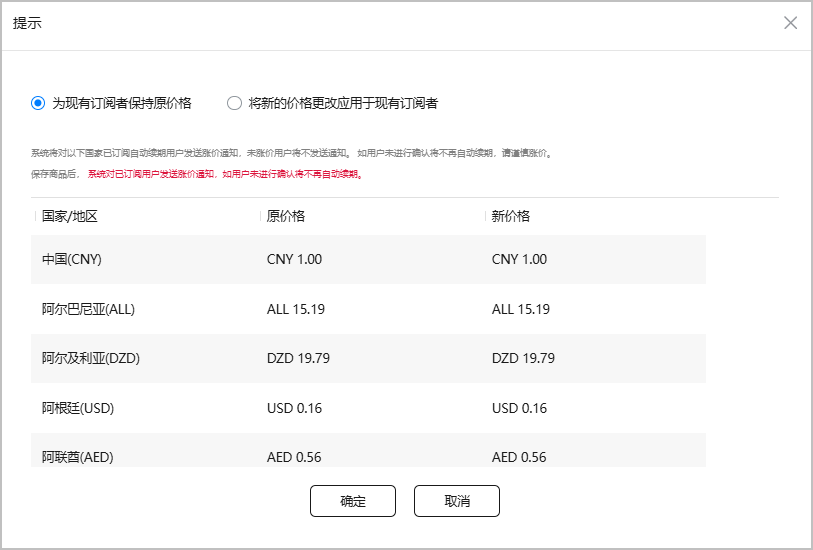
   * 商品促销价格

     您还可根据您的促销策略设置商品促销价，详情请参见[设置促销价格](#section94711378421)。

9. 完成修改后，点击“保存”。

## 批量修改商品

1. 登录[AppGallery Connect](https://developer.huawei.com/consumer/cn/service/josp/agc/index.html)，选择“APP与元服务”。
2. 在应用列表中点击需要批量修改商品的应用。
3. 在“运营”页签下的左侧导航栏中，选择“产品运营>商品管理”。
4. 下载表格，批量修改商品信息并上传。

   

   请按照规范批量修改商品信息，否则会在上传时报错，具体错误信息可参见[常见错误说明](#section725924710321)。

   * 方法一：

     a）点击页面右上角，下载商品模板并保存到本地。

     b）按规范修改商品信息。

     c）点击“批量操作”下拉选项中的 “修改商品”，并在弹出的添加框中点击选择上传已填写的商品模板。

     
   * 方法二：
     1. 点击“导出商品”，下载商品信息表格并保存到本地。
     2. 按规范修改商品信息。
     3. 点击“批量操作”下拉选项中的 “修改商品”，并在弹出的添加框中点击选择上传已修改的商品信息表格。

     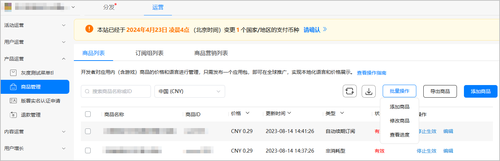
5. 在确认页面可查看商品信息修改前后对比图，点击“确定”。

   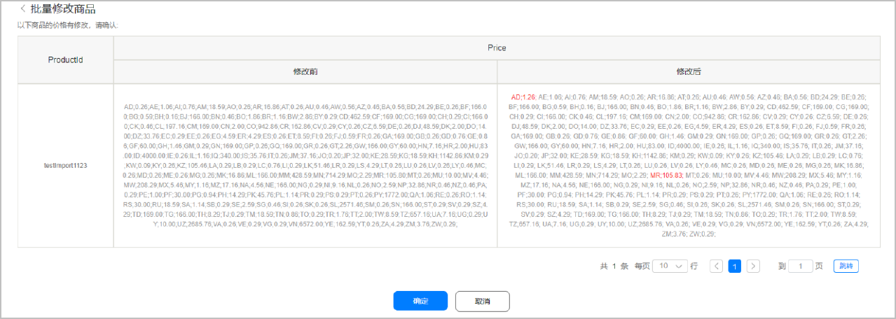

## 设置促销价格

###非订阅类商品

1. 登录[AppGallery Connect](https://developer.huawei.com/consumer/cn/service/josp/agc/index.html)，选择“APP与元服务”。
2. 在应用列表中点击需要设置促销价格的应用。
3. 在“运营”页签下的左侧导航栏中，选择“产品运营 > 商品管理”。
4. 在商品列表中，点击待设置促销价的非订阅类商品对应“操作”列的“编辑”。

   
5. 点击商品编辑页面上的“查看编辑”。

   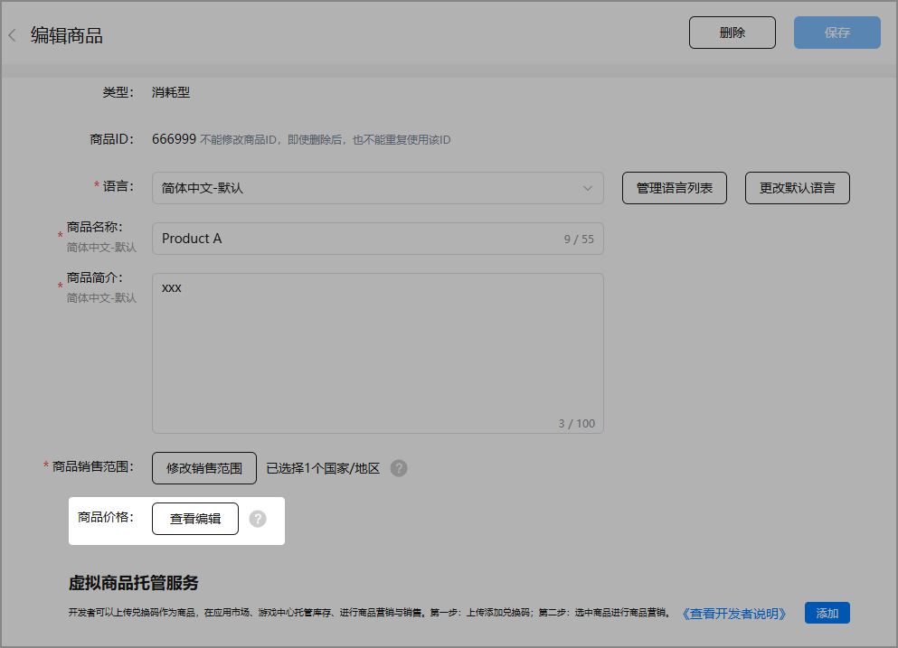
6. 在商品价格页面，点击“设置促销价”。

   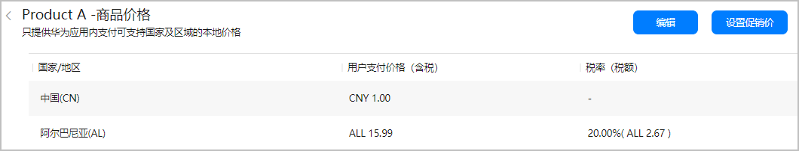

7. 在弹出的“设置促销价”页面中，点击“添加促销价”。

   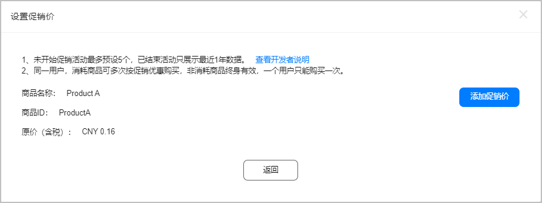

8. 设置促销活动语言、名称以及开始/结束时间，点击“下一步”。

   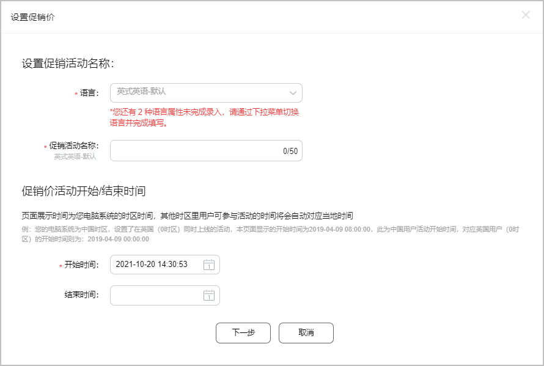

9. 设置促销活动适用的国家或地区，点击“下一步”。

   

10. 设置“汇率换算基准价格”（须低于当前原价），点击“刷新”同步更新不同促销国家/地区的促销价格，并点击“完成”。

    

    如果您需要调整某个国家/地区商品的用户支付促销价，可单独进行修改。

    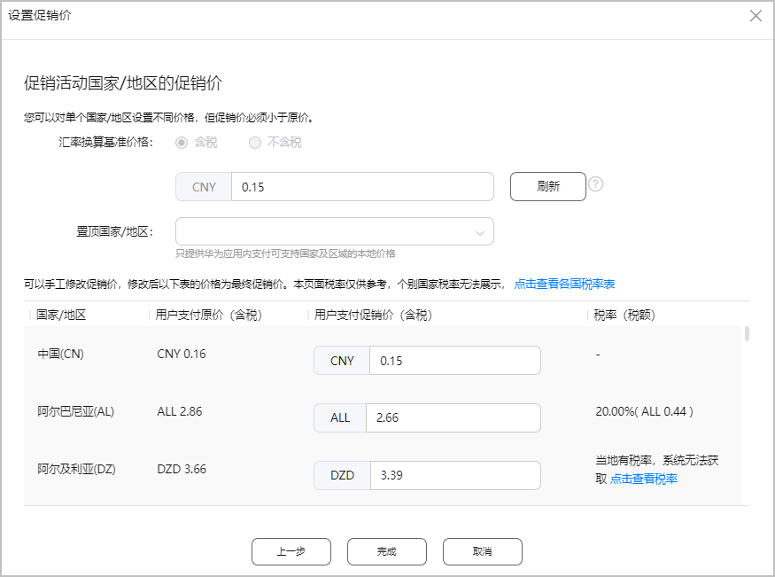

###自动续期订阅商品

1. 登录[AppGallery Connect](https://developer.huawei.com/consumer/cn/service/josp/agc/index.html)，选择“APP与元服务”。
2. 在应用列表中点击需要设置促销价格的应用。
3. 在“运营”页签下的左侧导航栏中，选择“产品运营 > 商品管理”。
4. 在商品列表中，点击待设置促销价的自动续期订阅商品对应“操作”列的“编辑”。

   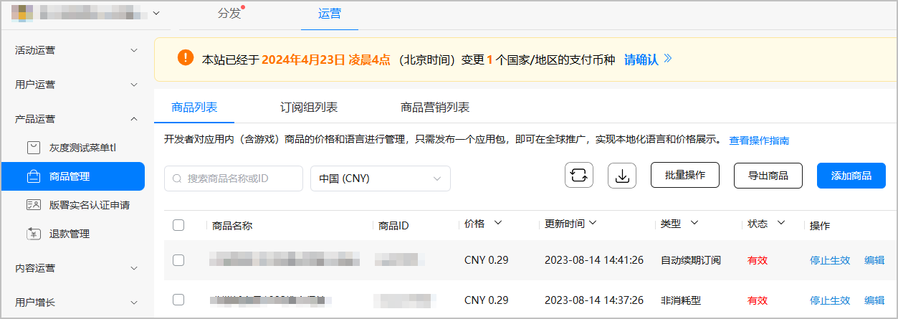
5. 选择商品编辑页面上的“查看编辑”。

   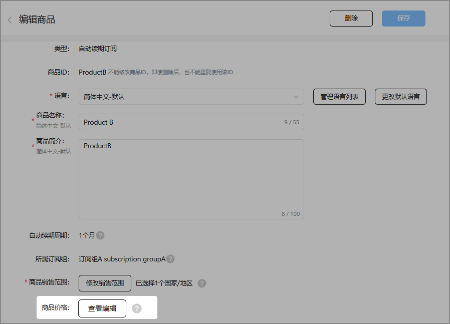
6. 在商品价格页面，点击“设置促销价”。

   

7. 在弹出的“设置促销价”页面中，点击“添加促销价”。

   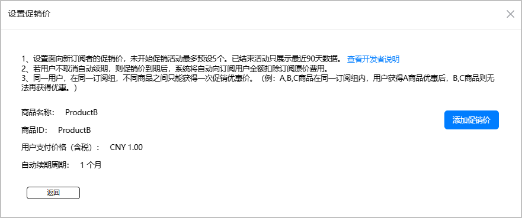

8. 设置促销活动语言、名称以及开始/结束时间，点击“下一步”。

   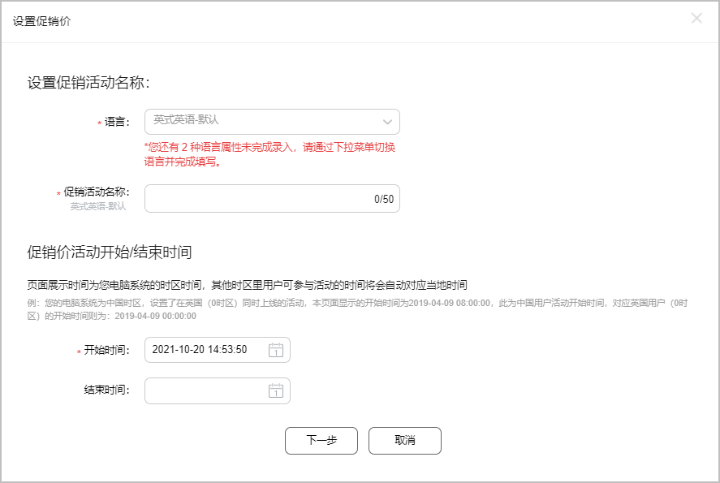

9. 设置参与促销活动的国家/地区，设置完成后点击“下一步”。

   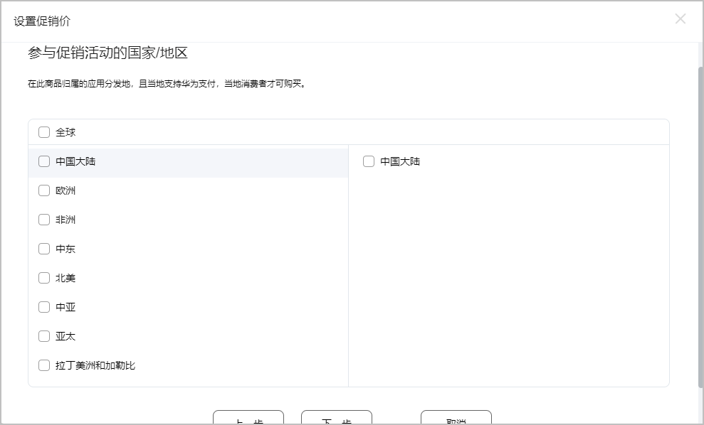

10. 设置活动类型。
    * 免费试用：需设置试用的期限。

      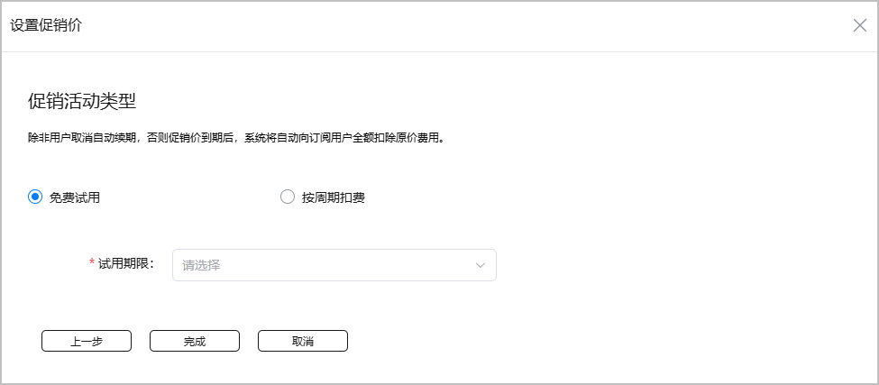
    * 按周期扣费：需设置优惠续期周期以及促销优惠价，且促销优惠价必须低于原价。

      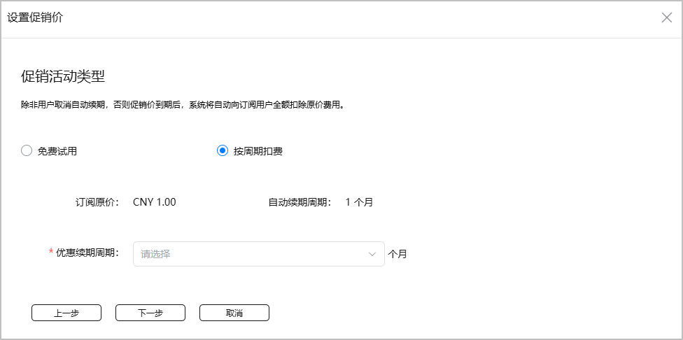

11. 若选择“免费试用”，设置完成后点击“完成”即可。若选择“按周期扣费”，设置完成后点击“下一步”，可对所有区域的价格进行确认或修改，确认后点击“完成”。

    

    如果您需要调整某个国家/地区商品的用户支付促销价，可单独进行修改。

## 常见错误说明

<MergeTable
  headers={['字段', '错误提示语', '原因说明']}
  rows={[
    [{ text: 'productId', rowspan: 4 }, '商品ID不符合规范，请参考表头说明。', 'productId不符合规范。'],
    [null, '文件中商品ID重复，请更换商品ID。', '批量修改时，同一个商品输入了多次，且其他内容不完全相同。（如果其他内容也完全相同，会自动去重）'],
    [null, '此商品不存在，请创建商品后再操作。', '该商品不存在，数据库中查不到该商品。'],
    [null, '商品ID冲突，请更换商品ID。', '批量新建时，导入的id是存在的。'],
    [{ text: 'ProductType', rowspan: 5 }, '商品类型不符合规范，请参考表头说明。', 'productType无效，非0、2或3（0：消耗型；3：非消耗型；2：订阅型）。'],
    [null, '订阅商品不支持修改，请删除。', '订阅型商品不允许修改。'],
    [null, '商品类型不允许修改。', '商品类型不允许修改。'],
    [null, '商品类型或者币种不支持，请确认。', '商品类型或者币种不支持，请确认。'],
    [null, '商品类型和订阅型周期不匹配，请确认。', '订阅型商品类型填错。'],
    [{ text: 'Locale Title Description', rowspan: 5 }, '本地化语言信息不符合规范，请参考表头说明。', 'Locale Title Description字段不符合规范。'],
    [null, '首个语言类型为默认语言，请修改为{{}}。默认语言类型不支持导入修改，请在页面操作修改。', '不允许修改默认语言类型，如默认语言是zh_CN，而输入的第一个locale是en_GB'],
    [null, '营销中的商品不允许修改语言名称和描述。', '营销中商品不允许修改语言描述等。'],
    [null, '一种语言输入了多种商品名称描述，请修改以下语言内的信息：{{}}。', '同一个locale输入了多种描述，如zh_CN|name|desc|en_GB|name|desc|zh_CN|othername|otherdesc。（如果相同，会自动去重）。'],
    [null, '商品语言类型不符合规范，请参考表头说明；请点击查询规范说明。', '商品语言类型不符合规范，请参考表头说明。'],
    [{ text: 'Price', rowspan: 9 }, '价格不符合规范，请参考表头说明。', '输入的价格无效。'],
    [null, '币种仅支持整数如5.00，请修改；点击此处查询国家对应币种。', '商品价格不满足该特殊国家币种仅支持整数的要求。'],
    [null, '币种以五分之一为最小单位如5.20，请修改；点击此处查询国家对应币种。', '商品价格不满足该特殊国家币种仅支持五分之一小数的要求。'],
    [null, '所有国家商品原价需高于促销优惠价，请调高价格，建议促销优惠结束后再修改商品原价。', '商品原价必须高于促销价。'],
    [null, '此商品还有国家价格为空，请在页面刷新设置或在文件中完整录入所有国家的价格。', '商品信息中还有国家的价格为空。'],
    [null, '同一国家/地区输入了多种价格，请修改以下国家/地区内的信息：{{}}', '同一个国家，输入了多次不同的价格，如CN;100;AR;80;CN;30;其中CN输入了两次，而且两次价格不同。（如果相同，会自动去重）'],
    [null, '请至少输入一组国家码和价格，所有价格不能超过2位小数，国家码请确认正确。示例：CN;1.00;DE;0.50', '国家价格对输入不符合要求，比如ABCDEF|100.1213123;'],
    [null, '默认币种不符合规范，请参考表头说明。', '默认币种不符合规范。'],
    [null, '价格超出两位小数，请修改。', '价格超出两位小数，请修改。'],
    ['SubPeriod', '订阅周期不符合规范，请参考表头说明。', '订阅周期不符合规范。'],
    [{ text: 'Subgroup ID', rowspan: 2 }, '订阅组ID不符合规范，请参考表头说明。', '订阅组ID不符合规范。'],
    [null, '订阅组不存在，请参考表头说明。', '订阅组不存在。'],
    [{ text: '通用', rowspan: 9 }, '文件过大。', '文件超过100M限制。'],
    [null, '文件类型错误。', '文件内容错误，比如将.exe改后缀名为.xlsx再上传。'],
    [null, '文件名称不合法。', '文件名错误，包含特殊字符，不可访问等情况。'],
    [null, '文件为空。', '文件为空。'],
    [null, '文件上传次数已达上限，请稍后再试。', '上传次数超过限制，一小时内最多上传1000000次。'],
    [null, '商品导入单次最大支持{{}}条，超出请分批上传。', 'excel超过指定行数，目前批量导入商品最多支持300条，批量修改商品最多支持200条。'],
    [null, '该商品创建失败，请联系客服处理。', '没有数据需要更新，临时表中无数据。'],
    [null, '商品无任何修改，请确认。', '输入无任何修改。'],
    [null, '尊敬的开发者，您好。很抱歉，当前操作遇到异常无法正常完成。如需帮助请联系我们。', '内部错误，原因不明。'],
  ]}
/>

| 尊敬的开发者，您好。很抱歉，当前操作遇到异常无法正常完成。如需帮助请联系我们。 | 内部错误，原因不明。 |