# 在玩服务管理

游戏中心【在玩】专区展示玩家已安装游戏的资讯、攻略、游戏资产、用户数据和小工具等信息。华为游戏中心向您开放自主管理在玩服务页面能力，您可以轻松更新相关内容，让玩家更好地了解和体验您的游戏。

## 展示效果

|  |  |
| --- | --- |
| 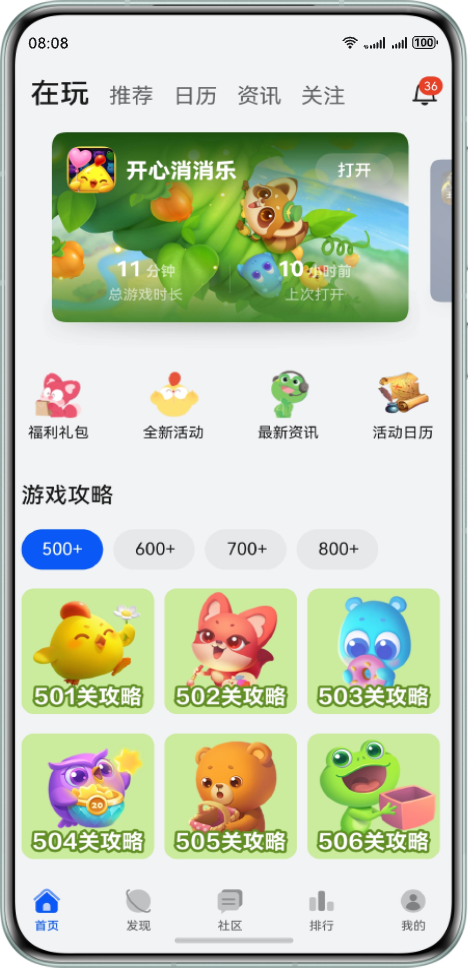 | 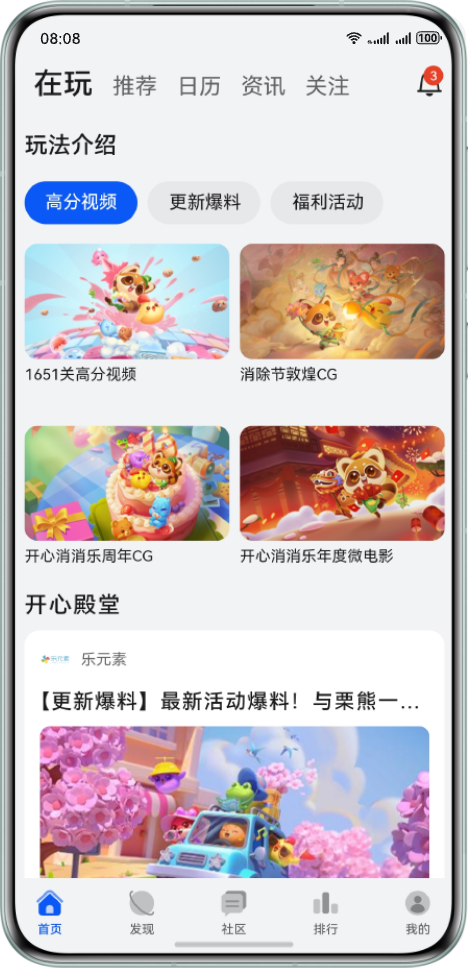 |

## 前提条件

* 您已成功[创建游戏](https://developer.huawei.com/consumer/cn/doc/distribution/app/agc-help-createapp-0000001146718717)，支持设备为“手机”。
* 使用[内容场景管理](#section66591944194716)功能需已[开通游戏版块](https://developer.huawei.com/consumer/cn/doc/app/game-center-community-operation-0000001194305462)。

## 在玩页面搭建流程

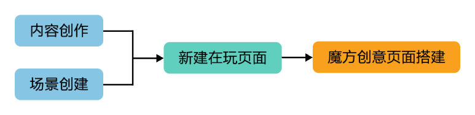

| 步骤 | 说明 |
| --- | --- |
| [内容创作](#section179510491422) | 创建内容作品，用于后续在玩魔方页面搭建时配置使用和场景子内容添加。 |
| [场景创建](#section1021293219914)（可选） | 创建场景，可用于后续在玩魔方页面搭建时配置使用。 |
| [新建在玩页面](#section135935152518) | 创建并配置您的在玩页面。 |
| [魔方创意页面搭建](#section1184968123215) | 使用魔方创意工具搭建在玩页面内容。 |

## 战绩资产接入方式

| 方法 | 说明 |
| --- | --- |
| [配置URL地址](#section51331312124210) | 配置相关URL地址，自动接入玩家战绩或资产数据。 |
| [上传游戏资源](#section334820230395) | 上传及管理战绩资产相关的游戏资源。 |

## 内容创作

您可以在AGC控制台创建并管理自己游戏相关的内容作品，以用于后续在玩页面的配置。根据主体部分所属类型，内容可分为“图文内容”与“视频内容”，各自的定义如下：

* 图文内容：主体部分为文章正文，由文本、图片（支持多张）、视频自由组合。
* 视频内容：主体部分为1个视频，正文部分为文本，正文不支持添加视频、图片。

###创建内容

1. 登录[AppGallery Connect](https://developer.huawei.com/consumer/cn/service/josp/agc/index.html)，在首页选择“全部服务”并搜索“游戏内容创作”，点击进入“游戏内容创作 > 内容管理”页面。
2. 点击“发布”，选择“写文章”或“发视频”创建图文内容或视频内容。

   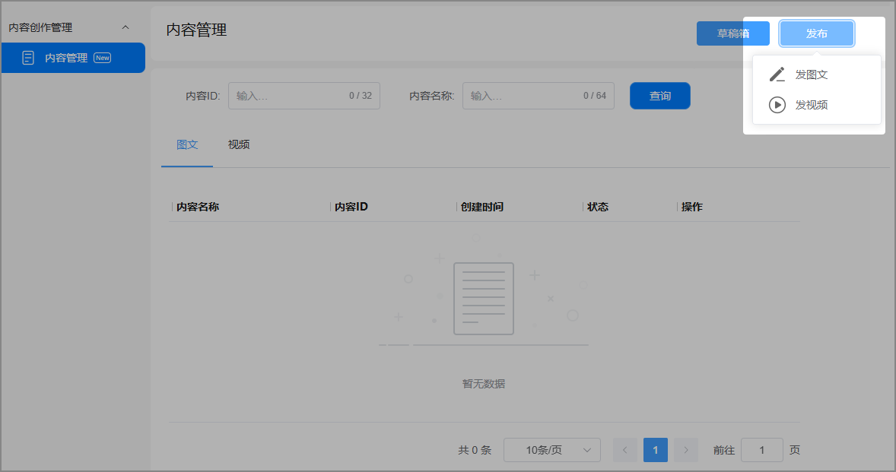
3. 在内容编辑界面完成内容创作后点击“发表”提交。
   * 写文章

     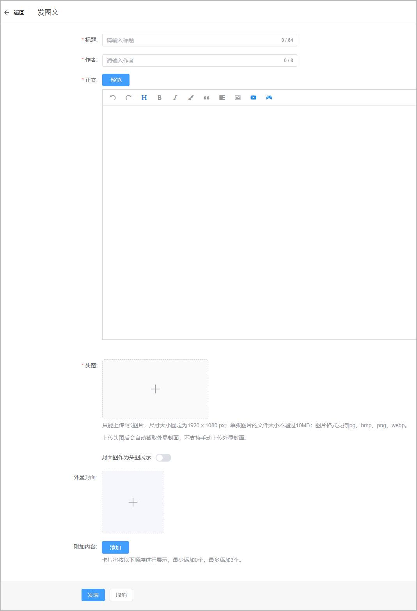

     | 参数 | 说明 |
     | --- | --- |
     | 标题 | 1~64个字符。 |
     | 作者 | 1~8个字符。 |
     | 正文 | 使用编辑器进行内容主体撰写。最多8000个字符。可点击“预览”查看内容展示效果。  说明：  + 正文中插入图片不超过三十张。 + 单张图片不超过10M。 |
     | 头图 | 只能上传1张图片，要求如下：  + 尺寸大小固定为1080px\*1080px。 + 单张图片的大小不超过10MB。 + 格式支持jpg、bmp、png、webp。 可勾选是否将封面图作为头图展示。 |
     | 外显封面 | 上传头图后会自动截取外显封面，不支持手动上传外显封面。 |
     | 附加内容（可选） | 点击“添加”，可以选择添加其它子内容。卡片将按下方顺序进行展示，最少添加0个，最多添加3个。 |
   * 发视频

     

     | 参数 | 说明 |
     | --- | --- |
     | 视频 | 大小需超过5MB，最大支持1GB视频文件，推荐使用mp4、mov格式。 |
     | 视频播放封面 | 只能上传1张图片，要求如下：  + 尺寸大小固定为1080px\*606px。 + 单张图片的文件大小不超过1MB。 + 图片格式支持jpg、bmp、png、webp。 说明：  上传视频播放封面后会自动截取外显封面，可以手动上传外显封面来覆盖自动截取的外显封面。 |
     | 标题 | 1~30个字符。 |
     | 作者 | 1~8个字符。 |
     | 视频简介 | 0~500个字符。可点击“预览”查看内容展示效果。 |
     | 外显封面图（可选） | 只能上传1张图片，要求如下：  + 尺寸大小固定为606px\*606px。 + 单张图片的大小不超过1MB。 + 格式支持jpg、bmp、png、webp。 |
     | 附加内容（可选） | 点击“添加”，可以选择添加其它子内容。卡片将按下方顺序进行展示，最少添加0个，最多添加3个。 |

###管理内容

1. 登录[AppGallery Connect](https://developer.huawei.com/consumer/cn/service/josp/agc/index.html)，在首页选择“全部服务”并搜索“游戏内容创作”，点击进入“游戏内容创作 > 内容管理”页面。
2. 页面展示已创建的内容列表，可切换页签查看文章内容和视频内容。点击操作列的“编辑”和“删除”可对内容进行二次编辑或删除操作。

   

## 内容场景管理

内容场景管理支持配置场景和对应的子内容，提升在玩服务页面的内容深度。在页面搭建时选择组件进行场景ID关联，可自动获取并展示该场景下配置的子内容。

###新建内容场景

1. 登录[AppGallery Connect](https://developer.huawei.com/consumer/cn/service/josp/agc/index.html)，点击“APP与元服务”，在应用列表中选择应用。
2. 选择“运营 > 内容运营 > 在玩服务管理 > 内容场景管理”，点击“创建内容场景”。

   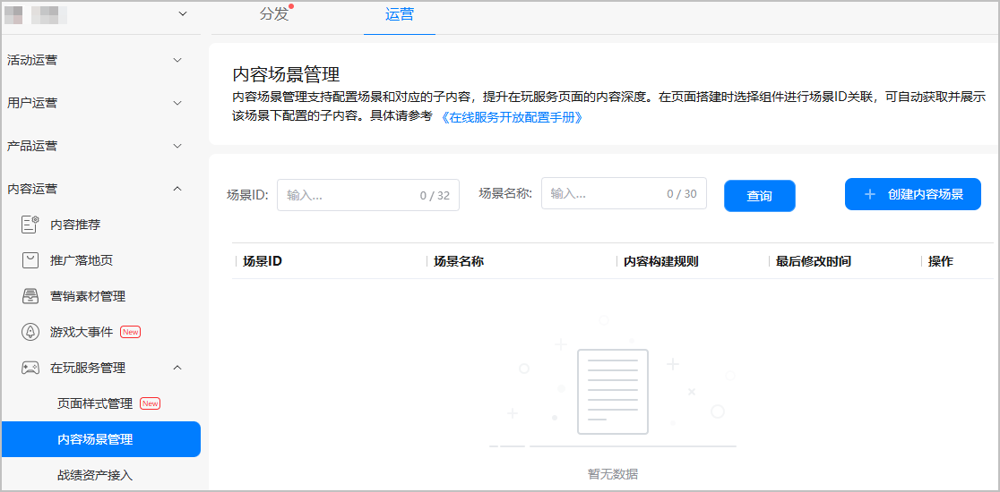
3. 在“ 创建内容场景”弹窗中填写“场景名称”，点击“确定”完成创建。

   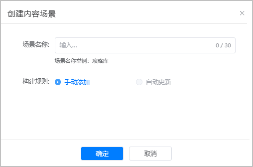

###编辑子内容

创建好内容场景后，您可在该内容场景下添加、删除子内容。

1. 登录[AppGallery Connect](https://developer.huawei.com/consumer/cn/service/josp/agc/index.html)，点击“APP与元服务”，在应用列表中选择应用。
2. 选择“运营 > 内容运营 > 在玩服务管理 > 内容场景管理”，在内容场景列表“操作”列点击“编辑子内容”。

   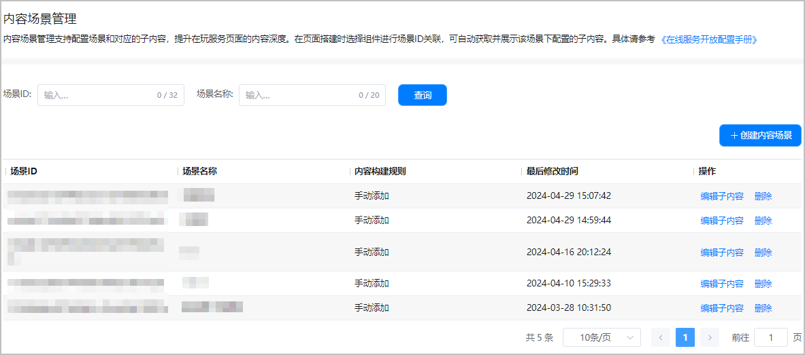
3. 在“编辑子内容”页面可通过“查询添加”和“导入”两种方式添加子内容。

   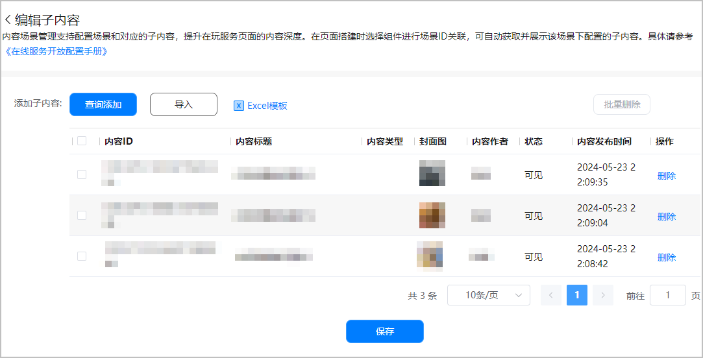

   * 查询添加

     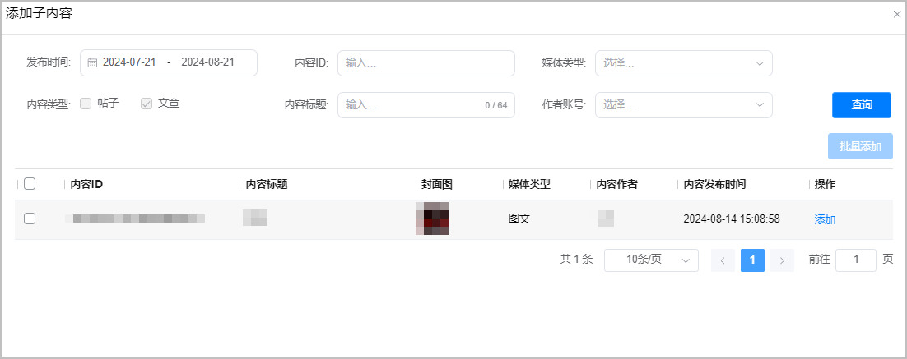

     支持通过内容发布时间、内容ID等条件查询子内容，点击列表“操作”列“添加”添加单条子内容或勾选多条后点击“批量添加”。
   * 导入

     在页面下载Excel模板，按要求填写内容。点击“导入”上传已填写模板文件，完成批量导入。

## 页面样式管理

页面样式管理是在玩服务的基础配置，通过上传素材、拖选组件，来搭建整体页面框架。

###新建在玩页面

1. 登录[AppGallery Connect](https://developer.huawei.com/consumer/cn/service/josp/agc/index.html)，点击“APP与元服务”，在应用列表中选择应用。
2. 选择“运营 > 内容运营 > 在玩服务管理 > 页面样式管理”，点击“创建在玩服务页面”。

   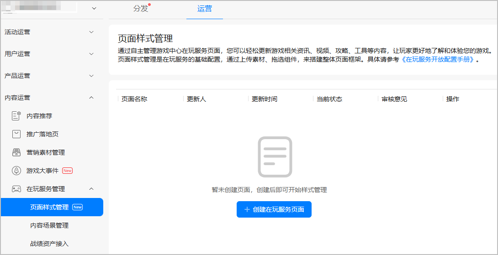
3. 在“页面样式管理”详情页按照提示填写信息，完成后点击“提交审核”或者“保存草稿”。

   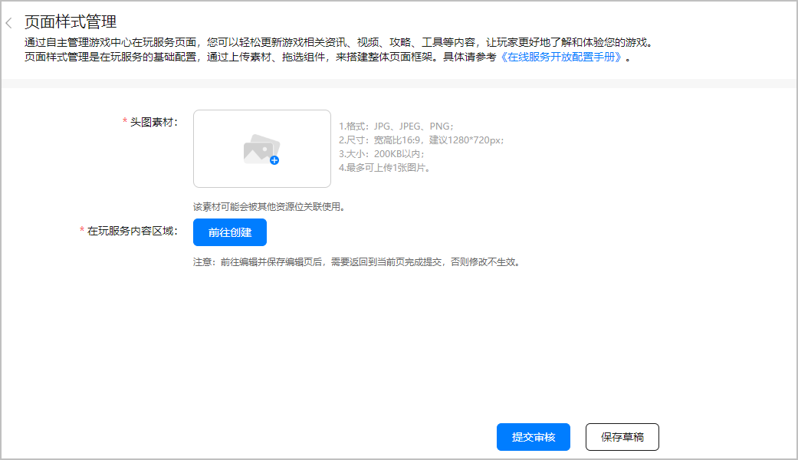

   | 参数 | | 说明 |
   | --- | --- | --- |
   | 头图素材 | | 头图素材要求如下：  * 格式：JPG、JPEG、PNG * 尺寸：宽高比16:9，建议1280\*720px * 大小：200KB以内 * 图片需要做蒙层处理，蒙层占卡片1/2高，与卡片底对齐，由上至下100%不透明至0%不透明，示例及蒙层处理方式见下文 * 最多可上传1张图片 说明：  该素材可能会被其他资源位关联使用。 |
   | 在玩服务内容区域 | | 点击“前往创建”进入魔方创意页面。  说明：  前往编辑并保存编辑页后，需要返回到当前页完成提交，否则修改不生效。具体魔方创意操作请参见[在玩服务魔方创意](https://developer.huawei.com/consumer/cn/doc/app/game-center-creatives-ideas-0000001865677220)。 |

   头图示例：

   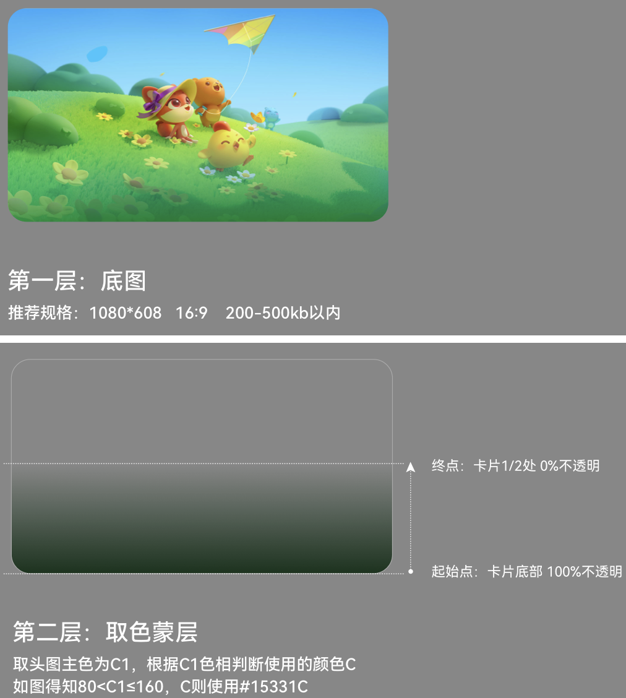

   头图蒙层如何处理？

   1. 取头图主色为C1(H1,S1,B1)
   2. 根据C1的色相(H1)，来判断使用的颜色C:

      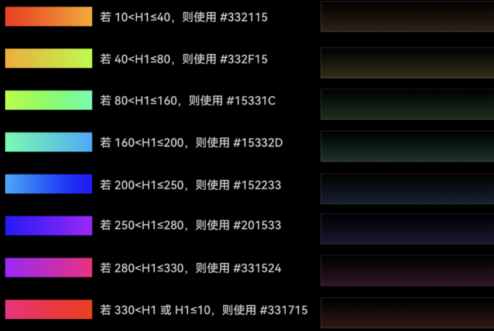
   3. 根据颜色C做渐变蒙层
4. 提交审核后，华为工作人员审核预计需要2~5个工作日，请耐心等待。审核结果可在列表查看，如果审核通过，页面将会直接在客户端展示上线。审核中如需修改内容可点击“撤回”后再重新编辑。

###编辑在玩页面

您可对不处于审核状态的已创建在玩页面进行编辑，更新已填写内容。

1. 登录[AppGallery Connect](https://developer.huawei.com/consumer/cn/service/josp/agc/index.html)，点击“APP与元服务”，在应用列表中选择应用。
2. 选择“运营 > 内容运营 > 页面样式管理”，在页面列表“操作”列点击“编辑”。

   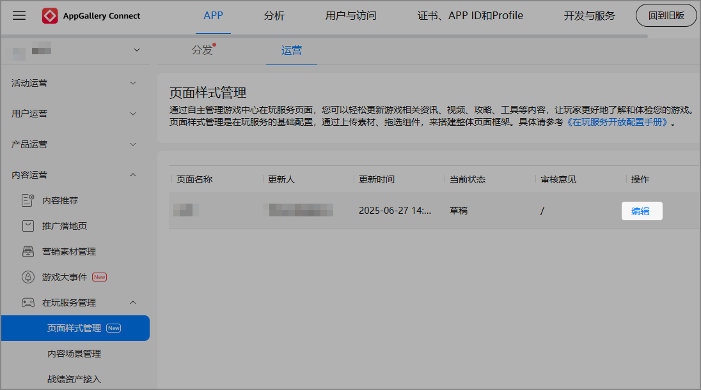

###页面状态

* 草稿

  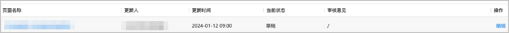

  创建页面编辑后点击“保存草稿”，页面为“草稿”状态，可再次进行编辑。
* 审核中

  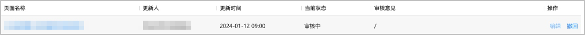

  页面“提交审核”后为“审核中”状态，如需修改内容可点击“撤回”后再重新编辑。

* 审核通过

  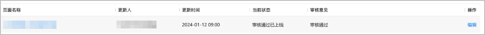

  审核通过，页面将会直接在客户端展示上线。
* 审核未通过

  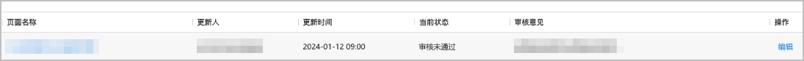

  若审核未通过，您需重新编辑内容后再提交。
* 更新

  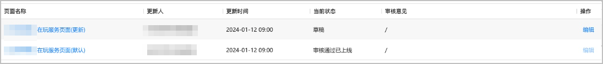

  已有审核通过上线的页面情况下可再次新建草稿在玩页面，提交审核通过后替换当前已上线在玩页面。
* 已下线

  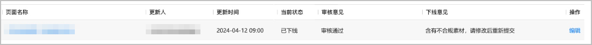

  已上线的页面如果发现问题，运营会进行下架操作，您可以根据下线意见修改后重新提交。

## 战绩资产接入

战绩资产接入是通过接入玩家的战绩或资产数据，将玩家的战绩、资产在“游戏中心 > 在玩tab”进行展示。

###配置URL地址

1. 登录[AppGallery Connect](https://developer.huawei.com/consumer/cn/service/josp/agc/index.html)，点击“APP与元服务”，在应用列表中选择应用。
2. 选择“运营 > 内容运营 > 在玩服务管理 > 战绩资产接入”，选择“url地址配置 > 数据拉取”。在“url地址配置”按照提示填写信息，填写完成后点击“下一步”到测试期。

   

   填写的URL地址要求以https://开头的有效的URL，不可以携带端口号，且不可以包含“..”、“@”等特殊字符。

   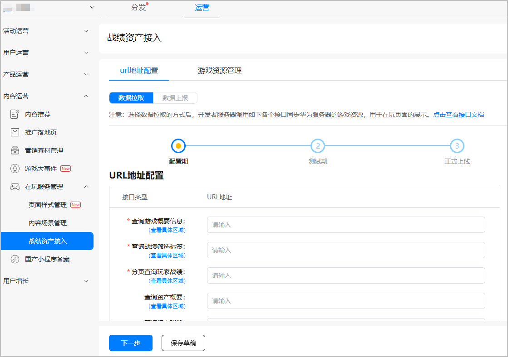

   | 参数 | 说明 |
   | --- | --- |
   | [查询游戏概要信息](https://developer.huawei.com/consumer/cn/doc/AppGallery-connect-References/agcapi-summary-0000002022225249) | 请填写可以查询到玩家在游戏内概要信息的URL地址，主要包括玩家基本信息和战绩信息总览。 |
   | [查询战绩筛选标签](https://developer.huawei.com/consumer/cn/doc/AppGallery-connect-References/agcapi-label-0000001985625670) | 请填写可以查询到当前游戏内可用于筛选的战绩标签的URL地址。 |
   | [分页查询玩家战绩](https://developer.huawei.com/consumer/cn/doc/AppGallery-connect-References/agcapi-scores-0000001985465938) | 请填写可以分页查询玩家战绩信息的URL地址。 |
   | [查询资产概要](https://developer.huawei.com/consumer/cn/doc/AppGallery-connect-References/agcapi-asset-summary-0000002022105729)（可选） | 请填写可以查询到玩家在游戏内资产概要信息的URL地址。 |
   | [查询资产明细](https://developer.huawei.com/consumer/cn/doc/AppGallery-connect-References/agcapi-asset-details-0000002022225253)（可选） | 请填写可以查询到玩家在游戏内资产的具体信息的URL地址。 |
   | [批量查询玩家基本信息](https://developer.huawei.com/consumer/cn/doc/AppGallery-connect-References/agcapi-basic-info-0000002038975322) | 请填写可以批量查询玩家在游戏内全部账号基本信息的URL地址。 |
   | [查询玩家角色信息](https://developer.huawei.com/consumer/cn/doc/AppGallery-connect-References/agcapi-role-info-0000002075016173)（可选） | 请填写可以查询到玩家在游戏内角色信息的URL地址。 |
3. 点击“新增账号”，在弹出的提示框内输入用于测试的华为账号的手机号或邮箱，点击“确认”添加测试账号。

   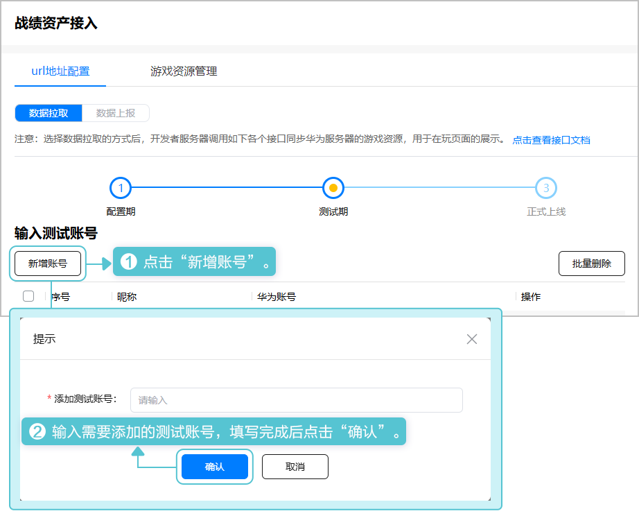
4. 点击“提交测试”，提交用于测试的华为账号。点击提交测试账号后，至多等待15分钟，可以在登录测试账号的华为手机上检查您的游戏上线战绩页面后的效果。

   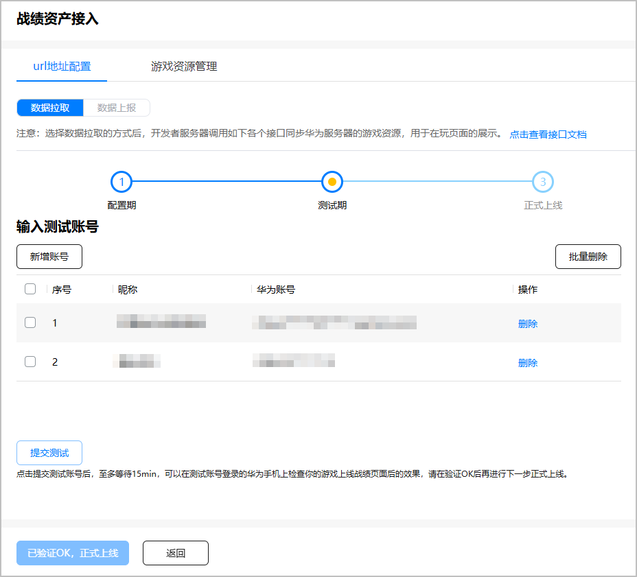
5. 在游戏中心客户端验证页面效果没有问题后，在AGC“战绩资产接入 > url地址配置 > 数据拉取”页面中点击“已验证OK，正式上线”将当前战绩资产页面提交上线。如果出现问题需要进行调整，请点击“返回”回到配置期重新填写URL地址信息。

   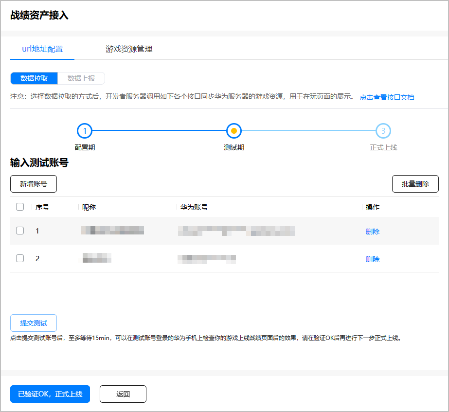
6. 正式上线后，您可以前往游戏中心客户端“在玩tab > 头部卡片”进行查看。如需重新配置相关地址，请在AGC“战绩资产接入 > url地址配置 > 数据拉取”页面中点击“一键返回”，返回配置期重新配置。

   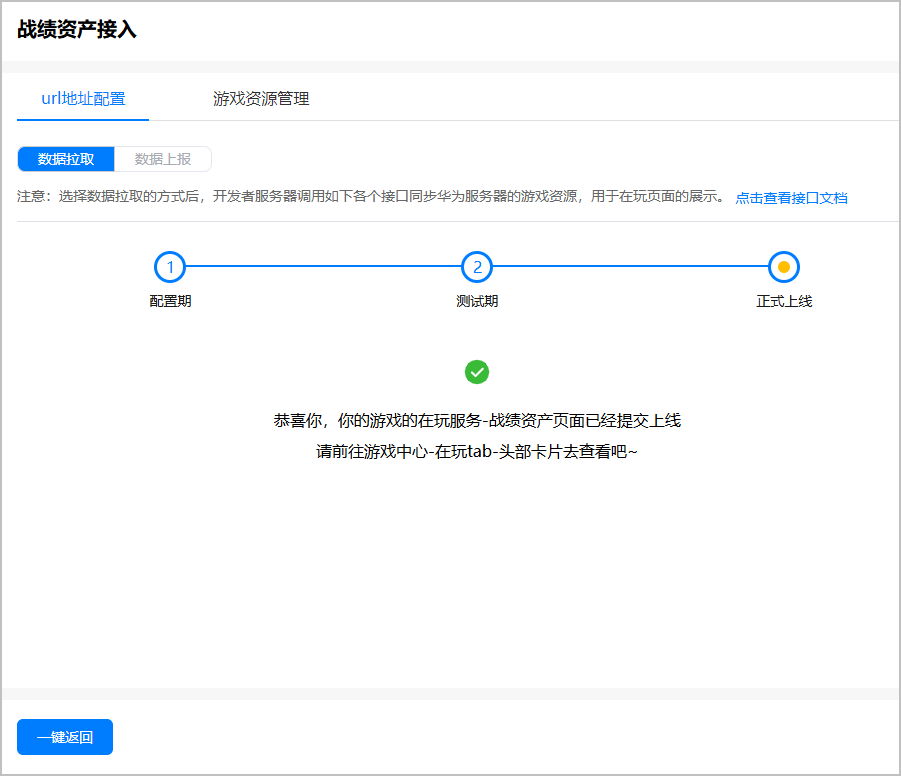

   

   如果对战绩资产页面接入有疑问，请先咨询华为平台运营人员。

###上传游戏资源

1. 登录[AppGallery Connect](https://developer.huawei.com/consumer/cn/service/josp/agc/index.html)，点击“APP与元服务”，在应用列表中选择应用。
2. 选择“运营 > 内容运营 > 在玩服务管理 > 战绩资产接入”，选择“游戏资源管理”。点击“上传资源”，在窗口内选择需要上传的资源。

   

   * 可批量上传多个文件，上传的资源名称重复时会对已有资源进行更新。
   * 仅支持上传图片，大小不超过500KB，格式支持JPG、JPEG、BMP、PNG。用于右上角勋章展示的图片需均保持相同的尺寸和1:1的宽高比，否则页面展示可能会失真。

   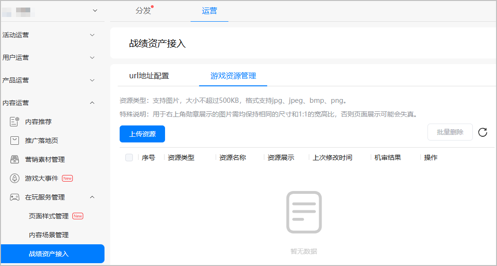
3. 资源上传完成后，您可以在游戏资源管理页面查看资源信息和机审结果，以及对资源进行更换、删除操作。

   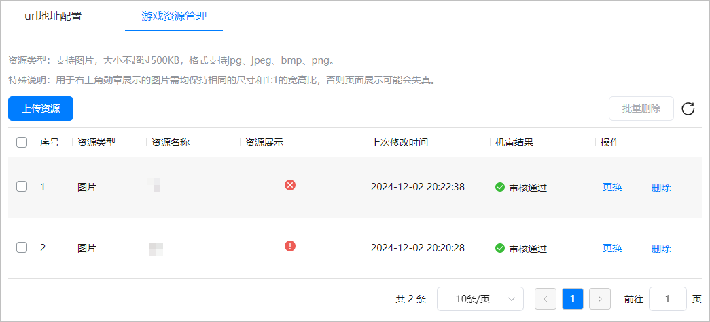

## 定期维护说明

如果您的在玩页面长期没有更新，我们会进行下线操作。

## 魔方创意

在玩编辑页面点击“前往创建”会打开魔方创意页面，魔方创意指导手册请参见[在玩服务魔方创意](https://developer.huawei.com/consumer/cn/doc/app/game-center-creatives-ideas-0000001865677220)。

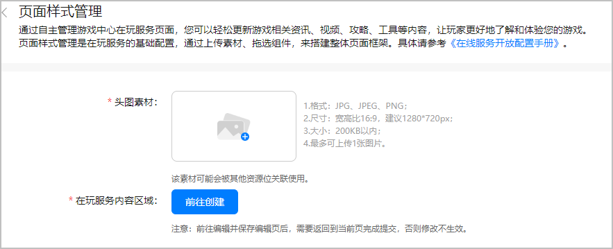