# 社区管理

华为游戏中心社区是以用户为核心，内容为引导，不断聚集更多热爱游戏的玩家，实现玩家与玩家，玩家与开发者的交流互动阵地。我们诚邀各位开发者一起来加入游戏社区的运营，为玩家提供更多的内容、创建社区活动和进行互动，共同建立一个受玩家喜爱的游戏社区。

## 社区开版

###前提条件

* 在开通社区版块前，您必须先[创建游戏](https://developer.huawei.com/consumer/cn/doc/distribution/app/agc-help-createapp-0000001146718717)。
* 社区版块的名称和图标影响审核结果，请在开通社区版块前修改，图标要求为216\*216px的png图片。
* 目前开通社区版块仅支持在架版本或预约审核通过的游戏。

###开通版块

1. 登录[AppGallery Connect 网站](https://developer.huawei.com/consumer/cn/service/josp/agc/index.html#/)，点击“社区管理”。
2. 选择“社区详情 > 版块管理”，点击“开通版块”。

   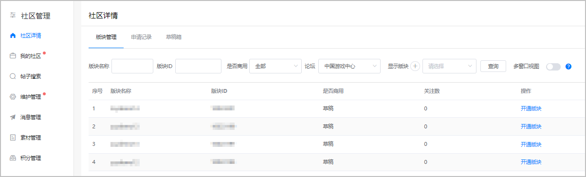
3. 在“开通版块”详情页按照提示填写信息。

   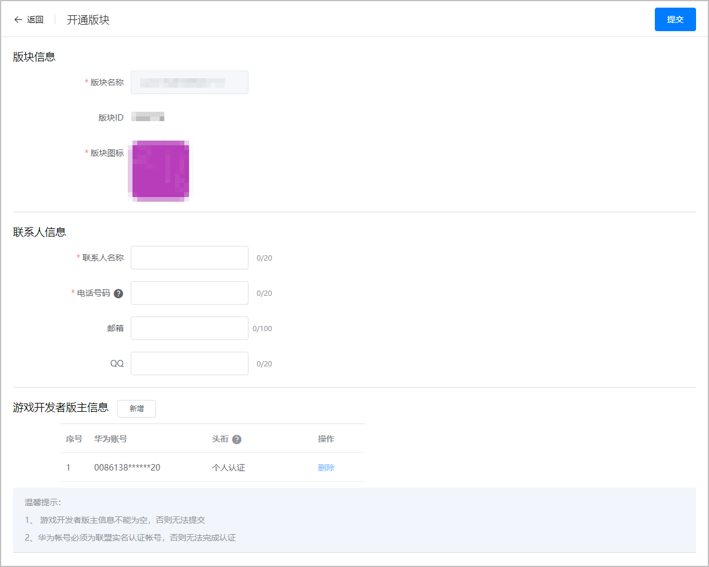

   | 参数 | | 说明 |
   | --- | --- | --- |
   | 版块信息 | | 自动获取关联信息，无需填写。 |
   | 联系人信息 | 联系人名称 | 必填项。方便华为工作人员与版块负责人取得联系。 |
   | 电话号码 | 必填项。电话号码格式有如下2种：  * 3~4位区号-7~8位座机号码，例如025-12345678。 * 13~19开头的手机号，例如13645167527。 |
   | 邮箱 | 选填项。 |
   | QQ | 选填项。 |
   | 游戏开发者版主信息 | | 至少一个实名认证的账号，可新增多个账号。账号包括：  * 华为账号 * 版主头衔必须符合如下要求之一：   + 游戏公司官方，认证内容为公司名称（以游戏公司为单位），一个公司仅能认证一个账号。   + 游戏官方，认证内容为游戏名称+官方（以单款游戏为单位），一个游戏仅能认证一个账号。   + 游戏相关人员，认证内容为游戏名称+职能（以从业者为单位），一个游戏可认证多个账号。 |
4. 完成信息的配置后，点击“提交”。若在工作日的17:00前提交申请，华为工作人员将在当天审核完毕，如遇节假日则延迟。在审核完成前，您都可以撤回申请。

###变更版块

1. 登录[AppGallery Connect 网站](https://developer.huawei.com/consumer/cn/service/josp/agc/index.html#/)，点击“社区管理”。
2. 选择“社区详情 > 版块管理”，点击“变更”。

   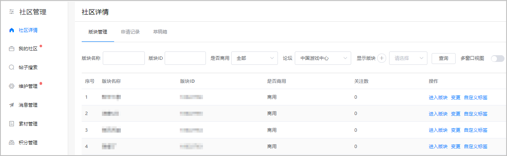
3. 在“申请变更”详情页按照提示填写信息。

   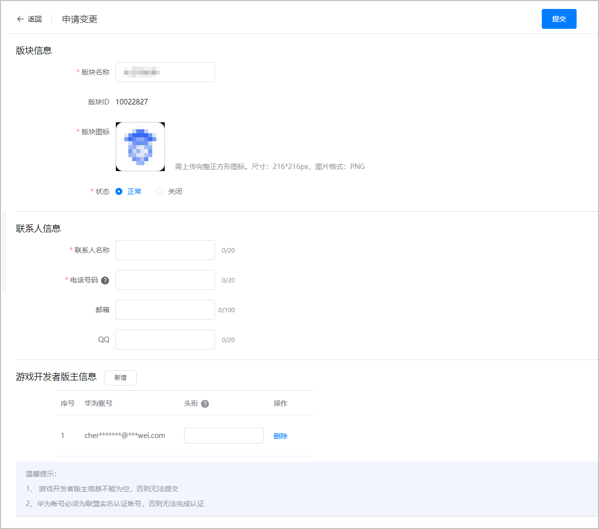

   | 参数 | 说明 |
   | --- | --- |
   | 版块信息 | * 若选择“关闭”版块，将不再支持自助开版。 * 若重新开通已关闭版块，需发送邮件至gameforum@huawei.com进行申请。 |
   | 联系人信息 | 变更联系人需要正确填写信息，方便华为工作人员与版块负责人取得联系。 |
   | 游戏开发者版主信息 | 变更头衔或新增版主信息都需要符合头衔认证标准。 |
4. 完成信息的更改后，点击“提交”。若在工作日的17:00前提交申请，华为工作人员将在当天审核完毕，如遇节假日则延迟。在审核完成前，您都可以取消变更内容。

## 常用操作及功能介绍

###后台操作

华为开发者联盟社区管理后台主要分为“社区详情”、“我的社区”、“维护管理”、“消息管理”四个模块：

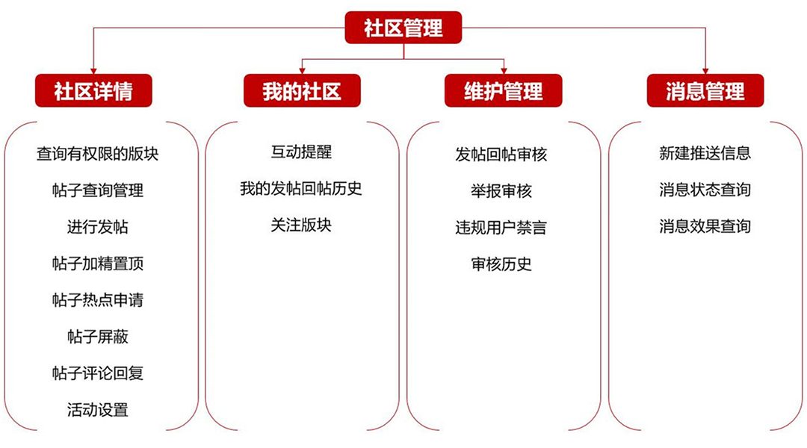

1. 后台进入流程：[AppGallery Connect](https://developer.huawei.com/consumer/cn/service/josp/agc/index.html) > 社区管理。
2. 社区详情页操作简介：

   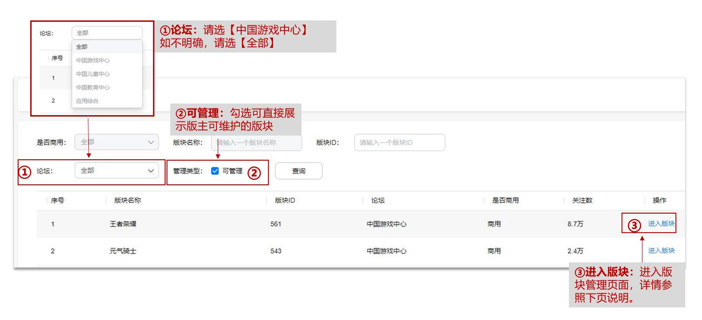

   点击进入版块——

   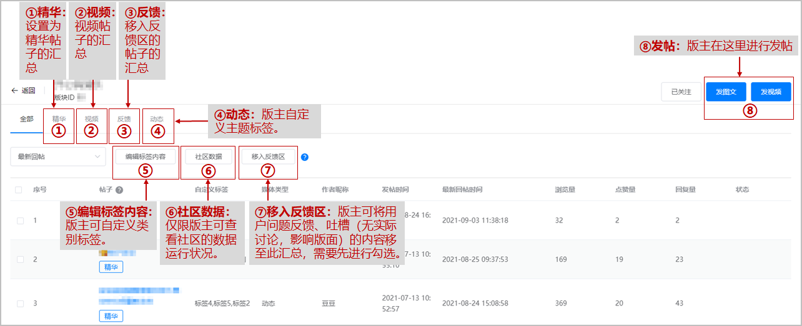

   点击“社区数据”，页面展示如下两类社区数据：

   * 版块数据： 根据您选择的时间范围，展示每天/周/月的数据值，例如新增关注账号、取消关注账号等。
   * 热门帖子列表：根据您选择的时间范围，展示回帖和回复总数排名前十的帖子。

   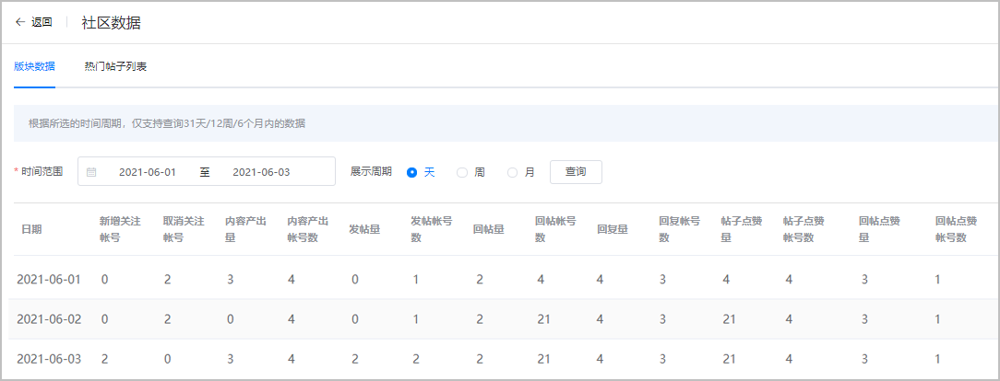

   点击进入帖子——

   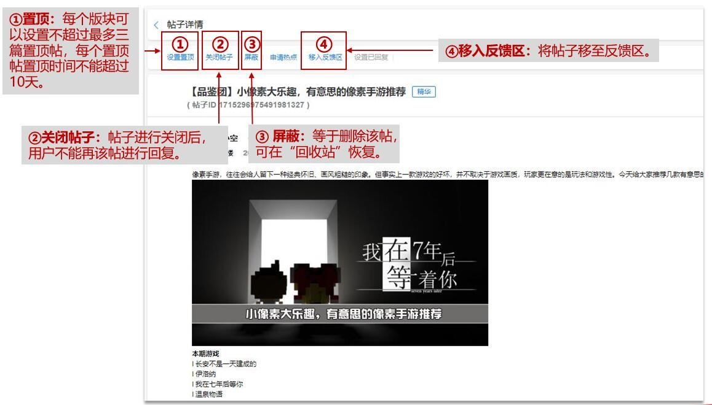

   帖子下拉——

   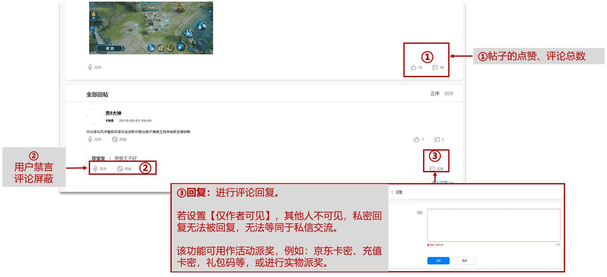
3. 我的社区页操作简介：

   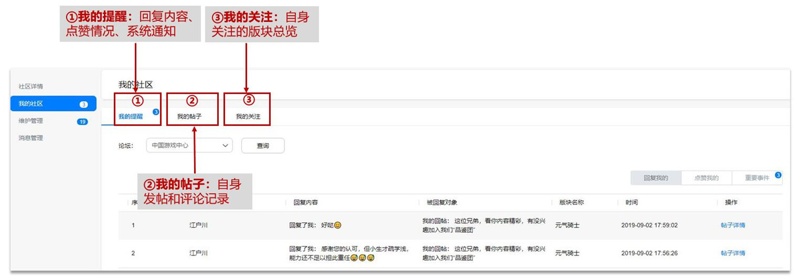
4. 维护管理页操作简介：

   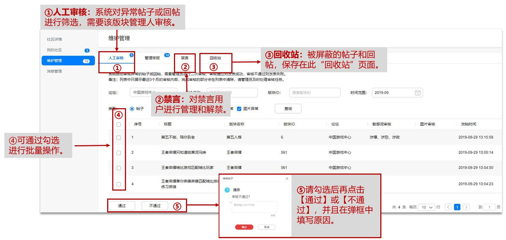

   点击管理举报——

   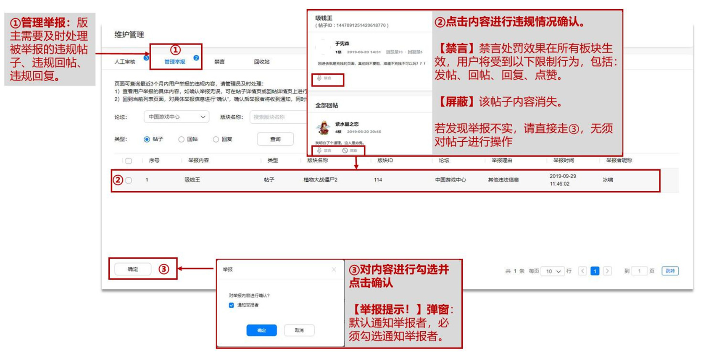

###社区贡献值介绍

社区成长系统是以鼓励社区玩家发帖、互动为目的系统。开发者选择开通后，需提供游戏礼包等奖励，用来刺激论坛玩家进行互动活跃。

1. 社区成长系统展示：

   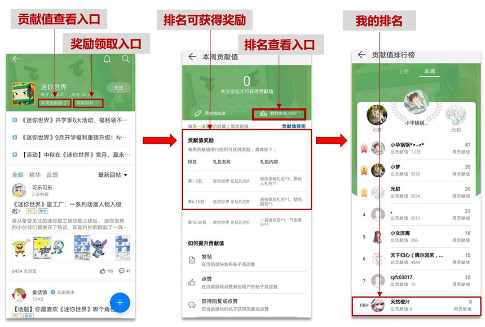
2. 社区贡献值系统开通方式：请通过[在线提单](https://developer.huawei.com/consumer/cn/support/feedback/#/add/101704353566310877?level2=101704353626565886&level3=101704354579010004&keyWord=Game Service Kit)方式联系华为工作人员。
3. 社区成长系统规则：

* 每个游戏版块的贡献值单独计算，每周日晚结算排名；玩家在所有版块的社区行为，能提升玩家的社区等级，等级提升可加速版块贡献值获取。
* 玩家在版块内的社区行为，能获取对应的版块贡献值；（例如每个回帖可以获取2点贡献值，每天上限10点；发帖、点赞、被回复等均有对应贡献值点数与每天上限）。
* 开发者需要设定贡献值有排行榜分级，方便展示每周头部玩家可领取不同的贡献值排行礼包；（例如：排行1-5名领取礼包A，排行6-15名领取礼包B，排行16-30名领取礼包C，不同的游戏可以根据自身情况灵活设置）。

想要进一步了解社区成长系统，点击[《社区礼包后台配置指导》](https://communityfile-drcn.op.hicloud.com/FileServer/getFile/cmtyManage/011/111/111/0000000000011111111.20191015150136.55802125866837868837759450270406%3A50511216084150%3A2800%3A5F26426AAFA7CDD75B605E5E673B27D42612A9A307A86DE2D18965DFB11FE4B4.pdf?needInitFileName=true) ，获得详细说明。

###消息推送功能简介

消息推送功能是提高社区内容曝光率的功能，开发者能主动将重点内容推送至社区玩家，让玩家及时收到内容通知。

1. 消息推送功能展示：

   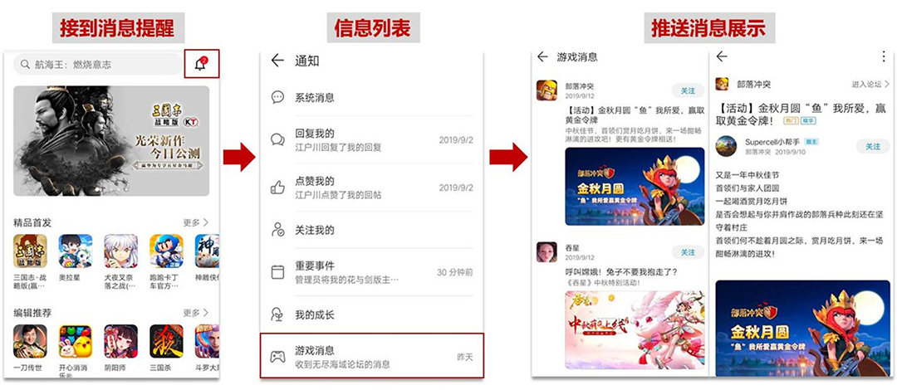
2. 消息推送功能流程：

   开发者需要前往“华为开发者联盟 > 社区管理 > 消息管理”→点击“新建”选项，进行信息编辑

   
3. 消息推送功能规则：

* 每月最多可进行两次推送，每次推送之间时间间隔必须大于一周；

  （举例：8月1日进行第一次推送，则至8月8日前不能进行第二次推送）
* 为避免打扰用户，预定推送时间段请在9:00 - 24:00之间，设定此外的时间推送，一概审核不通过；
* 消息发送后，开发者可以在“消息管理”→“消息效果”中查看发送效果。

想要进一步了解消息推送功能，点击[《华为游戏中心10.1版本信息推送功能与关注功能介绍》](https://communityfile-drcn.op.hicloud.com/FileServer/getFile/cmtyManage/011/111/111/0000000000011111111.20191015150622.71765797638897961168025364037694%3A50511216084150%3A2800%3AF863881CEFD829E253F8AF2EB8A4215755B177E147E323C0BBD5C79440ADB72A.pdf?needInitFileName=true) ，获得详细说明。

###资讯与推送详情页功能

资讯内容推荐功能可以将优质内容多维度地向玩家展示，增加内容的曝光、阅读量与回复量。详情页推荐功能可以将优质内容在游戏详情页中直接展示给玩家，能扩大陌生玩家对该游戏内容的了解。

**资讯功能**

1. 资讯内容展示-资讯页

   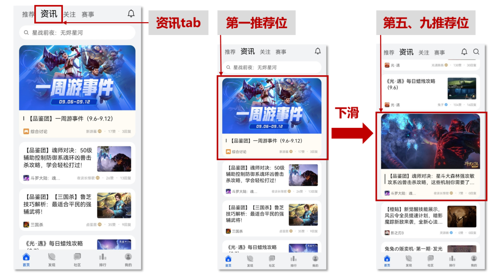

   

   第一、五、九推荐位申请需要向对接的品类经理提出申请。
2. 资讯内容推荐流程：

   路径：[AppGallery Connect](https://developer.huawei.com/consumer/cn/service/josp/agc/index.html) > 社区管理 > 社区详情 > 进入版块 > 点击帖子 > 申请资讯。

   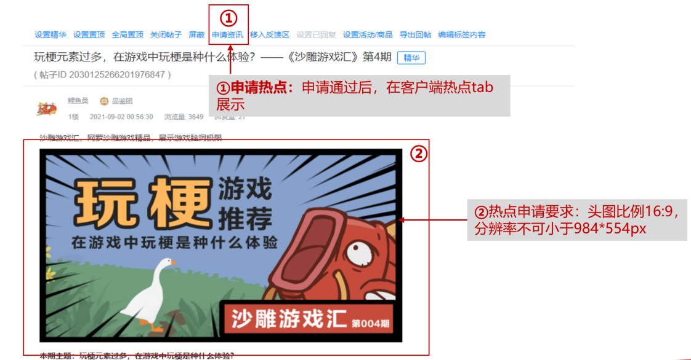
3. 资讯内容推荐规则：

* 每款游戏每天只能通过一次资讯申请；
* 申请内容必须为与游戏相关的高质量精品内容；
* 申请资讯内容可选择帖内合适的图作为封面图，或自行上传，图片分辨率不低于984\*554px，格式为jpg或png；
* 申请第一推荐位需要提供专门的曝光图，示例见下：

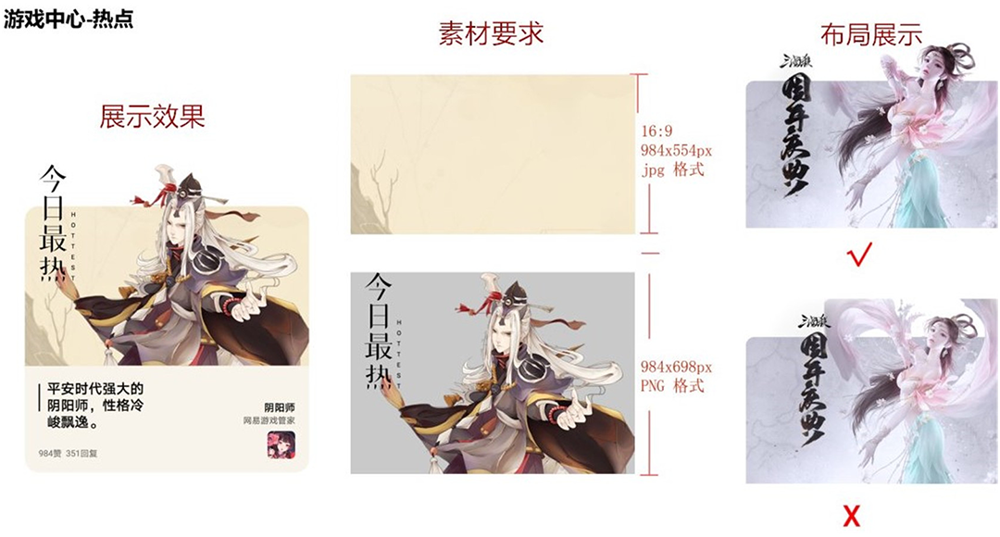

想要进一步了解热点推荐功能，点击 [《热点内容审核规则方案》](https://communityfile-drcn.op.hicloud.com/FileServer/getFile/cmtyManage/011/111/111/0000000000011111111.20191015153419.65752067703022996047473039403211%3A50511216084150%3A2800%3A62149CC171A598F9E549803904A4DF5DD54380B9588F9845BBB1F9AF53D2C603.pdf?needInitFileName=true)，获得详细说明。

**推送详情页功能**

1. 详情页推荐展示：

   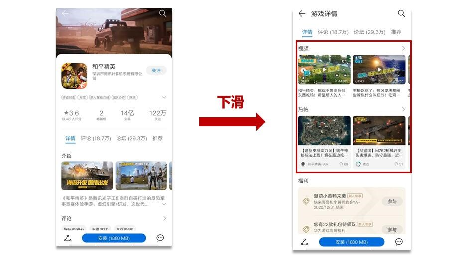
2. 详情页内容推荐申请：

   与热点申请路径一致，但必须选择“当前版块”与选择“时间”，选择完成后点击“确定”。

   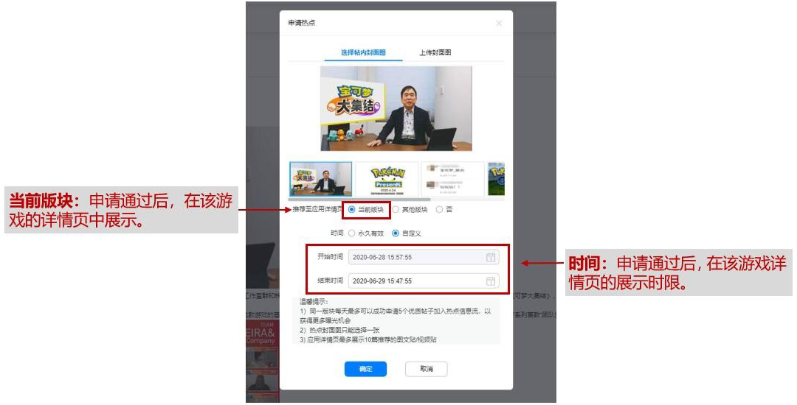
3. 详情页内容推荐规则：

* 详情页内容推荐分为视频、热帖两种，皆可进行推荐；
* 推荐内容必须为与游戏相关的高质量精品内容，活动、简单的公告等一律不通过；
* 推荐内容必须选择具有代表性并且美观的封面图，可以是帖内图片也可以自行上传，要求984\*554的jpg或png的图片格式；
* 推荐时间请按照推荐内容本身的时效性进行设置。

###活动弹框功能

活动弹窗功能可以让玩家在登录游戏时获得活动弹窗通知。

1. 活动弹窗展示：

   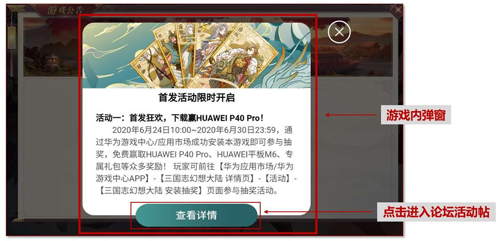
2. 活动弹窗申请流程：

   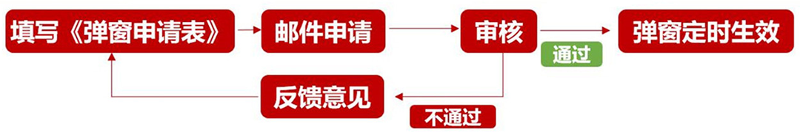

   第一步：按要求填写《[华为游戏中心社区活动弹窗申请表](https://alliance-communityfile-drcn.dbankcdn.com/FileServer/getFile/cmtyPub/011/111/111/0000000000011111111.20260424135620.24926369299119821163515778040364%3A20260601145604%3A2800%3A1AEC573FD743BD5A7D999F5B03EAC51333DD1B252EFEA170DAC6B444FBA77328.xlsx?needInitFileName=true)》；

   第二步：将表格和活动文案、图片邮件发送至邮箱：gameforum@huawei.com ；

   第三步：等待工作人员1~2个工作日审核并反馈意见。
3. 活动弹窗规则：

* 活动弹窗申请一周只有一次机会；
* 活动弹窗生效时间除特殊情况外目前只能申请周六日；
* 申请弹窗的活动必须真实有效，禁止标题党；
* 请在弹窗生效期内，保证活动时间的有效。

## 社区维护要求

社区活跃度的提高，缺不了开发者的配合与努力。所以我们要求开发者对版块内容、活动、用户和版面维护负责，并且按照以下规则和建议进行论坛维护。

###内容建设

是以内容建议为主导，带动玩家互动活跃，最终增加玩家对游戏的黏性。而如何做到好内容建设，我们的建议是三点：

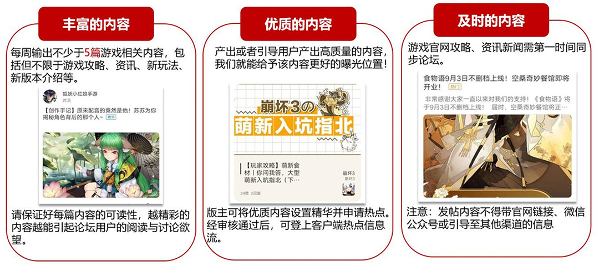

优质的内容可以获得更多曝光的机会。

###活动组织

为了活跃游戏版块，社区鼓励开发者们积极组织社区活动与话题，并给予适当的奖励以增强玩家的参与积极性。社区活动与话题建议：

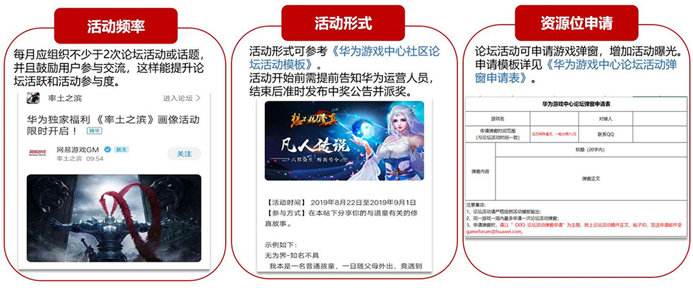

资料：[《华为游戏中心社区论坛活动模板》](https://communityfile-drcn.op.hicloud.com/FileServer/getFile/cmtyManage/011/111/111/0000000000011111111.20191015154608.42107904913519918628004785679315%3A50511216084150%3A2800%3A189B812B894FADB1879D029BC8B07869767DAD43E43B9737295142A539E0B4A5.pdf?needInitFileName=true)

###用户维护

开发者对玩家发帖、回帖的互动，能明显提高论坛玩家的活跃，改善社区的氛围。同时版主们为了维护良好的社区氛围，需要对违规用户进行处理。所以我们要求开发者们能做到：

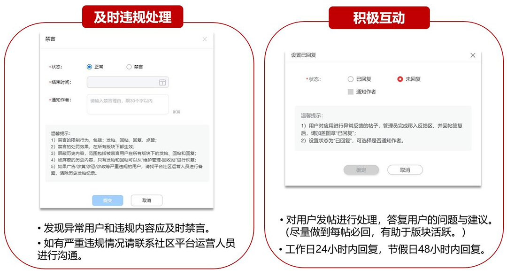

###社区维护

社区日常的运营也需要版主的坚持维护，置顶、加精、鼓励产出，让更多玩家能直接看到更多优质内容。因此我们建议：

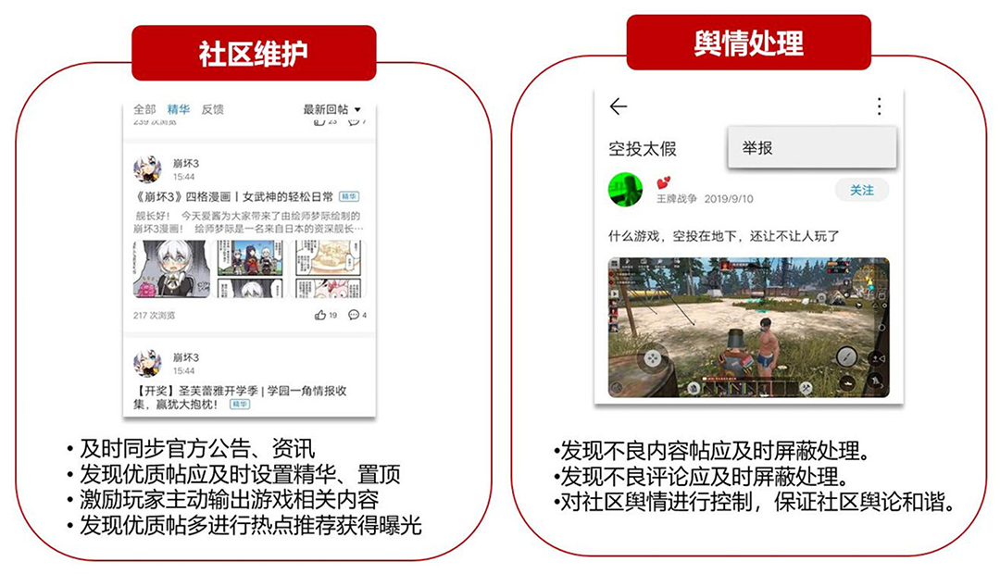

为避免影响用户体验，论坛工作人员会对长期不维护的社区进行关版处理。

## 游戏内嵌社区

游戏中心为开发者提供了游戏内嵌社区服务。游戏内嵌社区服务提供快速访问华为游戏中心论坛的能力，支持玩家直接在游戏内浏览帖子和交流互动，提供沉浸式的论坛互动体验，助力游戏论坛内容产出，提高官方信息触达率。

|  |
| --- |
| 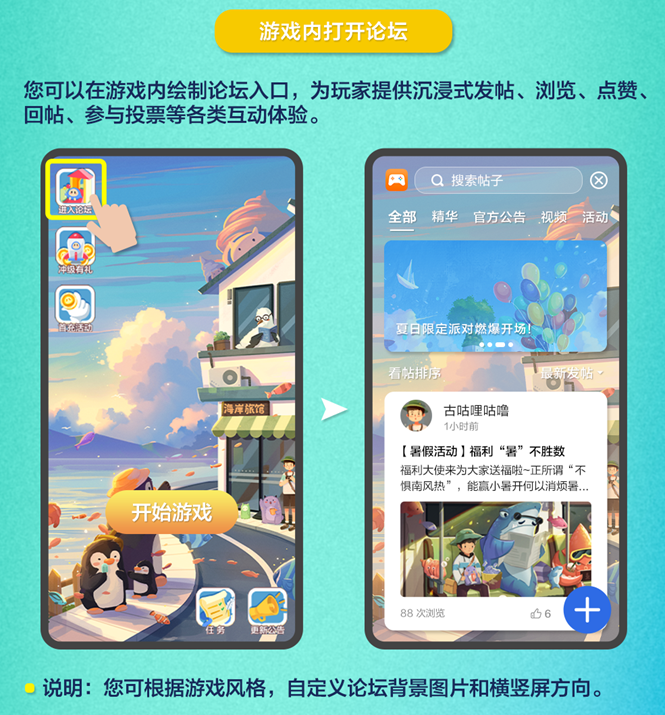 |

您仅需简单的开发步骤即可集成该服务，想要进一步了解游戏内嵌社区功能和接入步骤，点击《[游戏内嵌社区接入指南](https://developer.huawei.com/consumer/cn/doc/AppGallery-connect-Guides/pgsmoment-introduction-0000001244369204)》，获得详细说明。

## 结语

在游戏外为玩家创造一个愉快、轻松的聚集地是我们华为游戏中心社区的目标。

要实现这个目标，我们需要和开发者们一同努力为玩家服务，如仍有疑问，请通过[在线提单](https://developer.huawei.com/consumer/cn/support/feedback/#/add/101704353566310877?level2=101704353626565886&level3=101704354579010004&keyWord=Game Service Kit)方式联系华为工作人员。

更多内容，请见[《华为游戏中心社区操作管理指南》](https://alliance-communityfile-drcn.dbankcdn.com/FileServer/getFile/cmtyPub/011/111/111/0000000000011111111.20260424135621.73819700935794179076722777179876%3A20260601145604%3A2800%3AF96A6A7C348B24B6A7658C7FC75038009281F7690E29921DB7141BF857F7425C.pptx?needInitFileName=true)。

关于指南中所提及的资料：

[《华为游戏中心开版申请》](https://communityfile-drcn.op.hicloud.com/FileServer/getFile/cmtyManage/011/111/111/0000000000011111111.20191015160808.93749614659460508984639867885044%3A50511216084150%3A2800%3A6789526C411EEF08D413712BFB8563A56FEEB5475D78C6B1E73734F35EA616C4.xlsx?needInitFileName=true)

[《社区礼包后台配置指导》](https://communityfile-drcn.op.hicloud.com/FileServer/getFile/cmtyManage/011/111/111/0000000000011111111.20191015160830.84342232606487076568229382262347%3A50511216084150%3A2800%3ADE435B9200BFC6CAB9C39709F8D0FE5AAAF81321E7ADFBA9AC91AF4A7095E6F1.pdf?needInitFileName=true)

[《华为游戏中心资讯内容审核规则》](https://alliance-communityfile-drcn.dbankcdn.com/FileServer/getFile/cmtyPub/011/111/111/0000000000011111111.20260424135621.21479819753952018669368146912145%3A20260601145604%3A2800%3AD0929A7B80FE3F440D191A7CD43D877E17C51BFCDC8482CD039AC9370F81D4E8.docx?needInitFileName=true)

[《华为游戏中心社区活动模板》](https://communityfile-drcn.op.hicloud.com/FileServer/getFile/cmtyManage/011/111/111/0000000000011111111.20191015160920.12876529510443291341318681997612%3A50511216084150%3A2800%3A06E5445E7235EF0D7FB9755C19C3A050199DB74AC96C052F7661D5A0C61426BA.pdf?needInitFileName=true)

[《华为游戏中心社区活动弹窗申请表》](https://communityfile-drcn.op.hicloud.com/FileServer/getFile/cmtyManage/011/111/111/0000000000011111111.20191015160944.65508203420649508241431850599889%3A50511216084150%3A2800%3A1D02C0E0CAE0B8FD02F0DB74FAEF9DA93489B75EEBAD76F8E050CC42BC78F7AD.xlsx?needInitFileName=true)

[《华为游戏中心10.1版本信息推送功能与关注功能介绍》](https://communityfile-drcn.op.hicloud.com/FileServer/getFile/cmtyManage/011/111/111/0000000000011111111.20191015161003.27916652238890466061685013894012%3A50511216084150%3A2800%3A87509BDBEBE4AF53323461F0195279BF3880FC360856A7D276F82D9F92830DC5.pdf?needInitFileName=true)