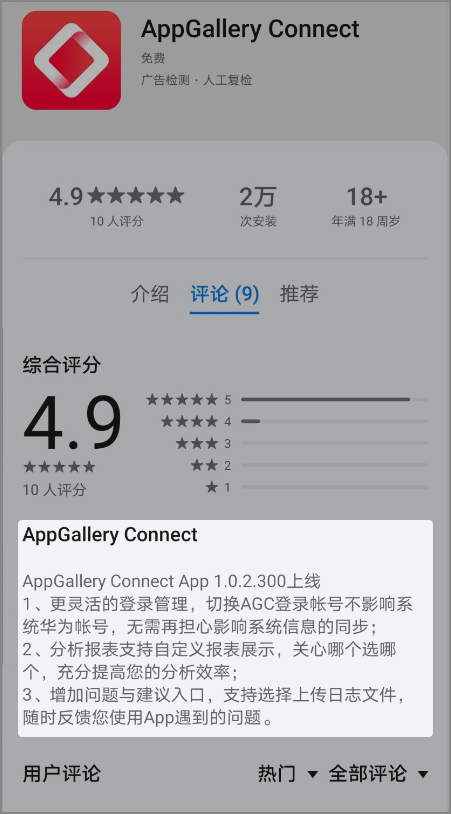
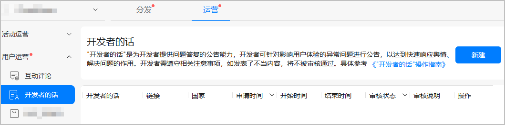
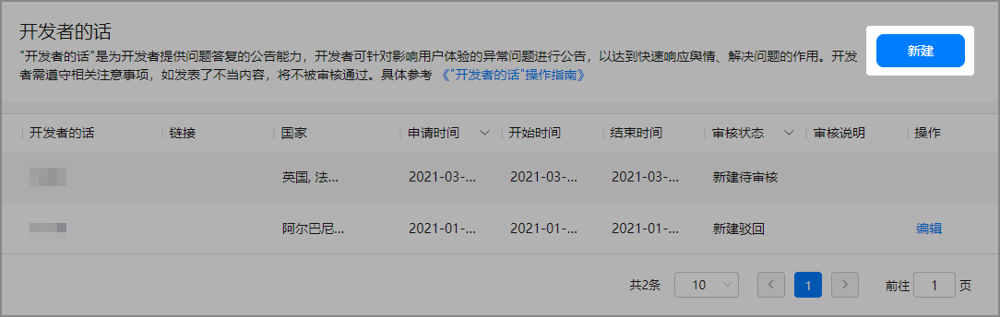
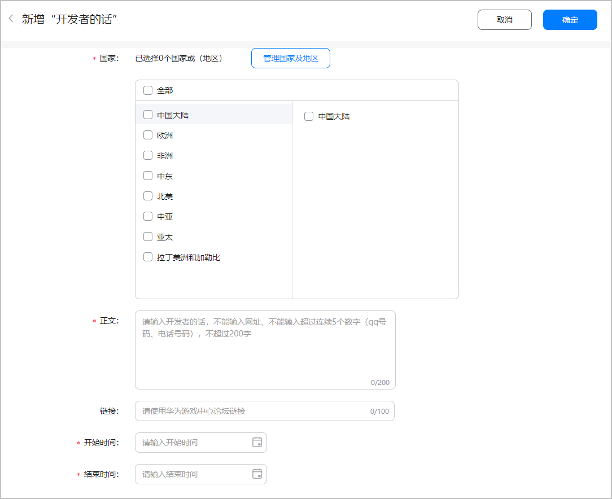
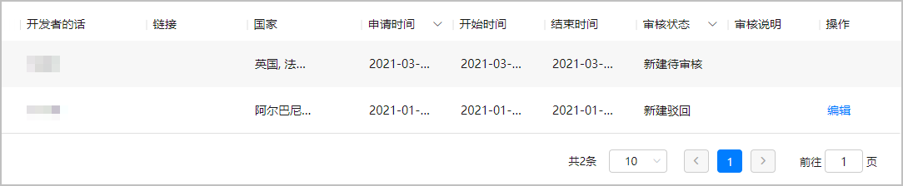

# 开发者的话

## 功能简介

“开发者的话”是为开发者提供问题答复的公告能力，开发者可针对影响用户体验的异常问题进行公告，以达到快速响应舆情、解决问题的目的，位置固定在“应用详情页-评论”下方。

## 使用场景

1. 评论区域出现大量用户反馈异常问题时，可使用“开发者的话”进行问题引导和官方答复。
2. 当应用/游戏出现影响用户体验的重大事项时，如：应用异常问题处理、游戏停服维护、游戏BUG修复等，需要开发者主动告知用户。

## 功能入口

[AppGallery Connect](`https://developer.huawei.com/consumer/cn/service/josp/agc/index.html`) &gt; APP与元服务 &gt; 运营 &gt; 用户运营 &gt; 开发者的话。

## 适用范围

在华为应用市场上架的应用（包括游戏）。

## 使用方法

### 新增“开发者的话”

### 内容配置

### 审核结果通知

开发者提交内容后，审核通过系统将会自动邮件通知开发者审核结果。您也可以通过页面的审核状态查询审核结果。

## 温馨提示

1. 置顶时间：置顶最长时间7天。
2. 支持全球化：每个应用（包括游戏）在每个国家都可以发布一条“开发者的话”。
3. 内容要求：发布内容禁止引导用户到非华为渠道。应用类内容不能输入超过连续5个数字（QQ号码、电话号码），游戏类内容不能输入超过连续5个数字和非华为官方渠道的联系方式，200个汉字以内，公告内容以问题引导、解决问题为主。
4. 链接跳转：支持配置跳转链接，可引导至应用/游戏论坛进行交流。