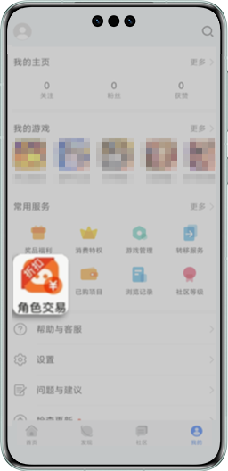
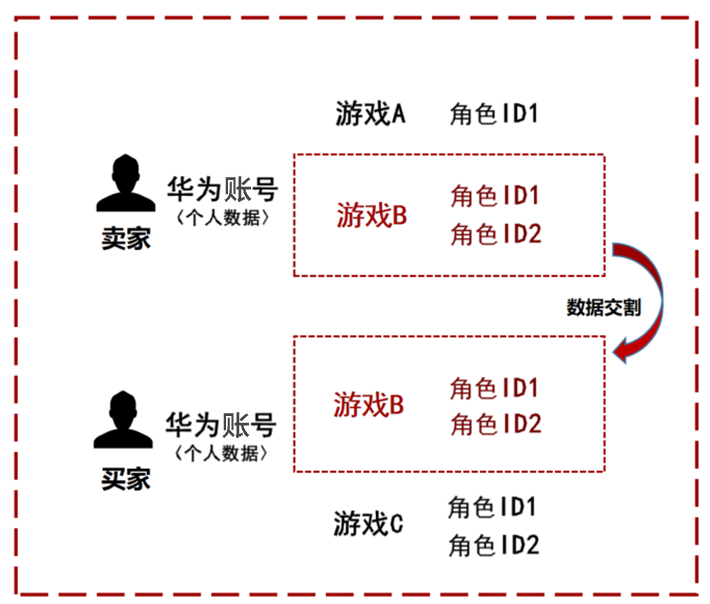
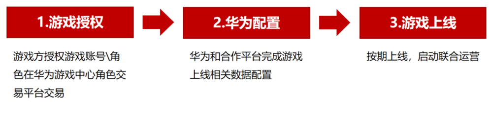

# 华为角色交易平台

## 平台介绍

华为角色交易平台是华为联合游戏方，为华为渠道的游戏玩家打造的安全、合规、放心的官方角色交易平台。平台提供官方角色交易能力，助力维护游戏生态，激活角色价值，提升游戏付费。

* <strong>交易安全，拒绝找回。</strong>

  不涉及华为账号交易，华为账号归属不变，避免账号关联的用户隐私泄露，从根源上杜绝账号找回问题。
* <strong>单游戏/单角色交易。</strong>

  支持单游戏/单角色颗粒度交易，不影响买/卖家其它的账号资产。
* <strong>内嵌游戏中心，聚集核心用户。</strong>

  游戏中心是华为核心用户聚集地，自带千万级月活流量。

## 角色交易入口

角色交易入口在“游戏中心App &gt; 我的 &gt; 常用服务 &gt; 角色交易”。

## 角色交易方式

角色交易方式是指买卖双方登录游戏的华为账号不变，仅角色从卖家华为账号转移至买家账号中，其它任何数据均无变化。

## 接入角色交易平台

接入角色交易平台的步骤如下：

## 联系方式

若您有意愿入驻华为游戏中心官方角色交易平台，或对角色交易平台有任何疑问，请联系华为游戏中心品类经理，或邮件联系game.business@huawei.com，感谢您的配合。