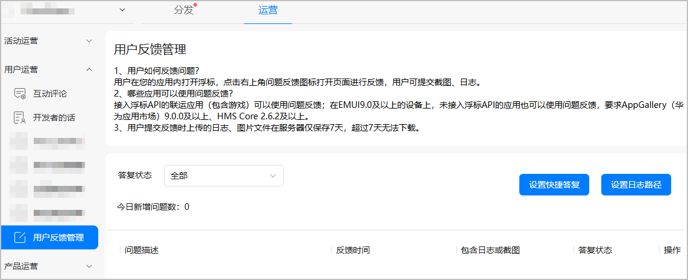
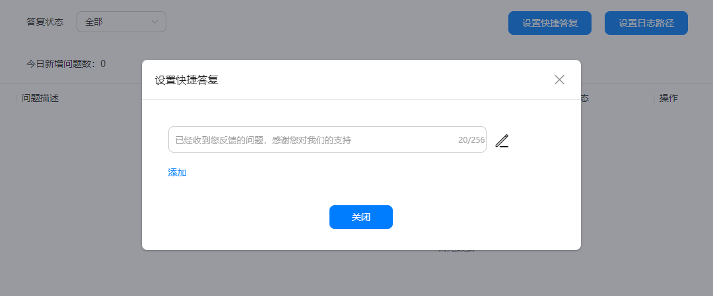
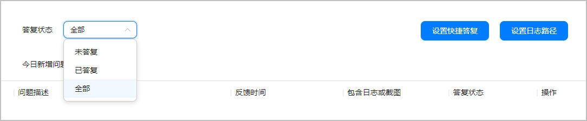
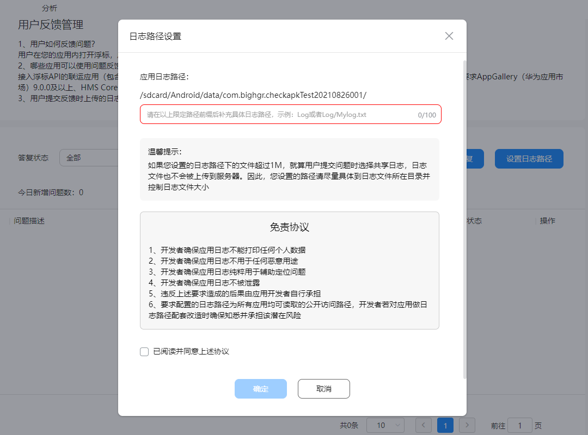
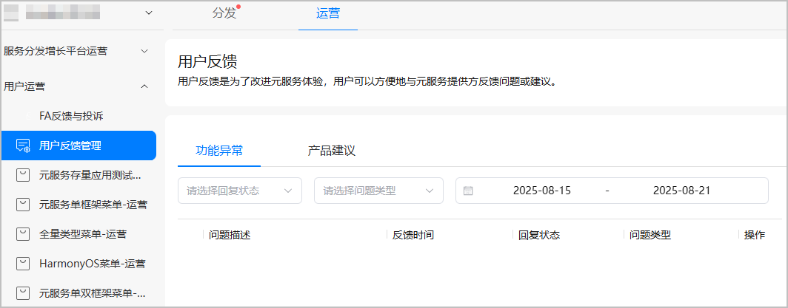

# 用户反馈管理

开发移动应用需经历一系列阶段，包括：创意、设计、开发、发布、反馈收集、修改、重新设计等等，目的是确保以最低的成本成功开发应用。用户反馈是产品生命周期中不可或缺的一部分，通过用户反馈，了解用户真实需求，并为之改进是决定产品演进的基础。快速及时地答复用户的反馈则有利于培养用户对产品的好感度，提升用户体验。

## 应用反馈管理

1. 功能入口：[AppGallery Connect](`https://developer.huawei.com/consumer/cn/service/josp/agc/index.html`)&gt; APP与元服务 &gt; 运营 &gt; 用户运营 &gt; 用户反馈管理。
2. 接入[浮标](`https://developer.huawei.com/consumer/cn/doc/HMSCore-Guides/game-buoy-0000001050121528`)API的联运应用（包含游戏）可以使用问题反馈；在EMUI9.0及以上的设备上，未接入浮标API的应用也可以使用问题反馈，要求AppGallery（华为应用市场）9.0.0及以上、HMS Core 2.6.2及以上。

   
3. 用户在您的应用内打开浮标，点击右上角问题反馈图标打开页面进行反馈，用户可提交截图、日志。开发者则可以在后台设置快捷答复，并可对答复内容自定义化。

   

   另外，还支持筛选已答复/未答复进行查看。

   

   

   用户提交反馈时上传的日志、图片文件在服务器仅保存7天，超过7天无法下载。
4. 设置日志路径：如果您设置的日志路径下的文件超过1M，就算用户提交问题时选择共享日志，日志文件也不会被上传到服务器。因此，您设置的路径请尽量具体到日志文件所在目录并控制日志文件大小。

   

## 元服务反馈管理

1. 登录[AppGallery Connect](`https://developer.huawei.com/consumer/cn/service/josp/agc/index.html`)网站，点击“APP与元服务”，在应用列表页的“HarmonyOS”页签，选择需查看用户反馈的元服务。
2. 选择“运营 &gt; 用户运营 &gt; 用户反馈管理”，进入用户反馈页面。

   
3. 您可以在用户反馈页面查看用户提出的问题或产品建议。