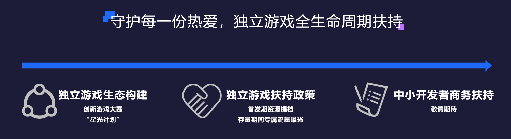
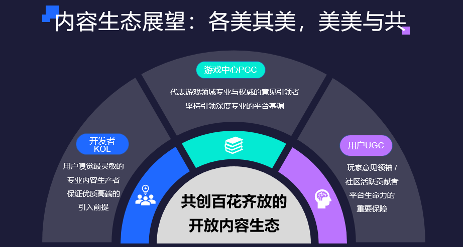
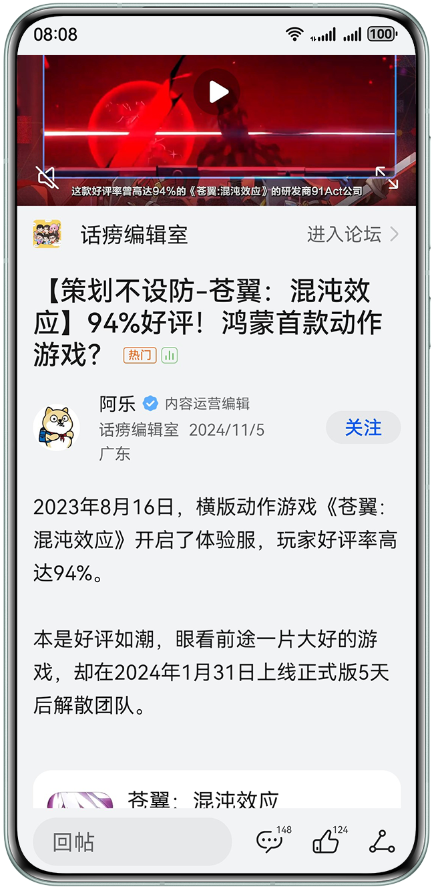
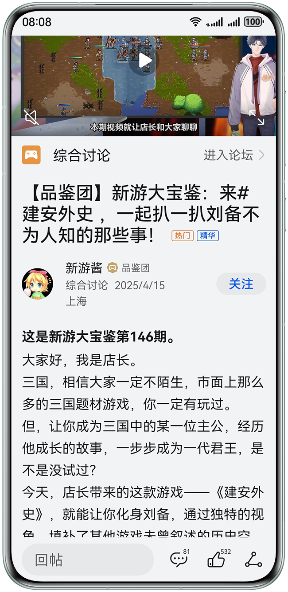
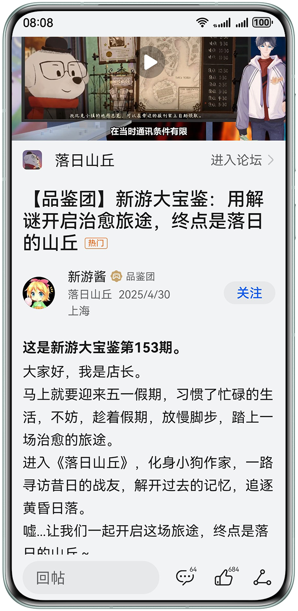
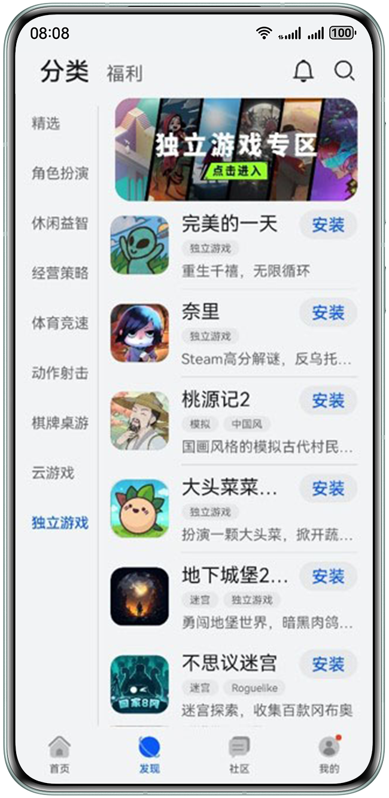
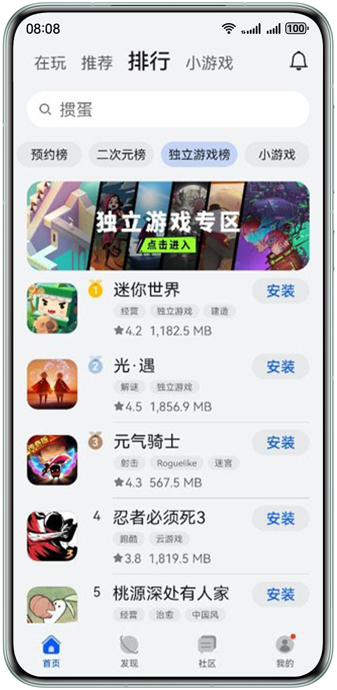
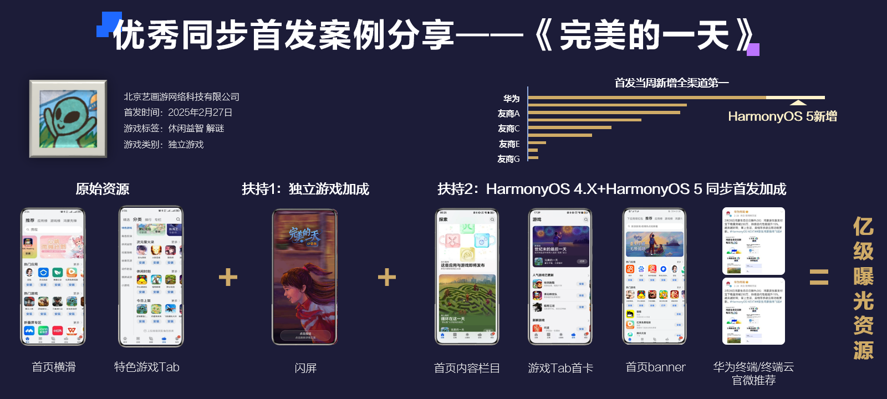
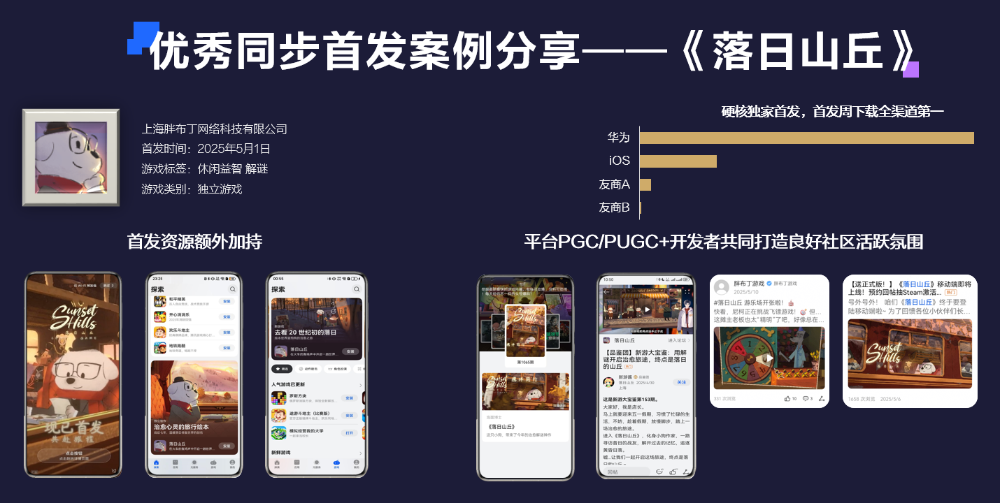

# 独立游戏

独立游戏是指由中小型团队开发制作，在玩法、美术、精神表达上相对小众，同时又有一定程度的创新和突破，但是要排除掉一些通过和商业化IP授权直接引入其世界观、故事背景的游戏，以及一些超休闲类或者涉及到盗版抄袭的游戏。

## 扶持政策

若您有任何问题，都可以扫描下方二维码加群联系华为游戏中心独立游戏团队。

|  |  |  |  |
| --- | --- | --- | --- |
|  |  |  |  |

### 测试期

在项目早期，如果开发者有创意需要进行验证，欢迎联系独立游戏团队或接口人进行咨询。开发者要求有可以上架的公司主体以及对应产品的相关资质。

华为游戏中心会通过“观星人”计划持续培养一批独立游戏的核心用户，通过定期发布的各类任务（例如评论、早期测试、深度测评等）持续为您的独立游戏产出核心内容，维持良好的玩家氛围，和平台一起为独立游戏营造一个好的生态。

### 预约期

华为游戏中心会根据游戏在业界的口碑，或者测试期间的数据表现、玩家呼声来挑选一批较为优质的独立游戏产品。

华为平台会在预约期间为优质游戏持续加热，同时支持优质游戏在较重大的市场宣发节点上获得更多的曝光，尽量被所有感兴趣的玩家看到。

### 首发期

若独立游戏新游能够达到一个较低要求的评级，同时在PC有过一定市场验证，或者在游戏业界有一定口碑，华为游戏中心会在该游戏首发上线时给予较多流量支持，尽量覆盖核心用户。

在此基础上，若独立游戏新游能够在HarmonyOS 4.X系统和HarmonyOS 5系统上同步首发，则可以获得最高亿级的曝光资源。

额外地，若独立游戏新游能够在适配HarmonyOS 5系统的基础上接入与游戏玩法较为匹配的HarmonyOS创新特性（例如碰一碰、创新互动卡片），流量扶持能够继续加码。

### 内容与社区运营

独立游戏除了产品本身的美术、玩法、叙事上有着与众不同的话题点之外，其背后的开发团队往往也极具故事性，在独立游戏产品的全生命周期中，华为游戏中心将持续挖掘可发酵的内容，通过编辑室和社区品鉴团持续输出专访、评测等不同类型的PGC和PUGC内容。同时会定期通过平台创作活动向玩家征集评论、评测、攻略类型等UGC内容，致力于构建一个“各美其美，美美与共”百花齐放的开发内容生态。

|  |  |  |
| --- | --- | --- |
|  |  |  |

### 产品孵化

华为游戏中心希望和有意向的独立游戏开发者一同定制一批面向未来、天生跨端、拥有革命性体验、新形态的HarmonyOS专属定制游戏，为此华为游戏中心将投入一定预算和端内端外的曝光资源，在创意立项、版号申请、产品接入等环节提供必要的支持。欢迎有意向的开发者通过上方二维码联系我们。

## 游戏展示专区

目前仅支持HarmonyOS 4.X系统。

华为致力于将独立游戏专区打造成一个独立游戏核心用户沉淀、发酵的专属阵地。

通过各类PGC、PUGC、UGC内容来吸引玩家不断复访，通过内容带货、种草的形式，把独立游戏小众和独特的一面呈现在玩家面前，不让玩家错过可能感兴趣的精品游戏。

| App | 独立游戏展示专区路径 |
| --- | --- |
| 游戏中心 | * 游戏中心-发现-分类-独立游戏-顶部banner * 游戏中心-首页-排行-独立游戏榜-顶部banner |
| 应用市场 | * 应用市场-游戏-分类-独立游戏-顶部banner * 应用市场-首页-游戏榜-独立游戏榜-顶部banner * 应用市场-游戏-排行-独立游戏榜-顶部banner |

|  |  |  |
| --- | --- | --- |
|  |  |  |

## 成功案例

独立游戏新游在HarmonyOS 4.X系统和HarmonyOS 5系统同步首发案例如下：

## 名词解释

| 概念 | 说明 |
| --- | --- |
| PGC | Professional Generated Content，由平台生成的内容。 |
| PUGC | Professional User Generated Content，由专业用户生成的内容。 |
| UGC | User Generated Content，由普通用户生成的内容。 |

## FAQ

### 已上架的独立游戏是否还可以获得华为游戏中心的额外扶持？

可以。

HarmonyOS生态现处于一个开放的窗口期，有意向与精品独立游戏进行合作。华为游戏中心会通过独立游戏专区、HarmonyOS创新特性相关的营销资源持续曝光与我们合作的产品，也会通过内容和社区运营为独立游戏提供一个良好的玩家生态。

### PC上的独立游戏是否还可以获得华为游戏中心的扶持？

可以。

独立游戏开发者普遍有PC游戏的开发经验，多端部署方便玩家在不同形态的设备上随时随地进行体验。针对积极适配PC端的游戏我们会优先进行推荐，包含游戏中心首页banner、大卡等联运资源推广，和新品发布会露出、官方社媒宣传等端外营销宣传源。