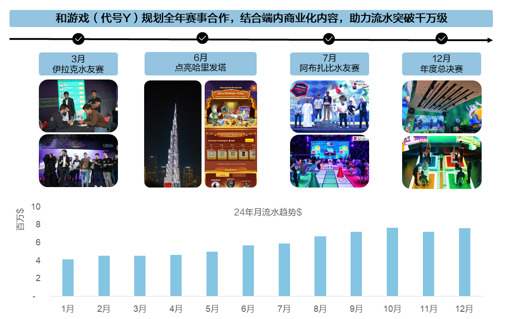
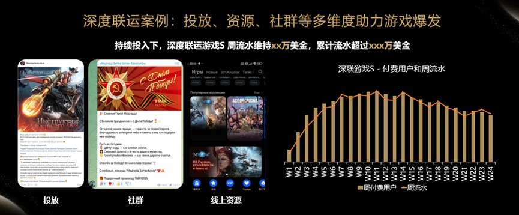

# 国际游戏联运服务

## 联运服务介绍

国际游戏联运服务，是华为和开发者将联运付费游戏产品通过华为海外应用市场、华为海外游戏中心等平台发布而进行的联运分成合作及各自的相关行为。华为为游戏开发者提供平台能力接入、数据报表、活动运营、用户运营等一系列分发运营服务。

合作模式：

* 应用内购买：是指用户在安装游戏后，在使用游戏的过程中，通过支付一定金额购买游戏内的数字内容、高级功能或其他增值服务。用户的支付行为（“应用内支付”或“In-App Purchase”）在游戏内产生。
* 付费下载：是指用户需要支付一定金额以后，才可以查看、下载和使用游戏产品。

## 扶持政策

### 优惠分成

账号组由游戏开发者在华为开发者平台创建账号组并提交与游戏开发者具有关联关系的所有关联开发者信息，或加入某个与游戏开发者有关联关系的开发者创建的账号组。详细内容请参见[《华为应用市场联运服务协议》](`https://developer.huawei.com/consumer/cn/doc/app/20204`)。

针对每个自然年，对游戏开发者的账号组中基于RSRA计算的前 30 万美元（含30万美元）总结算金额所涉及的交易，账号组中每个关联的开发者账号适用的分成比例都将为15%:85%（华为:开发者）。当账号组每个自然年基于RSRA计算的总结算金额超过 30 万美元（不含30万美元）后，则账号组中的每个关联账号在该自然年的余下时间里适用标准分成比例。

### 游戏资源和评级

华为游戏中心会在游戏上架前，将游戏包同步给游戏意向发布区域，进行试玩评级；评级分S、A+、A、B+、B，C 不同的评级匹配相应的在上线时华为提供的曝光资源，包含开屏、banner、社群推广等。

### 海外各区域能力介绍

经过多年能力积累，华为游戏中心在海外各个区域都具备强大的游戏推广资源。

* 亚太：在华为旗舰店打造游戏的品牌宣传助力阵地；举办线下活动，与用户互动，打造更强大的社群；高校合作，培养年轻玩家，服务游戏封测和电竞推广；运营商宣传资源，提升充值消费，出圈获客；支持游戏公会运作，促进玩家活跃和留存。
* 欧亚：上千名KOL合作对接，提供高曝光率；全场景生命周期运营覆盖，提升用户激活、付费转化、付费提升。

* 中东非：游戏本地化提升服务，牵引游戏优化方向；KOL集中推广，最大化曝光；整合资源打造线上社区，沉淀核心用户；结合游戏商业化节奏，推出福利活动，提升拉收效率。
* 欧洲：社群本地化深度运营，覆盖主流社群阵地；VIP一对一推送触达，获取高价值用户；联合游戏参与游戏展会，破圈获客。

* 拉美：内容创作者计划，输出高质量游戏内容；运营商全面合作，多维度触达核心游戏玩家；参与游戏展&路，举办玩家见面会，打造优质游戏体验。

### 分成政策与结算相关

* 分成政策

  

  2022年最新分成政策请参考[《华为应用市场联运服务协议》](`https://developer.huawei.com/consumer/cn/doc/app/20204`)。

  + 首次签订《华为应用市场联运服务协议》的日期为2022年1月1日及之后的开发者，可申请参加2022年激励计划。
  + 除非发生终止，否则本2022年激励计划将持续有效。

* 结算周期规则：结算单出具后确认结算单自动触发支付流程。根据已签订的合作协议，合作伙伴可在结算单出具后15个自然日内同华为对账并确认结算单，若在15个自然日内未发起争议申请则视同无异议，系统自动确认，进入支付处理流程。
* 结算公式&场景举例

  当期结算金额=（总交易金额-总支付渠道手续费-订单销项税额）\*分成比例\*（1+进项税率）\*[结算汇率\*（1-币种转换费率）]+结算调整-商户承担的优惠券成本\*结算汇率

  + 总交易金额：结算周期内所有用户实际支付的订单金额总和（含税）。
  + 总支付渠道手续费：商品价格乘以渠道费用表中所列的渠道[费率](`https://developer.huawei.com/consumer/cn/doc/00002`)。
  + 订单销项税：根据支付订单所在的纳税国或地区对应的税法要求而定，税率信息请参照[税率表](`https://developer.huawei.com/consumer/en/doc/start/merchant-service-0000001053025967#section154132916309`)。
  + 分成比例：遵循联运服务协议中双方约定的 “分成比例”。
  + 结算汇率&币种转换费率：
    - 若产品销售国家或地区的本地货币与结算币种不同，则华为将采用华为公布的汇率来将其换算为结算币种，并扣除1.5％的币种转换费率
    - 华为汇率取自上一个月最后一个工作日北京时间上午10点市场即期汇率。在汇率异常波动的情况下，华为保留采用其它汇率或不同转换费用的权利。

## 成功案例

## 深度联运介绍

深度联运模式，是华为推出的一种全渠道联运商业模式，旨在通过华为自身的投放能力、本地化能力等，帮助开发者开拓市场。

### 华为在深度联运服务提供更多发行服务

1. 测试期：LQA优化，素材准备，专业游戏评测，游戏预约，核心用户收拢。
2. 首发期：买量获客，下载及付费破冰活动，游戏KOL推广，本地媒体曝光。
3. 爆发期：买量持续投入，社群活动，VIP用户群深度维护。
4. 长线运营期：平台型活动（如水友赛、社群赛、电竞赛）。

### 深度联运报名链接

请您联系 gamesupport@huawei.com 报名参与深度联运。

### 深度联运案例

## FAQ

### 接入指引

游戏接入流程请参见[发布应用](`https://developer.huawei.com/consumer/cn/doc/app/agc-help-release-overview-0000001272395372`)文档。