# 游戏预约（APK）

游戏预约指在游戏首发前进行宣传，配合游戏论坛、资讯的持续更新曝光，保证首发前的游戏热度，为正式首发凝聚力量。当玩家对游戏感兴趣时会选择预约游戏，在游戏首发后，华为游戏中心会给已预约的用户发送通知，这些用户会有较高概率转化成游戏玩家，因此我们强烈推荐您使用游戏预约。游戏预约流程如下：

## 前提条件

* 您已成功[创建游戏](`https://developer.huawei.com/consumer/cn/doc/distribution/app/agc-help-createapp-0000001146718717`)，且软件包类型为“APK(Android应用)”，支持设备为“手机”。
* （可选）您可以[开通游戏版块](`https://developer.huawei.com/consumer/cn/doc/app/game-center-community-operation-0000001194305462`)，宣传游戏内容，聚集核心用户。
* （可选）您可以[申请预约活动](`https://developer.huawei.com/consumer/cn/doc/app/game-center-setup-activities-reservation-0000001657694701`)，对预约用户派发礼包、卡券等福利。

## 选择预约方式

请根据不同预约方式的特点选择您想要的预约方式。

### 详情页预约

详情页预约页面样式较简洁，页面所需素材内容较少，可作为快速上线的预约方式。预约页面可展示游戏论坛和活动礼包等。素材准备可参考[详情页预约素材](#section1072141417177)。

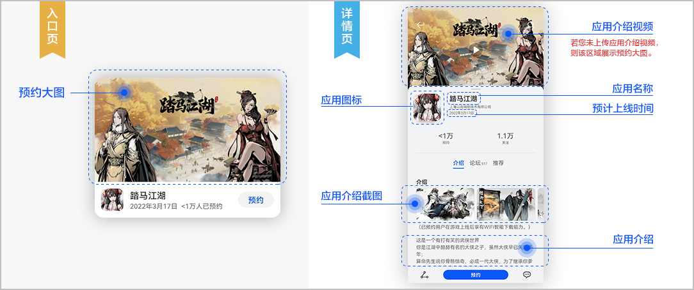

### H5页面预约

H5页面展示样式较丰富，上传图片、文字素材即可生成预约页面。相较于详情页，H5页面预约所需的素材内容较多，页面展示效果较好，可作为中后期优化预约的方式。H5预约页面可展示游戏社区入口、社区内容、预约福利等。素材准备可参考[H5页面预约素材](#section5865155713178)。

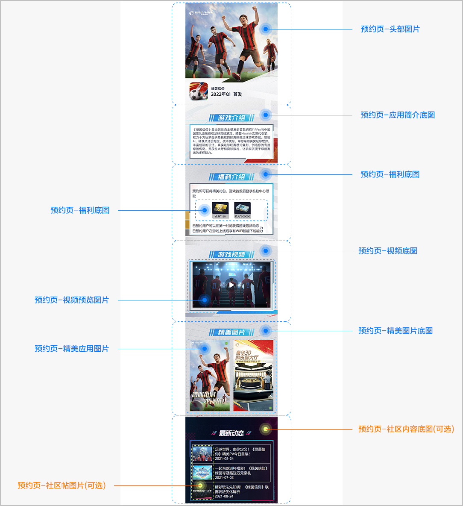

### 自定义页面预约（魔方创意页面）

自定义页面展示样式较丰富，页面内容不受固定模块限制，可根据游戏自身特色开发各类模块，例如多视频、技能演示、小游戏等，以灵活多变的形式和丰富多彩的内容吸引预约用户。当前支持使用[魔方创意生成的H5内容化预约页](`https://developer.huawei.com/consumer/cn/doc/app/game-center-creatives-ideas-pre-order-0000002023298502`)或直接使用预约H5活动页面作为预约详情页。

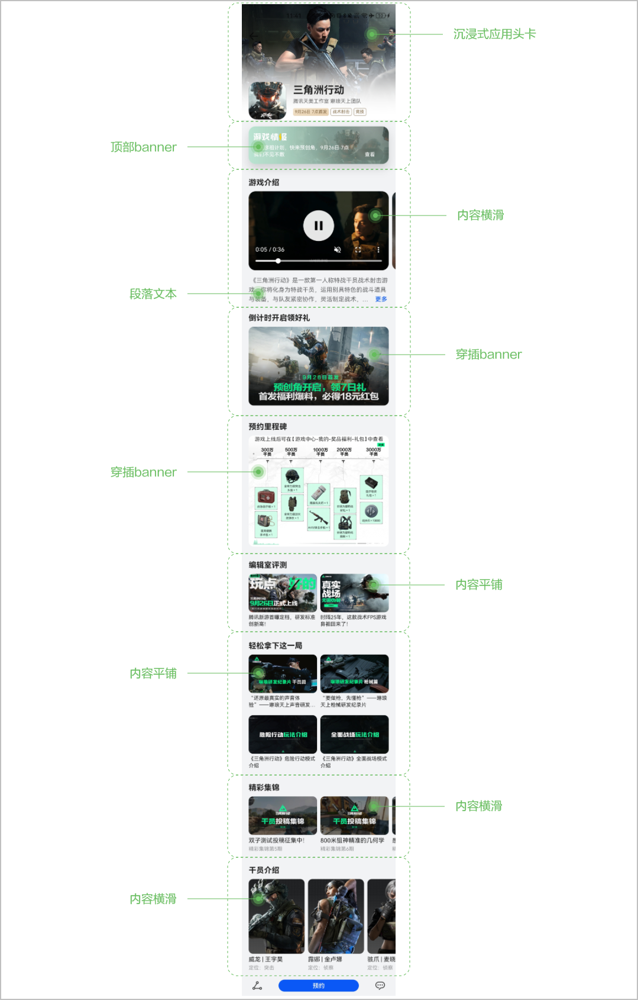

### 预约方式的对比

| 预约方式 | 操作难度 | 页面完成时间 | 建议选择场景 |
| --- | --- | --- | --- |
| 详情页预约方式 | 低 | 快 | 建议您首次新建预约申请时使用。 |
| H5页面预约方式 | 中等 | 中等 | 建议您在中后期优化预约页面时使用。 |
| 自定义页面预约（魔方创意页面）方式 | 中等 | 中等 | 建议您在中后期优化预约页面时使用。 |

## 准备预约素材

请根据您选择的预约方式准备对应的素材内容。

您可以在预约期间让玩家参与实物抽奖活动，具体实施方案请联系华为运营人员的企业QQ：2851508956。

### 详情页预约素材

| 准备项 | 说明 |
| --- | --- |
| 预约大图 | 展示在预约专题栏的预约图，作为预约页的入口。要求宽\*高为1280px\*720px，不超过2MB的JPG/PNG图片。 |
| 介绍视频（可选） | 展示在预约专题栏的介绍视频。要求分辨率为1280\*720，宽高比为16:9，不超过500MB且视频长度15秒~2分钟的MP4/MOV视频。 |
| 预约礼包图片（可选） | 展示在预约页。要求宽\*高为168px\*168px，不超过100KB的PNG/JPG图片。 |

### H5页面预约素材

| 准备项 | 说明 |
| --- | --- |
| 预约大图 | 展示在预约专题栏的预约图，作为预约页的入口。要求宽\*高为1280px\*720px，不超过2MB的JPG/PNG图片。 |
| 介绍视频（可选） | 展示在预约专题栏的介绍视频。要求分辨率为1280\*720，宽高比为16:9，不超过500MB且视频长度15秒~2分钟的MP4/MOV视频。 |
| 全局背景颜色 | 以#开头的6位十六进制颜色值，颜色值可参照[颜色码对照表](`https://alliance-communityfile-drcn.dbankcdn.com/FileServer/getFile/cmtyPub/011/111/111/0000000000011111111.20251217151636.77136823140306973003732938561071%3A50001231000000%3A2800%3A3A16ADBAF49B159639A96C6D8D6B5455430AD9ED5DAA32D1BB1C40A4717B1E4F.xlsx?needInitFileName=true`)。  说明：  “黑色”的十六进制颜色值为“#000000”；“白色”的十六进制颜色值为“#ffffff”。 |
| 头部图片 | 展示在预约页顶部。要求宽\*高为1080px\*1146px，不超过500KB的JPG/PNG图片。 |
| 进入社区的按钮底图（发布中国大陆时可选） | 社区论坛的入口按钮。要求宽\*高为360px\*120px，不超过500KB的JPG/PNG图片。 |
| 应用简介底图 | 游戏简介版块的背景图。要求宽\*高为1080px\*684px，不超过200KB的JPG/PNG图片。 |
| 福利底图 | * 福利版块的背景图。要求宽\*高为1080px\*888px，不超过200KB的JPG/PNG图片。 * 福利礼包展示效果图。要求宽\*高为898px\*200px，不超过200KB的JPG/PNG图片 |
| 视频底图（发布中国大陆时必选） | 游戏视频版块的背景图。要求宽\*高为1080px\*924px，不超过200KB的JPG/PNG图片。 |
| 视频预览图片（发布中国大陆时必选） | 不播放视频时的预约图片。要求宽\*高为912px\*514px，不超过200KB的JPG/PNG图片。 |
| 视频文件（发布中国大陆时必选） | 要求分辨率范围为720P~1080P，不超过500MB且视频长度为15~30秒的MP4/MOV视频。 |
| 精美图片底图 | 精美图片版块的背景图。要求宽\*高为1080px\*1212px，不超过200KB的JPG/PNG图片。 |
| 精美应用图片 | 精美游戏场景截图。要求4~5张宽\*高为450px\*800px，不超过500KB的JPG/PNG图片。 |
| 社区内容底图（发布中国大陆时可选） | 社区版块的背景图。要求宽\*高为1080px\*1014px，不超过200KB的JPG/PNG图片。 |
| 社区帖图片（发布中国大陆时可选） | 每条社区帖子缩略图。要求1~3张宽\*高为228px\*169px，不超过50KB的JPG/PNG图片。 |

### 自定义页面预约（魔方创意页面）素材

| 准备项 | 说明 |
| --- | --- |
| 沉浸式头图 | 要求宽高比为4:3，不超过500KB的图片，建议宽\*高为1080px\*810px。 |
| 应用ICON | 要求宽高比为1:1。 |
| 游戏情报底图 | 仅支持无文案底图，不超过500KB的图片，建议宽\*高为1080px\*290px。 |
| 游戏五图 | 要求宽高比为16:9，不超过500KB的图片，建议宽\*高为1280px\*720px。 |
| 游戏介绍文案 | 游戏简介。 |
| 福利信息图片 | 不超过500KB的图片，建议图片宽度为1280px，高度可自定义。 |
| 游戏内容图片 | 不超过500KB的图片，有三种尺寸可选择：   * 宽高比为16:9，建议宽\*高为1280px\*720px。 * 宽高比为3:4，建议宽\*高为960px\*1280px。 * 宽高比为1:1，建议宽\*高为1080px\*1080px。 |
| 游戏相关视频 | 要求视频格式为MP4，压缩格式为H264。 |
| 预约大图 | 展示在预约专题栏的预约图，作为预约页的入口，要求宽\*高为1280px\*720px，不超过2MB的JPG/PNG图片。 |
| 介绍视频（可选） | 展示在预约专题栏的介绍视频。要求分辨率为1280\*720，宽高比为16:9，不超过500MB且视频长度15秒~2分钟的MP4/MOV视频。 |
| 自定义H5链接 | 当前支持通过魔方创意编辑内容化预约页，也可以直接添加由魔方创意生成并审核通过的H5活动页面链接。 |

## 配置应用基本信息

在提交游戏的预约申请前，您必须优先[配置应用基本信息](`https://developer.huawei.com/consumer/cn/doc/app/agc-help-releaseapkrpk-0000001106463276#section27070410361`)，否则无法提交预约申请。配置基本信息需要的素材规范请参考[应用素材要求](`https://developer.huawei.com/consumer/cn/doc/distribution/app/agc-help-app-material-requirement-0000001146534651`)。

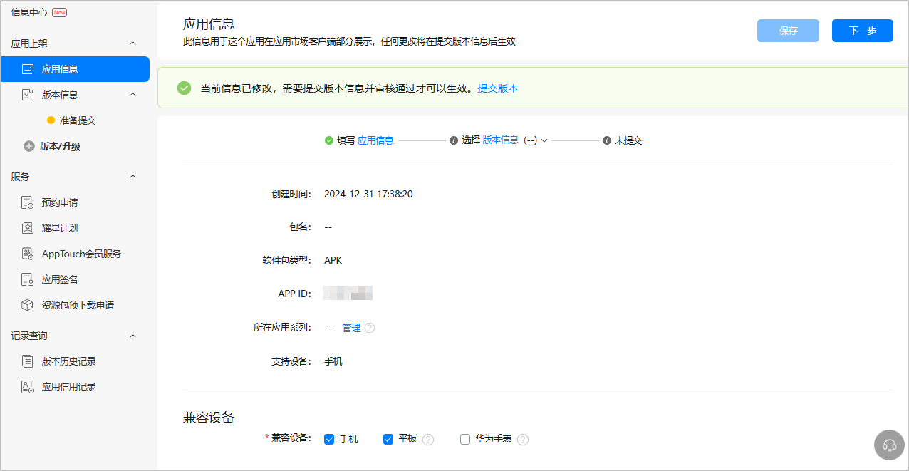

* 若分发到非中文语言的国家或区域，需设置“美式英文”作为默认语言，以提高用户体验度。
* 请确保“应用信息”页面中选择的多语言范围和“预约申请”页面保持一致，且“版本信息”页面中选择的国家或地区和“预约申请”页面保持一致，否则无法提交预约申请。

## 提交预约申请

1. 登录[AppGallery Connect](`https://developer.huawei.com/consumer/cn/service/josp/agc/index.html`)，点击“APP与元服务”。
2. 在应用列表中点击需要申请预约的游戏，选择“分发 &gt; 服务 &gt; 预约申请”，在页面右侧点击“新建预约”。

   

   您无法新建同一国家或地区的预约申请。

   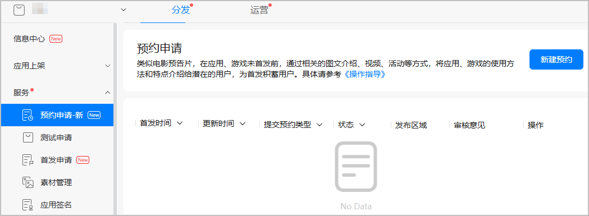
3. 在“预约申请”页面按照提示填写信息。

   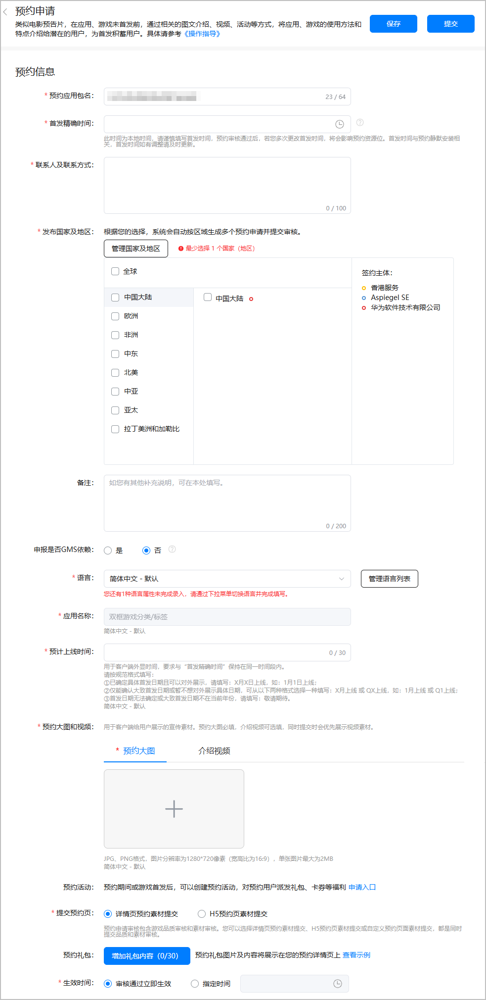

   | 配置项 | 说明 |
   | --- | --- |
   | 预约应用包名 | 预约包名请以 “.huawei”或“.HUAWEI”结尾。 |
   | 首发精确时间 | 游戏首次上架时间，若有调整请及时更新。  说明：  若您已提交内测申请，请确保新游的首发时间必须晚于[内测结束时间](`/docs/distribute/app-dist/game-center/game-center-test-0000001239342331/game-center-early-access-0000001194302390#ZH-CN_TOPIC_0000001194302390__p13448133315204`)。 |
   | 联系人及联系方式 | 填写联系人和联系人QQ、联系电话、邮箱，要求1~100字符。 |
   | 发布国家及地区 | 游戏预约分发的国家及地区，需和“版本信息”页面保持一致，否则可能导致用户无法下载游戏。  说明：  华为运营人员在审核应用时会检查您的游戏是否符合对应国家或地区的政策、宗教文化等要求。若不符合，运营人员会将该国家或地区从分发区域中去除 。 |
   | 备注（可选） | 可补充其他说明信息。要求1~200个字符。 |
   | 语言 | 预约页面展示的语言。您可以自主添加其他语言：  * 每种语言的素材内容必须单独配置并保存。 * 优先根据玩家手机的语言系统自动切换。若没有，则使用您配置的默认语言显示预约页。 说明：  您选择的多语言范围需和“应用信息”页面保持一致，否则可能导致用户无法正常查看游戏的预约页。 |
   | 应用名称 | 自动关联，不可更改。 |
   | 预计上线时间 | 用于客户端外显时间，要求与“首发精确时间”保持在同一时间段内。  请按规范格式填写：  * 已确定具体首发日期且可以对外展示，请填写：X月X日上线，如：1月1日上线； * 仅能确认大致首发日期或暂不想对外展示具体日期，可从以下两种格式选择一种填写：X月上线 或 QX上线，如：1月上线 或 Q1上线； * 首发日期无法确定或大致首发日期不在当前年份，请填写：敬请期待。 说明：  “Q4”表示“第四季度”。 |
   | 预约大图和视频 | 用于客户端给用户展示的宣传素材。请上传提前准备的预约大图或介绍视频，预约大图为必填，介绍视频为选填，同时提交时优先展示视频素材。 |
   | 论坛申请（可选） | 游戏社区论坛可宣传游戏相关内容，聚集核心用户。 |
   | 预约活动（可选） | 预约活动可对预约用户派发礼包、卡券等福利。您可在游戏首发当天提交礼包申请和活动申请，审核通过后预约礼包会自动发放给预约用户。 |
   | 提交预约页 | 提交的预约方式：  * [详情页预约素材提交](#section32641652143114) * [H5预约页素材提交](#section1785425473514) * [自定义预约页面素材](#section719143793615) 说明：  详情页预约、H5预约页预约与自定义页面预约（魔方创意页面），可相互进行转换。若需快速上线，可先进行详情页预约，后续更改为H5页面预约或自定义页面预约（魔方创意页面）。 |

### 详情页预约素材提交

“提交预约页”选择“详情页预约素材提交”后，继续按照提示填写预约申请信息。预约申请中需要上传素材内容，具体要求可参考[准备预约素材](#section1072141417177)。

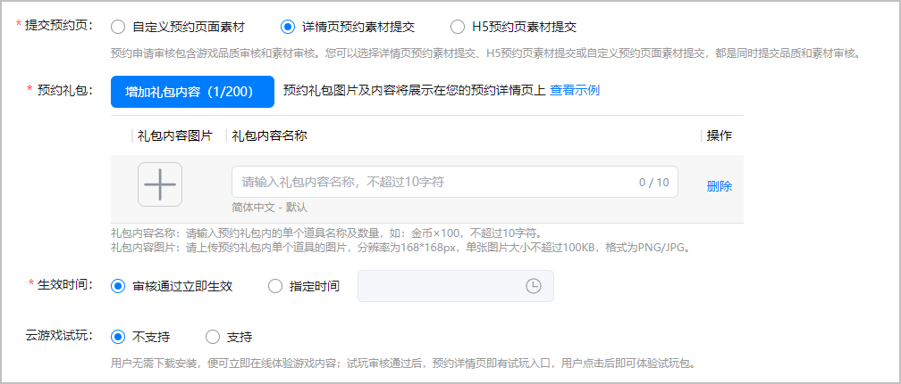

| 配置项 | 说明 |
| --- | --- |
| 预约礼包 | 预约活动中派发给预约用户的福利，最多可创建30个。  说明：  * 可不配置预约礼包，若配置需完整填写图片和名称信息。 * 若暂不确定预约礼包内容，请删除默认空白项。 |
| 生效时间 | 请选择预约生效方式：   * 审核通过立即生效 * 指定时间 |
| 云游戏试玩 | 请选择“不支持”。  说明：  根据国家出版署规定不能以任何形式给未成年人提供游戏，所以该配置项目前已失效。 |

### H5预约页素材提交

“提交预约页”选择“H5预约页素材提交”后，继续按照提示填写预约申请信息。预约申请中需要上传素材内容，具体要求可参考[准备预约素材](#section5865155713178)。

文档仅展示部分操作页面。

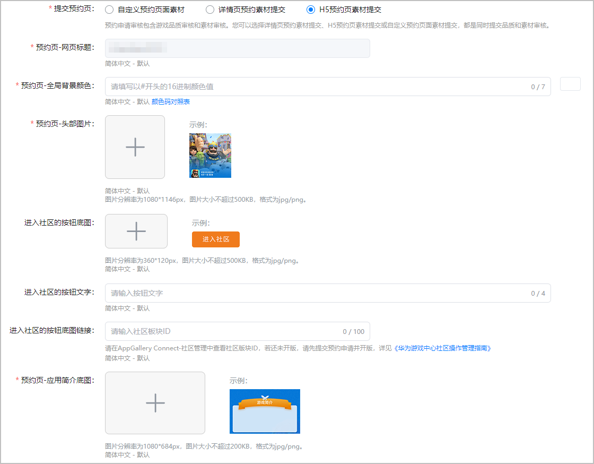

完成信息的填写后，您可以点击右上角的“预览”查看效果。若您的预约语言超过3种，将展示“请选择其他语言”的下拉框。您可以根据素材展示的效果进行优化。

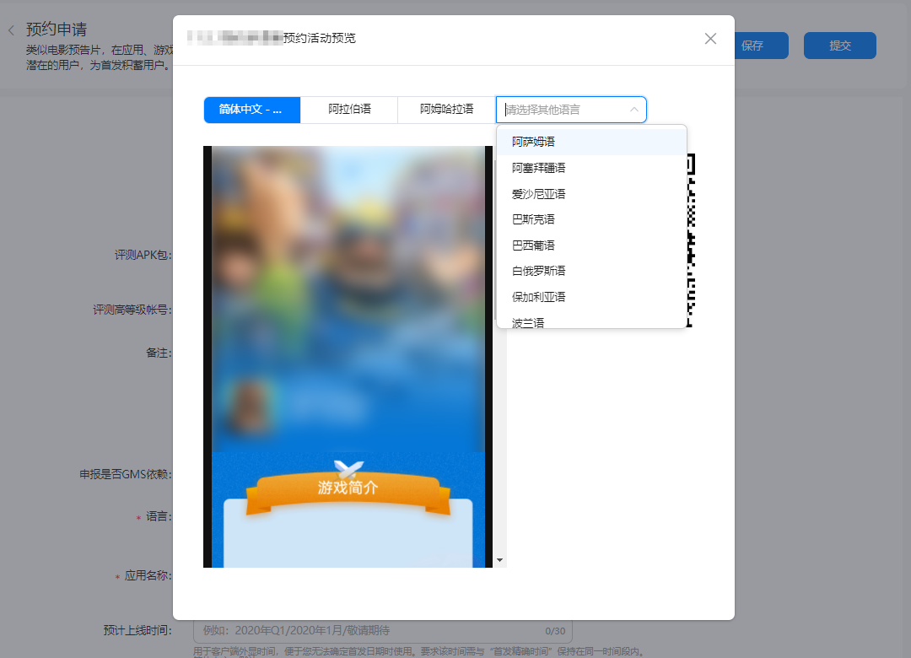

### 自定义预约页面素材

“提交预约页”选择“自定义预约页面素材”后，点击“前往创建”前往魔方创意新建页面，完成编辑并保存后返回当前页面，点击“生成链接”生成魔方创意的H5活动页面链接，或直接填写由魔方创意生成并审核通过的H5活动页面链接。

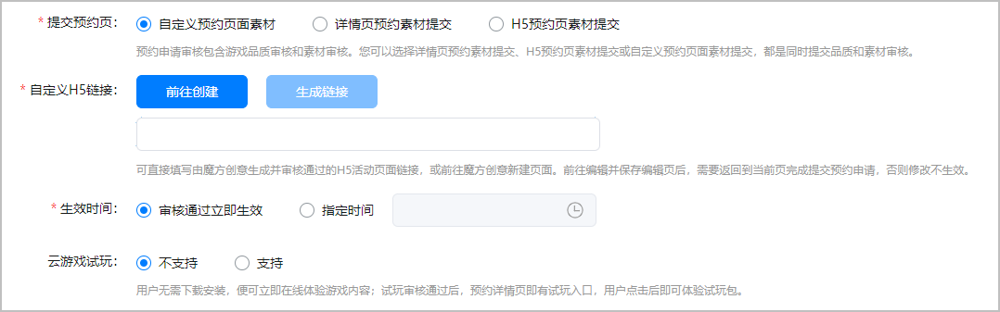

| 配置项 | 说明 |
| --- | --- |
| 自定义H5链接 | 可直接填写由魔方创意生成并审核通过的H5活动页面链接，或前往魔方创意新建页面。点击“前往创建”前往魔方创意编辑并保存编辑页后，需要返回到当前页点击“生成链接”生成对应的H5链接，并完成提交预约申请，否则修改不生效。  说明：  若历史提交为zip包素材，更新提交时，若不涉及页面内容更新，此处可继续提交原zip包；若需更新页面内容，请使用魔方创意生成H5活动页面并完成提交。具体魔方创意操作请参见[游戏预约魔方创意](`https://developer.huawei.com/consumer/cn/doc/app/game-center-creatives-ideas-pre-order-0000002023298502`)。 |
| 生效时间 | 请选择预约生效方式：   * 审核通过立即生效 * 指定时间生效 |
| 云游戏试玩 | 请选择“不支持”。  说明：  根据国家出版署规定不能以任何形式给未成年人提供游戏，所以该配置项目前已失效。 |

### 版本、隐私和权限信息

请在预约期按照实际情况提前完善版本、权限和隐私信息，以便用户在预约前查阅。

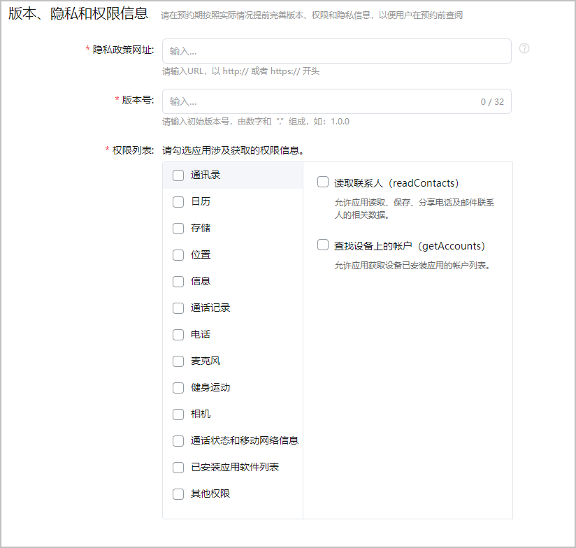

| 配置项 | 说明 |
| --- | --- |
| 隐私政策网址 | 请输入URL，以 http:// 或者 https:// 开头。  链接至此应用的隐私政策的网址(URL)，该网址会在应用的详情页面添加隐私政策跳转，可帮助用户清楚地了解您如何处理敏感的用户数据和设备数据。 隐私政策必须完整说明您的应用如何收集、使用和分享用户数据，包含但不限于如下情况建议提供：   * 面向儿童的App。 * 包含账号注册或需要访问用户的现有账号，或由法律另行规定。 * 对于收集用户或设备相关数据的App。 |
| 版本号 | 请输入初始版本号，最多32个字符，由数字和“.”组成，如：1.0.0 |
| 权限列表 | 请勾选应用涉及获取的权限信息。 |

## 预约审核与上架

您提交预约申请后，华为工作人员完成审核需要1~3个工作日。您可以前往[互动中心](`https://developer.huawei.com/consumer/cn/doc/distribution/app/agc-help-interaction-center-0000001146518763`)页面或在“预约申请”页面查看完整的审核结果和意见。

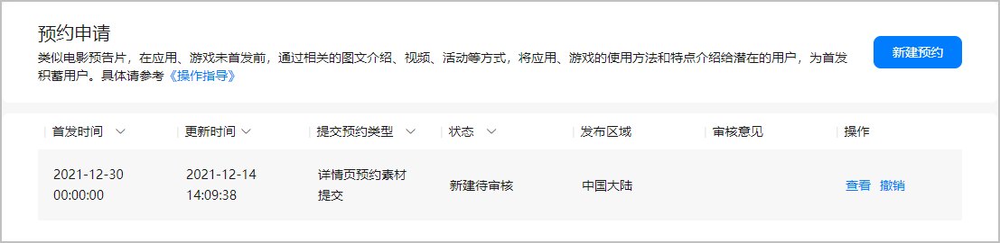

您提交预约申请时会根据发布区域自动生成多条记录。

游戏预约上架后，用户可在华为游戏中心的专题栏预约您的游戏。当预约的游戏首发时，系统会给预约用户发放通知，同时会开启“WIFI下对预约用户静默下载”功能，这些用户会有较高概率转化成游戏玩家。

* 预约申请发生更新、取消、失效等提交操作时，您的[素材测试实验](`https://developer.huawei.com/consumer/cn/doc/AppGallery-connect-Guides/agc-materialtest-create-exper-0000001081085046`)（如有）将会自动失效。
* 若在预约上架后取消该预约，系统将不再保存原有的预约用户。

## 查看预约数据

您的预约上架后会产生相关的预约数据，具体查看路径如下：

1. 登录[AppGallery Connect](`https://developer.huawei.com/consumer/cn/service/josp/agc/index.html`)，点击“分析”。
2. 在应用列表页面，选择您已成功申请预约的游戏，选择“分发分析 &gt; 预约 ”，查看您应用的预约数据。

   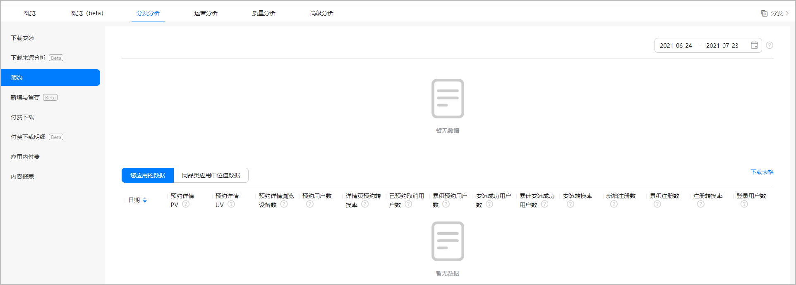

   | 预约数据 | 参数 | 说明 |
   | --- | --- | --- |
   | 您应用的数据 | 预约详情PV | 预约详情浏览的次数。 |
   | 预约详情UV | 预约详情浏览的用户数。 |
   | 预约详情浏览设备数 | 进入预约详情浏览的设备数。 |
   | 预约用户数 | 预约该应用的用户数，含快捷预约用户数+详情页预约用户数。 |
   | 详情页预约转换率 | 详情页带来的预约用户数/预约详情UV。 |
   | 已预约取消用户数 | 取消预约的用户数。 |
   | 累计预约用户数 | 截止当前累计预约该应用的用户数。 |
   | 安装成功用户数 | 应用上线后，已预约用户安装成功的用户。 |
   | 累计安装成功用户数 | 应用上线后，已预约用户累计安装成功的用户。 |
   | 安装转换率 | 累计安装成功用户数/累计预约用户数。 |
   | 新增注册数 | 应用上线后，已预约用户新增注册用户数。 |
   | 累计注册数 | 截止当前应用上线后，已预约用户新增注册用户数。 |
   | 注册转换率 | 累积注册数/累积预约用户数。 |
   | 登录用户数 | 应用上线后，已预约用户登录用户数。 |
   | 同品类应用的中位值数据 | 详情页预约转换率 | 详情页带来的预约用户数/ 预约详情UV。 |
   | 安装转换率 | 累计安装成功用户数/累计预约用户数。 |
   | 注册转换率 | 累积注册数/累积预约用户数。 |

## 联系我们

若有任何疑问，可以备注“公司全称+游戏名称”申请加入游戏预约对接群获取进一步帮助和支持。

* 华为游戏预约对接1群：543519746
* 华为游戏预约对接2群：922657721