# 游戏预约（APP）

游戏预约指在游戏首发前进行宣传，配合游戏论坛、资讯的持续更新曝光，保证首发前的游戏热度，为正式首发凝聚力量。当用户对游戏感兴趣时会选择预约游戏，在游戏首发后，华为游戏中心会给已预约的用户发送通知，这些用户会有较高概率转化成游戏玩家，因此我们强烈推荐您使用游戏预约。游戏预约流程如下：

## 前提条件

* 您已成功[创建游戏](`https://developer.huawei.com/consumer/cn/doc/app/agc-help-create-app-0000002247955506`)，且软件包类型为“APP(HarmonyOS应用)”，支持设备为“手机”。
* （可选）您可以[开通游戏版块](`https://developer.huawei.com/consumer/cn/doc/app/game-center-community-operation-0000001194305462`)，宣传游戏内容，聚集核心用户。

## 准备预约素材

| 准备项 | 说明 |
| --- | --- |
| 应用介绍截图 | 可选择“横向截图”或“竖向截图”。   * 图片数量：3-5张。 * 尺寸：   + 横向截图：要求宽高比为16:9，建议宽\*高为1280px\*720px。   + 竖向截图：要求宽高比为9:16，建议宽\*高为720px\*1280px。 * 格式：PNG、JPG、JPEG、WEBP。 * 大小：PNG/JPG/JPEG图片不超过5MB，WEBP图片不超过200KB。 |
| 应用介绍视频（可选） | 可选择“横向视频”或“竖向视频”。   * 视频长度：15秒-2分钟。 * 尺寸：   + 横向视频：要求宽高比为16:9，建议分辨率为1280\*720。   + 竖向视频：要求宽高比为9:16，建议分辨率为720\*1280。 * 格式：支持MOV、MP4格式。 * 大小：要求500MB以内。 |

## 配置应用基本信息

1. 登录[AppGallery Connect](`https://developer.huawei.com/consumer/cn/service/josp/agc/index.html`)，点击“APP与元服务”。
2. 在应用列表中点击需要申请预约的游戏，选择“分发 &gt; 服务 &gt; 预约申请”，进入预约申请界面。

   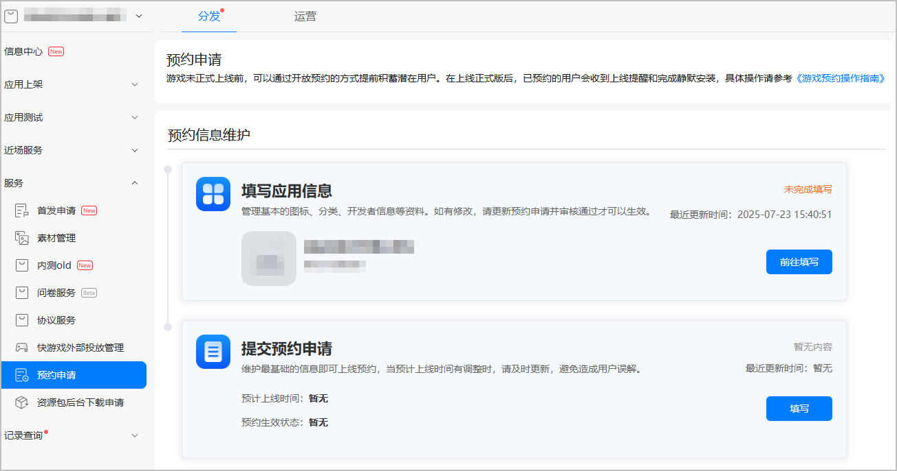
3. 若“填写应用信息”卡片内显示“未完成填写”，请点击“前往填写”，优先完成[配置应用信息](`https://developer.huawei.com/consumer/cn/doc/app/agc-help-release-app-0000002271695230`)，否则无法提交预约申请。若卡片内显示“已完成填写”，可直接[提交预约申请](#section5204152220572)；如需修改，请点击“前往更新”重新[配置应用信息](`https://developer.huawei.com/consumer/cn/doc/app/agc-help-release-app-0000002271695230`)。

   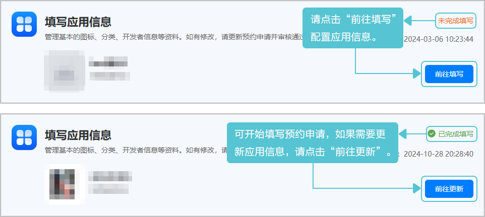

   

   如果应用信息有修改，请[更新预约申请](#ZH-CN_TOPIC_0000002053113676__section1580117234911)并重新提交审核，审核通过才可以生效。

## 提交预约申请

1. 登录[AppGallery Connect](`https://developer.huawei.com/consumer/cn/service/josp/agc/index.html`)，点击“APP与元服务”。
2. 在应用列表中点击需要申请预约的游戏，选择“分发 &gt; 服务 &gt; 预约申请”，在“提交预约申请”卡片点击“填写”，按照提示填写信息。

   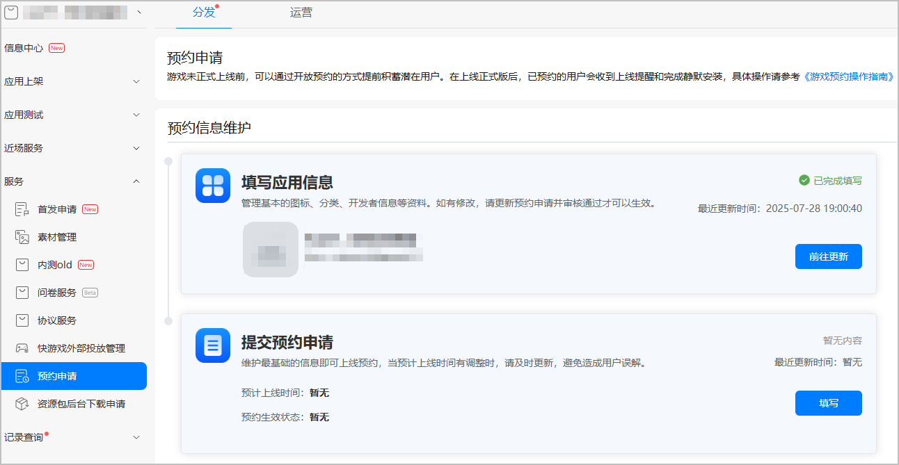

### 预约上线信息

当预计上线时间有调整时，请及时更新，避免造成用户误解。

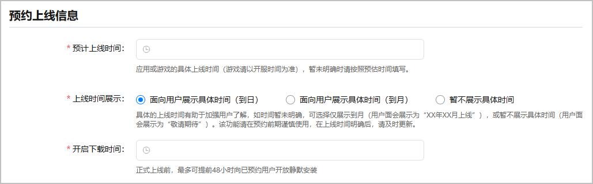

| 配置项 | 说明 |
| --- | --- |
| 预计上线时间 | 请填写应用或游戏的具体上线时间（游戏请以开服时间为准），暂未明确时请按照预估时间填写。 |
| 上线时间展示 | 可选择“面向用户展示具体时间（到日）”、“面向用户展示具体时间（到月）”或“暂不展示具体时间”。具体的上线时间有助于加强用户了解，如时间暂未明确，可选择仅展示到月（用户面会展示为“XX年XX月上线”），或暂不展示具体时间（用户面会展示为“敬请期待”）。该功能请在预约前期谨慎使用，在上线时间明确后，请及时更新。 |
| 开启下载时间 | 请填写应用或游戏开启下载的时间。正式上线前，最多可提前48小时向已预约用户开放静默安装。 |

### 介绍及素材信息

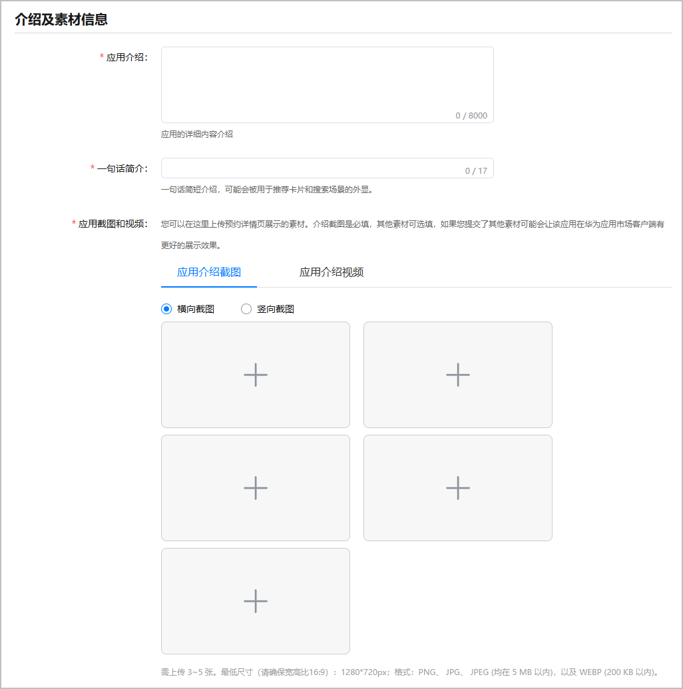

| 配置项 | 说明 |
| --- | --- |
| 应用介绍 | 请填写应用的详细内容介绍，最多可输入8000个字符。 |
| 一句话简介 | 请填写应用的一句话简短介绍，可能会被用于推荐卡片和搜索场景的外显。 |
| 应用截图和视频 | 可以上传预约详情页展示的素材，有应用介绍截图和应用介绍视频两种选择。介绍截图为必填，其他素材可选填。如果您提交了其他素材可能会让该应用在华为应用市场客户端有更好的展示效果。具体要求可参考[准备预约素材](#section2633155020506)。 |

### 版本、隐私和权限信息

请在预约期按照实际情况提前完善版本、权限和隐私信息，以便用户在预约前查阅。

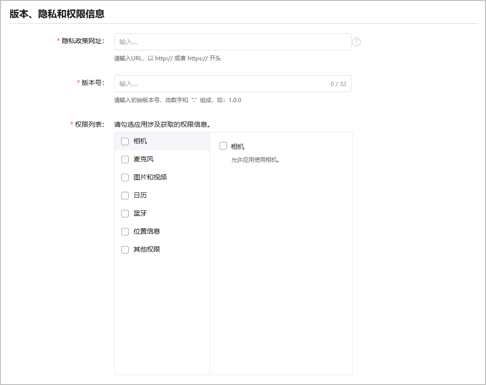

| 配置项 | 说明 |
| --- | --- |
| 隐私政策网址 | 请输入URL，以 http:// 或者 https:// 开头。  链接至此应用的隐私政策的网址(URL)，该网址会在应用的详情页面添加隐私政策跳转，可帮助用户清楚地了解您如何处理敏感的用户数据和设备数据。 隐私政策必须完整说明您的应用如何收集、使用和分享用户数据，包含但不限于如下情况建议提供：   * 面向儿童的App。 * 包含账号注册或需要访问用户的现有账号，或由法律另行规定。 * 对于收集用户或设备相关数据的App。 |
| 版本号 | 请输入初始版本号，最多可输入32个字符，由数字和“.”组成，如：1.0.0。 |
| 权限列表 | 请勾选应用涉及获取的权限信息。 |

### 审核补充信息

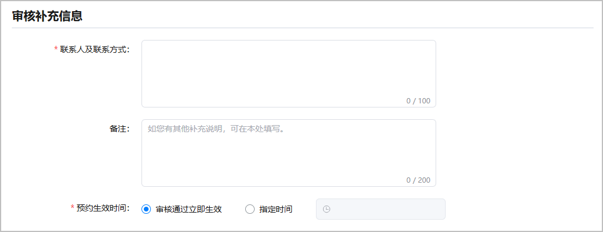

| 配置项 | 说明 |
| --- | --- |
| 联系人及联系方式 | 请填写联系人和联系人QQ、联系电话、邮箱，要求1~100字符。 |
| 备注（可选） | 可补充其他说明信息，最多可输入200个字符。 |
| 预约生效时间 | 请选择预约的生效时间，可选择审核通过立即生效，或指定时间生效。 |

### 提交审核

填写完成后，点击页面底部“提交审核”，提交当前预约申请。

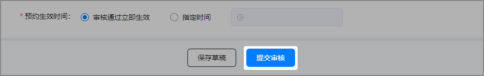

填写过程中如需退出当前页面，可点击“保存草稿”，保存当前已填写内容。

## 预约审核与上架

您提交审核后，华为工作人员完成审核需要1~3个工作日。您可以前往[互动中心](`https://developer.huawei.com/consumer/cn/doc/app/agc-help-interaction-center-0000002276985946`)页面或在“预约申请”页面的“提交预约申请”卡片查看完整的审核结果。

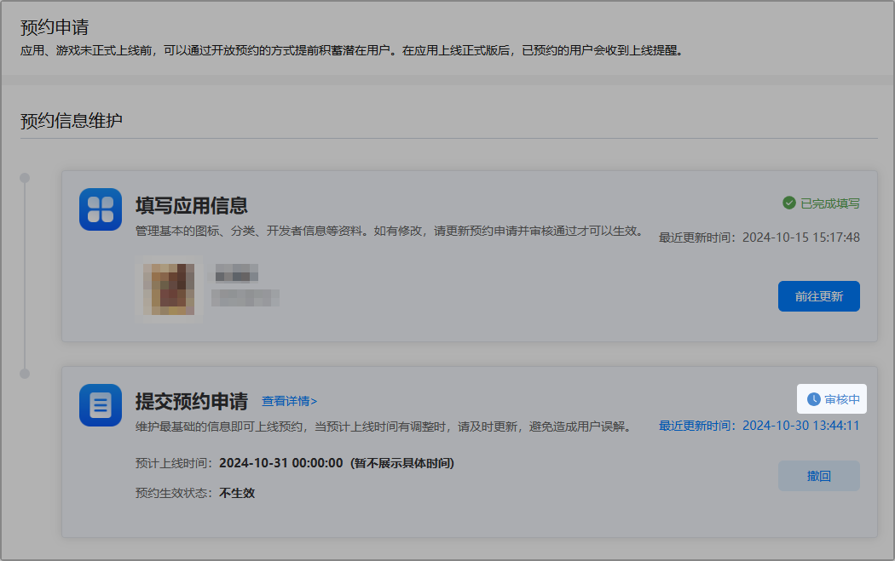

游戏预约上架后，用户可在华为游戏中心搜索页和精选页查找并预约您的游戏。当预约的游戏正式上线时，系统会给预约用户发放通知，同时会开启“WIFI下对预约用户静默下载”功能，这些用户会有较高概率转化成游戏玩家。

## 预约下线

1. 在提交预约申请卡片内点击“下线”。

   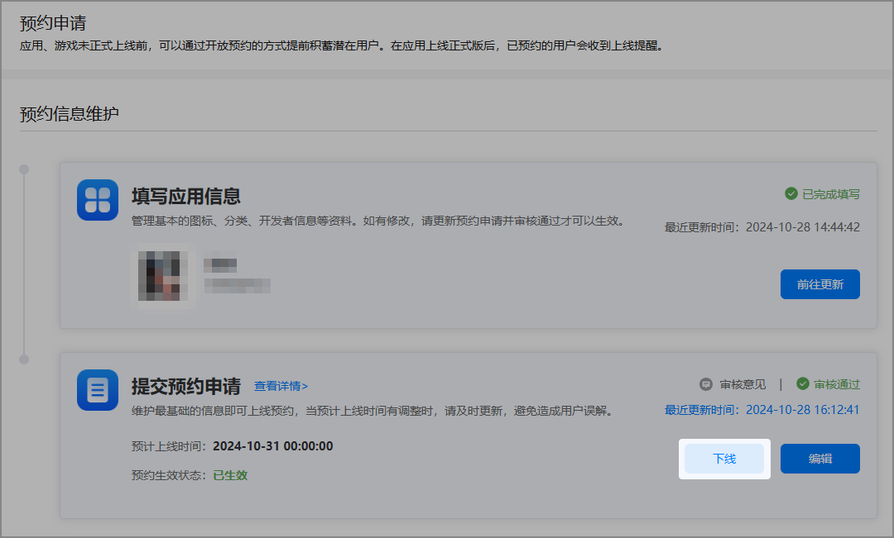
2. 在下线确认弹框内填写下线理由，最多可输入128个字符。填写完成后点击“确认”，弹出“提交预约下线成功”的提示，提交下线审核。

   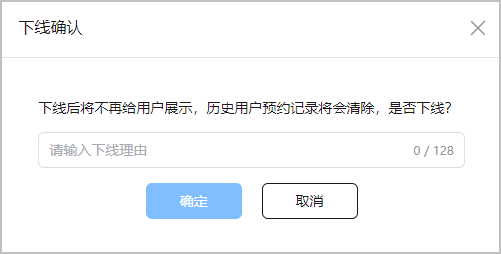

## 撤回审核申请

如果需要撤回已提交审核的申请，可以在提交预约申请卡片内点击“撤回”并在提示弹框内点击“确认”，即可撤回当前申请。撤回申请后如需继续之前操作，需要重新提交申请。

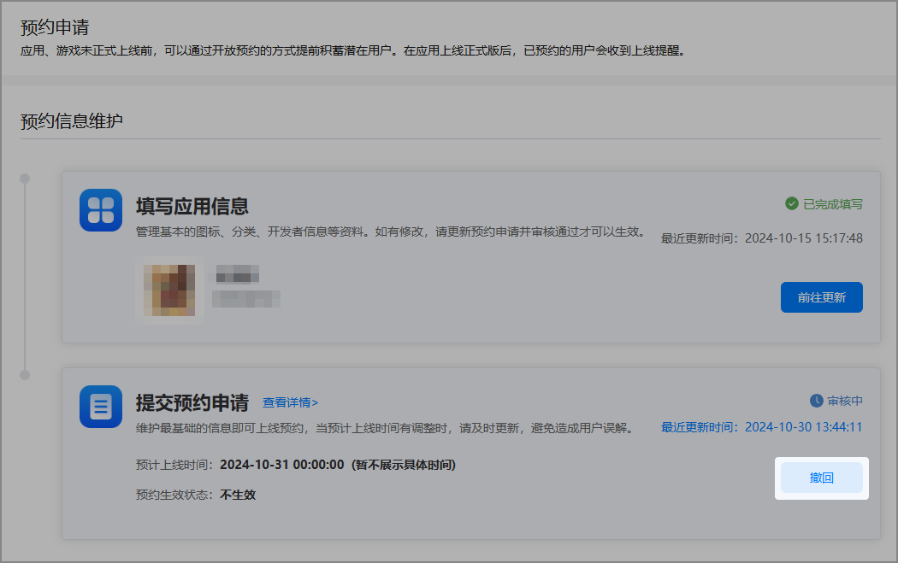

## 查看操作记录

1. 点击“预约申请”页面内“提交预约申请”卡片中的“最近更新时间”。

   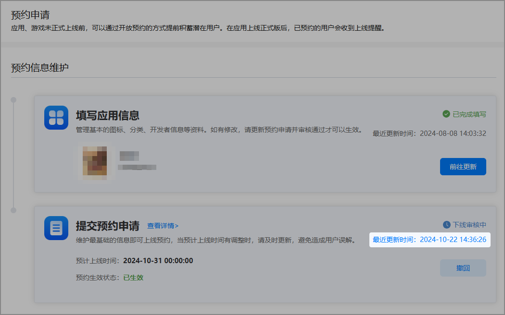
2. 在“操作记录”页面内可以查看当前预约的操作时间、操作人员、具体操作及意见。

   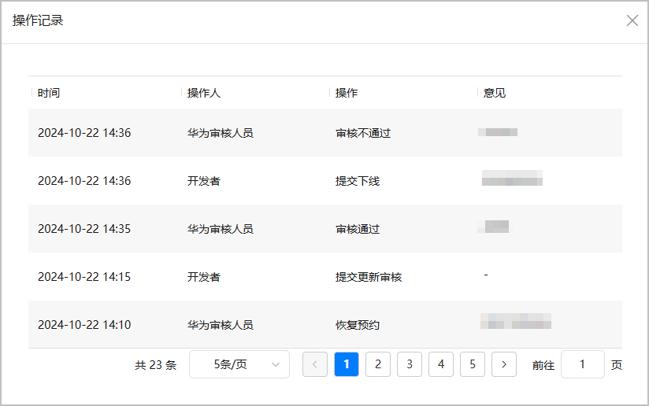

## 联系我们

若有任何疑问，可以备注“公司全称+游戏名称”联系游戏预约QQ账号：2851508956，获取进一步帮助和支持。