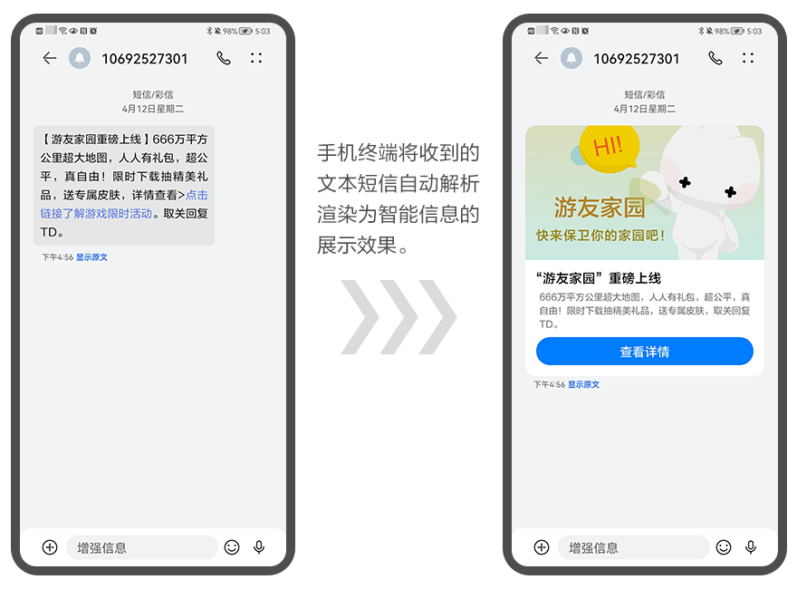
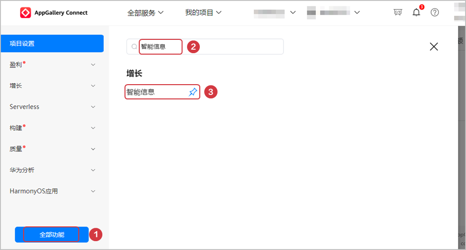
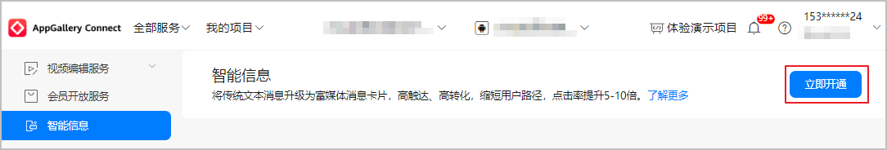
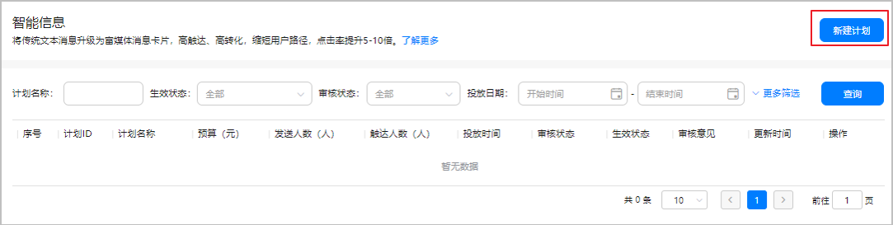
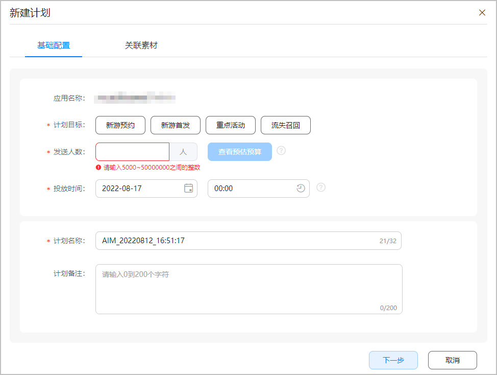
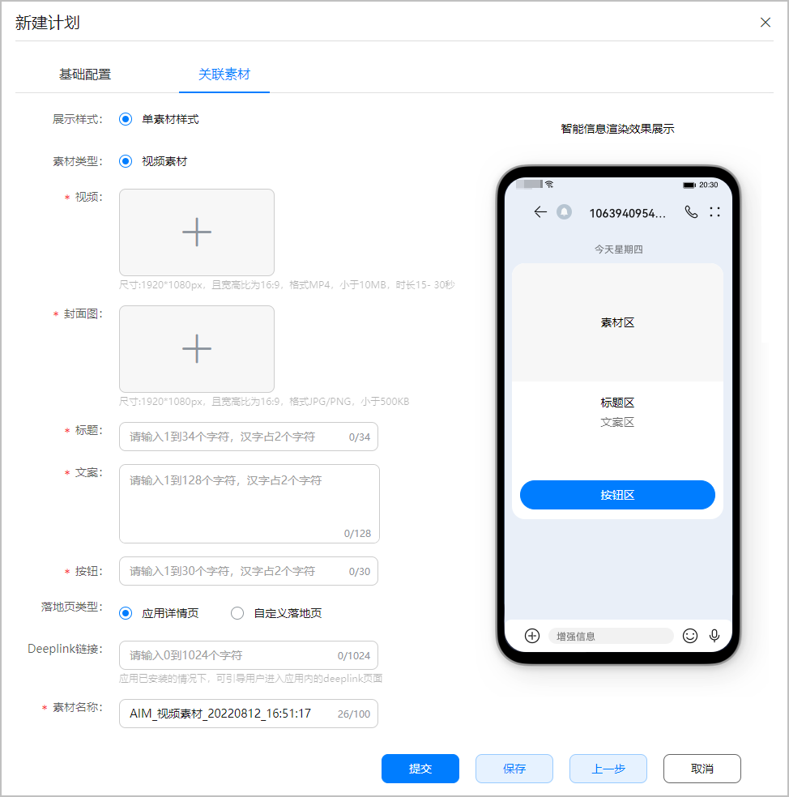
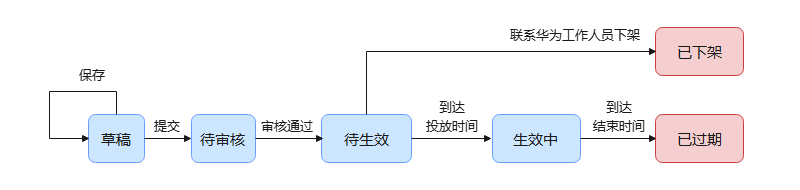

import MergeTable from "@site/src/components/MergeTable";

# 智能信息

为了扩展更多的游戏用户，帮助您提升沉默用户、流失用户、新用户等多种受众用户的转化能力，现推出“智能信息”服务。智能信息基于手机终端短信的增强技术，将传统文本短信无缝升级为可交互的富媒体消息卡片，实现强触达、高转化的运营目标。

## 工作原理

用户的手机终端将下发的文本短信自动解析并渲染成智能信息卡片的展示效果，用户点击后即可直达您预设的落地页。这种智能信息具备强提醒的特点，且转化效果好，帮助您更好地实现新游预约/首发、推广重点活动以及流失召回的运营目标。

## 申请服务

请登录[AppGallery Connect](https://developer.huawei.com/consumer/cn/service/josp/agc/index.html)，确认“开发与服务 > 增长 ”下是否有“智能信息”菜单。若看不到菜单，请发送申请服务的邮件。

“智能信息”当前仍处于Beta阶段，申请“智能信息”服务需向华为运营人员发送申请邮件。请按如下格式填写申请邮件：

|  |  |
| --- | --- |
| 邮件标题 | *[您的游戏名称]*-申请智能信息 |
| 邮件内容 | APP ID，获取方式可参考[查询应用基本信息](https://developer.huawei.com/consumer/cn/doc/distribution/app/agc-help-appinfo-0000001100014694)。 |
| 发送邮箱 | * 休闲游戏请发送gamebeta@huawei.com * 网络游戏请发送gameop@huawei.com   说明：  服务的定价信息可通过邮箱咨询华为运营人员。 |

申请通过后，若未看到“智能信息”菜单，则还需要通过项目页面的“全部功能”搜索并固定“智能信息”菜单。操作方式见下图。

## 前提条件

* 您的游戏/快游戏已预约或已在架。
* 您的余额账户已有充足的可用资金。若资金不足，请参考[账户充值](https://developer.huawei.com/consumer/cn/doc/AppGallery-connect-Guides/agc-account-recharge-0000001126625360#section7835133116713)在“通用基金”上充值。
* 请提前准备智能信息的相关素材内容。

  | 素材项 | 要求 |
  | --- | --- |
  | 游戏视频 | 宽高分辨率为1920px\*1080px（16:9），小于10MB的MP4格式，建议视频时长15s~30s。 |
  | 游戏视频封面图 | 宽高分辨率为1920px\*1080px（16:9），小于500KB的JPG/PNG格式。 |
  | 智能信息标题 | 智能信息的标题，不超过34个字符，1个汉字占2个字符。 |
  | 智能信息文案 | 智能信息的正文信息，不超过128个字符，1个汉字占2个字符。 |
  | 智能信息页按钮 | 智能信息的按钮文本，不超过30个字符，1个汉字占2个字符。 |
  | 自定义落地页 | 点击按钮跳转的页面。若自定义H5落地页，请提前准备落地页。 |

## 启用服务

首次使用“智能信息”服务需先开通此服务。若您已经开通，可跳过本步骤。

1. 登录[AppGallery Connect](https://developer.huawei.com/consumer/cn/service/josp/agc/index.html)，点击“开发与服务”，在卡片列表页面选择需要开通智能信息服务的项目。
2. 选择“增长 > 智能信息”，在“智能信息”页面右侧点击“立即开通”。

   

   首次进入“智能信息”页面需在弹窗口中签署协议。

   

## 创建智能信息计划

1. 在“智能信息”页面点击右侧的“新建计划”。

   
2. 页面右侧抽屉式滑出“新建计划”窗口，在“基础配置”页签下按照提示填写信息，完成后点击“下一步”。

   

   | 配置项 | 说明 |
   | --- | --- |
   | 计划目标 | 请选择新建智能信息计划的推广目标：  * 新游预约：通过给目标群体发送智能信息，强提醒用户受众进行新游预约。 * 新游首发：游戏首发期间，强提醒目标玩家下载并进入游戏。 * 重点活动：游戏重点营销活动场景，将重点活动通过智能信息传达给用户。 * 流失召回：通过智能信息将营销素材传达给离开游戏一段时间的玩家。 |
   | 发送人数 | 发送智能信息的人数。请根据实际情况填写人数，范围为[5000,50000000]。填写人数后可以查看预估预算，您的账户将根据您设置的发送人数锁定预算资金。  注意：  * 账户的实际扣费以实际触达人数为准。 * 发送的用户人群需提前联系华为运营人员进行沟通。 |
   | 投放时间 | 智能信息投放给用户的时间，请按实际情况选择投放时间。  说明：  智能信息计划将在您选择的时间投放，并在投放智能信息8天后自动过期，同时自动释放剩余未使用的资金。 |
   | 计划名称 | 当前智能信息计划的名称。您可以根据实际情况修改计划名称，不超过32个字符。 |
   | 计划备注（可选） | 您可以补充其它说明信息，不超过200个字符。 |
3. 在“新建计划”窗口的“关联素材”页签下，按照提示填写信息，完成后点击“提交”。

   

   | 配置项 | 说明 |
   | --- | --- |
   | 视频/封面图 | 请上传提前准备好的素材内容。 |
   | 标题/文案/按钮 | 请填写提前准备好的文案。 |
   | 落地页 | 请指定按钮跳转的页面类型：  * 应用详情页：跳转至华为应用市场/游戏中心的应用详情页。 * 自定义落地页。您可以在魔方创意网站新建/编辑落地页，或填写https开头的落地页链接。 |
   | Deeplink链接（可选） | 应用已安装的情况下，可引导用户进入应用内的deeplink页面。不超过1024个字符。  说明：  应用未安装的情况下，将不会提示用户安装您的应用。 |
   | 素材名称 | 填写上传视频的名称，不超过100个字符。 |
4. 成功提交智能信息的申请后，华为工作人员审批预计需要3~5个工作日，请耐心等待。审核结果可在状态栏查看。智能信息审核通过后将在您指定的时间进行投放。

## 管理计划

###删除计划

处于“草稿”、“审核驳回”状态的计划支持“删除”操作。

###编辑计划

处于“草稿”、“审核驳回”状态的计划支持“编辑”操作。

###查看计划

点击“计划名称”，抽屉式滑出“计划详情页”窗口展示“智能信息”的计划详情。

###下架计划

若想取消发送智能信息，请在设定的投放时间到达前联系华为工作人员。仅“待生效”状态的智能信息计划支持下架。

## 计划状态流转图

<MergeTable
  headers={['审核状态', '生效状态', '支持操作']}
  rows={[
    ['草稿', '-', '查看、编辑、删除'],
    ['待审核', '-', '查看'],
    [{ text: '审核通过', rowspan: 4 }, '待生效', '查看'],
    [null, '生效中', '查看'],
    [null, '已过期', '查看'],
    [null, '已下架', '查看'],
    ['审核驳回', '-', '查看、编辑、删除'],
  ]}
/>

| 审核驳回 | - | 查看、编辑、删除 |