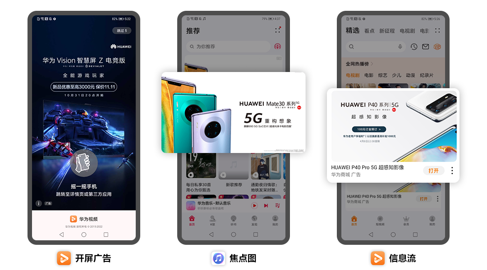
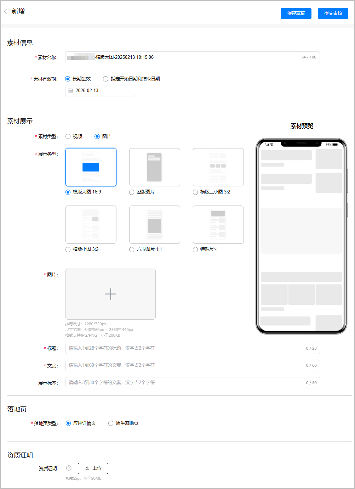
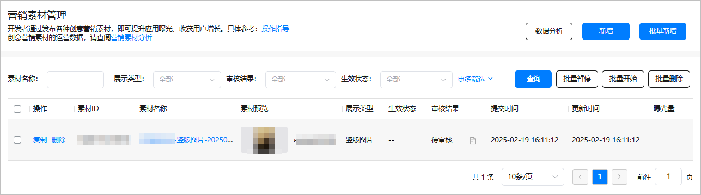
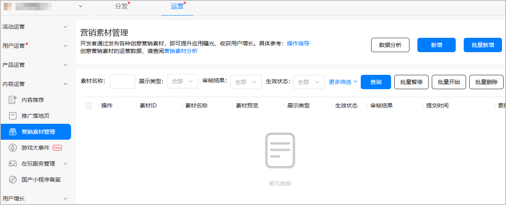
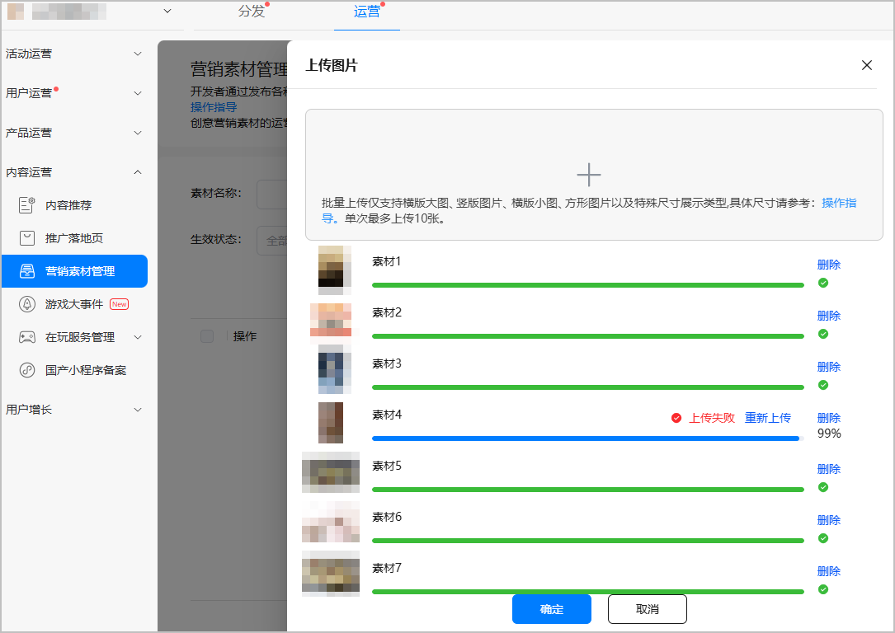
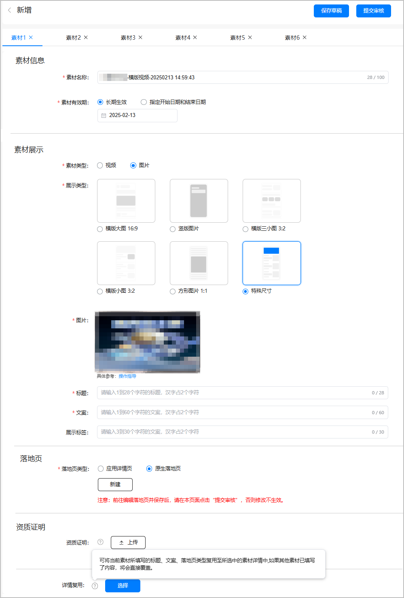
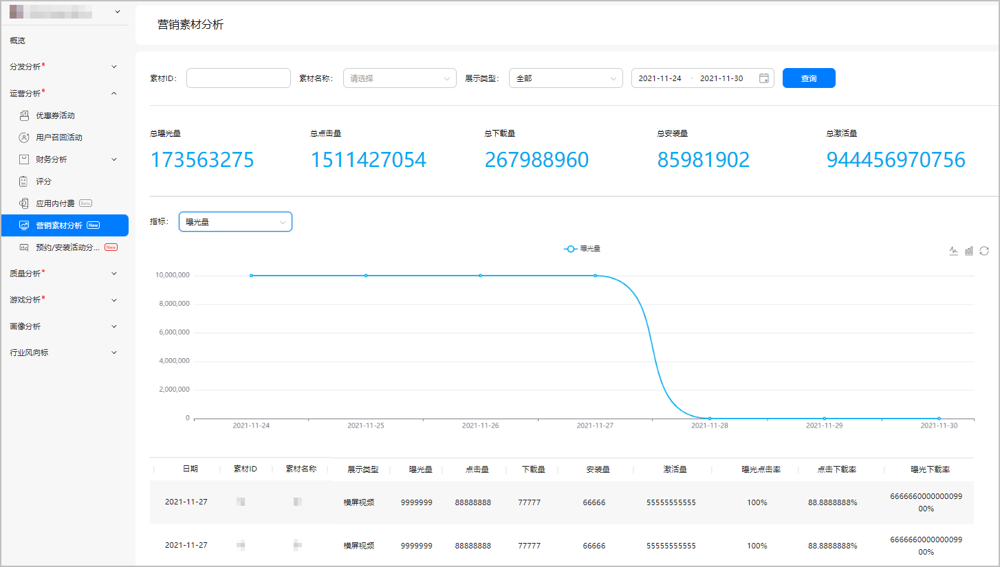

# 营销素材管理

为了提升游戏曝光量，我们可将您丰富多彩的营销素材投放至诸多推广渠道，例如华为视频、华为音乐、华为阅读等，向海量媒体的用户传递您的游戏价值，而您仅需向我们提交营销素材。

## 使用场景

营销素材可投放在不同媒体的不同广告位，例如华为视频的开屏广告、华为音乐的焦点图广告等。具体的广告位以最终上线为准。

## 前提条件

* 您的游戏已在架。
* 您可以根据实际情况提前准备如下一种或多种素材内容。

  | 素材类型 | 展示类型 | 说明 |
  | --- | --- | --- |
  | 视频 | 横版视频（16:9） | + 视频：要求宽高范围在640\*360px~2560\*1440px，推荐1280\*720px，时长15~120s，小于50MB的MP4，视频必须有声音。 + 封面图：要求宽高范围在640\*360px~2560\*1440px，推荐1280\*720px，小于400KB的JPG/PNG。 |
  | 竖版视频（9:16） | + 视频：要求宽高范围在360\*640px~1440\*2560px，推荐720\*1280px，时长15~120s，小于50MB的MP4，视频必须有声音。 + 封面图：要求宽高范围在360\*640px~1440\*2560px，推荐720\*1280px，小于400KB的JPG/PNG。 |
  | 图片 | 横版大图（16:9） | 要求宽高范围在640\*360px~2560\*1440px，推荐1280\*720px，小于140KB的JPG/PNG。 |
  | 竖版图片（2:3） | 要求宽高范围在100\*150px~1080\*1620px，推荐320\*480px，小于140KB的JPG/PNG。 |
  | 竖版图片（9:16） | 要求宽高范围在360\*640px~1440\*2560px，推荐720\*1280px，小于140KB的JPG/PNG。 |
  | 横版三小图（3:2） | 要求宽高范围在150\*100px~1620\*1080px，推荐480\*320px，小于100KB的JPG/PNG。 |
  | 横版小图（3:2） | 要求宽高范围在150\*100px~1620\*1080px，推荐480\*320px，小于140KB的JPG/PNG。 |
  | 方形图片（1:1） | 要求宽高范围在160\*160px~900\*900px，推荐160\*160px，小于140KB的JPG/PNG。 |
  | 特殊尺寸 | 主要用于banner或壁纸示意图。主要宽高尺寸有2934px\*3306px、2496px\*468px、612px\*468px、1312px\*560px、1080px\*170px、720px\*1440px、1280px\*1665px。 |

  

  素材尺寸必须满足对应的比例。

## 新增素材

投放营销素材前需选择素材类型、上传素材内容等，相关操作均在素材编辑页面完成。

### 上传单个素材内容

1. 登录[AppGallery Connect](`https://developer.huawei.com/consumer/cn/service/josp/agc/index.html`)，点击“APP与元服务”，在应用列表页面选择需要新增营销素材的应用。
2. 选择“运营 &gt; 内容运营 &gt; 营销素材管理”，在页面右侧点击“新增”。

   

   

   * 一个应用下最多支持100条素材，您可以主动删除素材释放空间。
   * 点击“数据分析”可查看营销素材的使用效果，详情请参见[查看素材分析](#section13001220182820)。
3. 在“新增”页面根据提示填写信息，完成后点击“提交审核”。

   

   | 分类 | 信息项 | 说明 |
   | --- | --- | --- |
   | 素材信息 | 素材名称 | 自动填充默认格式“应用名称-素材类型-日期时间”，您可以根据实际情况进行修改。 不超过100个字符。 |
   | 素材有效期 | 素材上线后可展示的时间段：  * 长期生效：开始日期默认当天，不指定结束时间，默认长期生效。 * 指定开始日期和结束日期。 |
   | 素材展示 | 素材类型 | 请根据提前准备的素材内容进行选择：  * 视频。 * 图片。 |
   |  | 展示类型 | 请根据实际情况进行选择。  * 横版视频（16:9） * 竖版视频（9:16） * 横版大图（16:9） * 竖版大图（9:16） * 横版三小图（3:2） * 横版小图（3:2） * 方形图片（1:1） * 特殊尺寸 |
   | 视频/封面图/图片 | 上传提前准备的素材内容。 |
   | 标题 | 不超过28个字符，汉字占2个字符。 |
   | 文案 | 不超过60个字符，汉字占2个字符。 |
   | 展示标签（可选） | 不超过30个字符，汉字占2个字符。 |
   | 落地页 | 落地页类型 | 您可以选择如下一种落地页类型：  * 应用详情页：游戏详情页。 * 原生落地页：投放在杂志锁屏的原生免解锁落地页。点击“新建”或“编辑”将前往[魔方创意](`/docs/distribute/app-dist/game-center/game-center-materials-0000001194142412/game-center-creatives-ideas-0000001429732169)设计落地页。 说明：  “进行中”的营销素材再次编辑落地页后需再次审核。 |
   | 资质证明 | 资质证明（可选） | 上传可用于验证素材使用权的资质证明，要求大小不超过50MB的Zip包，如肖像使用授权书等文件。 |
4. 华为工作人员审核营销素材预计需要1~3个工作日，请耐心等待，审核结果可在“审核结果”栏查看。

   

### 批量上传素材内容

1. 登录[AppGallery Connect](`https://developer.huawei.com/consumer/cn/service/josp/agc/index.html`)，点击“APP与元服务”，在应用列表页面选择需要新增营销素材的应用。
2. 选择“运营 &gt; 内容运营 &gt; 营销素材管理”，在页面右侧点击“批量新增”。

   
3. 在右侧“上传图片”页面，点击选中提前准备的素材内容进行批量上传。

   

   * 批量上传当前仅支持图片类型素材内容。
   * 单次最多上传10张。

   
4. 在“新增”页面点击不同素材的详情页根据提示填写信息，完成后点击“提交审核”。

   

   | 分类 | 信息项 | 说明 |
   | --- | --- | --- |
   | 素材信息 | 素材名称 | 自动填充默认格式“应用名称-素材类型-日期时间”，您可以根据实际情况进行修改。 不超过100个字符。 |
   | 素材有效期 | 素材上线后可展示的时间段：  * 长期生效：开始日期默认当天，不指定结束时间，默认长期生效。 * 指定开始日期和结束日期。 |
   | 素材展示 | 素材类型 | 请根据提前准备的素材内容进行选择：  * 视频。 * 图片。 |
   |  | 展示类型 | 请根据实际情况进行选择。  * 横版视频（16:9） * 竖版视频（9:16） * 横版大图（16:9） * 竖版大图（9:16） * 横版三小图（3:2） * 横版小图（3:2） * 方形图片（1:1） * 特殊尺寸 |
   | 标题 | 不超过28个字符，汉字占2个字符。 |
   | 文案 | 不超过60个字符，汉字占2个字符。 |
   | 展示标签（可选） | 不超过30个字符，汉字占2个字符。 |
   | 落地页 | 落地页类型 | 您可以选择如下一种落地页类型：  * 应用详情页：游戏详情页。 * 原生落地页：投放在杂志锁屏的原生免解锁落地页。点击“新建”或“编辑”将前往[魔方创意](`/docs/distribute/app-dist/game-center/game-center-materials-0000001194142412/game-center-creatives-ideas-0000001429732169)设计落地页。 说明：  “进行中”的营销素材再次编辑落地页后需再次审核。 |
   | 资质证明 | 资质证明（可选） | 上传可用于验证素材使用权的资质证明，要求大小不超过50MB的Zip包，如肖像使用授权书等文件。 |
   |  | 详情复用（可选） | 可将当前素材所填写的标题、文案、落地页类型复用至所选中的素材详情中，如果其他素材已填写了内容，将会直接覆盖。 |
5. 华为工作人员审核营销素材预计需要1~3个工作日，请耐心等待，审核结果可在“审核结果”栏查看。

## 管理素材

### 复制素材内容

点击“操作”列的“复制”，您可以复制并修改素材内容，完成后需要重新提交审核。

### 暂停投放素材

点击“暂停”或“批量暂停”，您可以暂停投放“进行中”状态的素材内容。若成功暂停，状态变更为“暂停”。

### 开始投放素材

点击“批量开始”，您可以重新投放“暂停”状态的素材内容。若重新开始投放，状态变更为“进行中”。

### 下架展示素材

若您想实时下架展示素材，请联系华为工作人员。仅“进行中”状态的展示素材支持下架，成功下架后的状态变更为“被下架”。

## 查看素材分析

为了给您带来高品质的营销体验，帮助您了解不同营销素材的使用效果，洞察行业市场的营销趋势，您可以实时查看推广平台的用户行为与分析数据。

1. 登录[AppGallery Connect](`https://developer.huawei.com/consumer/cn/service/josp/agc/index.html`)，点击“分析”，在应用列表页面选择需要查看报表的应用，选择“运营分析 &gt; 营销素材分析”。
2. 在“营销素材分析”页面，您可以筛选素材属性、分析指标后，查看对应的营销素材报表。

   

   您的游戏没有上传营销素材时，也会使用该游戏的icon图标作为素材在某些场景中填充，此时您看到的曝光数据即为该游戏icon图标的曝光数。

   

   | 统计指标 | 说明 |
   | --- | --- |
   | 曝光量 | 营销素材内容的曝光次数。 |
   | 点击量 | 营销素材内容的点击次数。 |
   | 下载量 | 应用的下载次数。 |
   | 安装量 | 应用的安装次数。 |
   | 激活量 | 应用首次打开次数。 |
   | 曝光点击率 | 点击量/曝光量。 |
   | 点击下载率 | 下载量/点击量。 |
   | 曝光下载率 | 下载量/曝光量。 |