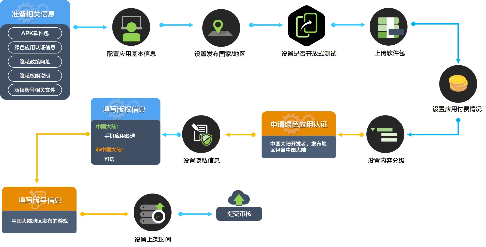

# APK游戏上架

当您的应用开发和测试完成后，您可以在AppGallery Connect（以下简称AGC）正式提交[APK游戏上架](`https://developer.huawei.com/consumer/cn/doc/distribution/app/agc-help-releaseapkrpk-0000001106463276`)，华为审核人员审核通过后应用就会变为“已上架”状态，用户可在华为应用市场搜索到您的应用。

## 操作流程

