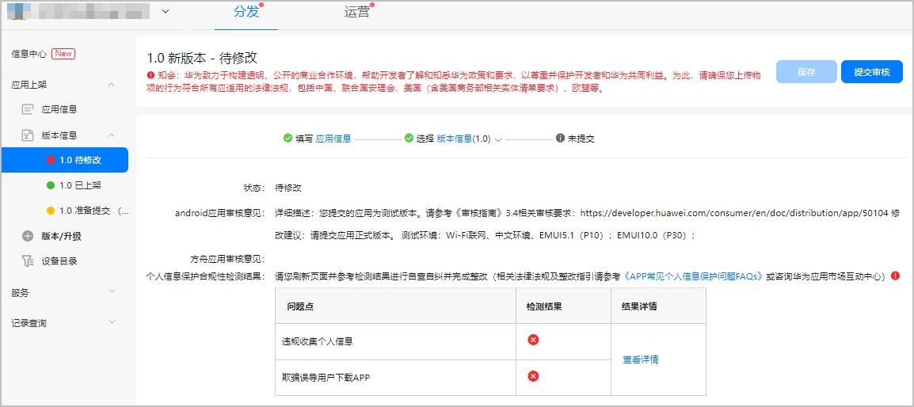

# 上架前自检

华为游戏中心是华为移动应用分发平台，为用户提供游戏的推荐、搜索、安装、管理、分享等服务，帮助您在华为应用市场实现商业价值最大化。

## 审核标准

为了帮助您尽可能顺利地通过游戏审核，请查收下方审核标准等相关审核事项：

* 游戏审核标准请参考[华为应用市场审核指南](https://developer.huawei.com/consumer/cn/doc/distribution/app/50104)。
* 游戏版权、版号要求请参考[版权资质审核要求](/docs/distribute/app-dist/app-market/x50000/x80301#h1-1584931854487-2)。

## 自检工具

* 参考[接入检测](https://developer.huawei.com/consumer/cn/doc/app/agc-help-self-check-0000001100158786)对游戏进行自检，并根据自检报告优化游戏。
* 参考[自检Checklist](https://developer.huawei.com/consumer/cn/doc/HMSCore-Guides/pre-release-check-0000001050121544)排查是否满足上架要求，减少您提交审核后被打回的概率。

## FAQ

### 游戏包提交后台后，审核时间一般多久？如何查看审核意见？

华为工作人员需要1~3个工作日完成游戏包的审核工作。您可以在“版本信息”页面查看审核结果。审核结束后，系统将自动发送审核结果邮件至您的预留邮箱，请及时查看。若需催审，请登录[互动中心](https://developer.huawei.com/consumer/cn/doc/distribution/app/agc-help-interaction-center-0000001146518763)联系华为工作人员。

### 审核意见提示：含有非法支付渠道，该如何修改？

“非法支付渠道”即运营商渠道号使用了非华为许可的渠道号，需要删除。

### Apk提审后，状态显示“正在审核”，为什么华为游戏中心依然显示旧版本号？

只有新版本审核通过并上架后，华为游戏中心客户端才会显示新版本号；待上架状态时，华为游戏中心客户端的版本号不会刷新。

### 版权资料暂时无法提供，是否可以先审核游戏包？

不可以，上架游戏要求必须资质齐全，流程上只有在资质审核通过后才能审核游戏包。

### 游戏内可含分享功能吗？

可以，分享二维码或下载链接仅能链接华为渠道包。

### 游戏文案、更新信息、详情页信息、应用描述、游戏主界面、世界频道主动广播等位置，是否可以含客服联系方式、QQ群、微信、微博、官网、二维码等信息？

不可以。若需处理玩家问题，请联系华为消费者热线：950800。

### 可使用第三方SDK工具接入华为SDK吗？

您提交的游戏包里不允许接入第三方SDK工具。

### 游戏中可以保留未调用的第三方支付代码吗？

不可以，除华为支付和华为渠道短代支付外， manifest、代码（包含注释代码或未使用代码）、jar包、资源等均不可含第三方支付信息。

### 玩家取消登录华为账号后，游戏是否需要重复拉起账号登录界面？

无需重复自动拉起登录界面，影响用户体验度。可以在玩家主动点击登录按钮时再调用登录接口。

### 消耗型商品购买成功后出现掉单时，如何补单？

补单请参考[消耗型商品补单流程](https://developer.huawei.com/consumer/cn/doc/HMSCore-Guides/redelivering-consumables-0000001051356573)。

### 未安装华为移动服务(HMS Core APK)的手机是否可以正常进入游戏？

不能，手机需重复提示用户安装华为移动服务后才可进入游戏。

### 进入默认登录华为账号的游戏需要拉起欢迎栏吗？

需要，游戏需要调用登录接口，登录成功后拉起欢迎栏，详情请参见[游戏登录](https://developer.huawei.com/consumer/cn/doc/HMSCore-Guides/game-login-0000001050121526)。