# 问卷服务

为了改善用户体验，现华为平台开放问卷服务，您可以在不同的使用场景下自定义问卷内容，快速向用户分发问卷并在线收集问卷结果，提升您的工作效率。

## 前提条件

* 您已经提前准备好若干问卷题目。
* 若需要在“联运调研”场景的问卷内容说明、问卷题目或题目选项中进行配图，请提前准备不超过2MB且不带有违规内容的图片。

## 操作流程

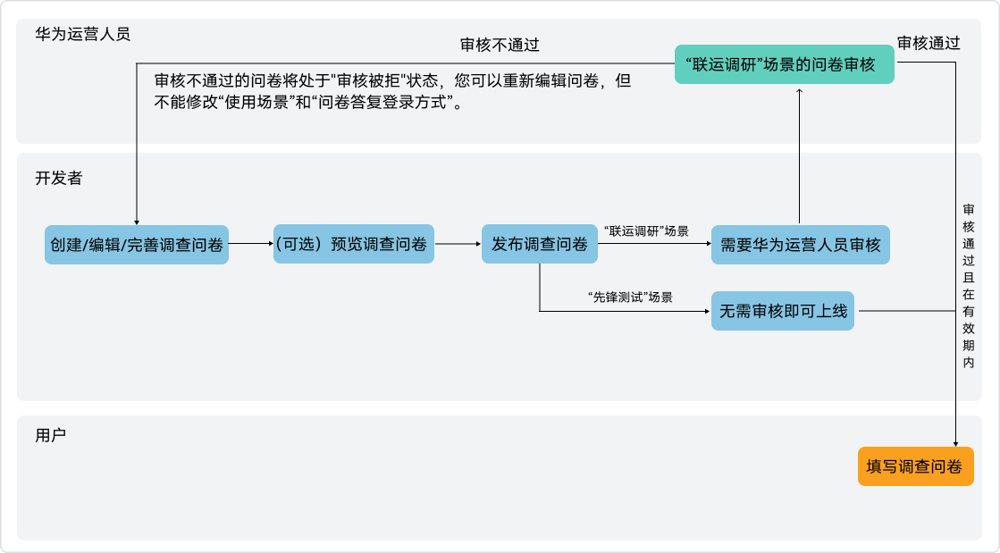

## 创建问卷

###进入调查问卷页面

1. 登录[AppGallery Connect](https://developer.huawei.com/consumer/cn/service/josp/agc/index.html)，点击“APP与元服务”，在应用列表选择想要创建问卷的应用。
2. 选择“分发 > 服务 > 问卷服务”，在页面右侧点击“新建”。

   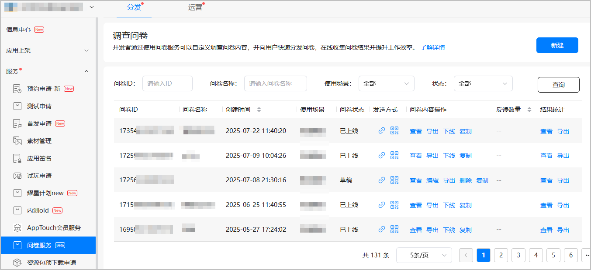

###填写基础信息

在“调查问卷”页面的“问卷基础信息”区域根据提示填写信息。

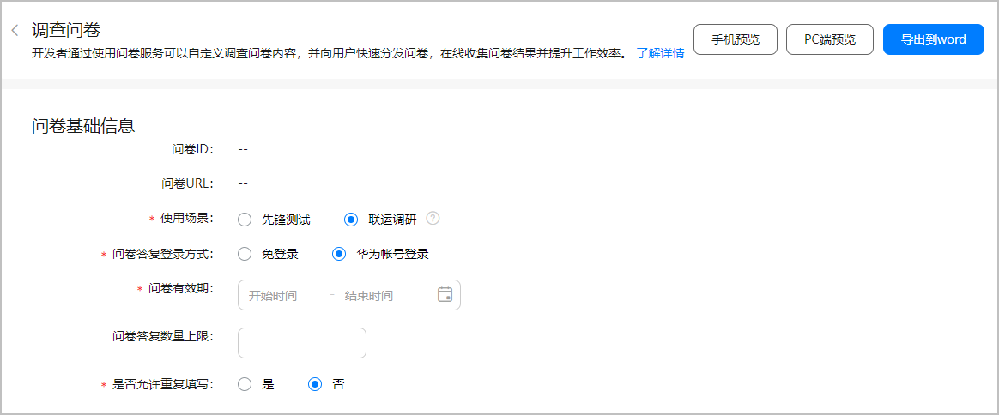

| 配置项 | 说明 |
| --- | --- |
| 问卷ID | 问卷保存或发布后，系统会为每个问卷分配唯一的问卷ID。 |
| 问卷URL | 问卷保存或发布后，每个问卷会自动生成访问URL。您可以将URL链接复制给用户，或二维码图片下载给用户。 |
| 使用场景 | 请选择问卷使用的场景：   * [先锋测试](/docs/distribute/app-dist/game-center/game-center-test-0000001239342331/game-center-pioneer-test-0000001194462384)：问卷可以运用于先锋测试服务中，该场景的问卷无需审核即可上线。 * 联运调研：问卷可以运用于联运模式场景下，例如品类运营、联合推广等。 |
| 问卷答复登录方式 | 请选择用户登录的方式：   * 免登录：表示用户可以无需登录，直接答复问卷。 * 华为账号登录：表示用户使用华为账号登录后答复当前问卷。先锋测试仅支持“华为账号登录”方式。 |
| 问卷有效期 | 该选项仅对“联运调研”场景显示。您需要选择当前问卷的“开始时间”和“结束时间”，问卷仅在有效期内进行答题。  说明：  * 问卷有效期的开始时间必须晚于问卷创建时间。 * 问卷有效期不能超过30天。 |
| 问卷答复数量上限 | 该选项仅对“联运调研”场景显示。请填写当前问卷允许接受用户作答的最大数量，目前支持30万。 |
| 是否允许重复填写 | 请选择是否允许用户重复提交当前问卷：   * 是：允许用户在最多次数范围内重复多次提交问卷。 * 否：仅允许用户提交一次问卷。 |

###添加问卷题目

在“调查问卷”页面的“问卷内容设置”区域填写问卷标题、上传提前准备的问卷说明配图并添加问卷题目。

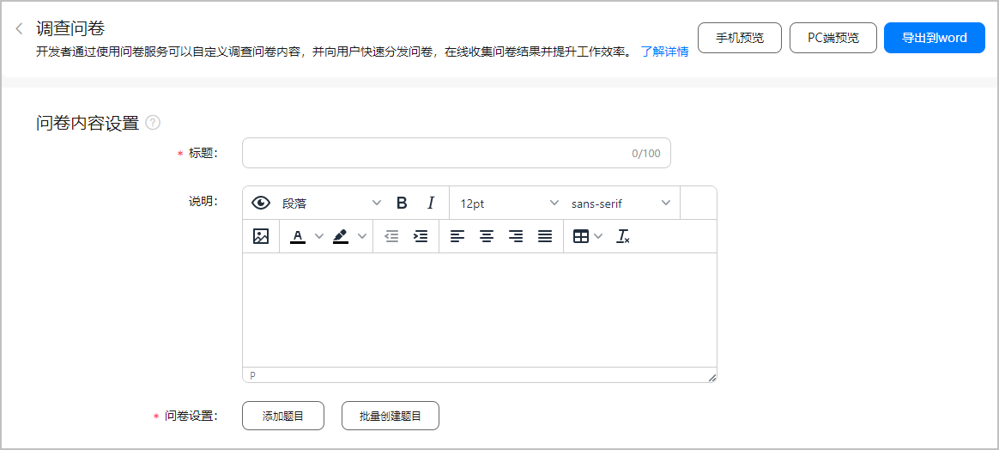

问卷题目中请勿出现涉黄、涉恐、涉毒、敏感字等信息，否则将无法提交问卷或发布问卷。

* 点击“添加题目”，您可以单次仅添加一道问卷题目。

  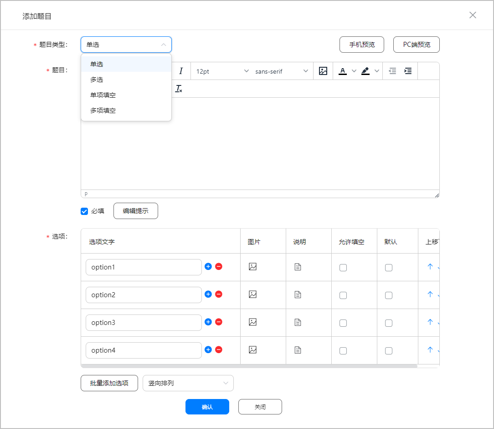

  | 配置项 | 说明 |
  | --- | --- |
  | 题目类型 | 您可以选择如下题目类型：  + 单选 + 多选 + 单项填空 + 多项填空 |
  | 题目 | + 您可以决定当前题目是否必填。 + 您可以编辑当前题目的提示说明。 + 您可以预览当前题目在手机端或PC端的效果。 + 针对“联运调研”场景，您可以上传提前准备的题目配图。 |
  | 选项 | + 若题目类型为“单选”或“多选”时：   - 您可以编辑每个选项的提示说明，并决定是否允许用户填写问卷内容。   - 您可以批量添加选项，并任意调整选项的顺序。   - 您可以决定上线后的选项排列方式是“竖向排列”或“横向排列”。   - 针对“联运调研”场景，您可以上传提前准备的选项配图。 + 若题目类型为“单项填空”或“多项填空”时，您可以对用户填写的内容进行校验，可支持“长度校验”、“数字校验”、“邮箱校验”、“微信号校验”。 |
* 点击“批量创建题目”，您可以按照模板或提示单次添加若干问卷题目。

  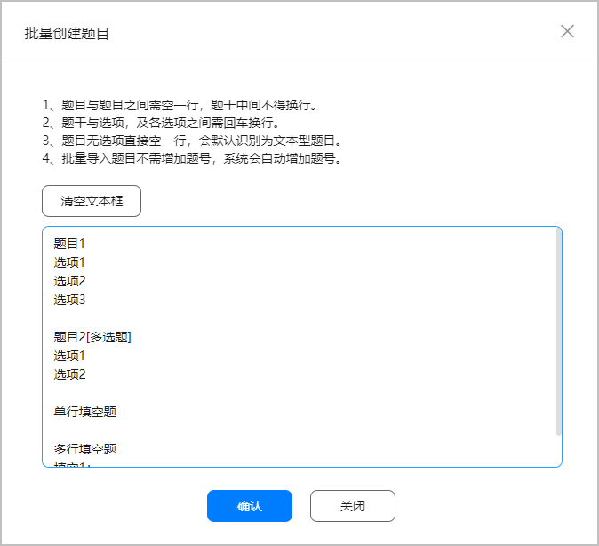

###编辑题目配置

成功添加问卷题目后，您可以管理已创建的若干题目或设置题目跳转逻辑。

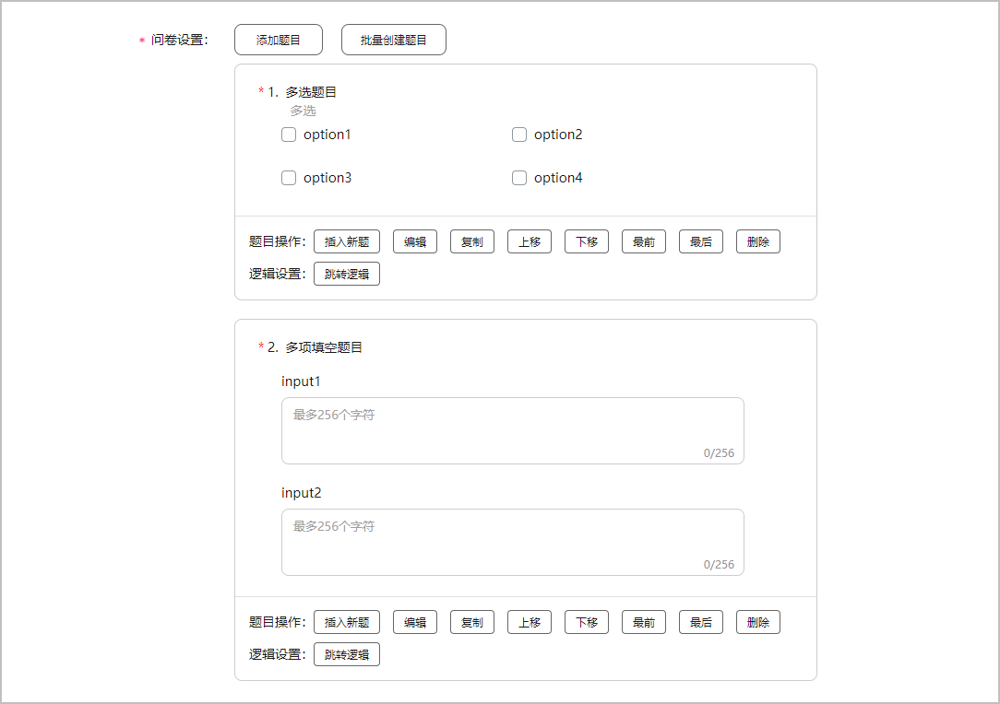

* 题目操作

  | 操作 | 说明 |
  | --- | --- |
  | 插入新题 | 您可以在当前题目之后添加新题目。 |
  | 编辑/复制/删除 | 您可以编辑/复制/删除当前题目。 |
  | 上移/下移 | 您可以将当前题目的位置向上/下调整。 |
  | 最前/最后 | 您可以将当前题目放置在问卷的最前/后。 |
* 跳转逻辑

  | 问卷题目类型 | 是否支持对应的跳题逻辑 | |
  | --- | --- | --- |
  | 按选项跳题 | 无条件跳题 |
  | 单选 |  |  |
  | 多选 |  |  |
  | 单项填空 |  |  |
  | 多项填空 |  |  |

  + 若勾选“按选项跳题”，您可以设置当前题目中每个选项跳转的下一题。

    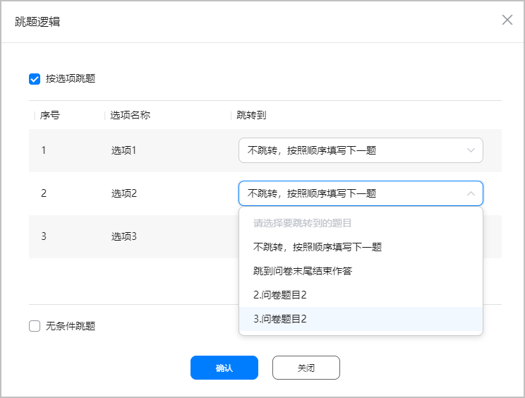
  + 若勾选“无条件跳题”，您可以直接设置当前题目跳转的下一题。

    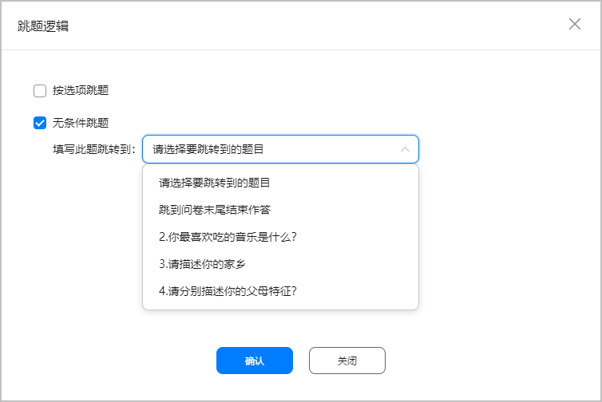

###预览问卷

完成问卷信息和题目的配置后，您可以在页面右上角点击“手机预览”或“PC端预览”进行实时预览。

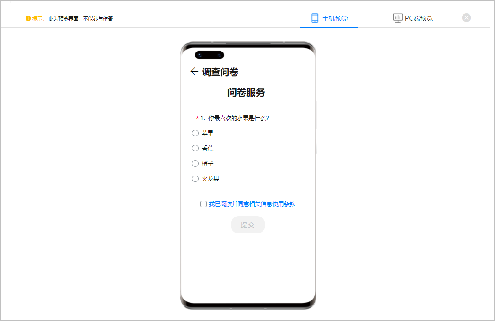

问卷预览界面不能参与作答。

###编辑分组

完成问卷信息和题目的配置后，您可以点击“编辑分组”并在“编辑分组”页面填写分组标题并添加问题的范围，将配置的问卷题目进行分组。

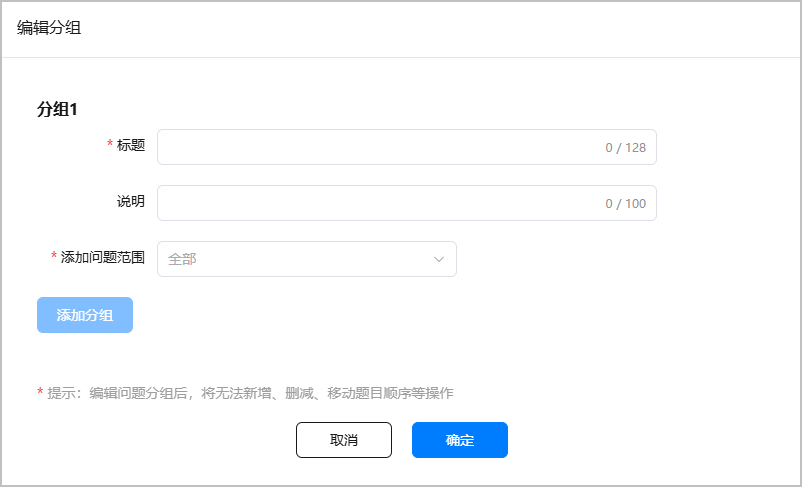

编辑问题分组后，将无法新增、删减、移动题目顺序等操作。

###发布问卷

1. 您可以填写提交问卷后的话语，同时根据样例填写当前问卷的期望投放人群。

   

   “期望投放人群”仅对“联运调研”场景中“华为账号登录”方式显示。

   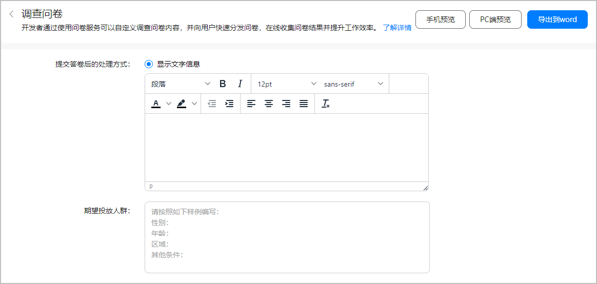
2. 问卷信息及问卷题目确定无误之后，您可以发布问卷。不同场景的问卷有不同的流程状态。

   

   * “先锋测试”场景的问卷无需审核，发布之后直接上线。
   * “联运调研”场景的问卷需等华为工作人员审核通过后才能上线。

   | 使用场景 | 所有的问卷状态 |
   | --- | --- |
   | 先锋测试 | * 已上线 * 已下线 * 草稿 |
   | 联运调研 | * 已上线 * 已下线 * 草稿 * 上线审核中 * 下线审核中 * 待生效 * 审核被拒 说明：  * 不能修改“审核被拒”问卷的“使用场景”和“问卷答复登录方式”。 * 没有答复数量的“已下线”问卷支持重新编辑，但不允许修改“使用场景”和“问卷答复登录方式”。 |

## 管理问卷

成功发布问卷后，您可以对不同状态的问卷进行管理操作。

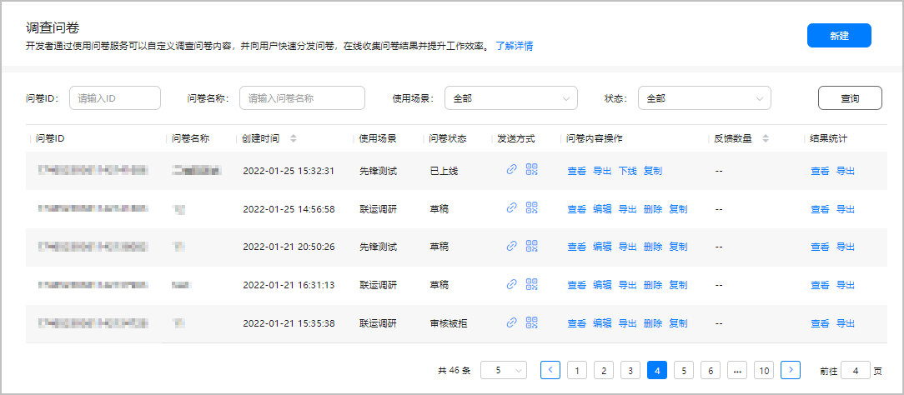

###查看问卷内容

您可以点击“问卷内容操作”列的“查看”，进入“调查问卷”页面查看问卷信息和题目。若“联运调研”场景的问卷审核被拒，您可以根据“审核意见”重新编辑后发布问卷。

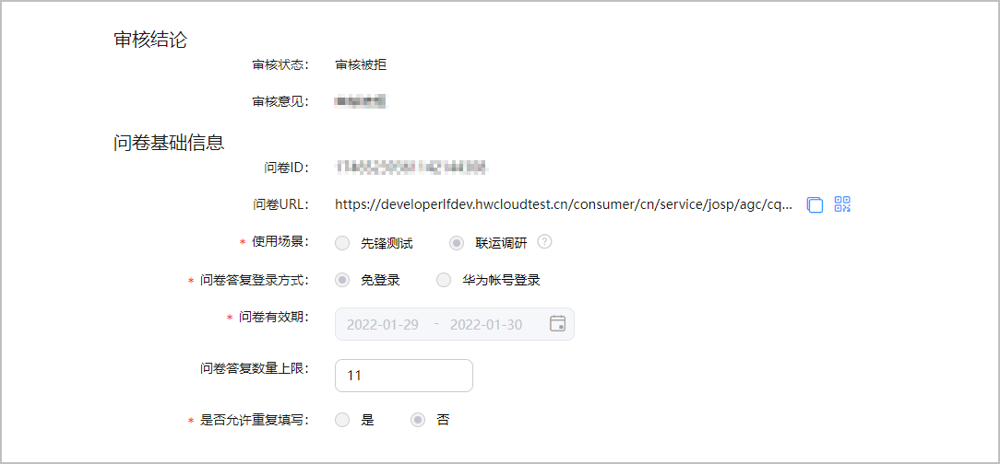

###编辑问卷内容

您可以点击“问卷内容操作”列的“编辑”，对当前问卷的信息和题目进行重新编辑。处于“上线审核中”和“已上线”状态的问卷不支持“编辑”操作。

* 为了确保反馈结果统计准确，不允许对已有用户反馈的“已下线”问卷内容进行修改。
* 没有答复数量的“已下线”的问卷可以重新编辑，但不允许修改“使用场景”和“问卷答复登录方式”。

###导出问卷题目

您可以点击“问卷内容操作”列的“导出”，将当前问卷的所有题目，包括题目的图片导出Word至本地。

###下线问卷

您可以点击“问卷内容操作”列的“下线”，将当前问卷即刻下线。处于“已下线”状态的问卷支持“查看”、“编辑”、“导出”、“删除”和“复制”操作。

###复制问卷内容

您可以点击“问卷内容操作”列的“复制”，将复制当前问卷的所有题目，包括题目的图片。请在弹出的窗口填写新问卷的名称，复制后的问卷初始状态为“草稿”状态。

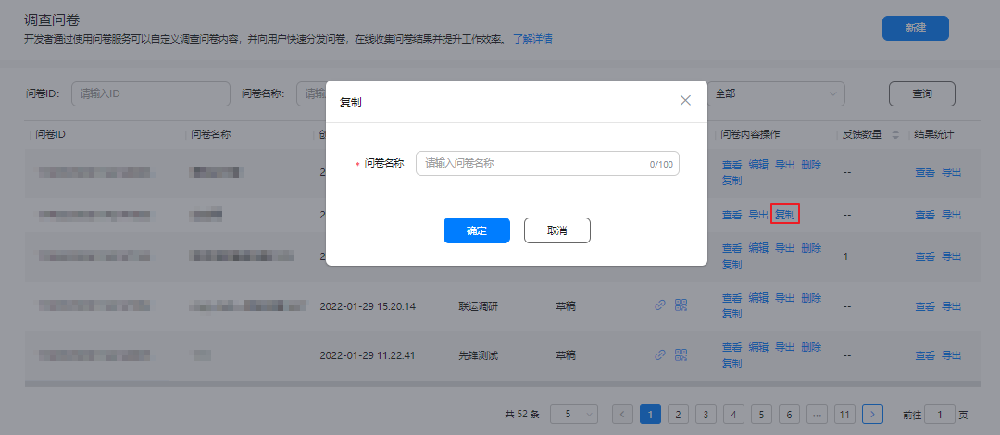

## 发送问卷

成功创建“先锋测试”或“联运调研”场景的问卷后，您可以将问卷定向发送给用户。待问卷上线后，用户可在问卷开始时间后填写问卷题目。

* 您可以复制问卷URL链接，用户打开链接后即可作答。
* 您可以下载二维码图片，用户扫描/识别二维码后即可作答。

  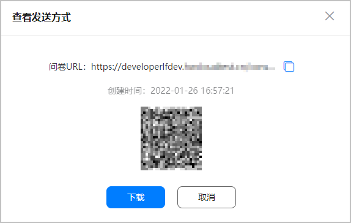

## 查看问卷结果

您可以点击“结果统计”列的“查看”，查看问卷结果统计，后续可以根据选项权重制定有效的改进计划。您也可以将问卷结果导出至本地Word文件。

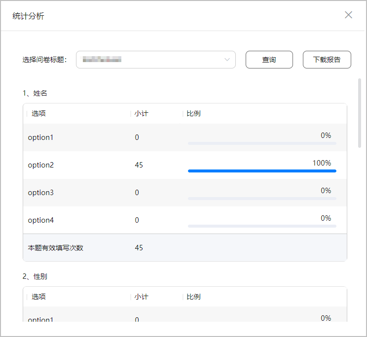