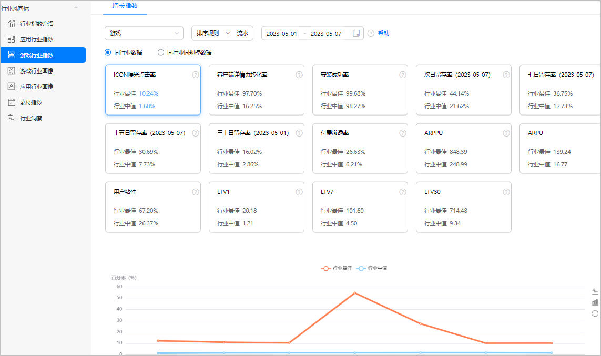
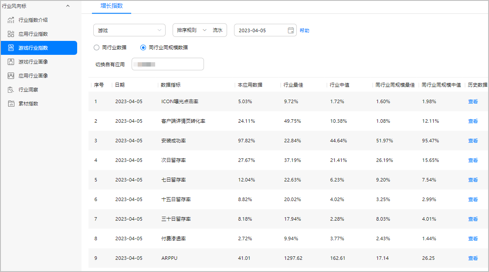
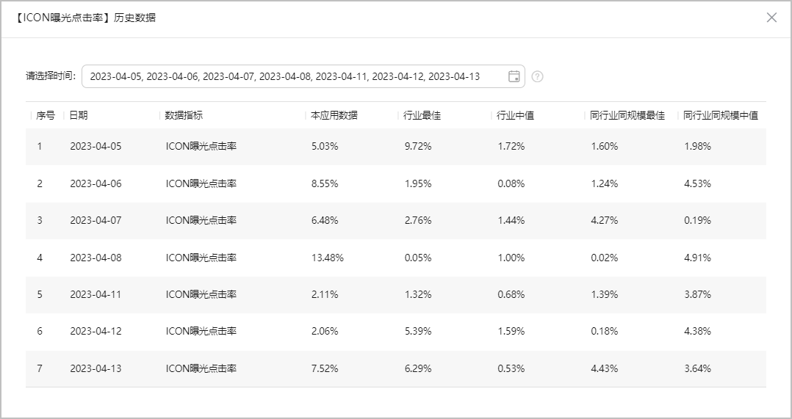
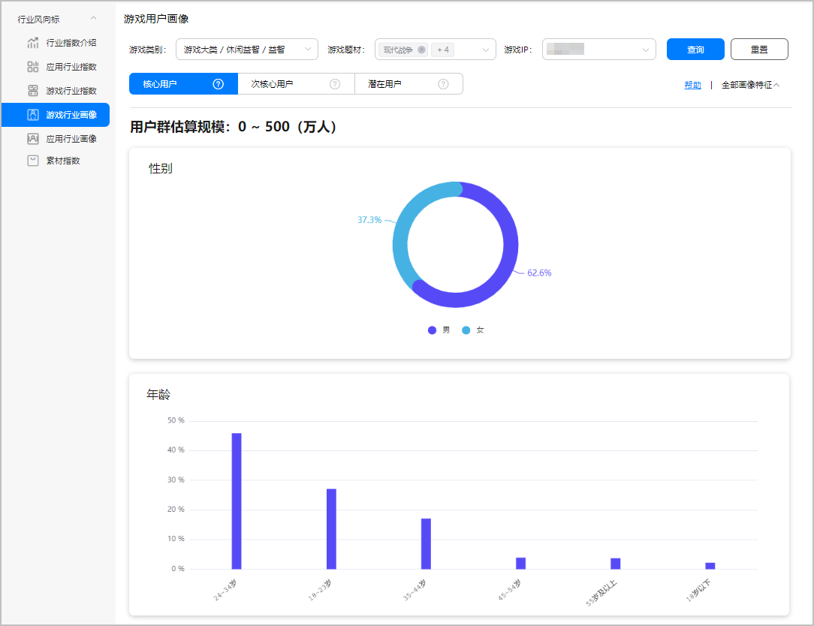
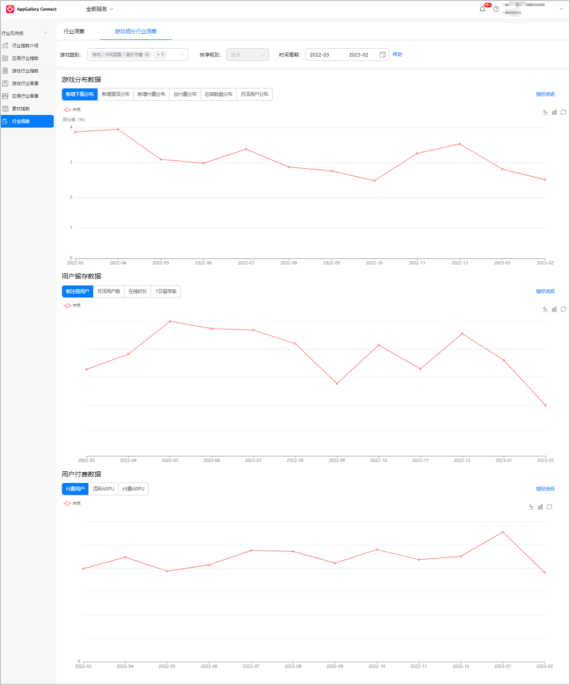
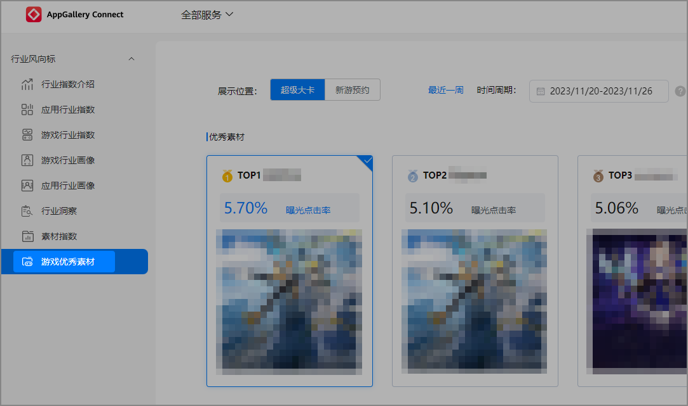
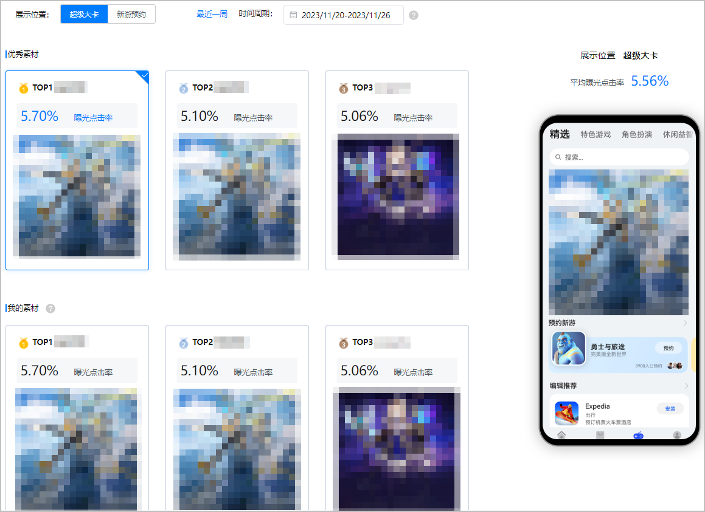
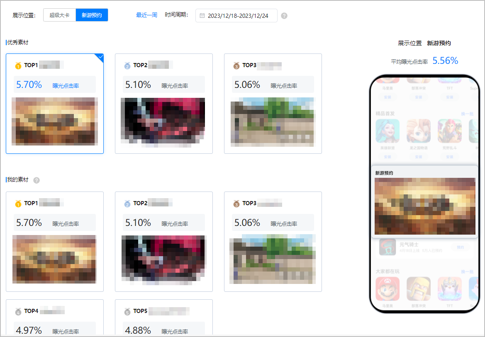

import MergeTable from "@site/src/components/MergeTable";

# 行业风向标

游戏行业风向标向您分析并展示了游戏行业指数、游戏行业画像和游戏细分行业洞察，您可以查看行业细分品类的整体数据，帮助您掌握行业运营情况、了解用户的使用偏好，从而基于游戏品类行业数据更科学的完成立项评估，更有针对性地开展游戏精细化运营。

## 游戏行业指数

游戏行业指数为您提供游戏细分行业典型游戏应用的运营指标参考数据，例如ICON曝光点击率、客户端详情页转化率、安装成功率等，帮助您了解游戏行业运营情况，辅助游戏立项及持续运营。

###进入行业指数页面

登录[AppGallery Connect](https://developer.huawei.com/consumer/cn/service/josp/agc/index.html)，在首页选择“全部服务 > 搜索游戏行业指数”，进入“游戏行业指数”页面。

###查看增长指数

为了更好地洞察行业趋势、提升自有产品运营能力，华为提供了同行业的趋势数据，并以数据指标的形式对您开放。

* **同行业数据**，即所选游戏品类的不同指标数据。您可以在筛选条件后查看行业最佳、行业中值的数据或图表：
  + “游戏类别”提供三级游戏分类，您可以单选一级分类、二级分类或三级分类。
  + “排序规则”支持按曝光、流水倒序排序。
  + “时间周期”支持快捷选择或自定义选择。

  

  统计范围默认为按游戏类别选择同行业游戏，根据选择的排序规则按流水或曝光倒序排列，取Top100游戏，如果数量不足100则取游戏全集。筛选范围已基于日活、曝光等指标数据剔除了尾部不具参考意义的游戏。

  + 行业最佳：所选游戏分类按流水或曝光排序top100游戏的top1游戏数据。
  + 行业中值：所选游戏分类按流水或曝光排序top100游戏的中位数游戏数据。

  

  | 指标 | 说明 |
  | --- | --- |
  | ICON曝光点击率 | 应用在华为应用市场及游戏中心ICON点击次数/ICON曝光次数。 |
  | 客户端详情页转化率 | 详情页带来的新下载成功量/详情页访问（客户端）。 |
  | 安装成功率 | 非更新应用下载成功后安装成功的比例，即非更新安装成功/非更新下载成功。 |
  | 次日留存率 | 统计日新增用户次日保持活跃的比率。 |
  | 七日留存率 | 统计日新增用户七日保持活跃的比率。 |
  | 十五日留存率 | 统计日新增用户十五日保持活跃的比率。 |
  | 三十日留存率 | 统计日新增用户三十日保持活跃的比率。 |
  | 付费渗透率 | 时间间隔范围内付费用户占活跃用户的比率。 |
  | ARPPU | 付费金额/付费用户数。 |
  | ARPU | 付费金额/活跃用户数。 |
  | 用户粘性 | 日活跃用户数/月活跃用户数，所得比值用于体现用户粘性。 |
  | LTV1 | 当天注册用户的付费金额/注册用户数。 |
  | LTV7 | 当天注册用户在七天内付费金额/当天注册用户数。 |
  | LTV30 | 当天注册用户在三十天内付费金额/当天注册用户数。 |
* **同行业同规模数据**，即与自有应用曝光量或流水金额处于同一档位的行业参考数据。曝光和流水档位设置将根据业务情况，定期刷新。您可以在筛选条件后查看任一在架游戏与行业同规模的对比数据。

  

  + 您可以切换任一在架游戏与行业同规模数据进行对比。
  + 您可以查看任一数据指标的历史数据。

    

    - 最多支持选择7个日期，选中多个日期后，单数据指标历史数据按日期顺序排列。
    - 最长可选择查看跨度为180天的历史数据。

    

## 游戏行业画像

游戏行业画像支持按不同标签查看核心、泛用户群的用户规模数据和画像特征数据，例如性别、年龄、联网方式、屏幕分辨率等各个维度的特征，帮助您更好的评估游戏市场热度趋势，更精准的支撑新游戏的立项，更有针对性的制定游戏运营策略。

###进入行业画像页面

登录[AppGallery Connect](https://developer.huawei.com/consumer/cn/service/josp/agc/index.html)，在首页选择“全部服务 > 搜索游戏行业画像”，进入“游戏行业画像”页面。

###查看游戏用户画像

在“游戏行业画像”页面，您可以筛选游戏条件查看不同用户群体的规模数据和画像特征图表：

* “游戏类别”提供三级游戏分类，您可以单选一级分类、二级分类或三级分类。
* “游戏题材”提供多种题材标签，您最多可以选择5项。
* “游戏IP”提供多种IP标签，您只可以选择1项。
* 右侧的“全部画像特征”提供多种[画像特征属性](#ZH-CN_TOPIC_0000001241425507__p5933142615013)，您需要至少选择1项。

* “核心用户”是跟您筛选的条件最匹配的群体；“次核心用户”是基于用户分析模型预测的群体，有类似的游戏偏好，但认同感低于“核心用户”；“潜在用户”是对同类游戏有兴趣但偏好不明显，有可能会成为游戏用户的群体。
* 若想查看所有群体的数据，请同时筛选“游戏题材”和“游戏IP”，您才可以查看所有用户群体的相关数据，否则您仅能查看“核心用户”群体的数据。

<MergeTable
  headers={['画像特征属性分类', '名称', '说明']}
  rows={[
    [{ text: '人口属性', rowspan: 3 }, '性别', '根据用户账号信息、手机使用行为，综合判断的性别。'],
    [null, '年龄', '根据用户账号信息、App安装使用、手机基本行为使用特征，通过机器学习算法预测用户所处的年龄段。'],
    [null, '职业', '根据用户账号信息、App安装使用、手机基本行为使用特征，通过机器学习算法预测的用户职业。'],
    [{ text: '终端属性', rowspan: 6 }, '联网方式', '近30天使用次数最多的联网方式。'],
    [null, '屏幕分辨率', '预置屏幕分辨率。'],
    [null, 'RAM', '预置RAM大小。'],
    [null, '设备价格', '终端设备的发售价格。'],
    [null, '机型', '用户使用机型。'],
    [null, 'EMUI版本', '当前设备EMUI版本。'],
    ['区域属性', '常驻城市', '取90天用户停留天数最多的城市类别及城市。'],
    [{ text: '游戏属性', rowspan: 5 }, '游戏类型偏好', '根据用户行为，挖掘出用户偏好的游戏类型。'],
    [null, '游戏玩法偏好', '根据用户行为，挖掘出用户偏好的游戏玩法。'],
    [null, '游戏题材偏好', '根据用户行为，挖掘出用户偏好的游戏题材。'],
    [null, '游戏元素偏好', '根据用户行为，挖掘出用户偏好的游戏元素。'],
    [null, '游戏玩家等级', '有效期内的游戏玩家游戏等级。'],
    [{ text: '用户行为属性', rowspan: 7 }, '近30天网游支付金额（元）', '网游付费用户最近30天网游支付总金额。'],
    [null, '30天内打开过游戏App个数', '近30天内打开过的游戏App的个数。'],
    [null, '30天内新安装游戏App个数', '近30天内新安装游戏App的个数。'],
    [null, '设备日均使用时长（小时）', '近30天内用户平均每天使用手机的小时数。'],
    [null, '手机在线时段', '近30天内每个时段在线的天数，如果某时段在线天数超过50%，就算此时段在线。'],
    [null, '安装应用类型偏好', '近三个月用户安装各类别（应用二级分类）应用的数量，按大于所有用户安装某应用类型中位数为该类型偏好。'],
    [null, '近180天访问活动类型分布', '近180天内用户访问的活动类型。'],
  ]}
/>

## 游戏细分行业洞察

基于华为游戏中心的历史数据，对您开放游戏指标的趋势数据，帮助您挖掘数据价值，判断市场环境和趋势，支撑新游戏的立项。

###进入细分行业洞察页面

登录[AppGallery Connect](https://developer.huawei.com/consumer/cn/service/josp/agc/index.html)，在首页选择“全部服务 > 搜索行业洞察”，在“行业洞察”页面选择“游戏细分行业洞察”页签。

###查看细分行业洞察

在“游戏细分行业洞察”页面，您可以筛选条件后查看游戏分布数据、用户留存数据和用户付费数据：

* “游戏类别”提供三级游戏分类，您可以单选一级分类、二级分类或多选三级分类。
* “排序规则”当前只提供按“流水”排序筛选游戏选项。
* “时间周期”支持按月选择、最长时间跨度周期为12个月。

<MergeTable
  headers={['洞察数据类型', '指标', '说明']}
  rows={[
    [{ text: '游戏分布数据', rowspan: 6 }, '新增下载分布', '统计所选各游戏子类流水排名Top100游戏的新下载次数（非更新下载次数）占比数据，展示月度分布变化趋势。'],
    [null, '新增激活分布', '统计所选各游戏子类流水排名Top100游戏的首次激活次数（客户端发起的首次激活数）占比数据，展示月度分布变化趋势。'],
    [null, '新增付费分布', '统计所选各游戏子类流水排名Top100游戏的新增付费额（仅新增用户的付费）占比数据，展示月度分布变化趋势。'],
    [null, '总付费分布', '统计所选各游戏子类流水排名Top100游戏的总付费额（包括新增用户和老用户的付费）占比数据，展示月度分布变化趋势。'],
    [null, '在架数量分布', '统计所选游戏类别流水排名Top100游戏，各子类在架数量占比数据，展示月度分布变化趋势。'],
    [null, '月活用户分布', '统计所选各游戏子类流水排名Top100游戏的月活用户数量占比数据，展示月度分布变化趋势。'],
    [{ text: '用户留存数据', rowspan: 4 }, '新注册用户', '统计所选各游戏子类流水排名前列的top游戏新注册用户数量拟合数据，展示各游戏类别数据变化趋势（此项数据仅展示相对变化趋势，不展示具体数值）。'],
    [null, '月活用户数', '统计所选各游戏子类流水排名前列的top游戏月活用户数量拟合数据，展示各游戏类别数据变化趋势（此项数据仅展示相对变化趋势，不展示具体数值）。'],
    [null, '在线时长', '统计所选各游戏子类流水排名前列的top游戏活跃用户平均每日在线时长拟合数据（分钟），展示各游戏类别数据变化趋势（此项数据仅展示相对变化趋势，不展示具体数值）。'],
    [null, '7日留存率', '统计所选各游戏子类流水排名前列的top游戏新增用户7日留存率拟合数据，展示各游戏类别数据变化趋势（此项数据仅展示相对变化趋势，不展示具体数值）。'],
    [{ text: '用户付费数据', rowspan: 3 }, '付费用户', '统计所选各游戏子类流水排名前列的top游戏付费用户数量拟合数据，展示各游戏类别数据变化趋势（此项数据仅展示相对变化趋势，不展示具体数值）。'],
    [null, '活跃ARPU', '统计所选各游戏子类流水排名前列的top游戏活跃用户平均付费拟合数据，展示各游戏类别数据变化趋势（此项数据仅展示相对变化趋势，不展示具体数值）。'],
    [null, '付费ARPU', '统计所选各游戏子类流水排名前列的top游戏付费用户平均付费拟合数据，展示各游戏类别数据变化趋势（此项数据仅展示相对变化趋势，不展示具体数值）。'],
  ]}
/>

## 游戏优秀素材

游戏优秀素材开放游戏中心热门资源位的优秀素材效果数据，方便您自主查询并参照优秀素材做针对性优化，提升素材质量，提升资源位使用效率及曝光点击转化率。

###进入游戏优秀素材页面

登录[AppGallery Connect](https://developer.huawei.com/consumer/cn/service/josp/agc/index.html)，在首页选择“全部服务 ”搜索游戏行业风向标，进入对应页面后在左侧菜单选择“游戏优秀素材”。

###查看游戏优秀素材

在“游戏优秀素材”页面，您可以按条件筛选查看优秀素材的相关数据。

* “展示位置”目前提供“超级大卡”和“新游预约”选项，未来会逐步开放更多位置的素材数据。
* “时间周期”按周筛选，可筛选最近3个月（即12周）的数据。

超级大卡：

新游预约：

筛选后展示满足条件的“优秀素材”和“我的素材”素材图片及其曝光点击率数据。点击选择某个素材后，右侧示意图区域展示该素材客户端效果（如果是动态素材，自动播放视频），示意图上方展示该坑位平均曝光点击率。

| 数据项 | 简介 | 说明 |
| --- | --- | --- |
| 优秀素材 | 行业优秀素材。满足筛选条件，按设备曝光点击率倒序排列，选取Top3优秀素材。 | * 预设曝光筛选门槛，每周曝光量低于特定阈值的素材不纳入Top素材范围。 * 候选素材不足3个时留空。 |
| 我的素材 | 您的账号下满足筛选条件的Top10素材（按设备曝光点击率倒序排列，展示最多10个素材）。 | * 在“我的素材”只能看到本账号下同一时段且有运营权限的应用素材数据，权限分配情况可在[AGC团队账号](https://developer.huawei.com/consumer/cn/doc/app/agc-help-manageaccount-0000001099996700)的“用户与访问 > 用户 > 所有用户”菜单下查看。 * “优秀素材”栏展示的优秀素材数据有曝光门槛（即曝光量高于一定阈值才能列为优秀），而“我的素材”不作限制，因此可能出现“我的素材”曝光点击率数据高于优秀素材，但未列入优秀素材的情况。 * 同游戏若有多个素材，按每个素材单独计算曝光点击率。 * 当素材曝光设备数为0时，曝光点击率显示为“-”。 |

数据计算方式：

* top素材曝光点击率 = 在选定周期内点击设备数总和 / 在选定周期内曝光设备数总和 \* 100%
* 平均曝光点击率 = 此坑位在选定周期内所有展示素材点击设备数总和 / 此坑位在选定周期内所有展示素材在选定周期内曝光设备数总和 \* 100%

在曝光点击率数据相同的情况下，以曝光数量高的素材优先。