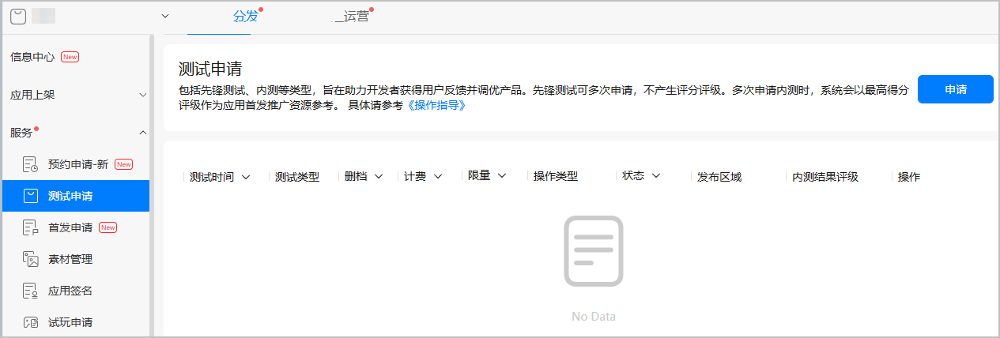
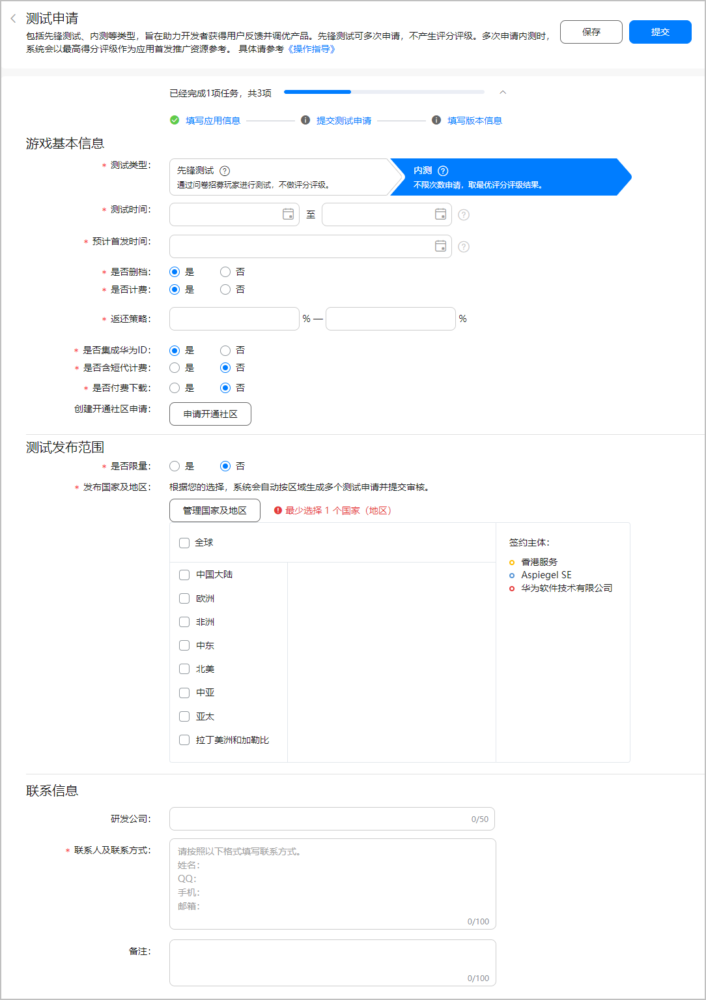
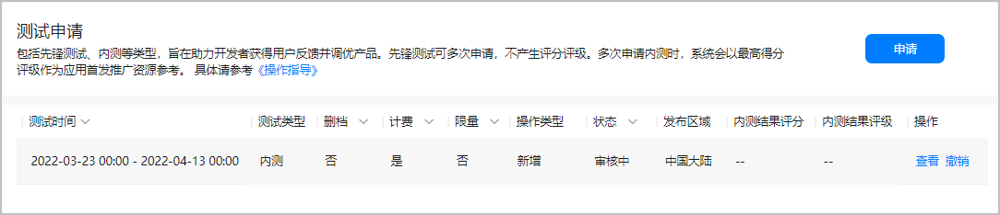
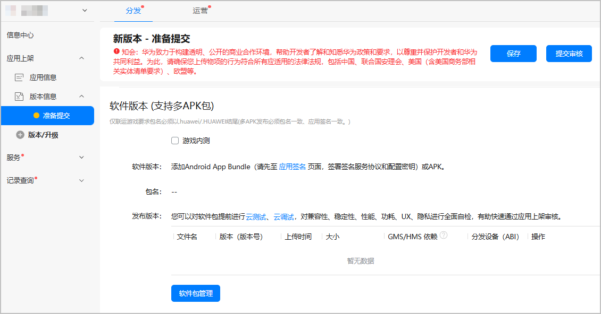
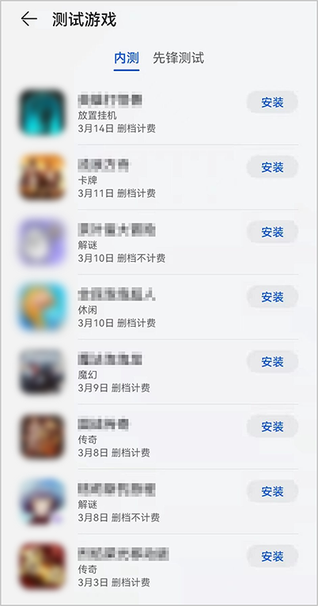
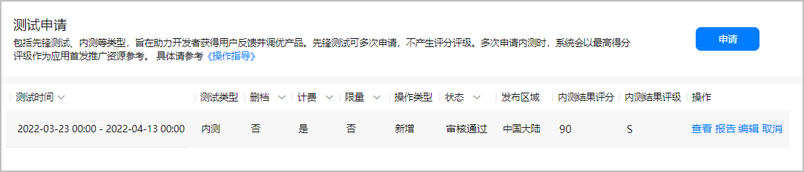
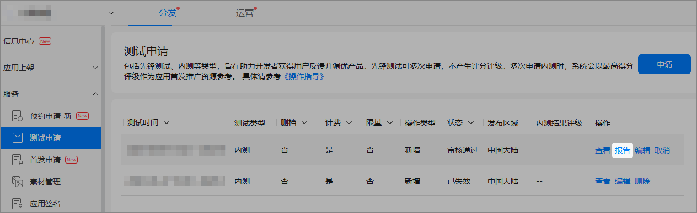
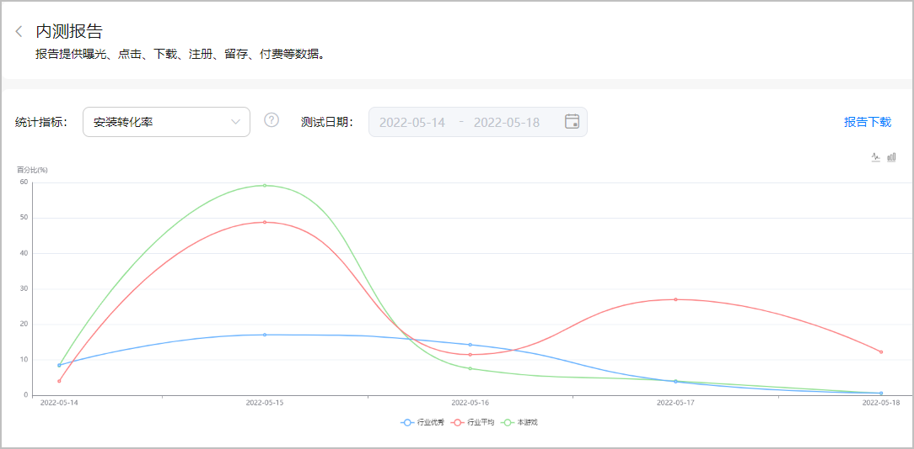
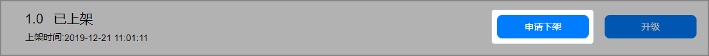

# 游戏内测（APK）

游戏内测是您验证游戏对华为手机适配情况，获取游戏数据情况来改进游戏的关键环节，同时内测数据也是用来确定游戏评分评级与首发推广资源的重要参考依据。因此强烈建议您对游戏进行内测。内测流程如下：

## 前提条件

* 您已成功[创建游戏](`https://developer.huawei.com/consumer/cn/doc/distribution/app/agc-help-createapp-0000001146718717`)，且软件包类型为“APK(Android应用)”，支持设备为“手机”。
* 您已[配置应用基本信息](`https://developer.huawei.com/consumer/cn/doc/app/agc-help-releaseapkrpk-0000001106463276#section27070410361`)，且游戏分类不包括“斗地主”、“捕鱼”、“纸牌 ”和“麻将”。
* 为了提升内测包的通过率，您需要提前自检游戏接入参数、游戏登录体验、游戏支付体验等。
* （可选）您可以[开通社区论坛](`https://developer.huawei.com/consumer/cn/doc/app/game-center-community-operation-0000001194305462`)，用于宣传游戏内容，聚集核心用户。

## 提交内测申请

1. 登录[AppGallery Connect](`https://developer.huawei.com/consumer/cn/service/josp/agc/index.html`)，点击“APP与元服务”，在应用列表页面选择需要申请内测的游戏。
2. 选择“分发 &gt; 服务 &gt; 测试申请”，在页面右侧点击“申请”。

   

   * 请至少提前5天提交内测申请，预留时间修改问题。
   * 内测业务对接QQ：2851161552。

   
3. 在“测试申请”页面按照提示填写信息，完成后点击“提交”。

   

   | 类别 | 参数 | 说明 |
   | --- | --- | --- |
   | 游戏基本信息 | 测试类型 | 请选择“内测”。 |
   | 测试时间 | 游戏内测的时间段。若有调整请及时更新。  说明：  * 建议单次内测时间为7~30天，内测结束时间为23:59:00，每两次内测间隔时间需超过7天。 * 若您已申请新游预约，请确保内测结束时间必须早于预约的[首发精确时间](`/docs/distribute/app-dist/game-center/game-center-pre-order-0000001239342333/game-center-pre-order-apk-0000002089114109#ZH-CN_TOPIC_0000002089114109__p108342217437`)。 |
   | 预计首发时间 | 游戏首次正式上架时间。  说明：  游戏正式首发前8天必须结束游戏内测。 |
   | 是否删档 | 内测结束后，是否清空当前内测的玩家数据。  说明：  同一个游戏不删档情况最多内测2次。 |
   | 是否计费 | 游戏内是否包含付费功能。  说明：  同一个游戏不计费情况最多内测2次。 |
   | 返还策略 | 若游戏删档且包含收费功能，您可设置不大于1000%的返还区间，在游戏首发后根据您的运营方案返还内测期间的充值金额。  说明：  您需要在游戏公告中阐述更详细的返还政策。 |
   | 是否集成华为ID | 游戏内是否接入华为账号SDK。 |
   | 是否含短代计费 | 游戏是否包含运营商的短信计费功能。 |
   | 是否付费下载 | 下载当前游戏是否需要付费。请选择“否”。  注意：  内测游戏必须免费下载，且勿让玩家0元付费下载。 |
   | 创建开通社区申请（可选） | 展示在内测详情页。社区论坛可宣传游戏相关内容，聚集核心用户。 |
   | 测试发布范围 | 是否限量 | 是否限制下载游戏的玩家数量。 |
   | 限量额度 | 若您限制玩家下载数量，请填写小于10,000,000的整数。 |
   | 发布国家及地区 | 游戏内测阶段发布的区域。  说明：  * 内测阶段发布的区域必须和“版本信息”页面保持一致。 * 申请内测的发布区域不能重复。 |
   | 联系信息 | 研发公司（可选） | 申请游戏内测的公司。 |
   | 联系人及联系方式 | 华为工作人员联系您的方式。请填写姓名、QQ、手机、邮箱等信息。要求1~100个字符。 |
   | 备注（可选） | 您可以补充额外的说明信息。 |
4. 内测申请的审核预计需要1~3个工作日，请耐心等待。审核结果可在状态栏或您预留的邮箱查看。

   

## 提交内测包

提交内测申请后，请尽快提交内测包审核。

* 请至少提前5个工作日提交内测包审核，预留时间修改问题，确保内测包顺利上架。
* 建议每次内测申请后都重新提交内测包。

1. 登录[AppGallery Connect网站](`https://developer.huawei.com/consumer/cn/service/josp/agc/index.html#/`)，点击“APP与元服务”。
2. 在应用列表中点击需要提交内测包的游戏，选择“分发 &gt; 应用上架 &gt; 版本信息”，在“版本信息”页面提交内测包，接入要求、流程与[发布应用(APK)](`https://developer.huawei.com/consumer/cn/doc/distribution/app/agc-help-releaseapkrpk-0000001106463276`)一致。

   

   

   * 上传测试包前，请必须勾选“游戏内测”。若无法勾选，请确认内测申请的状态，是否有待生效/已生效的内测申请。
   * 内测包的“付费情况”必须选择“免费”。
   * 若内测游戏有付费功能，则“应用内资费”应勾选相应的资费类型。
   * 建议内测包的上架时间和内测开始时间保持一致。
   * 是否为开放式测试版本，请选择“否”。
3. 内测包的审核预计需要3~5个工作日，请耐心等待。审核结果可在“版本信息”页面或[互动中心](`https://developer.huawei.com/consumer/cn/service/josp/agc/index.html#/interactive`)查看。

## 内测游戏上架

请及时查看内测申请和内测包审核的结果。

* 若游戏的内测申请与内测包审核均已通过，您的游戏将在内测期间展示在华为应用市场/游戏中心的内测专题栏，玩家可下载感兴趣的内测游戏。
* 若游戏内测申请已通过但内测包审核未通过，请根据审核结果修改并重新提交内测包审核。若未在内测期间成功上架内测包，需在内测结束后重新提交内测申请和内测包的审核。
* 若游戏的内测包审核已通过但内测申请未通过，请根据审核结果修改并重新提交内测申请。待内测申请通过后且到达内测开始时间时，您的内测游戏将会展示在内测专题栏。

* 若当前内测游戏选择了“限量”测试，在即将达到限量人数时，会有邮件或短信通知您，此时您应提前申请下架内测包。
* 内测游戏上架前，请务必做好公告提醒，避免用户投诉。

## 查看内测结果

内测结束后，您可以查看内测结果和内测报告。

### 查看评分评级

内测结束后会产生对应的评分评级，您可以在“测试申请”页面查看内测评分和评级。

内测评分区间为0~100，内测评级有C、B、B+、A、A+、S。

### 查看内测报告

内测结束后24小时可在页面查看日报告，七日后可下载汇总报告。报告提供“曝光”、“下载”、“留存”等多维度指标的图表及详细数据，同时展示基于游戏分类的行业数据，可助力您调优游戏产品、节省测试成本，提升新游测试效率。

1. 登录[AppGallery Connect](`https://developer.huawei.com/consumer/cn/service/josp/agc/index.html`)，点击“APP与元服务”。
2. 在应用列表中选择查看报告的应用，选择“分析 &gt; 服务 &gt; 测试申请”，在页面右侧点击对应申请“操作”列的“报告”。

   

   

   * 游戏内测结束后24小时提供日报告数据查看，七日后提供汇总报告下载。报告生成后保留时间为一年，请及时查看或下载报告。
   * 三日留存率3日后生成数据，七日留存率7日后生成数据。
   * 游戏内测报告支持中文、英文与俄文三种语言。
3. 在“内测报告”页面，您可以筛选“统计指标”后查看日报告，或点击右上方“报告下载”下载汇总报告。

   

   | 统计指标 | 简要说明 | 行业优秀/行业平均 |
   | --- | --- | --- |
   | 曝光量 | 应用在应用市场/游戏中心推荐、排行榜、搜索等资源位被展示次数。 | - |
   | 曝光设备数 | 应用在应用市场/游戏中心推荐、排行榜、搜索等资源位被展示设备数。 | - |
   | 详情页浏览次数 | 应用详情页被浏览的次数。 | - |
   | 详情页浏览设备数 | 应用详情页被浏览的设备数。 | - |
   | 下载设备数 | 非更新成功下载设备数。 | - |
   | 安装设备数 | 成功安装设备数。 | - |
   | 注册账号数 | 成功注册账号数。 | - |
   | 详情页转化率 | 详情页带来的新下载成功量/详情页查看量。 | - |
   | 下载转化率 | 下载设备数/详情页浏览设备数。 | - |
   | 安装转化率 | 安装设备数/下载设备数。 | 有 |
   | 注册转化率 | 注册账号数/安装设备数。 | 有 |
   | 次日留存率 | 内测期间，新增账号的次日留存率。 | 有 |
   | 三日留存率（3日后生成数据） | 内测期间，新增账号的三日留存率。 | 有 |
   | 七日留存率（7日后生成数据） | 内测期间，新增账号的七日留存率。 | 有 |
   | 付费账号数 | 成功付费的账号数。 | - |
   | 付费渗透率 | 付费账号数/注册账号数。 | 有 |
   | 流水 | 累计付费金额。 | - |
   | ARPPU | 流水/付费账号数。 | 有 |
   | 付费笔数 | 累计付费笔数。 | - |
   | 单笔ARPU | 流水/付费笔数。 | - |
   | 活跃账号数 | 活跃的账号数。 | - |

   

   《游戏内测报告》中的“行业”根据游戏明细分类划分，其中“行业优秀”是该分类下Top20%游戏的表现，“行业平均”是该分类下Top40%游戏的表现。

### 优化游戏内测

根据内测结果和内测报告优化游戏并重新发起内测申请时，若因特殊原因而无法继续提交申请时，您可以发送以下格式的邮件申请优化测试。若邮件申请通过审核，华为工作人员将根据游戏的最新版本进行优化测试，并将内测评分/评级结果发送至您的邮箱和页面状态栏。发送优化测试邮件需同时满足以下条件：

* 当前游戏已有B+及以上的内测评级结果。
* 距离最近评级结果公布日期间隔15日以上。
* 当前游戏首发前全渠道无内测计划。

|  |  |
| --- | --- |
| 邮件标题 | 您的游戏名称+优化测试 |
| 邮件内容 | * 优化测试原因。 * APP ID：查询方法可参见[查询应用基本信息](`https://developer.huawei.com/consumer/cn/doc/distribution/app/agc-help-appinfo-0000001100014694`)。 * 版本更新列表。 |
| 收件邮箱 | game.business@huawei.com |

若游戏优化测试后又进行了内测，则在优化测试后360天内，华为将不再受理贵公司名下任何游戏的优化测试申请，同时：

* 若在新的渠道进行内测且分发区域包含华为应用市场，则以此次内测结果为准，此前所有内测结果全部作废。
* 若在新的渠道进行内测且分发区域未包含华为应用市场，则以优化测试之前的最高内测结果为准。

## 下架内测游戏

您可以在内测结束前或结束后申请下架内测包，请在“版本信息”页面提交下架申请。

内测结束后，系统会自动发起内测包下架流程，请耐心等待。

游戏停服或关服请晚于下架时间，并在停服或关服前做好公告提醒。

## FAQ

### 同一个游戏是否允许多次内测？

允许多次内测，但两次内测时间大于7天，且同一个游戏不删档情况最多内测2次，不计费情况最多内测2次。本平台不受理不删档不计费内测。

### 对内测时长是否有要求？

建议单次内测时间为7~30天。

### 游戏内测对资质是否有要求？

游戏内测对资质的要求可参考[准备游戏资质](`/docs/distribute/app-dist/game-center/game-center-access-0000001239622337/game-center-preparation-work-0000001194305246#section5818191119155`)。