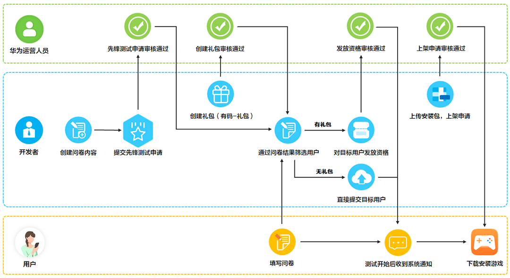
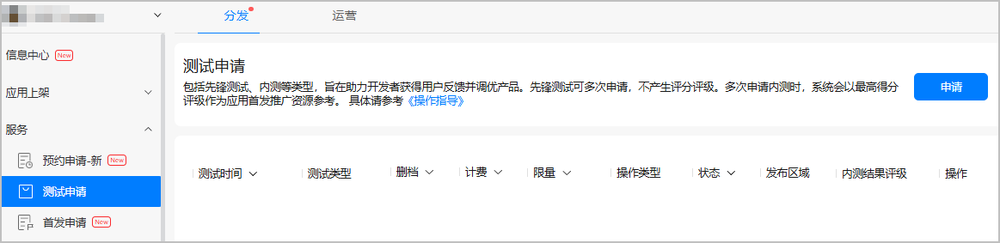
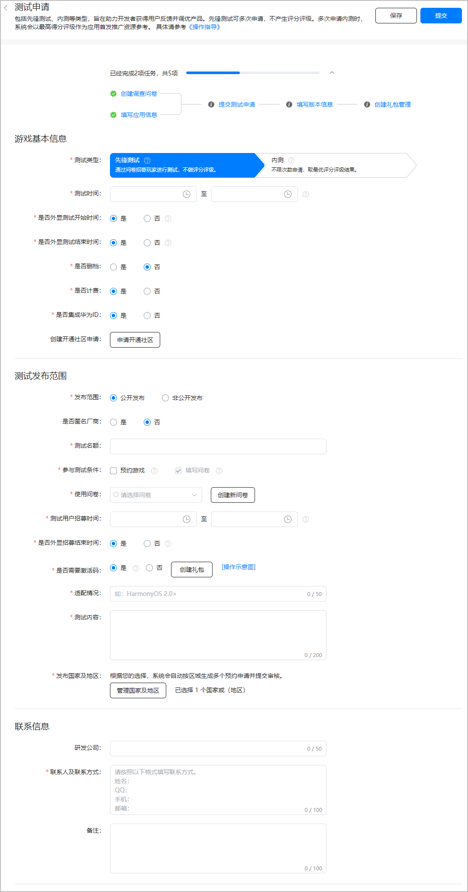
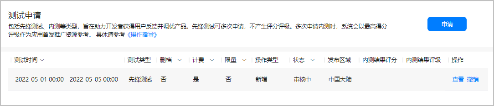
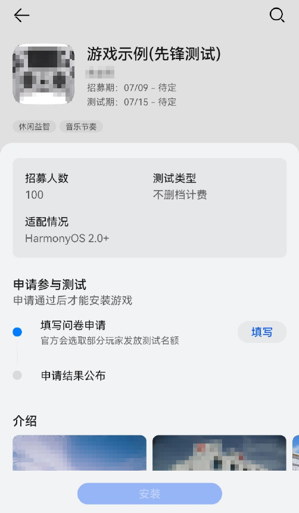
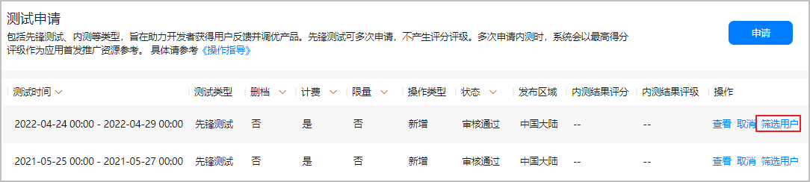
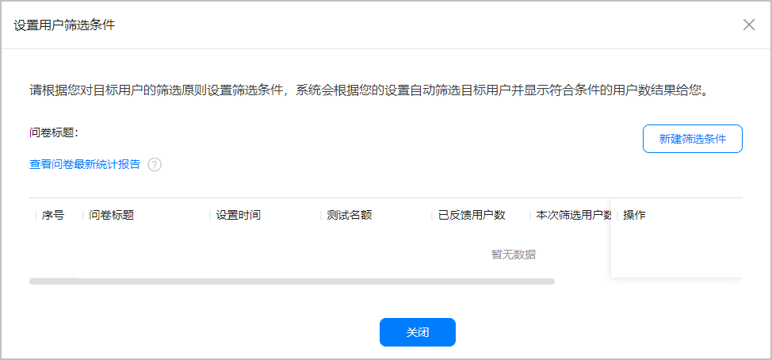
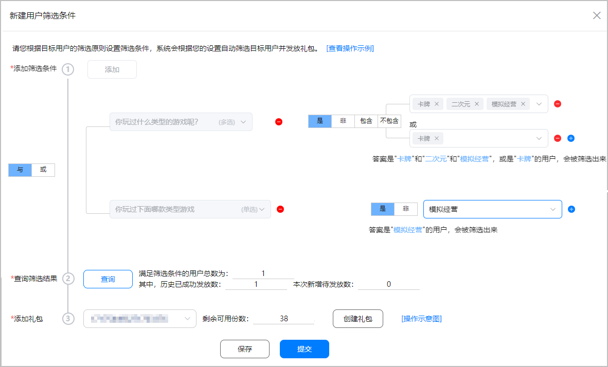
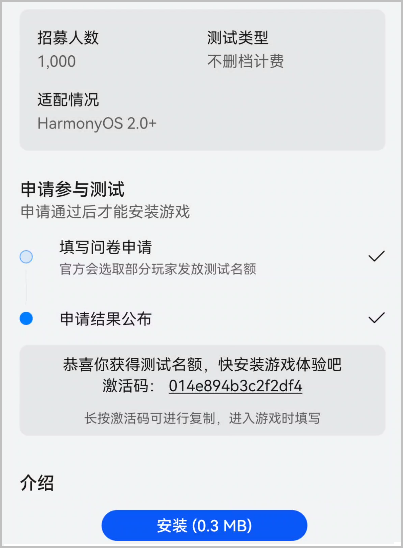
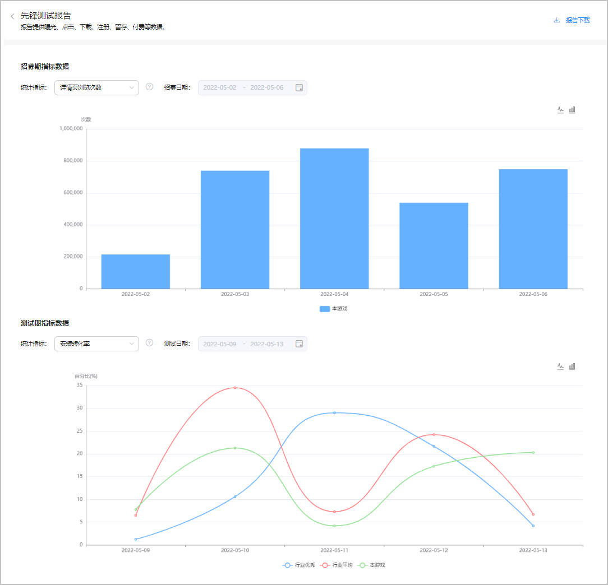

# 先锋测试

先锋测试是在游戏正式发布前，通过调查问卷对先锋玩家进行招募体验并获得其反馈，调优产品从而提升体验的一种限量测试。您可以通过问卷形式筛选出目标用户，对其发放游戏测试资格，在先锋测试阶段根据玩家反馈意见，优化游戏玩法、操作体验、美术风格等，提高游戏质量及体验。同时，您可以验证游戏对华为终端设备、华为游戏SDK适配情况。

## 支持场景

* 公开发布：面向华为旗下所有机型用户发布的公开测试，获得测试资格的用户可在华为应用市场/游戏中心安装并体验您的游戏。
* 非公开发布：非公开发布的保密测试，仅针对与本游戏相关的核心用户进行触达，具体触达用户人群可与相关品类经理沟通。

## 前提条件

* 您已成功[创建游戏](`https://developer.huawei.com/consumer/cn/doc/distribution/app/agc-help-createapp-0000001146718717`)，且软件包类型为“APK(Android应用)”，支持设备为“手机”。

  

  + “斗地主”、“捕鱼”、“纸牌 ”和“麻将”类型游戏不支持先锋测试。
  + 已有在架包体的游戏不支持先锋测试。若需使用“体验服”测试，请重新创建游戏后向华为工作人员提供APPID。
* 为了提升测试包的通过率，您需要提前自检游戏接入参数、游戏登录体验、游戏支付体验等。
* （可选）您可以[开通游戏版块](`https://developer.huawei.com/consumer/cn/doc/distribution/app/game-center-community-operation-0000001194305462`)，用于宣传游戏内容，聚集核心用户。

## 操作流程

您需要完成如下步骤：

| 序号 | 步骤 | 说明 |
| --- | --- | --- |
| 1 | [申请服务](#section69351662274) | 建议在使用先锋测试服务前，与华为工作人员沟通测试的相关信息。 |
| 2 | [创建问卷](#section1681818282812) | 您需要创建“先锋测试”类型的问卷，到达招募时间后，感兴趣的用户可在游戏详情页填写问卷申请测试资格。 |
| 3 | [配置应用基本信息](#section159131949123112) | 您需要提交填写游戏的基本信息，例如选择游戏类型。 |
| 4 | [创建礼包](#section182351834142810) | 若游戏需持有激活码才能进入，您必须创建礼包激活码，发放给获得测试资格的用户。 |
| 5 | [申请先锋测试](#section114115015572) | 提交申请时您需要正确填写先锋测试的相关信息，例如设置招募时间/测试时间，体验游戏是否需要邀请码等关键信息。 |
| 6 | [上传测试包](#section1146317210575) | 在测试包审核通过后，获得测试资格的用户可以在华为应用市场/游戏中心安装并体验您的游戏。 |
| 7 | [筛选用户](#section15507163605717) | 先锋测试的招募时间结束后，您可以对提交的所有问卷进行筛选，以确认最终可以具备测试资格的用户。 |

### 申请服务

若先锋测试选项置灰，可联系指定的华为工作人员申请开通服务。若确认已开通服务，建议与华为工作人员沟通如下信息：

| 信息 | 说明 |
| --- | --- |
| 游戏名称 | 申请先锋测试的游戏名称。 |
| APP ID | 游戏的唯一标识，可参考[查询应用基本信息](`https://developer.huawei.com/consumer/cn/doc/distribution/app/agc-help-appinfo-0000001100014694`)。 |
| 招募时间 | 用户完成测试资格申请的时间段。 |
| 测试时间 | 获得测试资格的先锋用户正式安装并体验游戏的时间段。 |
| 测试内容 | 您想要先锋玩家反馈的优化内容，例如游戏核心玩法或美术风格。 |

* 休闲游戏请联系QQ：2851161555。
* 网络游戏请联系QQ：2851508943。

### 创建问卷

正式申请先锋测试前，您需要[创建](`/docs/distribute/app-dist/game-center/game-center-setup-project-0000001194142410/game-center-questionnaire-0000001194144428#section113061322132311`)“先锋测试”类型的问卷，感兴趣的用户可填写问卷以申请游戏测试的资格。

* “先锋测试”类型的调查问卷无需审核。
* 建议先锋测试的问卷标题加上游戏ID，可参考[查看应用基本信息](`https://developer.huawei.com/consumer/cn/doc/distribution/app/agc-help-appinfo-0000001100014694`)。
* 建议问卷创建后，点击[预览](`/docs/distribute/app-dist/game-center/game-center-setup-project-0000001194142410/game-center-questionnaire-0000001194144428#section54421040112713`)查看问卷效果。

### 配置应用基本信息

您需要提前完善游戏的基本信息，例如游戏图标、游戏类型等，详情可参见[配置应用基本信息](`https://developer.huawei.com/consumer/cn/doc/app/agc-help-releaseapkrpk-0000001106463276#section27070410361`)。

### 创建礼包

请决定体验您的游戏是否需要激活码：

* 若需要激活码，您需要[创建“礼包”类型的奖品](`/docs/distribute/app-dist/game-center/game-center-operation-0000001239502315/agc-help-activity-operation-0000001194302394/game-center-setup-activities-all-0000001657534737/game-center-setup-activities-reservation-0000001657694701#section3160112618266`)，用户持有激活码才能进入游戏。

  

  + 目前，仅支持实名认证的企业开发者创建“礼包”类型的奖品。
  + “礼包兑换码”即是玩家进入游戏的激活码，建议兑换码的个数大于招募玩家的数量。
* 若无需激活码，可忽略此步骤，直接[申请先锋测试](#section114115015572)。

### 申请先锋测试

* 请在招募开始前至少提前5天申请先锋测试，预留时间修改问题。
* 请勿同时提交“先锋测试”和“[内测](`https://developer.huawei.com/consumer/cn/doc/distribution/app/game-center-early-access-0000001194302390`)”申请。

1. 登录[AppGallery Connect](`https://developer.huawei.com/consumer/cn/service/josp/agc/index.html`)，点击“APP与元服务”，在应用列表页面选择需要申请先锋测试的游戏。
2. 选择“分发 &gt; 服务 &gt; 测试申请”，在页面右侧点击“申请”。

   
3. 在“测试申请”页面按照提示填写信息，完成后点击“提交”。

   

   | 类别 | 参数 | 说明 |
   | --- | --- | --- |
   | 游戏基本信息 | 测试类型 | 请选择“先锋测试”。 |
   | 测试时间 | 获得测试资格的用户体验游戏的时间段。  说明：  * 若您已申请新游预约，请确保先锋测试结束时间必须早于预约的[首发精确时间](`/docs/distribute/app-dist/game-center/game-center-pre-order-0000001239342333/game-center-pre-order-apk-0000002089114109#ZH-CN_TOPIC_0000002089114109__p108342217437`)。 * 建议单次先锋测试时间7~30天。 * 建议先锋测试的招募结束至测试开始的时间间隔大于1天且小于7天。 * 游戏开始招募后需要修改招募时间或测试时间需[发送更新申请邮件](#section7102135875312)。 |
   | 是否外显测试开始时间 | 选择是否外显测试开始时间。选择“否”会在华为应用市场、游戏中心的先锋测试详情页的时间处展示：“待定”。 |
   | 是否外显测试结束时间 | 选择是否外显测试结束时间。选择“否”会在华为应用市场、游戏中心的先锋测试详情页的时间处展示：“待定”。 |
   | 是否删档 | 测试结束后，是否清空所有玩家的数据。 |
   | 是否计费 | 游戏内是否包含付费功能，例如关卡收费、会员收费等。 |
   | 是否集成华为ID | 游戏内是否接入华为账号SDK。 |
   | （可选）创建开通社区申请 | 展示在游戏详情页。社区论坛可宣传游戏相关内容，聚集核心用户。 |
   | 测试发布范围 | 发布范围 | 游戏上架后是否展示在“先锋测试”专题区：  * 公开发布：表示游戏上架后展示在专题区，且搜索可见。 * 非公开发布：表示游戏上架后不展示在专题区，且搜索不可见。获得测试资格的用户可以通过推送消息安装并体验游戏。 说明：  建议面向全部用户招募的测试选择“公开发布”。针对小范围用户的保密测试选择“非公开发布”。 |
   | 是否匿名厂商 | 请决定是否在先锋测试详情页展示您的企业名称：  * 是：不展示。 * 否：继续展示。 说明：  * 若在先锋测试详情页隐匿您的企业名称，且后续将申请[新游预约](`https://developer.huawei.com/consumer/cn/doc/app/game-center-pre-order-0000001239342333`)，建议选择[H5页面预约](`/docs/distribute/app-dist/game-center/game-center-pre-order-0000001239342333/game-center-pre-order-apk-0000002089114109#section4655536919`)方式。 * 对于审核通过的先锋测试，仅允许未到招募时间的先锋测试修改当前参数。 |
   | 测试名额 | 获得测试资格的用户数量。请根据实际情况填写。 |
   | 参与测试条件 | 申请测试游戏的要求：  * 勾选“预约游戏”，表示只有预约用户才能参与填写问卷以申请测试资格。 * 未勾选“预约游戏”，表示对游戏感兴趣的用户可以直接填写问卷以申请测试资格。 说明：  只有您创建过[游戏预约](`https://developer.huawei.com/consumer/cn/doc/app/game-center-pre-order-0000001239342333`)且已审核通过上架后，此处才会出现“预约游戏”选项，勾选该选项后用户可在游戏详情页先预约游戏再填写问卷。 |
   | 使用问卷 | 招募开始后，对游戏感兴趣的用户申请测试资格时填写的问卷：  * 您可以创建新的问卷。 * 您也可以选择已有的问卷。 注意：  用户招募时间开始后，禁止更换调查问卷。 |
   | 测试用户招募时间 | 对游戏感兴趣的用户完成测试资格申请的时间段。  说明：  * 建议先锋测试的招募时间小于7天。 * 在游戏招募期间，用户无法下载测试游戏。 * 游戏开始招募后需要修改招募时间或测试时间需[发送更新申请邮件](#section7102135875312)。 |
   | 是否外显招募结束时间 | 选择是否外显招募结束时间。选择“否”会在华为应用市场、游戏中心的先锋测试详情页的时间处展示：“待定”。 |
   | 是否需要激活码 | 获得测试资格的用户体验游戏是否需要激活码：  * 是：表示用户必须持有激活码，此时您需要[创建礼包](#section182351834142810)。 * 否：表示获得测试资格的用户可以直接安装并体验游戏。 |
   | 适配情况 | 游戏的机型适配情况。要求1~50个字符。 |
   | 测试内容 | 在测试过程中想让玩家反馈的优化内容，例如游戏核心玩法。要求1~200个字符。  说明：  相同版本的游戏不建议重复测试。若需要多次申请先锋测试，请说明游戏优化和新增内容。 |
   | 发布国家及地区 | 游戏发布的范围。请选择“中国大陆”。 |
   | 联系信息 | 研发公司（可选） | 提交先锋测试申请的企业。 |
   | 联系人及联系方式 | 华为工作人员联系您的方式。请填写姓名、QQ、手机、邮箱等信息。要求1~100个字符。 |
   | 备注（可选） | 您可以补充额外说明信息。 |
4. 华为工作人员审核先锋测试申请预计需要1~3个工作日，请耐心等待。审核结果可在状态栏或您预留的邮箱查看。

   
5. 若先锋测试的申请通过且到达招募时间后，您的游戏将会展示在华为应用市场/游戏中心的专题区，感兴趣的用户可以根据“申请参与测试”的要求完成招募报名。

   

### 上传测试包

先锋测试审核通过后，请尽快在“版本信息”页面上传测试包，以确保先锋测试开始前通过审核，让获得测试资格的用户在华为应用市场/游戏中心正常下载。

若测试开始前还未上传测试包或测试包审核未通过，获得测试资格的用户无法在应用市场/游戏中心正常下载该游戏。

1. 登录[AppGallery Connect](`https://developer.huawei.com/consumer/cn/service/josp/agc/index.html`)，点击“APP与元服务”，在应用列表页面选择先锋测试游戏。
2. 选择“分发 &gt; 应用上架 &gt; 版本信息”，在“版本信息”页面上传测试包，相关的接入要求、流程与[发布应用(APK)](`https://developer.huawei.com/consumer/cn/doc/distribution/app/agc-help-releaseapkrpk-0000001106463276`)一致。

   

   * 测试包的“付费情况”必须选择“免费”，以保证获得测试资格的用户在华为应用市场/游戏中心可以免费安装并体验您的游戏。
   * 若游戏内包含[计费功能](#ZH-CN_TOPIC_0000001194462384__p527154118297)，则“应用内资费”应勾选相应的资费类型。
   * 上传测试包前，请必须勾选“先锋测试版本”。
   * 测试包的发布区域请选择“中国大陆”。
3. 华为工作员审核测试包预计需要3~5个工作日，请耐心等待。审核结果可在“版本信息”页面或[互动中心](`https://developer.huawei.com/consumer/cn/service/josp/agc/index.html#/interactive`)查看。
4. 若测试包审核通过且到达测试时间后，获得测试资格的用户可前往华为应用市场/游戏中心安装并体验您的游戏。

   

   若在测试包审核通过后更新先锋测试信息，您必须再次上传测试包审核。

### 筛选用户

先锋游戏招募结束后，您可以选择符合条件的用户测试您的游戏。

1. 登录[AppGallery Connect](`https://developer.huawei.com/consumer/cn/service/josp/agc/index.html`)，点击“APP与元服务”，在应用列表页面选择先锋测试游戏。
2. 选择“分发 &gt; 服务 &gt; 测试申请”，在列表对应的操作列点击“筛选用户”。

   
3. 在弹出的“设置用户筛选条件”窗口上点击“新建筛选条件”进行目标用户的筛选。

   
4. 在弹出的“新建用户筛选条件”窗口上选择符合筛选条件的用户并推送开测通知或激活码消息。您可以结合自身的实际需求，对提交的所有问卷设置一定的条件以筛选出最终的目标用户，确认后点击“提交”，即可对最终的目标用户推送消息。

   

   | 步骤 | 筛选环节 | 操作说明 |
   | --- | --- | --- |
   | 1 | 添加筛选条件 | 点击“添加”：  * 您可以设置若干题干之间“与”、“或”的逻辑关系。 * 您还可以设置单个题干中选项“是”、“非”、“包含”、“不包含”的筛选条件。点击、可添加和删除选项。 说明：  + 单选题选项仅支持“是”、“非”的筛选条件，多选题选项支持“是”、“非”、“包含”、“不包含”的筛选条件。   + 筛选条件为“是”和“包含”时，选项之间为“或”的关系，筛选条件为“非”和“不包含”时，选项之间为“且”的关系。   + 当您完成筛选条件和选项值设置后，下方会显示该题完整筛选说明文字，供您参考理解。 |
   | 2 | 查询筛选结果 | 点击“查询”，您可以查看满足筛选条件的用户总人数。 |
   | 3 | 添加礼包（仅针对激活码的游戏。） | 您需要为最终的筛选用户选择礼包：  * 若有数量大于筛选人数的礼包，您可以直接选择。 * 若礼包数量小于筛选人数，您可以[创建礼包](#section182351834142810)。 |
   | 4 | 提交 | 点击“提交”即可对筛选用户发送开测通知或激活码消息。  说明：  * 您可以多次筛选用户并发送开测通知或激活码消息。 * 如您选择激活码发放，且不想提前发给用户，请务必在需要发放日期的当日进行用户筛选提交，提交前请与华为运营人员沟通，请勿提前提交。 |
5. 获得测试资格的用户会在华为应用市场/游戏中心会收到开测消息或激活码通知。在先锋测试正式开始后，用户可前往安装并体验游戏。

   

   

   * 用户可在通知页或游戏详情页复制激活码，在进入游戏登录界面后验证无误后即可体验游戏。
   * 先锋测试结束后，游戏将会自动下架，无需额外申请下架。

## 查看测试报告

先锋测试结束后24小时可在页面查看日报告，七日后可下载汇总报告。该报告可助力您调优研发产品、提升开发者业务粘性，节省测试成本，提升新游测试效率。

* 三日留存率3日后生成数据，七日留存率7日后生成数据。
* 先锋测试报告仅保留一年，在有效期内，您可以查看或下载。
* 先锋测试报告支持中文、英文与俄文三种语言。

1. 登录[AppGallery Connect](`https://developer.huawei.com/consumer/cn/service/josp/agc/index.html`)，点击“分析”，在应用列表选择先锋测试游戏。
2. 选择“分发分析 &gt; 测试报告”，选择测试类型为“先锋测试”，点击“查看报告”。
3. 在页面查看日报告或点击右上方“报告下载”下载汇总报告。

   

   | 所属阶段 | 统计指标 | 简要说明 | 行业优秀/行业平均 |
   | --- | --- | --- | --- |
   | 招募期 | 曝光量 | 应用在应用市场/游戏中心推荐、排行榜、搜索等资源位被展示次数。 | - |
   | 曝光设备数 | 应用在应用市场/游戏中心推荐、排行榜、搜索等资源位被展示设备数。 | - |
   | 详情页浏览次数 | 应用详情页被浏览的次数。 | - |
   | 详情页浏览设备数 | 应用详情页被浏览的设备数。 | - |
   | 问卷填写账号数 | 招募期间，进入到问卷填写页面的账号数。 | - |
   | 问卷提交账号数 | 招募期间，完成问卷提交的账号数。 | - |
   | 问卷转化率 | 问卷提交账号数/问卷填写账号数。 | - |
   | 详情页转化率 | 问卷提交账号数/详情页浏览设备数。 | - |
   | 测试期 | 曝光量 | 应用在应用市场/游戏中心推荐、排行榜、搜索等资源位被展示次数。 | - |
   | 曝光设备数 | 应用在应用市场/游戏中心推荐、排行榜、搜索等资源位被展示设备数。 | - |
   | 详情页浏览次数 | 应用详情页被浏览的次数。 | - |
   | 详情页浏览设备数 | 应用详情页被浏览的设备数。 | - |
   | 获得资格账号数 | 筛选后获得资格的账号数。 | - |
   | 下载设备数 | 非更新成功下载设备数。 | - |
   | 安装设备数 | 成功安装设备数。 | - |
   | 注册账号数 | 成功注册账号数。 | - |
   | 下载转化率 | 下载设备数/获得资格账号数。 | - |
   | 安装转化率 | 安装设备数/下载设备数。 | 有 |
   | 注册转化率 | 注册账号数/安装设备数。 | 有 |
   | 次日留存率 | 先锋测试期间，新增账号的次日留存率。 | 有 |
   | 三日留存率（3日后生成数据） | 先锋测试期间，新增账号的三日留存率。 | 有 |
   | 七日留存率（7日后生成数据） | 先锋测试期间，新增账号的七日留存率。 | 有 |
   | 付费账号数 | 成功付费的账号数。 | - |
   | 付费渗透率 | 付费账号数/注册账号数。 | 有 |
   | 流水 | 累计付费金额。 | - |
   | ARPPU | 流水/付费账号数。 | 有 |
   | 付费笔数 | 累计付费笔数。 | - |
   | 单笔ARPU | 流水/付费笔数。 | - |

   

   先锋测试报告中的“行业”根据游戏明细分类划分，其中“行业优秀”是该分类下Top20%游戏的表现，“行业平均”是该分类下Top40%游戏的表现。

## FAQ

<strong>游戏开始招募后需要修改招募时间或测试时间该如何发送更新申请邮件？</strong>

发送更新邮件前需先和华为工作人员沟通。

|  |  |
| --- | --- |
| 邮件标题 | *[您的游戏名称]*-先锋测试更新招募时间/测试时间 |
| 邮件内容 | * 游戏名称。 * APPID，可参考[查询应用基本信息](`https://developer.huawei.com/consumer/cn/doc/distribution/app/agc-help-appinfo-0000001100014694`)。 * 修改招募时间/测试时间原因。 * 修改后的招募时间/测试时间。 |
| 收件邮箱 | game.business@huawei.com |