# 分阶段发布

在当前上架版本为全网发布时，您可以采用分阶段发布的方式进行应用升级。采用分阶段发布，您可以先向一定比例的用户发布更新的版本，然后再逐步提升用户比例，最终实现全网发布。通过小范围的版本更新，您可以快速获取用户对新版本的反馈意见，降低全网发布后版本出现问题的风险。

## 前提条件

* 分阶段发布的应用或者元服务必须存在全网在架的版本。
* 分阶段发布仅支持如下软件包类型及设备类型：

  | 支持的软件包类型 | 对应的设备类型 |
  | --- | --- |
  | APK | + 手机 + VR |
  | AAB | 手机 |
  | RPK | 手机 |
  | APP | + 手机 + 平板 + PC/2in1 + 智慧屏 + 运动手表 + 智能手表 |

## 提交分阶段发布申请

1. 登录[AppGallery Connect](`https://developer.huawei.com/consumer/cn/service/josp/agc/index.html`)，点击“APP与元服务”。
2. 在应用列表选择待升级应用或者元服务，进入应用详情页面。

3. 选择“分发 &gt; 应用上架 &gt; 版本信息”，在页面右上角点击“升级”。

   
4. 左侧导航栏新增“新版本-准备提交”页面。

   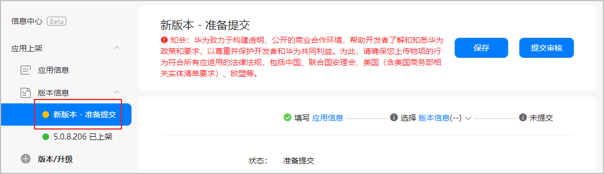

5. 如需修改应用信息，点击左侧导航栏“应用信息”或者右侧“应用信息”进行编辑，详情请参见[配置应用信息](`https://developer.huawei.com/consumer/cn/doc/app/agc-help-harmonyos-releaseapp-non-next-0000002179322402#section242410559206`)。完成后点击“下一步”，将再次跳转至“新版本-准备提交”页面。

   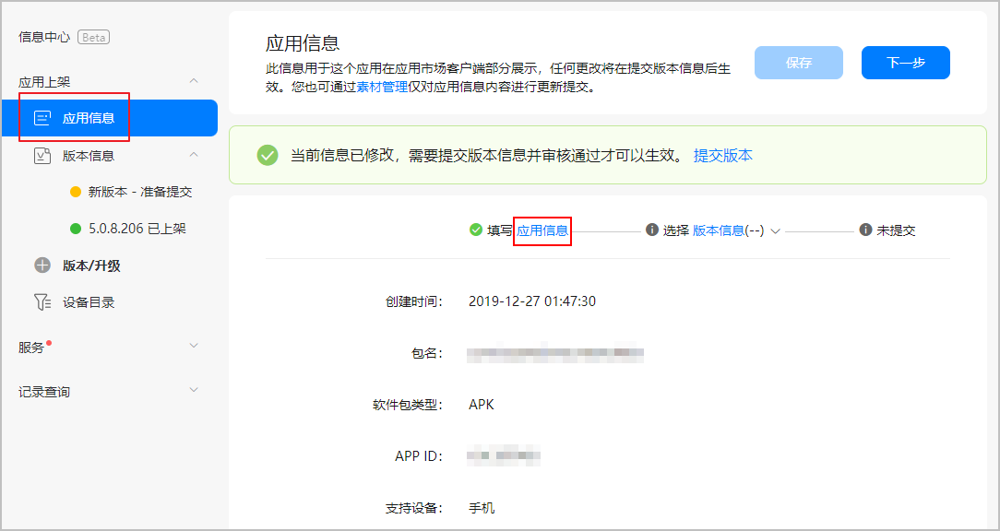

6. 在“开放式测试”区域，“是否开放式测试版本”选择“否”。

   

   如需发布开放式测试版本，请参考[上架开放式测试版本](`https://developer.huawei.com/consumer/cn/doc/development/AppGallery-connect-Guides/agc-betatest-release-0000001071228673`)。

   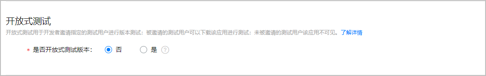
7. 在“软件版本”区域点击“软件包管理”（若为HarmonyOS应用/元服务，则点击“版本选取”），在弹出的窗口中上传或者选取软件包。

   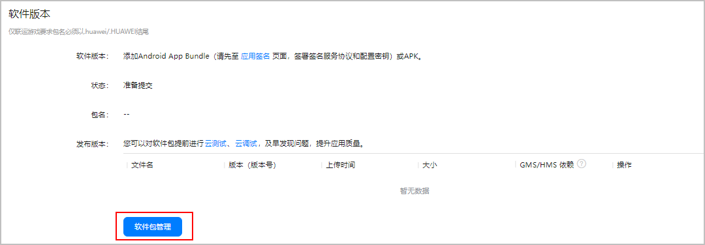

   * 如需更新软件包，您可以点击“上传”，上传本地软件包。

     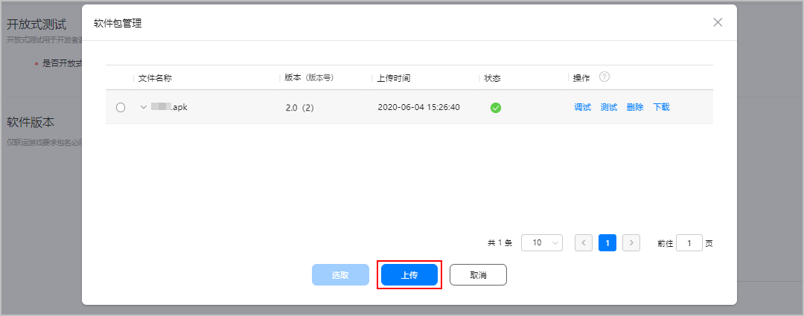
   * 若无需更新软件包，您可以直接在软件包列表中选择，点击“选取”。

     

     请确保您上传的软件包versionCode不低于当前在架版本的versionCode，否则将无法选择使用，您可点击“上传”重新提交正确的软件包。

     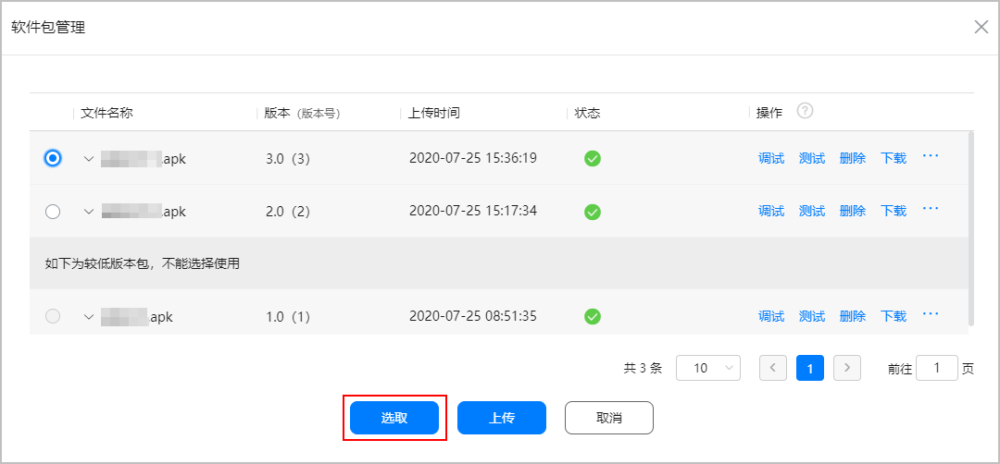

8. 在“发布类型”区域下设置相关参数。

   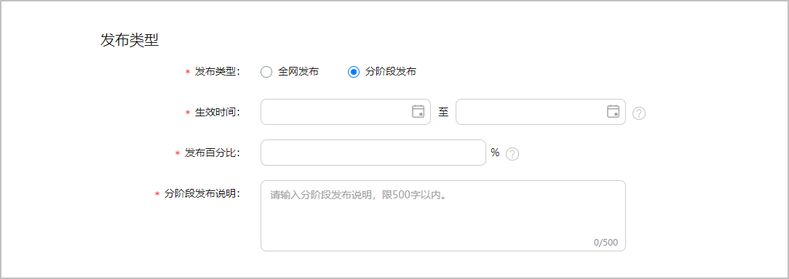

   | 参数 | 说明 |
   | --- | --- |
   | 发布类型 | 选择“分阶段发布”。 |
   | 生效时间 | 分阶段发布的生效周期。  分阶段发布开始时间不得早于当前时间，结束时间必须大于开始时间，生效周期最大365天。达到生效结束时间后，分阶段发布版本将自动转全网发布。暂停状态下，不会自动转全网发布。 |
   | 发布百分比 | 版本发布后可获取该版本的设备数占总数的比例。设置完成，在版本生效时间开始时立即按此比例进行随机分配。例如设置为50%，那么在版本生效时间段内，始终只能在50%的设备上获取该版本，该比例不会发生变化。  请输入整数或小数，数值必须大于0且小于100。如果输入小数，则最多保留小数点后两位。对于同一个分阶段发布版本，每修改一次发布范围的百分比，建议大于上一次的百分比数值。 |
   | 分阶段发布说明 | 填写您本次分阶段发布的备注信息，如发布特性等，要求1-500字符。  此说明不对用户或华为审核人员展示，仅展示在版本信息页面，供您自己参考。 |

9. 完善其他相关信息后，点击“提交审核”，确认版本号无误后点击“确认”。提交成功后，应用版本状态更新为“正在审核”。

   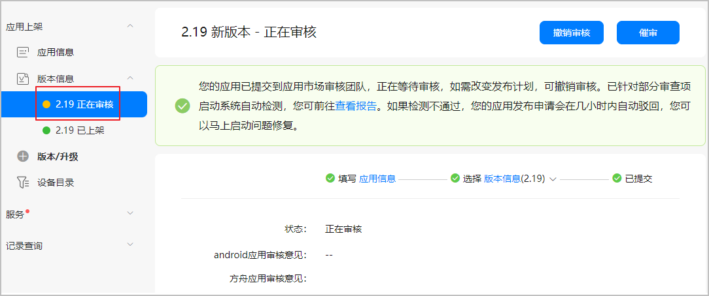

   

   分阶段发布不支持强制更新，强制更新选项不生效。

## 分阶段发布申请审核通过

分阶段发布审核通过但尚未达到生效时间：

* 左侧导航栏的“版本信息”变更为“待上架”状态。
* “版本信息”页面右上角显示“[更新分阶段发布](#section14611832111112)”和“[取消分阶段发布](#section1798894281212)”按钮。
* “版本信息”页面的“发布类型”区域显示“分阶段发布中”状态。

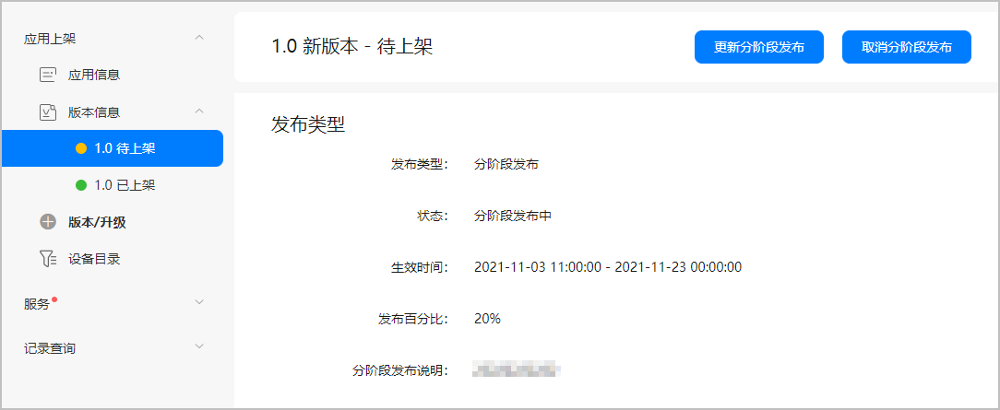

在分阶段发布生效期间：

* 左侧导航栏的“版本信息”变更为“已上架”状态。
* “版本信息”页面右上角显示“[更新分阶段发布](#section14611832111112)”、“[暂停分阶段发布](#section891645219919)”、“[取消分阶段发布](#section1798894281212)”和“升级”按钮。
* “版本信息”页面的“发布类型”区域显示“分阶段发布中”状态。

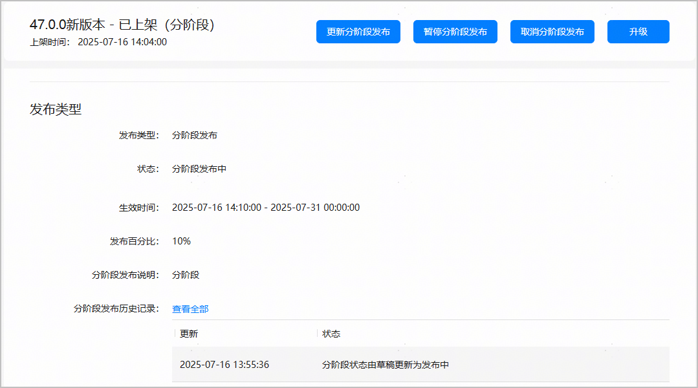

## 暂停分阶段发布

在分阶段发布生效期间，您可以执行如下操作暂停分阶段发布：

1. 在“版本信息”页面右上角 点击“暂停分阶段发布”。
2. 认真阅读弹出的提示框内容后，点击“确认”。

   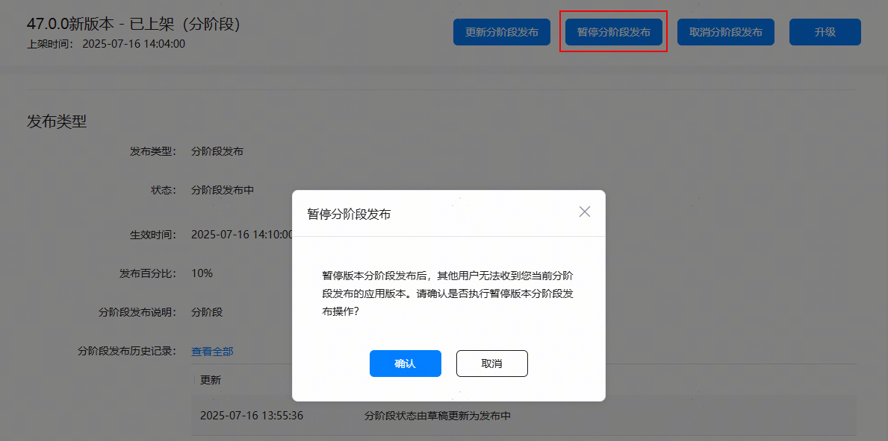

   

   * 暂停分阶段发布的申请无需人工审核。
   * 暂停分阶段发布后，发布范围内的所有用户均无法在华为应用市场搜索到该版本的应用。

## 恢复分阶段发布

暂停分阶段发布后，您可以执行如下操作恢复分阶段发布：

1. 在“版本信息”页面右上角 点击“恢复分阶段发布”。
2. 在弹出的对话框中修改参数后，点击“确认”。

   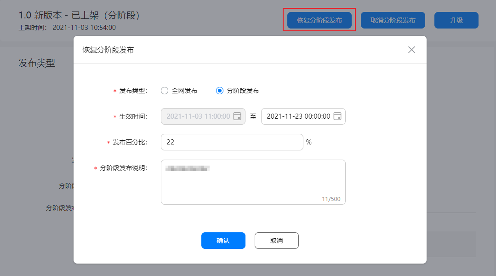

   | 恢复分阶段发布参数 | 说明 |
   | --- | --- |
   | 发布类型 | 您可以选择如下任一类型：  * “全网发布”：根据发布国家或地区全网发布应用。完成选择后，后面三个参数不显示。 * “分阶段发布”：继续以分阶段发布的方式上架应用。 |
   | 生效时间 | * 起始时间：不支持修改。 * 结束时间：支持修改。您需要保证整个分阶段发布的生效周期不超过365天。 |
   | 发布百分比 | 支持修改。对于同一个分阶段发布版本，每修改一次发布范围的百分比，建议大于上一次的百分比数值。 |
   | 分阶段发布说明 | 支持修改。要求1-500个字符。 |

   

   * 恢复分阶段发布的申请无需人工审核。
   * 恢复分阶段发布后，发布范围内的用户可以在华为应用市场搜索到该版本的应用。

## 更新分阶段发布

### 适用场景

您可以在如下场景中更新分阶段发布：

* 分阶段发布的申请审核通过但尚未达到生效时间。
* 在分阶段发布生效期间。

### 操作步骤

您可以执行如下操作更新分阶段发布：

1. 在“版本信息”页面右上角 点击“更新分阶段发布”。
2. 在弹出的对话框中修改参数后，点击“确认”。

   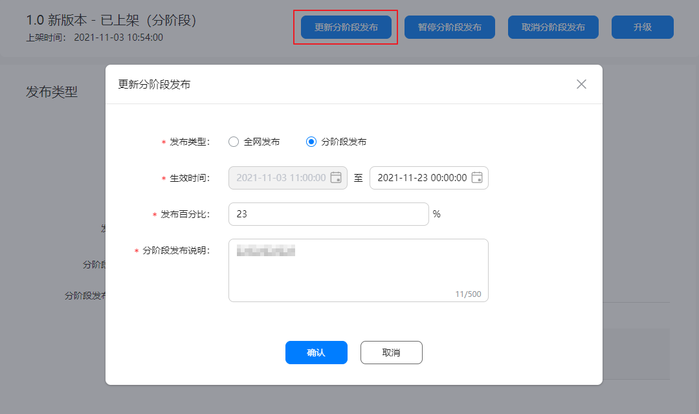

   | 更新分阶段发布参数 | 说明 |
   | --- | --- |
   | 发布类型 | 您可以选择如下任一类型：  * “全网发布”：根据发布国家或地区全网发布应用。完成选择后，后面三个参数不显示。 * “分阶段发布”：继续以分阶段发布的方式上架应用。 |
   | 生效时间 | * 起始时间：   + 若起始时间已生效，则不支持修改，置灰显示。   + 若起始时间未生效，则支持修改。您需要保证整个分阶段发布的生效周期不超过365天。 * 结束时间：支持修改。您需要保证整个分阶段发布的生效周期不超过365天。 |
   | 发布百分比 | 支持修改。对于同一个分阶段发布版本，要求发布百分比数值逐渐变大。 |
   | 分阶段发布说明 | 支持修改。要求1-500个字符。 |

   

   * 更新分阶段发布的申请无需人工审核。
   * 更新分阶段发布后，在发布范围内新增的用户也可以在华为应用市场搜索到该版本的应用。

## 取消分阶段发布

分阶段发布审核通过后，您可以执行如下操作取消分阶段发布：

1. 在“版本信息”页面右上角点击“取消分阶段发布”。
2. 认真阅读弹出的提示框内容后，点击“确认”。

   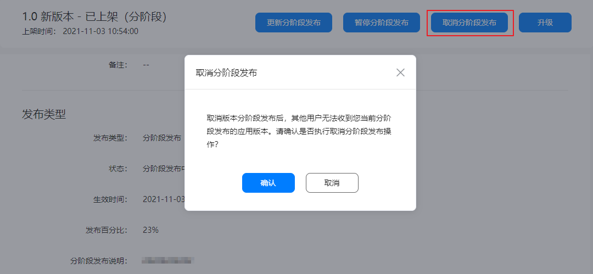

   

   * 取消分阶段发布的申请无需人工审核。
   * 取消分阶段发布后，发布范围内的所有用户均无法在华为应用市场搜索到该版本的应用。

## 查看分阶段发布历史操作记录

您可以在“发布类型”区域下查看“分阶段发布历史记录”。

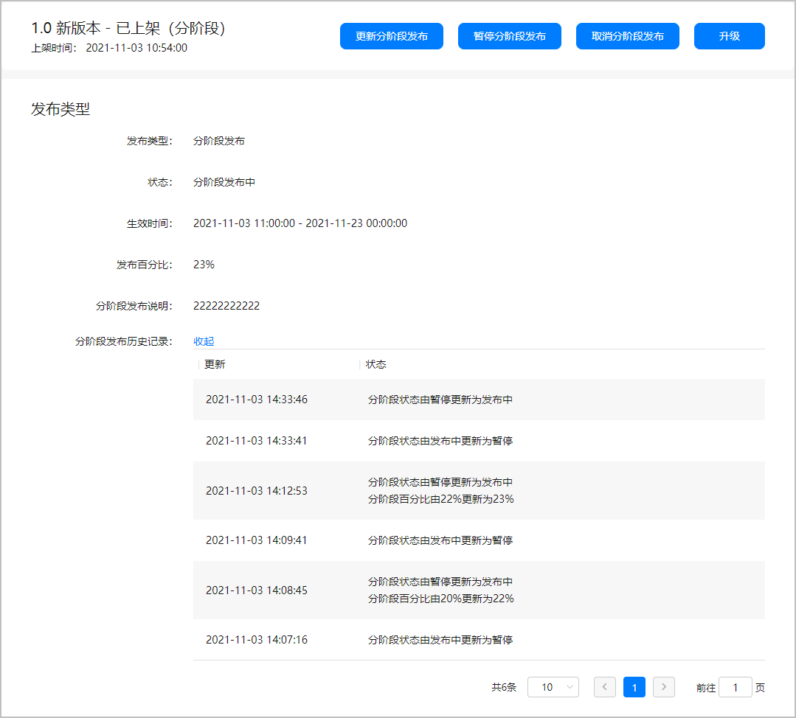

## 分阶段发布版本转全网版本

### 自动转全网版本

分阶段发布的生效周期结束后，将自动转全网发布版本。

### 手动转全网版本

点击“恢复分阶段发布”或“更新分阶段发布”，“发布类型”选择“全网发布”，即可将分阶段发布版本转为全网版本。

分阶段发布版本转为全网版本后，账号持有者、管理员和应用管理员会收到邮件和短信通知，海外开发者仅收到邮件通知。

## 升级分阶段发布版本

在分阶段发布版本页面中，您可以点击右上角的“升级”，进行分阶段版本的升级，请勿点击全网版本进行升级。“发布类型”区域下的信息填写与[提交分阶段发布申请](#section1252218167912)时一致。

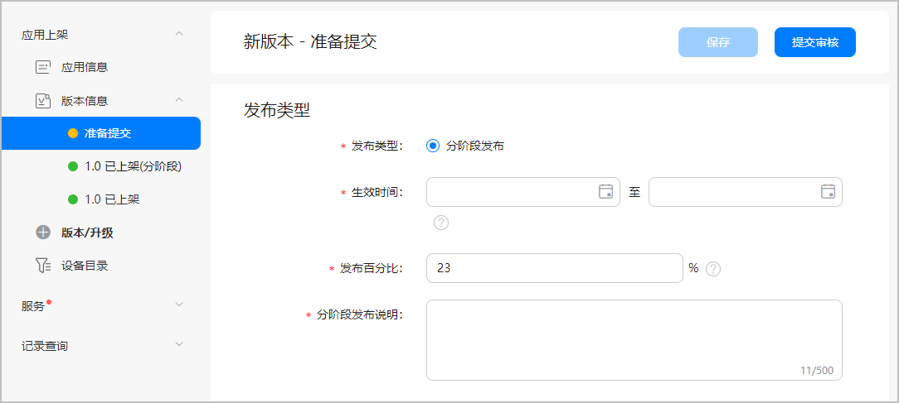

* 一个应用只能有一个在架的分阶段发布版本。
* “分阶段发布”版本只能升级为更高的“分阶段发布”版本。“全网发布”版本可以升级为更高的“分阶段发布”版本或“全网发布”版本。
* 如需升级全网版本，请先将当前在架的分阶段版本提前全网发布，或取消分阶段发布。

## 回退分阶段发布版本

分阶段发布版本不支持回退功能。

## 下架分阶段发布版本

* 取消分阶段发布后，分阶段发布版本会立即下架，无需人工审核。

* 全网版本下架审核通过后，分阶段发布版本也将随之下架。