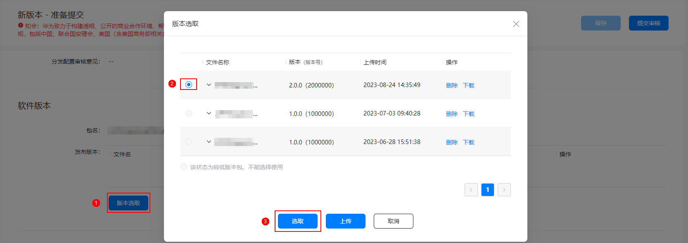

# 更新在架应用详情

若您想提升应用的下载转化率和市场曝光度，建议您时常更新在架应用详情。您无需更换软件包即可方便快捷地上传一套效果较好的新素材应用于全网。

若您的应用支持中、英等多个语种，更新应用图标/应用介绍截图/应用介绍内容时，请根据您的更新计划，先选择相应的语种，再对相应语种下的应用图标/应用介绍截图/应用介绍内容进行更新，否则会导致更新内容无法在您预期的语言模块下生效。

## 前提条件

* 必须存在一个在架版本的应用。
* 根据不同的更新方式，您需要提前准备对应的素材内容。

| 更新方式 | 更新方式说明 | 您需准备的素材内容 |
| --- | --- | --- |
| [更新应用基本信息](#section142661753185214) | 您无需更换软件包，通过升级同版本的方式即可更新应用的基本信息。升级审核通过后，应用详情更新成功。 | * 兼容设备。 * 可本地化基础信息：语言、应用名称、应用介绍、应用一句话简介、新版本特性、应用图标、应用截图和视频。 * 应用分类。 * 开发者服务信息：官网。 |
| [仅更新应用素材](#section14907119115411) | 通过素材更新实验，您可在不升级版本的情况下更新全网在架版本的应用素材。审核通过后，新素材立即生效上架，或手动发布上架。  说明：  * 您需提前向华为运营人员发送申请邮件，申请使用素材管理功能，详情请参见[申请使用服务](`https://developer.huawei.com/consumer/cn/doc/development/AppGallery-connect-Guides/agc-materialmanage-applywhitelist-0000001128107381`)。 * 仅APK、RPK软件包类型支持仅更新应用素材。 | 素材更新实验仅支持如下素材内容的更新：   * 应用介绍 * 应用一句话简介 * 应用图标 * 应用介绍截图 * 应用介绍视频 |

## 更新应用基本信息

已全网上架的应用支持以同版本更新的方式升级。采用此升级方式，您可以仅修改应用详情，无需更新软件包。

若在架应用的扩展文件发生变化时，不支持同版本更新，您必须上传新的APK软件包。

1. 登录[AppGallery Connect](`https://developer.huawei.com/consumer/cn/service/josp/agc/index.html`)，点击“APP与元服务”。
2. 在应用列表中选择待更新的应用，进入应用详情页。
3. 在“版本信息”页面的右上角点击“升级”，左侧导航栏新增“新版本 - 准备提交”页面。

   

4. 点击左侧导航栏“应用信息”，更新应用详情，详见[配置应用信息](`https://developer.huawei.com/consumer/cn/doc/app/agc-help-harmonyos-releaseapp-non-next-0000002179322402#section242410559206`)。完成后点击“下一步”，系统进入“新版本 - 准备提交”页面。

   

5. 在右侧“软件版本”下点击“版本选取”（若为Android应用，则点击“软件包管理”），直接选择当前在架软件包，点击“选取”。

   

   此处务必选择在架软件包，如果选择上传与在架不同的软件包，即使versionCode没有变化也不支持同版本升级，必须[升级应用版本](`https://developer.huawei.com/consumer/cn/doc/app/game-center-upgrade-version-0000001194325288#section166011045192419`)。

   

6. 更新发布国家或地区、可本地化基础信息（应用介绍、一句话简介、新版本特性、素材）、付费情况等其它应用版本信息，详见[配置版本信息](`https://developer.huawei.com/consumer/cn/doc/app/agc-help-harmonyos-releaseapp-non-next-0000002179322402#section4997848103814`)。
7. 应用版本信息更新完成后，点击右上角“提交审核”，系统提示当前版本提交软件包versionCode与在架版本versionCode相同，点击“确认”。

   

提交成功后，应用状态更新为“正在审核”，版本号不变。审核通过后，应用详情更新成功，用户在华为应用市场将看到最新的应用详情信息。

## 仅更新应用素材

已上架应用通过创建素材更新实验可以更新应用素材，详情请参见[素材更新](`https://developer.huawei.com/consumer/cn/doc/development/AppGallery-connect-Guides/agc-materialupdate-procedure-0000001177572613`)。