# 升级应用版本

应用上架后，如果您需要修改应用的分发国家、修改软件包、发布开放式测试版本等，需在AppGallery Connect中提交新版本给华为进行审核。审核通过后，用户将在华为应用市场搜索到最新的应用版本。

## 操作流程

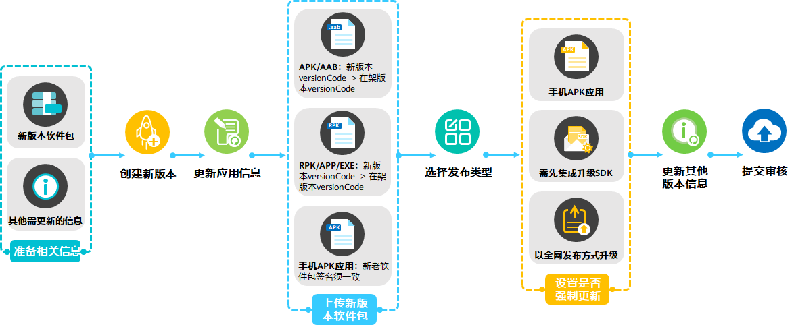

## 前提条件

您已准备好需要更新的材料或信息，例如新版本软件包、新应用素材等。

## 创建新版本

在AGC提交版本升级申请前，请先创建新版本。

1. 登录[AppGallery Connect](https://developer.huawei.com/consumer/cn/service/josp/agc/index.html)，选择“APP与元服务”。
2. 在应用列表中点击待升级的应用“状态”链接，系统进入该版本的“版本信息”页面。
3. 点击右上角“升级”，左侧导航栏新增“新版本 - 准备提交”页面。

   

   如果存在最后一个版本未完成上架，可能“升级”按钮不存在，同时左侧“版本/升级”菜单置灰，不可点击。

   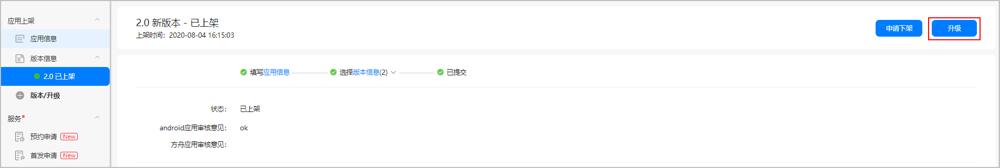

## 更新应用信息

如需修改应用信息，点击左侧导航栏“应用信息”进行编辑，详见[配置应用信息](https://developer.huawei.com/consumer/cn/doc/app/agc-help-harmonyos-releaseapp-non-next-0000002179322402#section242410559206)。完成后点击“下一步”，进入“新版本 - 准备提交”页面。

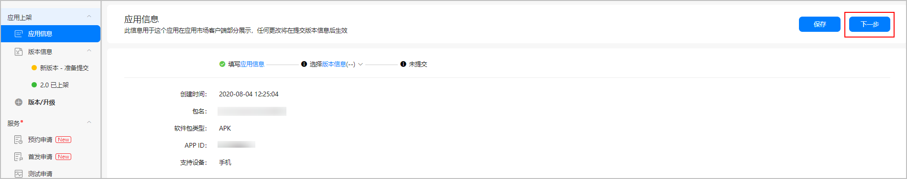

## 上传新版本软件包

在“新版本 - 准备提交”页面的“软件版本”栏点击“版本选取”（若为Android应用，则点击“软件包管理”），在弹出的软件包选取窗口点击“上传”，上传本地软件包。

| 软件包类型 | 升级要求 |
| --- | --- |
| APK | * 请确保您上传的软件包versionCode不低于当前在架版本的versionCode。 * 对于手机APK应用，新版本软件包签名必须与当前在架版本的软件包签名保持一致。 如果您上传的APK包签名和当前在架版本的APK包签名不一致，请参见[软件包签名不一致处理](#section15339193186)。 |
| RPK/APP/EXE | 请确保您上传的软件包versionCode不低于当前在架版本的versionCode。 |
| AAB | 不支持versionCode相同但软件包不同的升级。  * 如您无需更换软件包，请直接选择当前上架版本的软件包。 * 如您需要更换软件包，请确保您上传的软件包versionCode高于当前在架版本的versionCode，否则将上传失败。 |

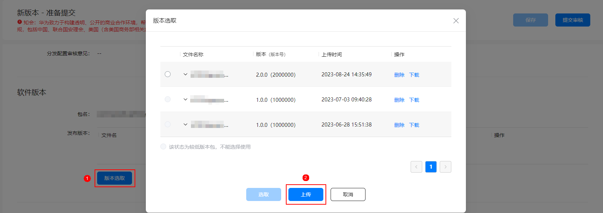

## 选择发布类型

如当前上架版本为全网发布，本次升级您可选择全网发布或分阶段发布。

* 如您选择全网发布，设置“发布类型”为“全网发布”。
* 如您选择分阶段发布，设置“发布类型”为“分阶段发布"，然后填写相关参数，具体参见[分阶段发布应用](/docs/distribute/app-dist/game-center/game-center-update-0000001239645255/game-center-stage-releasing-0000001194485288#ZH-CN_TOPIC_0000001194485288)。

## 设置是否强制更新

对于发布到手机设备的APK应用，您还可开启强制更新功能。开启后，用户必须升级才能进入应用。

* 集成升级应用的SDK后，该功能才生效。非游戏应用可参考[应用升级SDK帮助文档](https://developer.huawei.com/consumer/cn/doc/AppGallery-connect-Guides/appgallerykit-app-update-0000001055118286)，游戏应用可参考[游戏升级SDK帮助文档](https://developer.huawei.com/consumer/cn/doc/AppGallery-connect-Guides/appgallerykit-game-update-0000001055756860)。
* 分阶段发布不支持强制更新，此选项不生效。

## 更新其他版本信息

如需更新其他版本信息，请参考[发布应用](https://developer.huawei.com/consumer/cn/doc/app/agc-help-release-overview-0000001272395372)下对应应用类型的发布指导。

在架应用不支持更改付费情况。如您想更改应用的付费情况，需下架并删除已上架应用，在重新发布应用时设置付费情况。

## 提交审核

所有信息确认无误后，点击右上角“提交审核”。

* 如系统弹出如下提示，确认软件包版本号无误后，点击“确认”。

  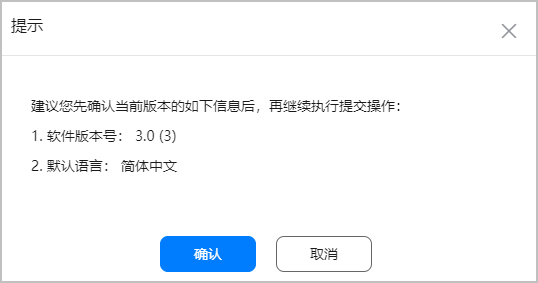
* 如系统弹出如下提示，表示您上传的软件包versionCode与当前在架版本的versionCode相同。

  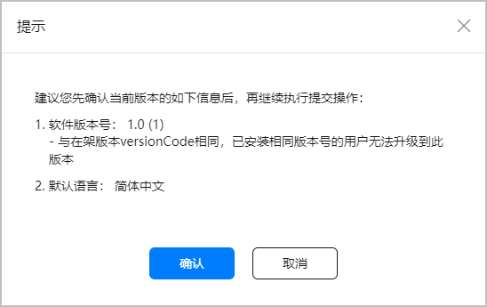
  + 如您确认不更改versionCode，点击“确认”即可。但需注意，如果新版本软件包的versionCode和当前在架版本的versionCode相同，已安装相同版本号的用户将无法升级到此版本，华为应用市场客户端显示的版本更新日期保持不变，依旧为在架版本的发布日期。
  + 如果发现versionCode错误，点击“取消”，重新上传正确的软件包。

提交成功后，应用状态更新为“正在审核”。审核通过后，应用升级成功。

## 软件包签名不一致处理方法

通过分阶段发布的应用在转为全网发布前，系统校验应用签名时以全网在架应用版本签名为准。

### Android应用

对于手机APK应用，当您在“软件包管理”窗口点击“选取”选择上传的软件包时，系统会即时校验签名是否一致。如果您更新的软件包签名和当前在架版本的软件包签名不一致，您可参考以下情况采取相应措施：

* 若您发布的应用为游戏应用，在弹出的提示框中点击“确定”后，返回“软件包管理”窗口。此时，您需要重新上传与在架版本签名一致的应用版本。

  若您无法获取在架版本签名，请根据应用分发地选择不同渠道进行反馈。
  + 游戏应用分发地为中国大陆地区时，请进入[互动中心](https://developer.huawei.com/consumer/cn/doc/app/agc-help-interaction-center-0000001146518763)反馈。

    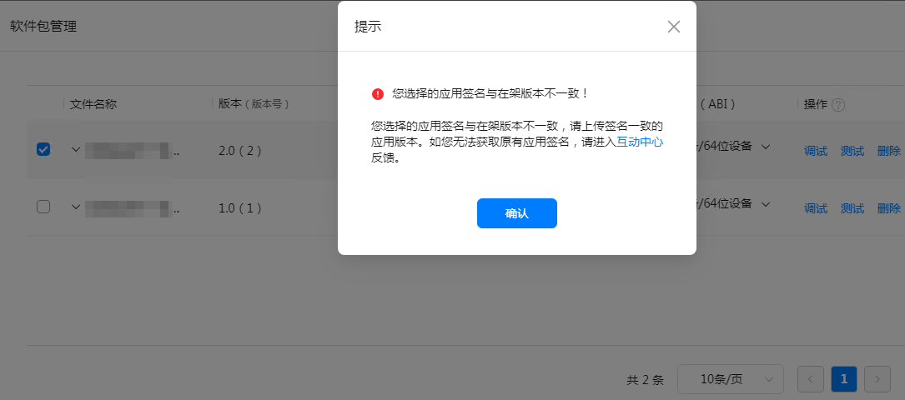
  + 游戏应用分发地为中国大陆以外地区时，请发送邮件至gamesupport@huawei.com反馈。

    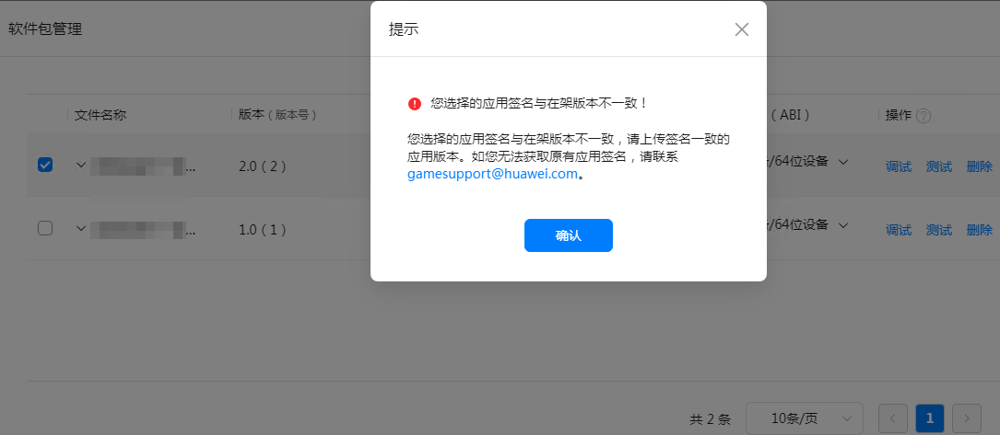
* 若您发布的应用为普通应用，会弹出下方的提示框。您需要根据实际情况，做出相应选择。
  + 如您打包时使用了错误的签名，或上传了错误的应用版本时，选择第一个选项，点击“确认”即可删除该应用包并返回“软件包管理”窗口。此时，您必须重新上传与在架版本签名一致的应用版本。

    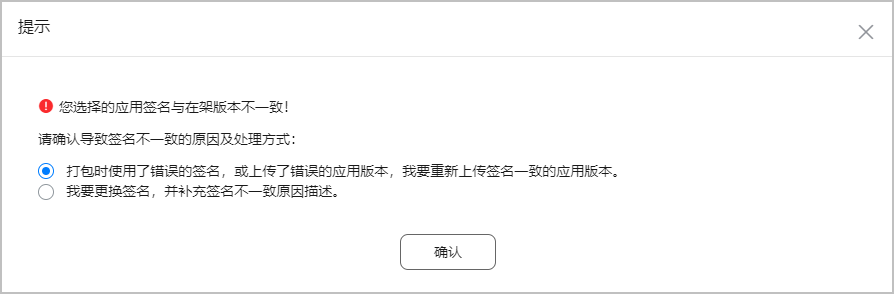
  + 如您需要更换应用签名，选择第二个选项。此时，请根据提示框内容填写签名不一致原因并勾选免责声明，提示框内的所有项均为必填项。填写完成后，点击“提交”。

    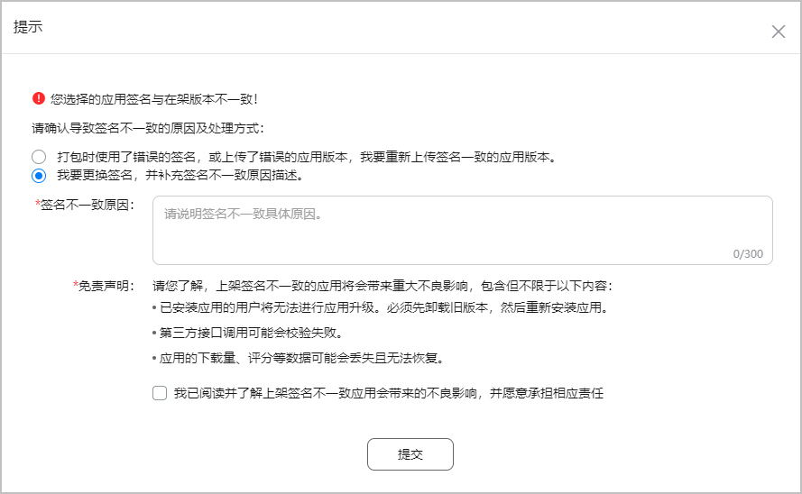

### HarmonyOS应用/元服务

对于HarmonyOS应用/元服务，当您在“版本选取”窗口选择上传的软件包并点击“提交审核”后，系统会即时校验开发者签名是否一致。若您当前提交审核的软件包的开发者签名与当前在架版本的开发者签名不一致，会弹出下方的提示框，您可根据实际情况进行选择：

若提交审核的版本基于全网在架版本升级，则和全网在架版本的签名进行比较。若提交审核的版本基于在架状态的开放式测试版本升级，则和在架状态的开放式测试版本的签名进行比较。

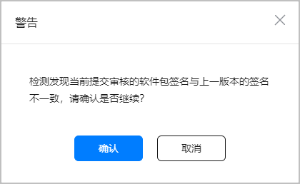

* 若您因密钥丢失等情况需要更换应用签名，请点击“确认”继续提交版本审核。
* 若您因使用了错误的签名，或者上传了错误的软件包而导致签名不一致，可点击“取消”或者关闭提示框，返回到“版本选取”窗口点击“上传”重新上传与当前在架版本签名一致的软件包。