# 有声内容接入

## 1.概述

有声内容接入是指用户将自己的有声内容发布到华为音乐的过程。

## 2.接入方式

有声内容的接入方式分为两种：

（1）在线上传。

（2）批量导入。批量导入每次上传的节目数量多，但是信息填写难度较高，请认真阅读表格中的提示。

## 3.在线上传

（1）新增专辑

点击“在线上传”进入新增界面。

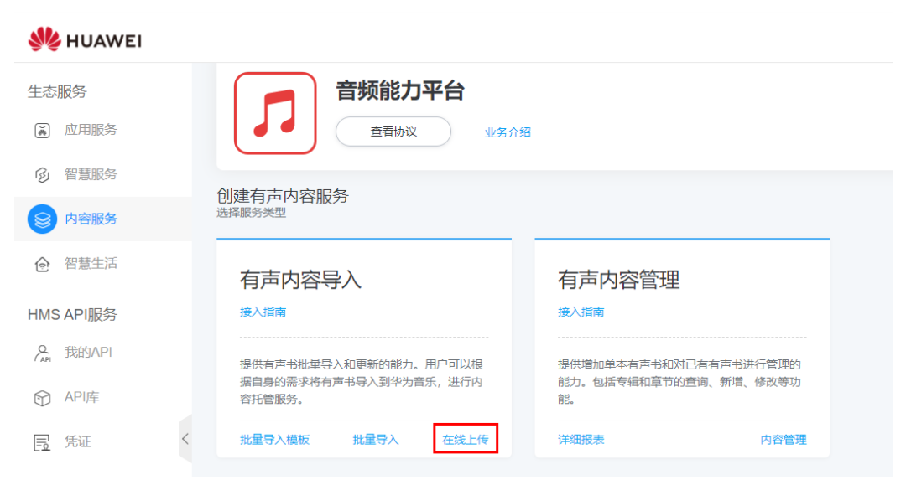

点击“新增专辑”按照提示规则填写各项信息后点击“保存”。

说明：需要按照要求正确填写信息，信息填写有误不能点击“保存”，或者保存失败。

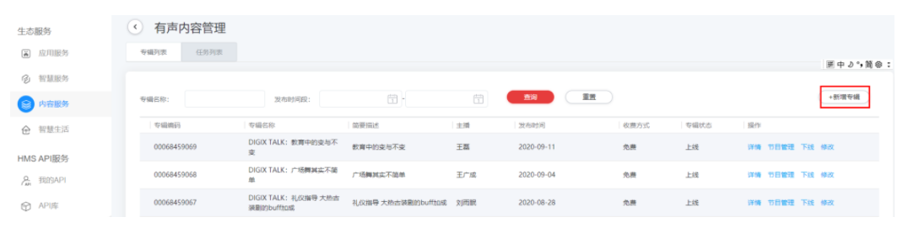

（2）新增节目

点击“节目管理”进入新增节目界面。

说明：只有新增专辑过后才能新增节目。当专辑处于“下线”状态时，不能进行新增节目操作。只有“上线”状态专辑下才能新增节目。

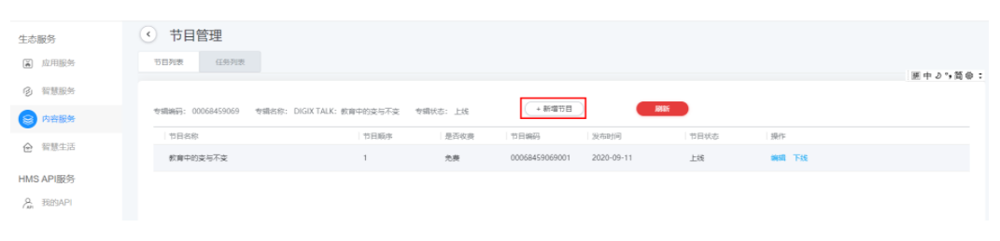

点击“新增节目”。需要认真阅读提示文字，每次最大支持选择20个节目。

说明：节目选择完成之后，可以根据需要修改对应的排序。确认无误之后点击“确认上传”。上传过程中不允许修改，上传结束后观察上传结果。依据提示进行操作。

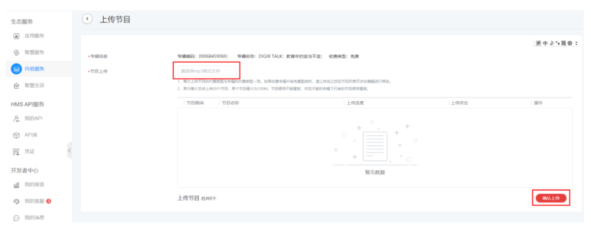

## 4.批量导入

1、下载导入模板

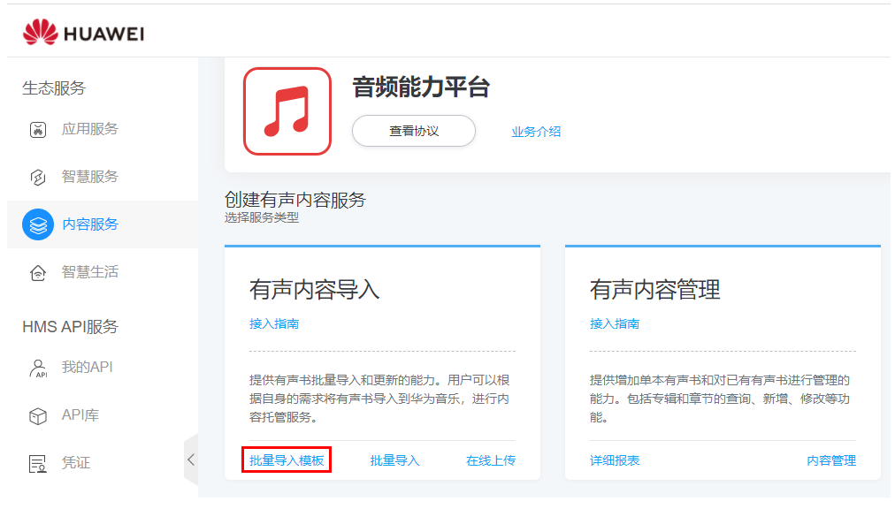

2、填写模板

将下载的“批量导入模板”进行解压缩。删除其中图片、音频样例文件。放入需要导入的音频、图片文件。打开“有声读物导入模板.xlsx”，保留其中的第一行和第二行，从第三行开始新增专辑和章节信息数据。填写之前请仔细阅读填写要求（黄色底纹内容），以免填写错误。

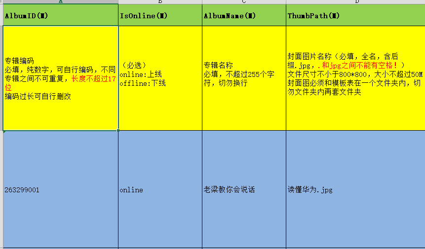

填写要点：

Excel里有3个sheet，前2个分别填写本次导入的所有专辑信息（简称Album表）和专辑对应每一集（简称Program表）的信息，sheet 3为可选取的标签信息（标签非必填，可在上传完成后再选择）

Album表填写重点：

大部分字段含义已在表中说明，以下为部分【注意事项】供您参考：

AlbumID专辑编码：每个编码必须是唯一的，不同专辑之间不能相同。

ThumbPath专辑图片路径：文件名和填入模板的内容保持一致，且必须加上后缀名（即.jpg），勿包含空格；尺寸上不低于800\*800，单个文件大小不超过50M。

Description描述：即展示在专辑详情页里的介绍，目前暂不支持富文本，只能填写纯文本。

Summary：即一句话介绍，不超过20字。

ReleaseTime发布时间：即填表日期。

Tags标签：用于app大数据推荐，请参考sheet 3里的说明填写，非必填，可上传后再添加，越精细越有利于推荐给目标用户。

Program表填写重点：

大部分字段含义已在表中说明，以下为部分【注意事项】供您参考：

AlbumID专辑编码：即Album表中的首列内容，必须与其保持一致。

ProgramID节目编码：以“对应专辑编码+001/002/003”格式填写，以此类推，该专辑里有多少集就相应编号，到下一张专辑以相同规则重新编号。

OrderID节目顺序：即按照专辑内容排序为1、2、3…以此类推。

ReleaseTime发布时间：与Album表的发布时间保持一致。

RilePath文件路径：即这一集对应的音频源文件路径，必须包括后缀名（即.mp3），切勿包含空格。

3、压缩文件

模板填写完毕，删掉所有示例内容，将自己的音频文件、图片文件、有声读物导入模板.xlsx文件一起打包（文件夹内切勿再包括其他文件夹）成以.zip格式结尾的压缩包。

4、导入文件

点击“批量导入”，进入上传界面。

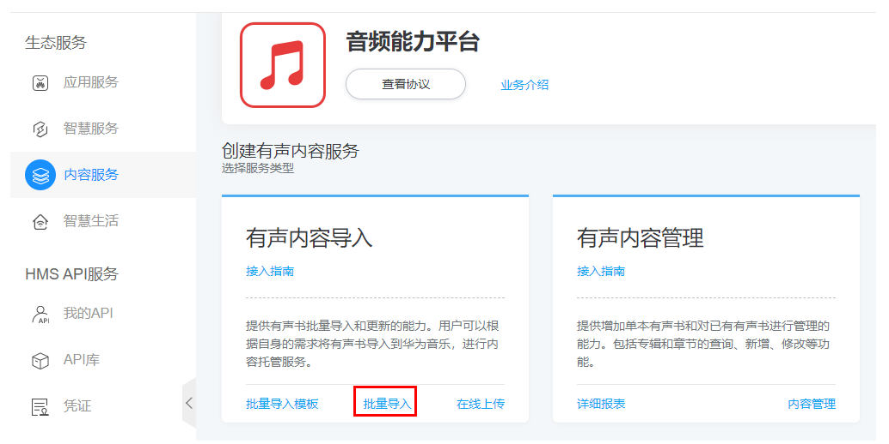

选中以.zip为结尾待发布的压缩文件，点击“确认上传”。

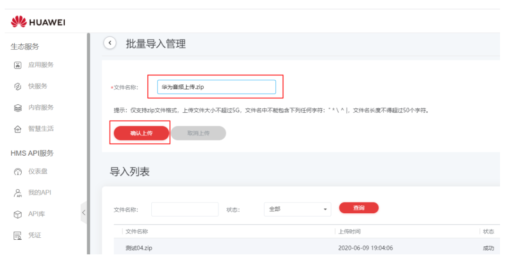

5、查询导入结果

上传完成之后，可在下方导入列表点击“查询”，确认导入结果。

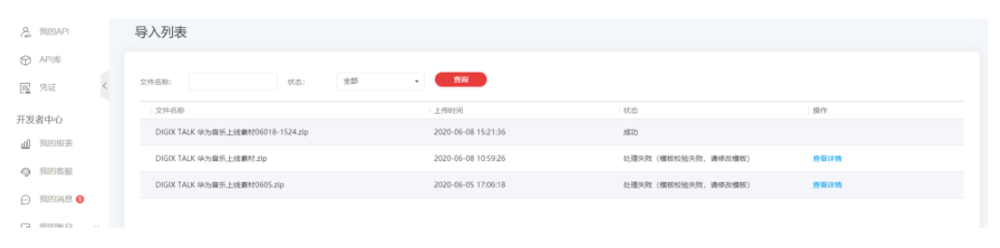

处理结果有五种状态：

成功：表示导入成功，可以在“有声内容管理”中查看具体内容。

处理中：表示系统在处理压缩包，需要等待处理完成。

上传失败：表示压缩包在上传的过程中出现问题，需要重新上传。

取消上传：表示压缩包上传的过程中主动中断上传过程。

处理失败：表示压缩包内文件不符合要求，需要重新处理后再上传。

如果显示成功既可以到“内容管理”中查看到导入的专辑信息。

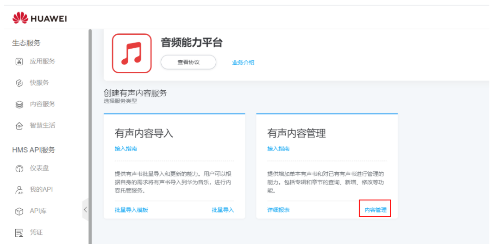

6、（可选）错误处理

当查询结果发现处理失败时，可点击“查看详情”看到处理失败的原因。依据提示修改模板中的问题，然后重新打包进行导入操作。

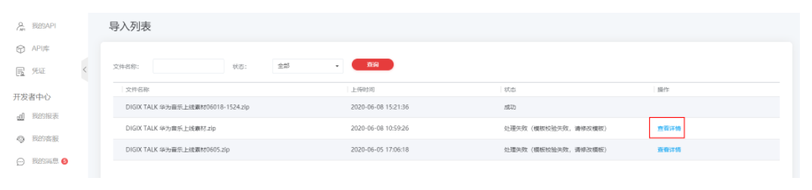