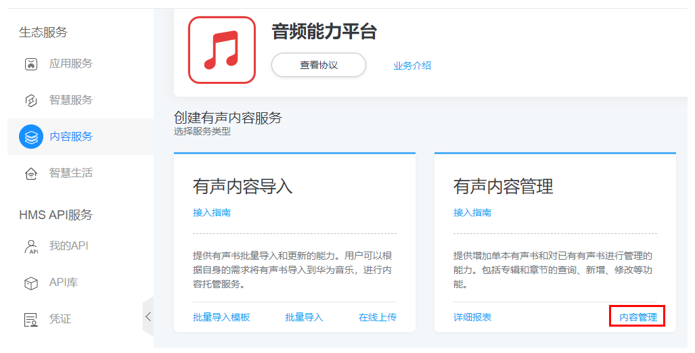
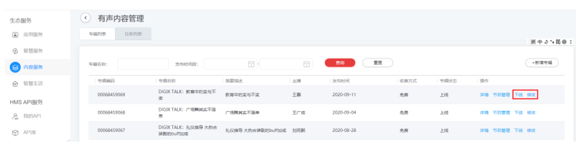
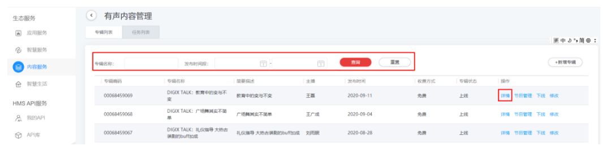
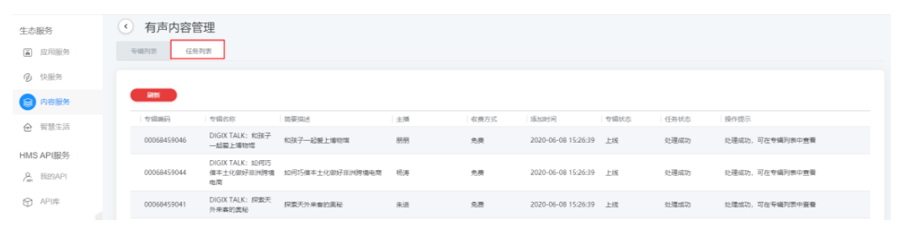
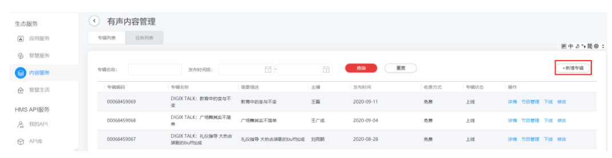

# 有声内容管理

## 1.概述

有声内容添加到音频能力平台上之后，可以对有声内容进行管理。支持的管理功能有：

（1）专辑的查询、新增、内容修改、上下线等。（2）节目的查询、新增、连载、内容修改、上下线等。

在业务界面点击“内容管理”，进入有声内容管理界面。

## 2.专辑管理

（1）查询专辑信息

支持全量专辑信息查询，也支持输入专辑名或发布时间进行条件查询。

点击“重置”可以对查询条件进行重置。

点击“详情”可以看到指定专辑的详细信息。

（2）查询操作记录

支持查询专辑处理过程的操作记录。处理过程记录的保存时间为1个月，1个月后自动清除。

任务列表记录各种操作的处理过程，依照操作时间先后进行排序。在任务列表中可以查看到每个操作的处理进展和处理结果。当导入专辑失败、新增修改专辑失败、新增修改章节失败时都可以在这个表中查看到失败原因。

（3）新增专辑

当有专辑需要新增的时候点击“新增专辑”。按照提示规则填写各项信息后点击“保存”。

（4）修改专辑

当需要修改专辑里面的信息时点击“修改”，能够对指定的专辑进行修改，包含上下线功能。也可以点击“上下线”来修改专辑的上下线状态。

## 3.节目管理

（1）查询专辑信息

支持全量专辑信息查询，也支持输入专辑名或发布时间进行条件查询。

点击“重置”可以对查询条件进行重置。

点击“详情”可以看到指定专辑的详细信息。

（2）查询操作记录

支持查询专辑处理过程的操作记录。处理过程记录的保存时间为1个月，1个月后自动清除。

任务列表记录各种操作的处理过程，依照操作时间先后进行排序。在任务列表中可以查看到每个操作的处理进展和处理结果。当导入专辑失败、新增修改专辑失败、新增修改章节失败时都可以在这个表中查看到失败原因。

（3）新增专辑

当有专辑需要新增的时候点击“新增专辑”。按照提示规则填写各项信息后点击“保存”。

（4）修改专辑

当需要修改专辑里面的信息时点击“修改”，能够对指定的专辑进行修改，包含上下线功能。也可以点击“上下线”来修改专辑的上下线状态。

