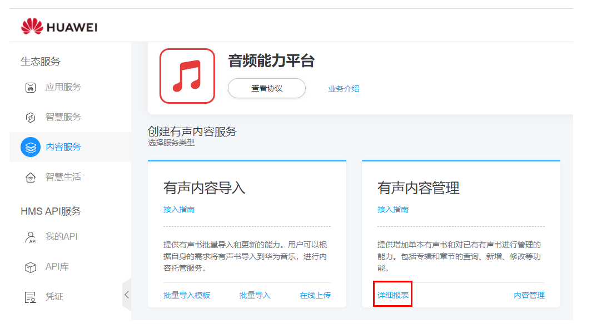
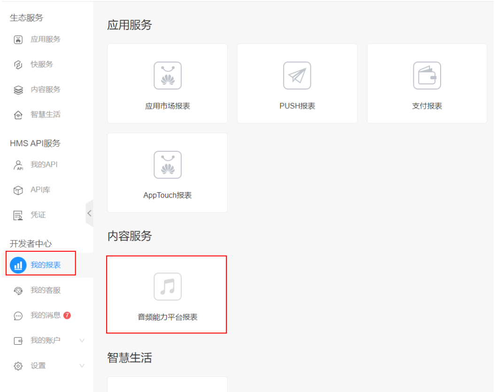
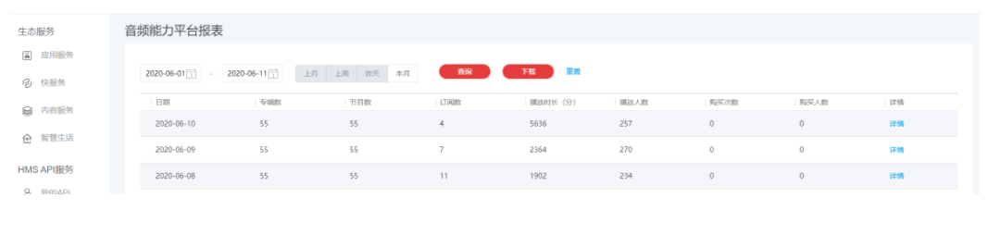
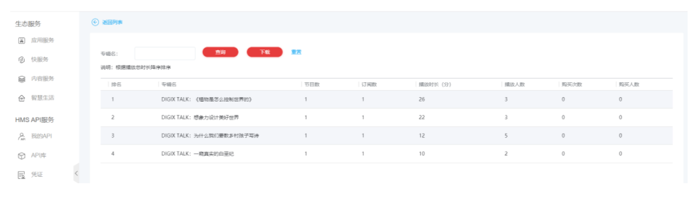

# 查看报表

## 1.概述

音频能平台支持查看有声内容的报表数据。您可以了解发布在音乐平台上的有声内容的运营情况。

## 2.报表入口

查看报表有两个入口。

（1）点击音频能力平台的主页面的“详细报表”。

（2）通过“我的报表”卡片进入。

## 3.每日报表

报表中展示了每日的播放数据。可以查询多个时间段内的数据，并支持数据下载。

## 4.详情

点击每日报表数据的“详情”，能够进行详情页。详情页可以查看到每个专辑详细数据，并支持数据下载。

