# 入驻指导

## 1.开发者联盟入驻指南

入驻华为音频能力平台需先注册华为开发者联盟帐号，详见[注册认证](https://developer.huawei.com/consumer/cn/doc/start/registration-and-verification-0000001053628148)。

## 2.音频能力平台入驻申请

入驻条件

需要和华为音乐进行合作的伙伴均可以申请入驻音频能力平台。

入驻方式

（1）注册开发者联盟帐号并完成实名认证，详见步骤1（注册指南）。

（2）登陆开发者联盟帐号后，点击右上角“管理中心“。

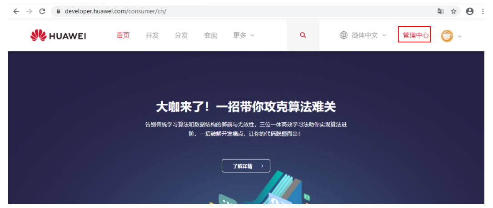

（3）点击左侧任务栏“内容服务”，单击进入“音频能力平台”。

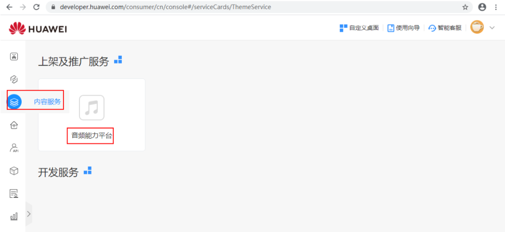

（可选）（4）添加“音频能力平台”卡片。

此步骤为可选步骤。在步骤（3）无法看到卡片的情况下使用。

点击自定义桌面

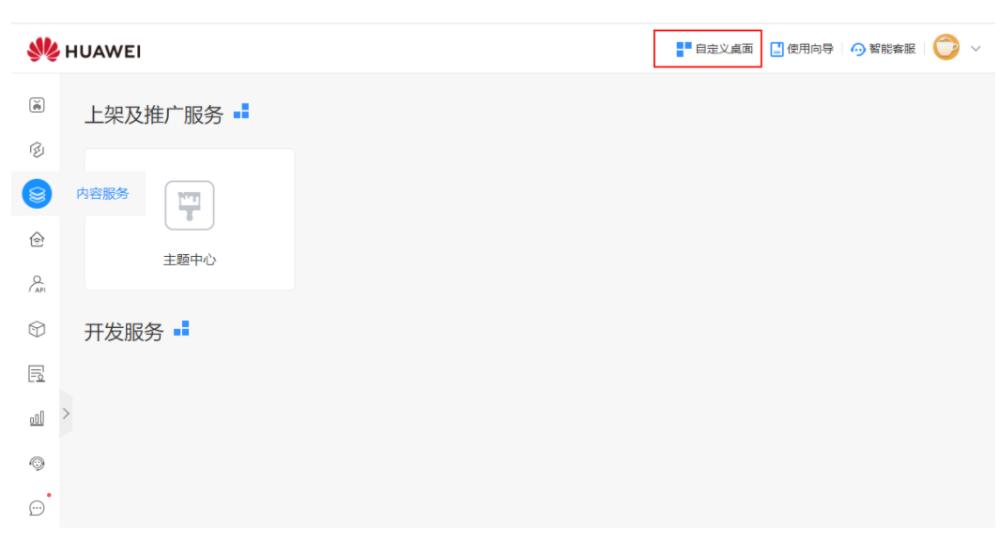

选择卡片并点击“关闭”。

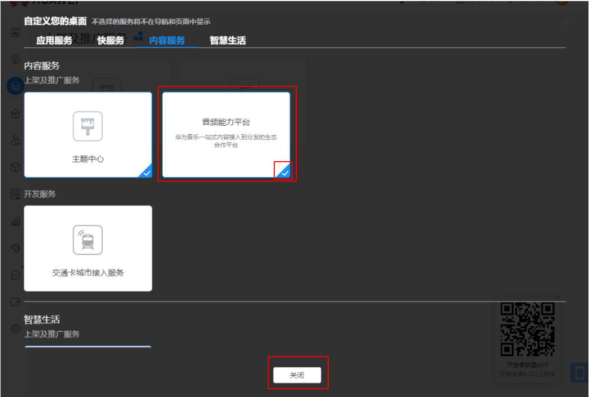

（5）申请入驻

没有入驻音频能力平台的合作伙伴，首次入驻需要联系15013685258或yimin.yang@huawei.com，申请入驻。入驻审批完成之后才能进行后续步骤。

如果您已经入驻，则没有此步骤。

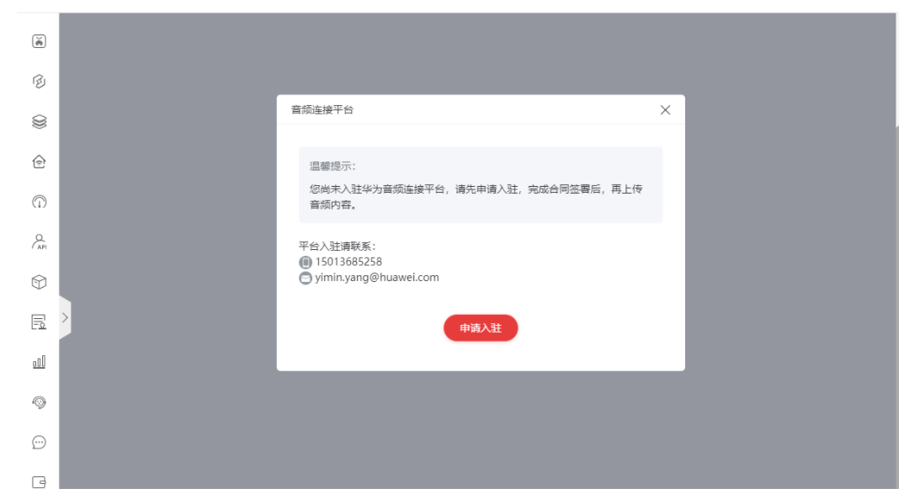

（6）商户服务信息填写

如果您没有填写商户服务信息则会看到此提示。如果您已经填写完成并审核通过，则没有此步骤。

商户服务信息的填写，详见开篇的步骤1（注册指南）。

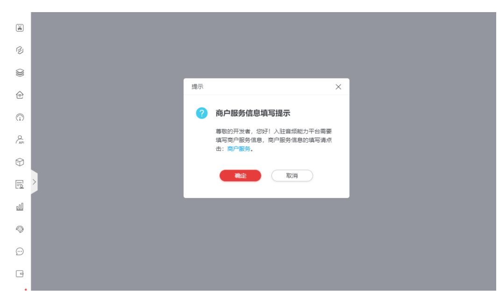

（7）商户服务协议签署

如果您没有签署商户服务协议则会看到此提示。如果您已经签署，则没有此步骤。

可以通过协议右侧滚动条查看协议详情，确认同意后签署协议。协议签署之后才能进行后续步骤。

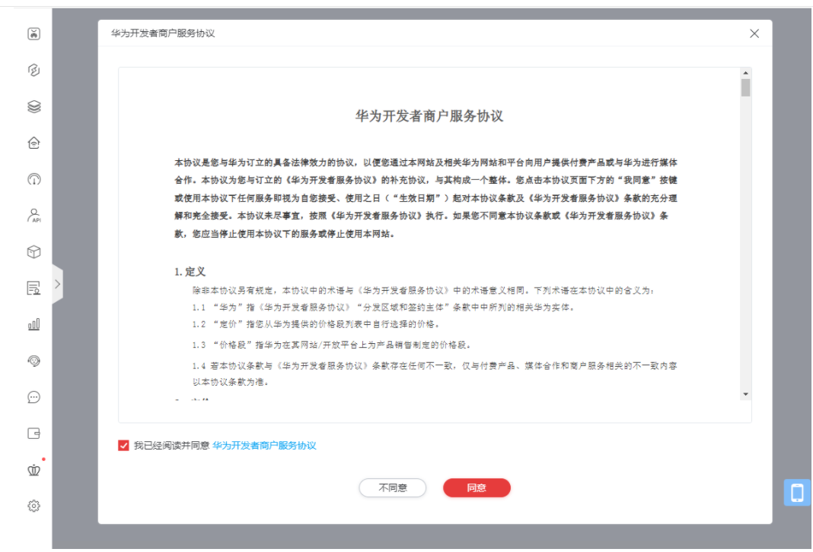

（8）进入音频能力平台的业务界面

完成上述操作之后即可以进入业务界面

有声书:

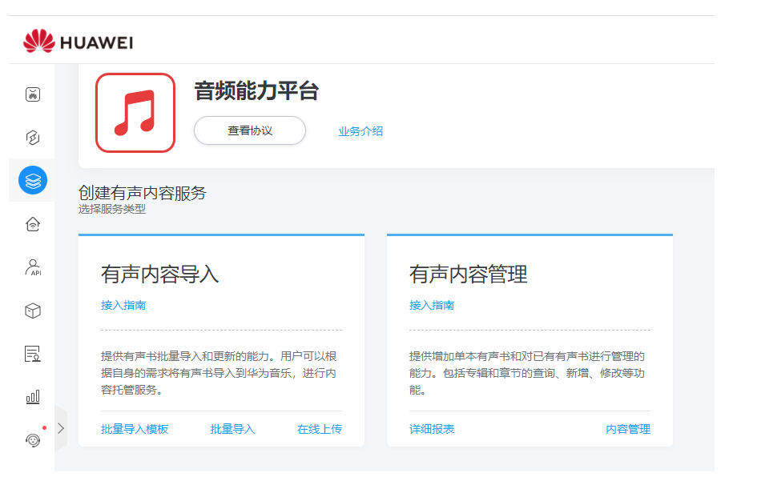

hifi:

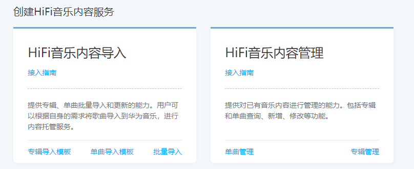

音乐内容:

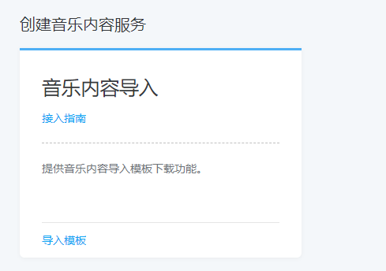

（9）进入音频能力平台的业务界面

如果您没有签署音乐内容合作协议则会看到此提示。如果您已经签署，则没有此步骤。

如果需要对应的功能，需要先签署协议。点击需要接入业务对应的卡片下的按钮，如下图。

有声书能力接入:

点击批量导入，在线上传，内容管理等按钮，弹出需要签约的协议内容

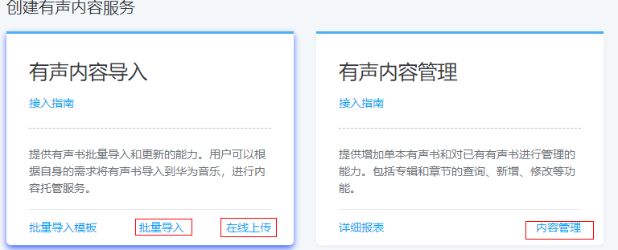

hires接入:

点击批量导入，单曲管理，专辑管理等按钮，弹出需要签约的协议内容

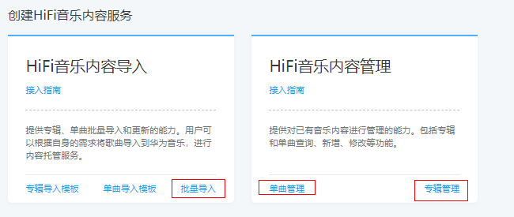

音乐接入：

点击导入模板按钮，弹出需要签约的协议内容

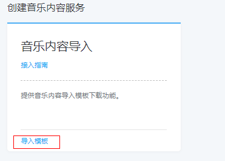

可以通过协议右侧滚动条查看协议详情，确认同意后签署协议。协议签署之后才能进行后续步骤。完成初次的入驻和协议签署之后，后续登录直接从管理中心进入业务界面，无需重复上述操作。

有声书：

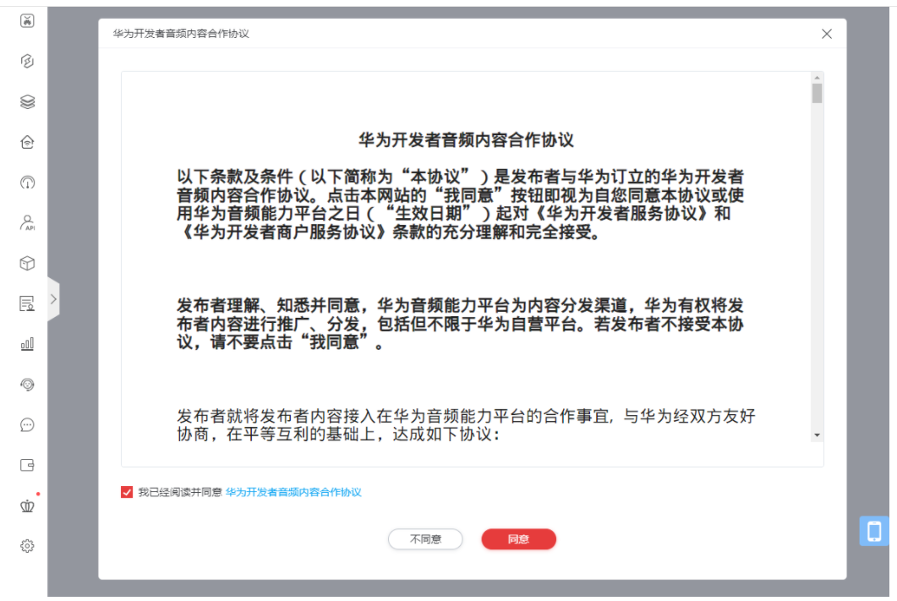

hifi：

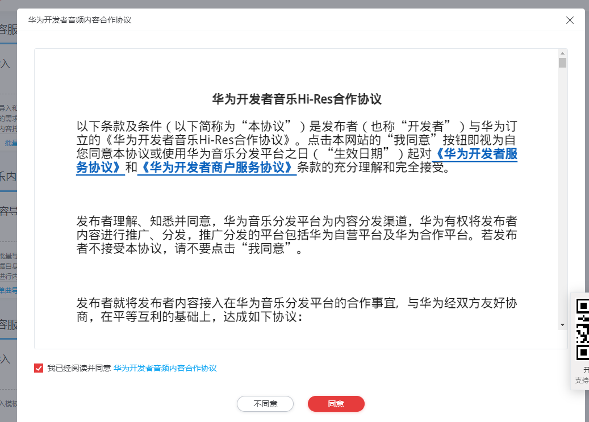

音乐接入：

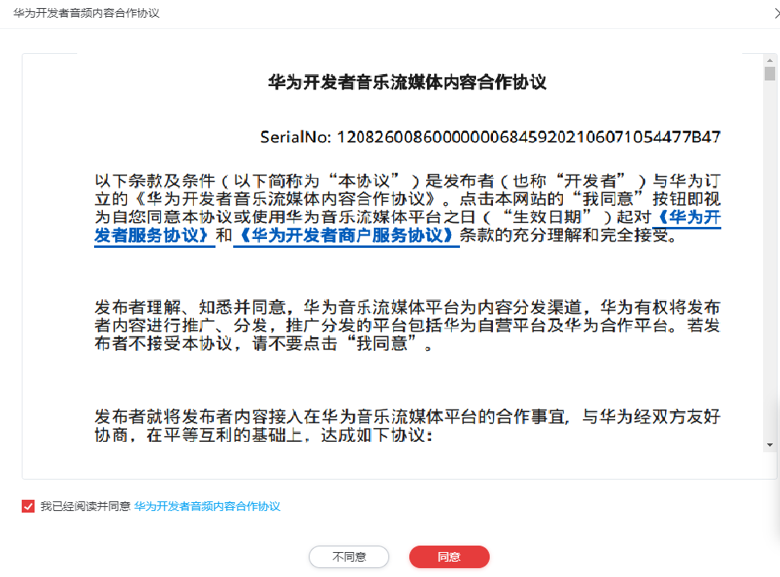

签约结束后，如果需要查看已经签约好的协议，可以点击上方查看协议的按钮

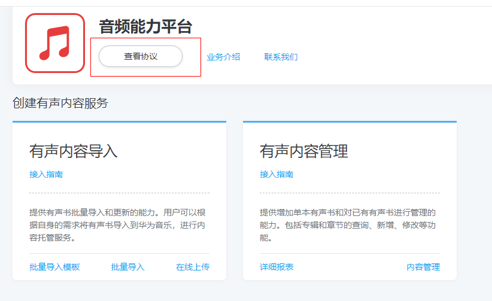

点击下载协议，下载对应的协议。

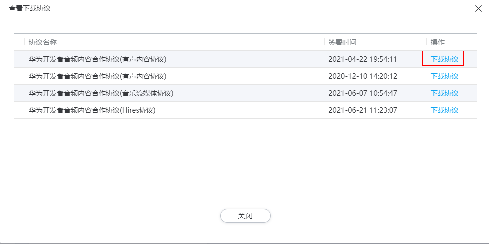