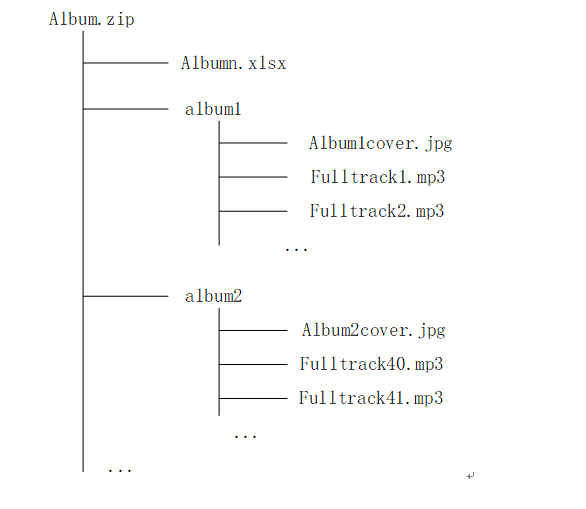
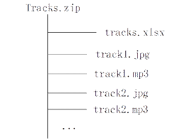
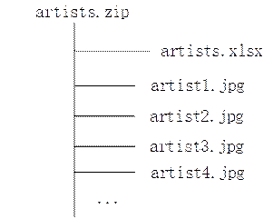
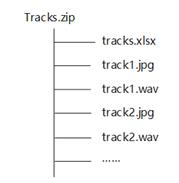

# 音乐内容技术要求

## <strong>一、音乐内容和资料的技术要求（非Hi-Res）</strong>

1. <strong>华为</strong>为<strong>许可人</strong>提供SFTP服务器信息，<strong>许可人</strong>须将<strong>内容</strong>及资料上传至<strong>华为</strong>SFTP服务器。
2. 文件应该包括三种：

   2.1包含专辑信息的ZIP 文件

   2.2包含音轨信息的ZIP文件

   2.3包含艺术家信息的ZIP文件（可选的）

3.具体描述专辑的ZIP 文件：

3.1专辑ZIP文件的示例路径：

3.2 专辑ZIP文件包括：

1)基于Field Definition Tracks in Batches模板（附件三）的，包含元数据表格的Excel文件；

2)若干媒体文件（一个媒体文件对应一条音轨）：

a)MP3格式的媒体文件参数应当符合以下要求：

|  |  |
| --- | --- |
| 参数 | HD 录入源 |
| 文件格式 | MP3 |
| 码率 | 320kbps |
| 采样率 | 44100KHZ |
| 声道 | 2 |

b)FLAC格式的媒体文件参数应当符合以下要求：

| 参数 | HD 录入源 |
| --- | --- |
| 文件格式 | FLAC |
| 码率 | &gt;= 640kbps |
| 采样率 | 44100KHZ |
| 声道 | 2 |

c)WAV格式的媒体文件参数应当符合以下要求：

| 参数 | HD 录入源 |
| --- | --- |
| 文件格式 | WAV |
| 码率 | &gt;= 640kbps |
| 采样率 | 44100KHZ |
| 声道 | 2 |

d)每张专辑的图片文件参数应当符合以下要求：

* 分辨率：1440\*1440，not less than 720\*720
* 格式：JPG

4.具体描述音轨的ZIP 文件：

4.1音轨ZIP文件的示例路径：

4.2音轨 ZIP 文件包括：

1)基于Field Definition Tracks in Batches模板（附件三）的，包含元数据表格的Excel文件；

2)若干媒体文件（一个媒体文件对应一条音轨）：

a)MP3格式的媒体文件参数应当符合以下要求：

|  |  |
| --- | --- |
| 参数 | HD 录入源 |
| 文件格式 | MP3 |
| 码率 | 320kbps |
| 采样率 | 44100KHZ |
| 声道 | 2 |

b)FLAC格式的媒体文件参数应当符合以下要求：

| 参数 | HD 录入源 |
| --- | --- |
| 文件格式 | FLAC |
| 码率 | 640kbps |
| 采样率 | 44100KHZ |
| 声道 | 2 |

c)WAV格式的媒体文件参数应当符合以下要求：

| 参数 | HD 录入源 |
| --- | --- |
| 文件格式 | WAV |
| 码率 | &gt;= 640kbps |
| 采样率 | 44100KHZ |
| 声道 | 2 |

d)每条音轨的图片文件参数应当符合以下要求：

* 分辨率：1440\*1440，not less than 720\*720
* 格式：JPG

5.具体描述艺术家的ZIP 文件：

5.1艺术家ZIP文件的示例路径：

5.2艺术家 ZIP 文件包括：

(1)基于Artists Initialization Information (Artist) 模板（附件四）的，包含元数据表格的Excel文件

(2)每位艺术家的图片文件参数应当符合以下要求：

a)分辨率：1440\*1440，not less than 720\*720

b)格式：JPG

## <strong>二、音乐内容和资料的技术要求（Hi-Res）</strong>

<strong>1</strong> <strong>、</strong> <strong>Hi-Res</strong> <strong>音频技术要求：</strong>

1.1如果音频采样深度大于或等于24bit，则音频采样率不得低于44.1KHz，即44.1KHz/24bit及以上规格的音频。

1.2如果音频采样深度为16bit，则音频采样率不得低于96KHz，即96KHz/16bit 及以上规格的音频。具体要求请见日本电子信息技术产业协会发文：&lt;https://www.jas-audio.or.jp/hi-res/definition&gt;

<strong>2.内容和资料的技术要求：</strong>

2.1<strong>华为</strong>为<strong>许可人</strong>提供SFTP服务器信息，<strong>许可人</strong>应将介质上传至<strong>华为</strong>SFTP服务器。

2.2介质文件应该包括：导入音频信息的ZIP 文件。

2.3具体描述音频的ZIP 文件：

(1)音频ZIP文件的示例路径：

(2)音频文件，要求WAV格式。若无法提供wav,则提供flac格式；

(3)每个音频的图片文件参数应当符合以下要求：

a)分辨率：1440\*1440，不低于 720\*720

b)格式：JPG