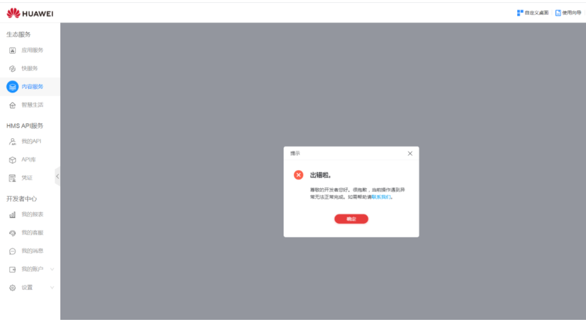
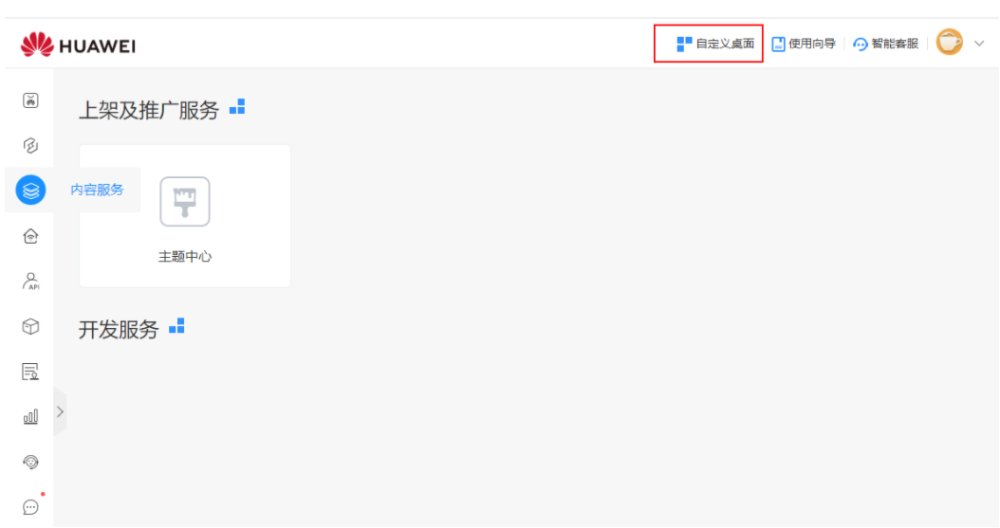
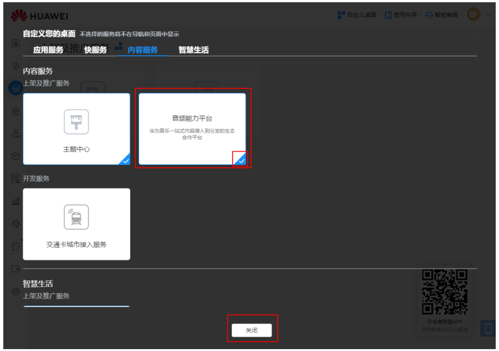
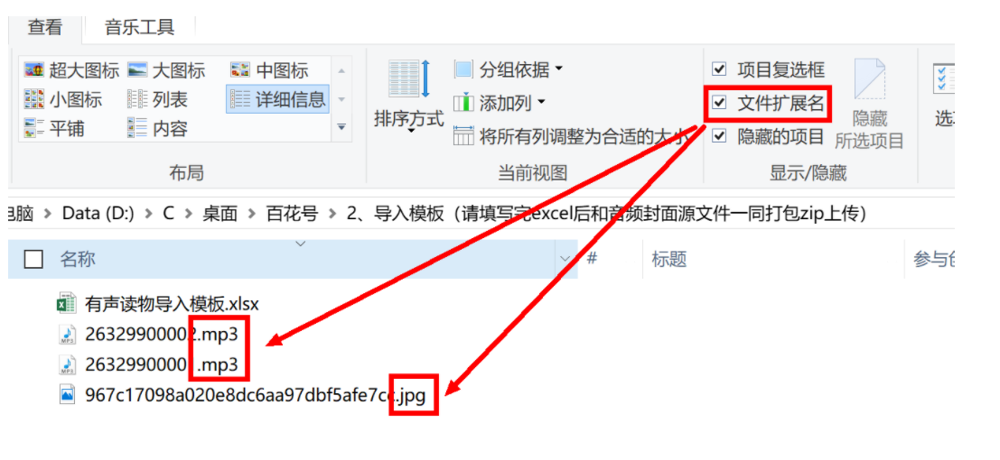

# FAQ

［问题一］为什么会出现“出错啦”的弹窗？

此错误信息弹窗为整个联盟的通用弹窗，一般是因为屏幕长期未操作而自动登出，可重新登录帐号，或换个浏览器尝试，若问题仍未解决，可联系您的华为服务顾问。

<strong>［问题二］我的后台看不到音频能力平台怎么办？</strong>

点击后台右上角的“自定义桌面”；在第3个页签“内容服务”下，就能找到“音频连接平台”，点击添加到桌面即可。

<strong>［问题三］专辑图片和音频源文件放置路径有什么要求？</strong>

专辑图片、音频源文件和excel模板必须打包为一个压缩包。其中图片和音频文件需要显示后缀名（操作方法：在文件夹菜单栏&gt;查看&gt;勾选“文件扩展名”即可）。

<strong>［问题四］之前已经下载过批量导入模板，可以直接使用吗？</strong>

音频链接平台每个版本的更新都会有新功能的引入，此时批量导入模板也会有变更。建议下载最新的批量导入模板使用，防止导入过程中出错。

<strong>［问题五］压缩包导入成功，在内容管理里面查询不到信息，是怎么回事？</strong>

导入成功只是音频接入的第一步。压缩包导入成功，在内容管理里面查询不到信息，通过以下步骤解决：

1. 在导入列表中查看已经导入的压缩包状态。如果显示上传失败，需要重新上传压缩包；如果显示处理中，请等待处理结果；如果显示处理失败，通过“查看详情”将对应的错误全部修改完成之后再重新上传压缩包。
2. 在内容管理的“任务列表”中查看任务状态。依据任务状态后面的“操作提示”进行处理。
3. 如果问题还未解决，请发邮件联系华为开发者联盟运营人员或者对接的运营人员。

<strong>［问题六］如何修改节目在专辑中的顺序？</strong>

专辑中的节目是按照编号进行排序，有正序和逆序两种方式。专辑中的节目顺序不能重复，如果重复就会报错。

* 新增节目时，按顺序增加序号即可。
* 插入节目时，需要先将插入点的后续节目顺序后移，将目标序号空出来才能插入新节目。
* 节目位置互换时，需要先将其中的一个节目序号改成不被占用的序号，然后再改回去。例如：A和B两个节目序号分别是1和2，当A和B需要互换时，可以先将A的序号改成3，再将B的序号改成1，最后将A的序号改成2。

<strong>［问题七］为啥导入列表和任务列表中的数据不见或变少了？</strong>

导入列表和任务列表是临时表，是对导入操作的辅助，用来记录导入过程。用户完成操作之后，临时表中的过期数据会被系统清除。数据的存储时间为1个月，超过1个月的数据不再显示。

<strong>［问题八］为啥页面中保存按钮是灰色的，不能进行点击操作？</strong>

页面中按钮为灰色表示页面没有进行变更，或者必须填写的元素没有全部正确填写。正确填写或者变更元素之后，保存按钮会自动变成红色，此时可以进行点击保存操作。

新增或者修改专辑、章节时，图片或者歌曲文件选择之后务必点击上传，否则按钮依然是灰色。

<strong>［问题九］编辑专辑有提示：“图片信息提示：图片已经存在”，编辑章节有提示：“音频信息提示：音频已经存在”是什么意思？</strong>

编辑专辑提示：“图片信息提示：图片已经存在”，表示曾经上传过该专辑的封面图片并存储在数据库中，如果重新上传图片上传成功之后会显示图片文件名。编辑章节提示：“音频信息提示：音频已经存在”，表示曾经上传过该章节的音频文件并存储在数据库中，如果重新上传音频上传成功之后会显示音频文件名。