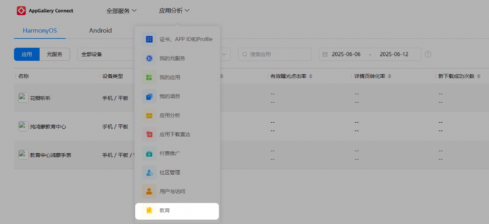
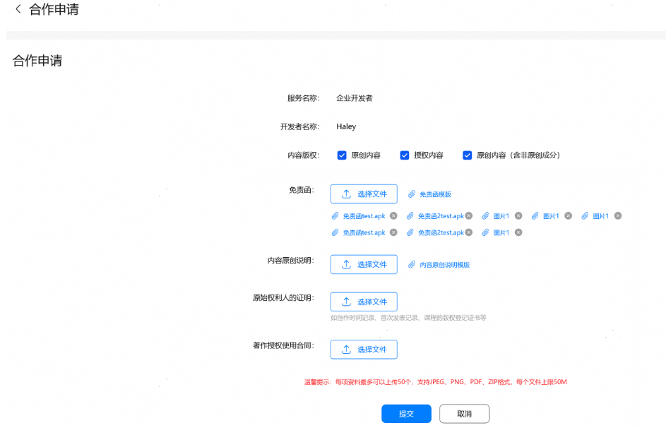
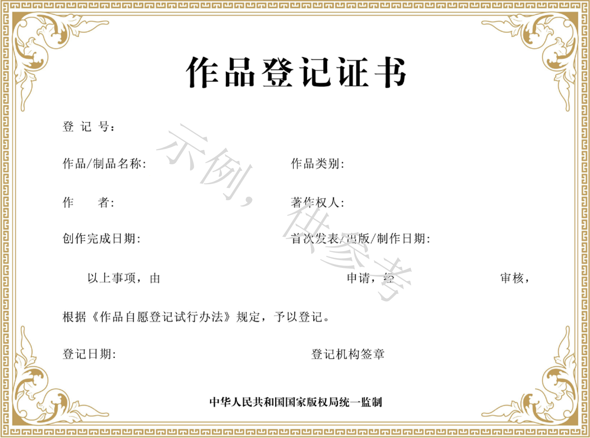
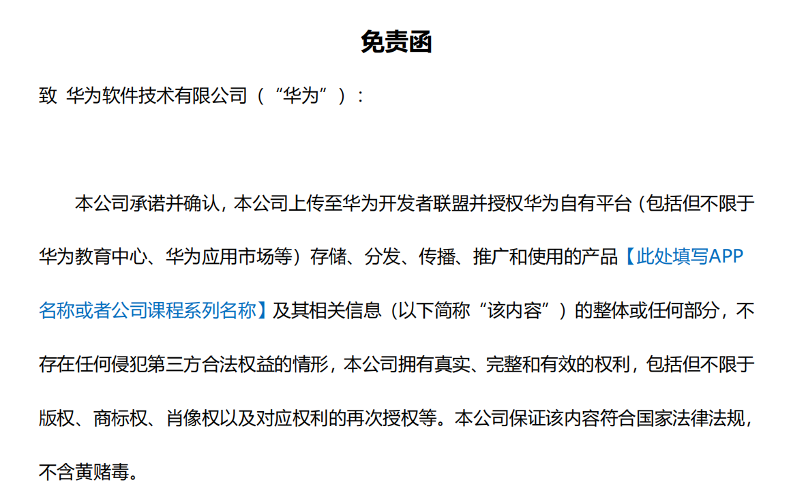
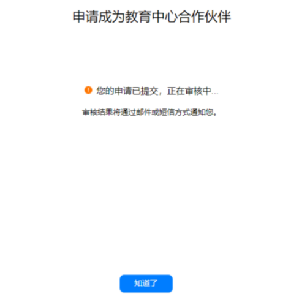
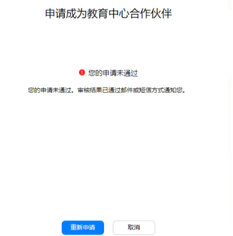
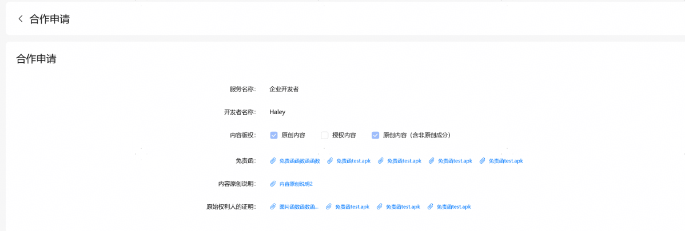

# 申请入驻教育中心

## 背景信息

[AppGallery Connect](https://developer.huawei.com/consumer/cn/service/josp/agc/index.html)对所有企业开发者展示“[教育](https://developer.huawei.com/consumer/cn/service/josp/educenter/index.html)”入口，企业开发者进入教育中心需要提交申请，审核通过后才可以使用教育中心内的功能。

个人开发者暂不开放“教育”入口，需要加入已申请教育中心权限的团队账号后，才可以使用教育中心的功能。根据您在团队帐号中的不同角色，您具备不同的权限，具体角色权限请参见[角色与权限](https://developer.huawei.com/consumer/cn/doc/distribution/app/agc-team_account_mgt#h1-1575967874303)。

推荐您使用谷歌浏览器访问教育中心管理页面。

## 前提条件

* 入驻华为教育中心前需先注册华为开发者联盟帐号并认证成为企业开发者，详见[注册认证](https://developer.huawei.com/consumer/cn/doc/start/registration-and-verification-0000001053628148)。
* 若您的课程或者套餐权益需要付费时，需要提前开通商户服务并签署华为商户服务协议，详见[开通商户服务](https://developer.huawei.com/consumer/cn/doc/start/merchant-service-0000001053025967)。
* 若您还未创建AGC项目，请参见[创建项目](https://developer.huawei.com/consumer/cn/doc/AppGallery-connect-Guides/agc-get-started-android-0000001058210705)创建您的AGC项目。

## 申请步骤

1. 首次进入教育中心会直接展示申请页面，请勾选“内容版权”并上传相关文件。

   

   | 名称 | 说明 |
   | --- | --- |
   | 内容版权 | 必选，默认不勾选，可多选，选项分为：  * 原创内容：当您的课程为原创内容时勾选，此时您需要上传课程的原始权利人证明文件、免责函和内容原创说明。 * 原创内容（含非原创成分）：当您的课程非原创或包含非原创部分时勾选，此时您需要上传课程的原始权利人的证明、《著作权许可使用合同》和《免责函》和《内容原创说明》。 * 授权内容：当您的课程为授权内容时勾选，此时您需要上传课程的《著作权许可使用合同》和免责函。 |

   相关文件说明：

   | 文件 | 说明 | 示例 |
   | --- | --- | --- |
   | 《原始权力人的证明》 | 如创作时间记录、首次发表记录、课程的版权登记证书等 |  |
   | 《著作权许可使用合同》 | 著作权许可使用合同是指作为许可人的著作权人与被许可人之间就作品使用的期间、地域、方式等而达成的协议。 | 著作权许可使用合同、转授权函或转授权合同电子版或截图均可。 |
   | 《免责函》 | 在申请入驻页面可下载免责函模板，在免责函蓝框处填写APP名称或者公司课程系列名称，并且附上实际上传的课程清单后签章。 |  |
2. 申请提交成功后，请等待审核结果。
   * 如果申请正在审核，显示如下界面，请耐心等待审核结果，最长3工作日内审结完毕。

     
   * 如果申请未通过，下次进入教育中心会显示未通过页面，您可以重新申请。

     
   * 申请通过后，您可以直接进入教育中心页面。

     

     进入教育中心前您需要根据页面提示签署《华为教育中心服务协议》。

     申请通过后若您需要更新申请信息，可以在“合作申请”菜单继续编辑申请信息重新提交申请。重新编辑提交后，申请处于审核状态或审核不通过状态时，点击“查看生效信息”可以查看已通过审核的信息。

     