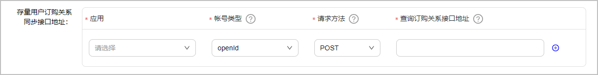
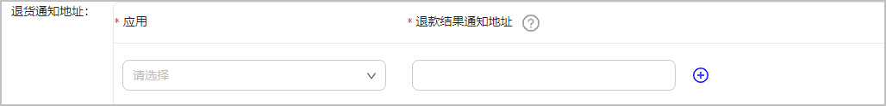
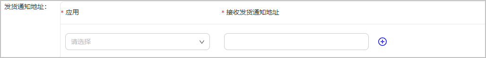

# 基础配置

## 配置存量用户订购关系同步接口地址

对于需要跳转到开发者应用学习的课程，为保证教育中心和已购买过课程的开发者侧存量用户之间订购关系的同步，防止购买过课程的存量用户二次购买，需要支持教育中心到开发者应用内查询用户存量订购关系。

添加存量用户订购关系同步接口地址信息：

| 参数 | 说明 |
| --- | --- |
| 应用 | 开发者名下应用，可选择此开发者名下所有已上架应用，支持下拉选择。 |
| 账号类型 | 用户账号类型，可选项为openId和unionId，支持下拉选择。 |
| 请求方法 | 请求method类型，可选GET或POST，新增配置默认选择POST。请确保类型正确，否则影响接口地址调用。 |
| 查询订购关系接口地址 | 必须为HTTPS开头，为保证教育中心和已购买过课程的开发者侧存量用户之间订购关系的同步，需要添加API订购查询接口，以保证用户体验。 |

## 配置退款通知地址

通过退款接口或者运营人工操作发起的退款，处理完毕后，通过退款通知地址告知开发者退款结果，告知开发者解除订购关系。

添加退款通知地址信息：

| 参数 | 说明 |
| --- | --- |
| 应用 | 开发者名下应用，可选择此开发者名下所有已上架应用，支持下拉选择。 |
| 退款通知地址 | 必须为HTTPS开头，如果课程不涉及跳转第三方应用，则无需填写此地址。 |

## 配置发货通知地址

商品购买成功后的通知发货地址，用户在教育中心直购课程后，由数字商品服务通过该地址通知开发者服务器发放对应的数字商品。

添加发货通知地址信息：

| 参数 | 说明 |
| --- | --- |
| 应用 | 开发者名下应用，可选择此开发者名下所有已上架应用，支持下拉选择。 |
| 接收发货通知地址 | 必须为HTTPS开头，如果课程不涉及跳转第三方应用，则无需填写此地址。 |

