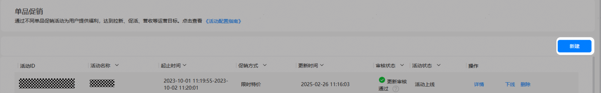
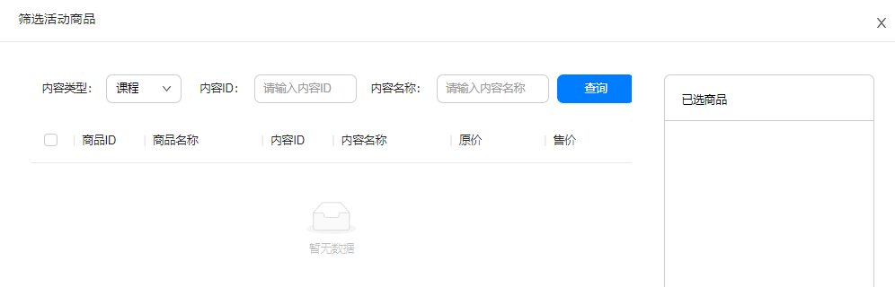
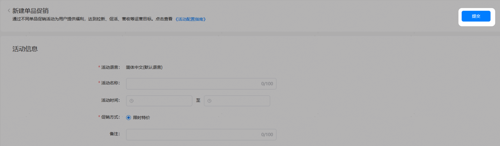
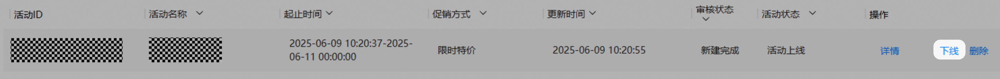
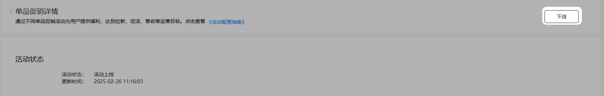
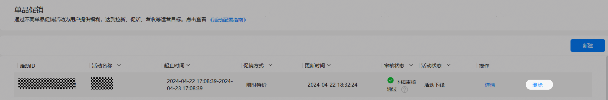
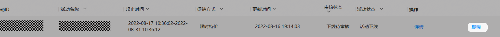

# 单品促销

您可以在AppGallery Connect创建单品促销活动，丰富您的课程售卖模式。通过促销活动为用户提供福利，提升用户留存。

## 新建/编辑促销活动

1. 登录[AppGallery Connect](https://developer.huawei.com/consumer/cn/service/josp/agc/index.html)，选择“教育”。
2. 选择“运营 &gt; 商品促销活动 &gt; 单品促销”，点击界面右侧的“新建”或点击促销活动后的“编辑”按钮。

   

   待审核状态，活动结束或活动下线促销活动不可编辑。

   

3. 在“新建单品促销”或者“编辑单品促销”页面，填写促销活动信息。

   | 参数 | 说明 |
   | --- | --- |
   | 活动语言 | 默认简体中文。 |
   | 活动名称 | 必填，定义的商品促销活动的活动名称，不能超过100个字。 |
   | 活动时间 | 必填项，创建的商品促销活动的活动时间，包含开始时间和结束时间，需要精确到时分秒。在编辑单品促销页面，活动开始后活动开始时间不可编辑。 |
   | 促销方式 | 必填项，开发者创建的商品促销活动的促销方式，  当前选项只有 “限时特价”，且默认选中。 |
   | 备注 | 非必填，商品促销活动的活动描述，不能超过300个字。 |
4. 添加商品。

   你可以选择点击“添加商品”也可以选择“批量导入”进行商品添加：

   * 点击“添加商品”后弹出以下页面，内容类型中您可以选择课程或套餐权益，默认展示课程。单击“查询”后默认展示您上传的所有状态为“课程上架”的付费课程。勾选商品并单击“确定”后勾选的商品会出现在当前页面的已选商品信息列表中。

     
   * 使用“批量导入”前您需要“下载导入模板”，按模板要求填写后，单击“批量导入”选择模板后完成导入。

     

     + 支持多次批量导入，如果商品信息列表中已有导入的商品，则导入失败。
     + 每次导入最多500条。

     模板参数：

     | 参数 | 说明 |
     | --- | --- |
     | APPID | 商品归属的应用ID。应用ID查询方法可参见[查询应用信息](https://developer.huawei.com/consumer/cn/doc/development/HMSCore-Guides/query-app-info-0000001050164344)，查询出信息后请在应用ID开头添加C。  例如：C100001 |
     | ProductId | 商品ID必须以大小写字母或数字开头，并且只能由大小写字母（A-Z,a-z）、数字（0-9）、下划线（\_）和句点（.）组成。  + 课程的商品ID请参考课程管理中[商品ID](/docs/distribute/content-dist/education-center/educenter-content-0000001145356855/educenter-cource-0000001050782860#ZH-CN_TOPIC_0000001223784215__p19573536123415)的配置，若没有商品ID，请配置为课程ID。 + 套餐权益的商品ID请参考套餐权益管理中[商品ID](/docs/distribute/content-dist/education-center/educenter-content-0000001145356855/educenter-package-0000001145436887#ZH-CN_TOPIC_0000001178462932__p15161234155812)的配置。 |

   商品添加成功后，所有商品信息会展示在商品信息列表中，请核对商品信息，并按要求填写促销价：

   | 参数 | 说明 |
   | --- | --- |
   | 商品ID | 参与活动的商品ID。 |
   | 商品名称 | 参与活动的商品名称。 |
   | 内容ID | 参与活动的内容ID，包括课程ID和套餐权益ID。 |
   | 内容名称 | 参与活动的内容名称，包括课程名称和套餐权益名称。 |
   | 内容类型 | 参与活动的内容类型，包括课程和套餐权益。 |
   | 原价 | 显示到小数点后两位，显示格式为CNY XX。 |
   | 售价 | 显示到小数点后两位，显示格式为CNY XX。 |
   | 促销价 | 参与活动的内容的促销价，可输入修改。  说明：  优惠幅度不能低于5%，其中优惠幅度=（售价-促销价）/售价 |
   | 操作 | 点击删除，确定后从商品列表中移除。 |

## 提交促销活动

新建或编辑活动后您可以提交单品促销活动：

同一个商品或套餐权益不能在同一时间参与多个活动。

* 新建单品促销活动提交，新建活动不需要审核即可生效：

  

## 下线促销活动

在“单品促销列表”和“单品促销详情”页面都可以下线促销活动，单击“下线”后审核状态变为下线待审核。

新建完成，更新审核通过，更新审核驳回，更新审核撤销，下线审核驳回，下线审核撤销状态下并且活动为上线或未结束状态可以下线促销活动。

## 删除促销活动

在“单品促销列表”页面可以删除活动，删除后该促销活动从促销列表移除。

更新审核通过、更新审核驳回、更新审核撤销、下线审核驳回、下线审核撤销状态并且活动已结束或活动下线状态下可以删除促销活动。

## 撤销促销活动审核

在“单品促销列表”页面可以撤销促销活动审核，当审核状态为<strong>“</strong>待审核”时才可以撤销该活动。撤销成功后活动审核状态变为“审核撤销”。

## 查看促销活动列表

您可以在“课程管理”页面查看课程列表：

| 名称 | 说明 |
| --- | --- |
| 活动ID | 单品促销活动ID。 |
| 活动名称 | 单品促销活动名称。 |
| 起止时间 | 单品促销活动起止时间。 |
| 促销方式 | 单品促销活动的促销方式，当期可选项只有“限时特价”。 |
| 更新时间 | 单品促销活动的更新时间，只要活动信息发生改变，即更新时间发生改变。 |
| 审核状态 | 单品促销活动的审核状态。 |
| 活动状态 | 单品促销活动的活动状态，包含：   * 活动上线 * 活动下线 |
| 操作 | 当前促销活动可以执行的操作：   * 详情：跳转至单品促销详情页面。 * 编辑：跳转至单品促销编辑页面（待审核状态的活动不可编辑）。 * 下线：对活动状态为“活动上线”的活动进行下线。 * 删除：对活动已结束状态的活动进行删除。 * 撤销：对待审核活动进行撤销。 |