# 专辑管理

## 专辑模型

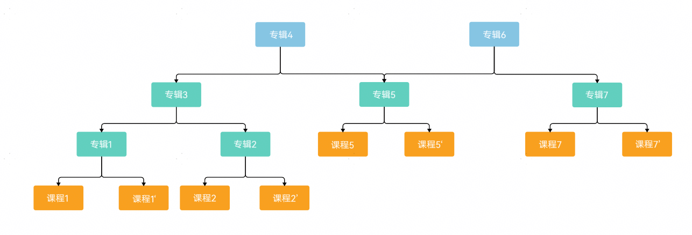

您可以将一系列课程按顺序组合形成专辑，若您配置此专辑用于推荐，当用户在客户端打开专辑中一个课程详情时，会有该专辑的推荐，并且专辑页面会按您指定的顺序展示所包含的课程。关于专辑您还需了解：

* 专辑之间可以具有父子关系，最多4级。如上图，专辑3是专辑1、2的父专辑。
* 专辑下只能关联专辑或课程，不能即包括专辑又包括课程，若一个专辑下关联了子专辑则称为组合专辑，若一个专辑下关联课程则称为非组合专辑。组合专辑可以看作专辑树中的非叶子节点，非组合专辑则为叶子节点。如上图，专辑3、4、6为组合专辑，其余直接关联课程的1、2、5、7均为非组合专辑。
  + 每个组合专辑最多可以关联20个子专辑，可指定子专辑的展示顺序，同一个子专辑可以与多个父专辑建立父子关系。
  + 每个非组合专辑可以关联最多2000个课程，可指定课程的展示顺序，已经关联过A专辑的课程依旧可以关联到B专辑下。
* 专辑支持从一个父专辑下移动到另一父专辑下，但被移动的专辑必须是非组合专辑。如上图，专辑7可以从专辑6直接移动至专辑4下，而专辑3则不能从专辑4移动至专辑6。
* 专辑之间审核状态相互独立，互不影响。
* 专辑若需要对用户可见需要满足如下条件：

  | 类型 | 可见条件 |
  | --- | --- |
  | 非组合专辑 | 1. 专辑已生效 2. 专辑可推荐 3. 专辑至少关联了2个在架课程 |
  | 组合专辑 | 1. 专辑已生效 2. 专辑可推荐 3. 至少有一个下级专辑已生效 4. 下级已生效专辑至少关联了2个在架课程 |

## 添加/编辑专辑

1. 登录[AppGallery Connect](https://developer.huawei.com/consumer/cn/service/josp/agc/index.html)，选择“教育”。
2. 选择“分发 &gt; 专辑管理”，点击右上角“添加专辑”或点击专辑后的“编辑”按钮。

   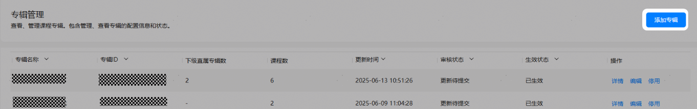
3. 在“新增专辑”或者“编辑专辑”页面，填写专辑信息。

   | 参数 | 说明 |
   | --- | --- |
   | 专辑名称 | 必填，最多15个字符。 |
   | 专辑介绍 | 必填，最多2000个字符。 |
   | 专辑封面 | 必填。  * 您可以选择“本地上传”或者在“素材中心”选择[素材管理](https://developer.huawei.com/consumer/cn/doc/content/educenter-material-0000001174571148)中已上传的文件。 * 第一张图：用于手机，jpg、png格式，图片分辨率为1280\*720像素(宽\*高)，单张图片最大为2MB。 * 第二张图：用于平板，jpg、png格式，图片分辨率为1080\*360像素(宽\*高)，单张图片最大为2MB。 |
   | 是否为组合专辑 | 必填。  * 组合专辑只能添加专辑，参见[添加专辑](#section217510336341)。 * 非组合专辑只能添加课程，参见[添加课程](#section16795153216328)。 |
   | 是否用于推荐 | 必填，配置为是则在课程详情页展示此专辑，配置为否则不会在课程详情页展示此专辑。 |

### 添加课程

当“是否为组合专辑”为“否”时需要添加归属于此专辑的课程，可通过资费类型、课程状态、课程类型、课程分类、课程名称、课程ID等条件进行筛选，请至少添加一个课程，否则无法提交。

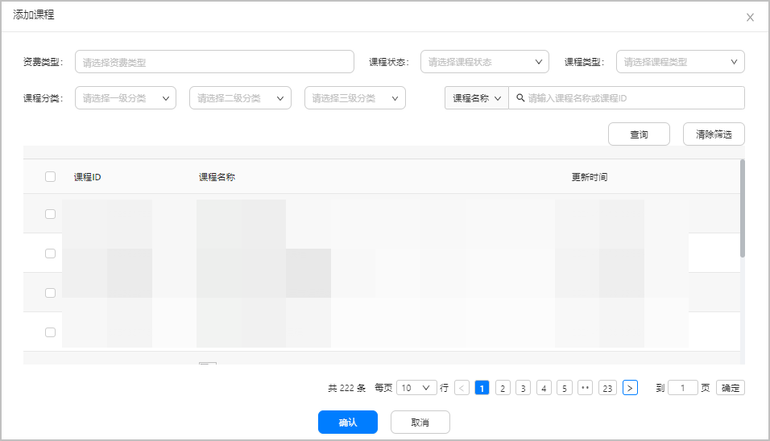

| 参数 | 说明 |
| --- | --- |
| 课程ID | 必填，多个ID之间请用英文逗号分隔。ID的排列顺序即为课程的排列顺序。每个目录中最多包含2000个课程。开发者的所有课程均可加入专辑（不限制课程状态，课程售卖方式，课程使用形式，是否免费等）。 |

添加成功后在“课程列表”显示已添加的课程，此时您可以在操作栏进行如下操作：

* 调整课程顺序：点击“调整至”，输入序号，点击“确定”即可进行调整操作。请填写1至2000的整数。

  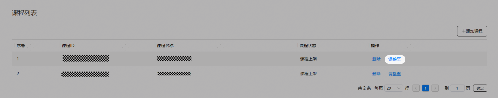
* 删除课程：在“课程列表”操作栏下点击“删除。

  

  课程删除后：

  + 此专辑不再包含此课程。
  + 专辑的上级专辑不再包含此课程。
  + 专辑关联的套餐权益不再包括此课程，已购买该套餐权益的用户无法使用此课程。
  + 上级专辑关联的套餐权益不再包括此课程，已购用户无法使用此课程。

  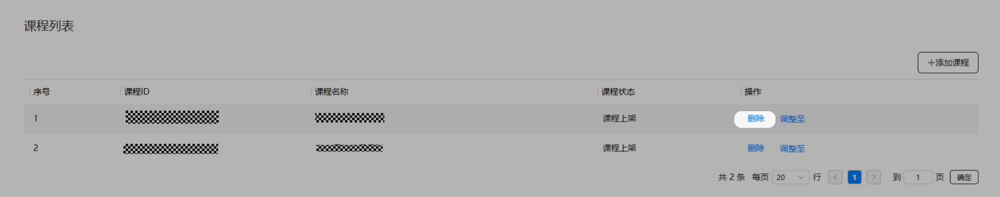

### 添加专辑

当“是否为组合专辑”为“是”时需要添加归属于此专辑的子专辑，请至少添加一个子专辑，否则无法提交。

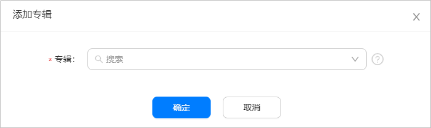

| 参数 | 说明 |
| --- | --- |
| 专辑 | 必填，最多可一次选择20个专辑，支持搜索。 |

添加成功，专辑列表显示已添加的子专辑。此时您可以在操作栏进行如下操作：

* 调整子专辑顺序：点击“调整至”，输入序号，点击“确定”即可进行调整操作。请填写1至20的整数。

  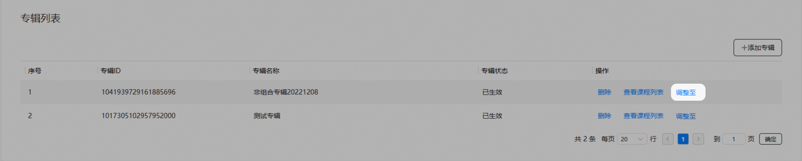
* 删除子专辑：在“专辑列表”操作栏下点击“删除。

  

  删除子专辑后：

  + 本专辑不再包含此专辑内的课程。
  + 本专辑的上级专辑不再包含此专辑。
  + 本专辑关联的套餐权益不再包括此专辑内的课程，已购用户无法使用此专辑内课程。
  + 上级专辑关联的套餐权益不再包括此专辑的课程，已购用户无法使用此专辑内的课程。

  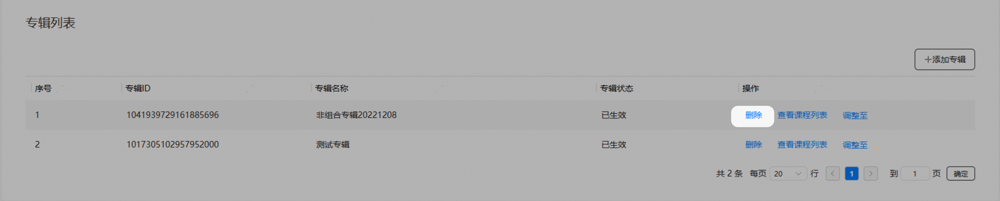
* 查看课程列表：按下级专辑中的顺序展示课程列表。
  + 如子专辑未生效或沙盒测试状态，则课程列表显示“无有效数据”。
  + 如子专辑已生效或停用：展示子专辑下的课程。

  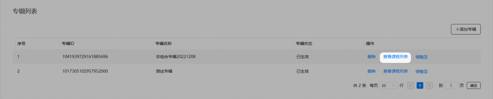

## 测试专辑

如果需要在教育中心APP中看到沙盒测试的专辑，需要首先添加您的测试帐号，请参见[管理测试帐号](https://developer.huawei.com/consumer/cn/doc/app/agc-help-testaccount-0000001146438651)。

新建或者编辑专辑时，您可以点击页面右上角的“测试”。点击测试成功后，您可以使用测试帐户在教育中心APP中查看沙盒测试状态的专辑，方便您联调测试。

审核状态为“新建待提交”、“新建审核驳回”、“新建审核撤销”的专辑可以提交测试，提交后专辑生效状态为沙盒测试。

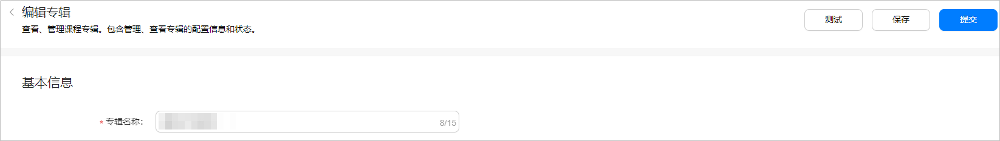

## 删除专辑

您可以在“专辑管理”页面删除专辑，仅当专辑“审核状态”为“新建待提交”、“新建审核撤销”或“新建审核驳回”时才能进行删除操作。

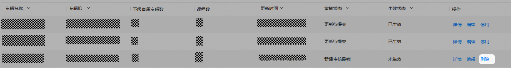

## 停用专辑

您可以在“专辑管理”页面停用专辑，仅当专辑“审核状态”为“新建审核通过”、“更新审核通过”、“更新审核撤销”或“更新待提交”时才能进行停用操作。

专辑停用后：

* 此专辑关联的套餐权益不再包括此专辑中的课程。
* 其上级专辑及其关联的套餐权益将不再显示此专辑中课程。
* 不影响其下级专辑的状态。
* 已购买此专辑关联的套餐权益或其上级专辑关联套餐权益的用户可继续使用此专辑中的付费课程至套餐权益有效期结束。

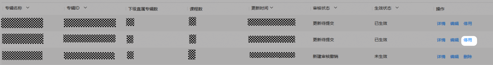

## 查看专辑列表

您可以在“专辑管理”页面查看专辑列表：

| 专辑信息 | 说明 |
| --- | --- |
| 专辑名称 | 支持换行显示。支持模糊搜索 |
| 专辑ID | 支持换行显示。支持模糊搜索   * 当专辑既有生效版本，也有编辑版本时：显示生效版本中的名称 * 当专辑仅有编辑版本时：显示编辑版本中的名称 |
| 下级直属专辑数 | 按实际显示，包括已生效和未生效的组合数量。如没有直属专辑则显示“-”。 |
| 课程数 | 直属下级专辑（已生效和停用的）中课程数之和。 |
| 更新时间 | 格式YYYY-MM-DD HH:MM:SS ，可按日期筛选 |
| 审核状态 | 显示当前的审核状态。 |
| 生效状态 | 显示当前的生效状态。   * 已生效 * 未生效 |
| 操作 | 当前专辑可以执行的操作：   * 通过“编辑”按钮编辑专辑，进入编辑专辑页面。 * 通过“详情”按钮查看专辑详情及生效数据（已生效专辑被更新时）。 * 通过“删除”按钮删除专辑。 * 通过“撤销”按钮撤销审核提交。 * 通过“停用”按钮提交专辑停用申请。 |