# 课程管理

## 课程/章节模型

课程下的章节支持一级目录和多级目录：

* 一级目录系列课直接在课程下添加章节，总章节数不超过1000个。
* 多级目录系列课需要先创建目录信息，最多3级目录，每级目录的子目录不超过30个。
* 同一目录节点下只能添加子目录或者添加章节，不能同时添加，目录添加章节后即为目录叶子节点。
* 可以在目录叶子节点上添加一个或者多个章节，所有目录下的总章节数不超过600个。

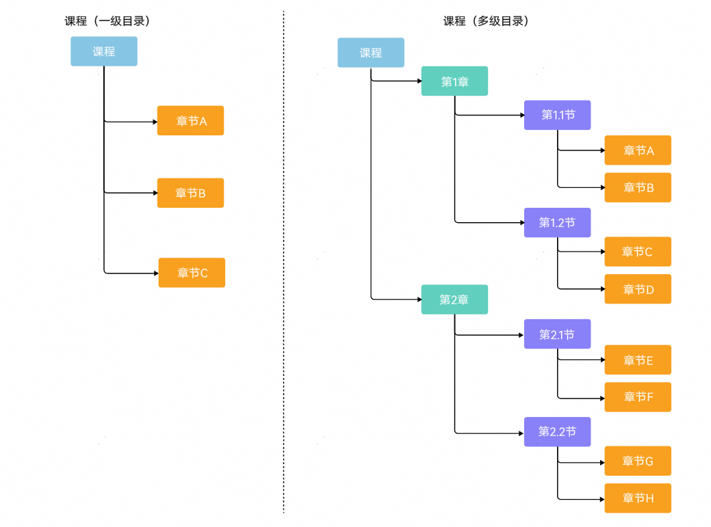

## 添加/编辑课程

1. 登录[AppGallery Connect](https://developer.huawei.com/consumer/cn/service/josp/agc/index.html)，点击“教育”。

   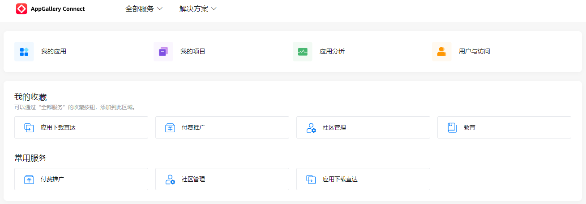

2. 选择“分发 &gt; 课程管理”，点击界面右侧的“添加课程”或点击课程后的“编辑”按钮。

   

   * 待审核状态的课程不支持编辑。
   * 当课程被华为运营人员锁定时，显示小锁头图标，不支持编辑。

   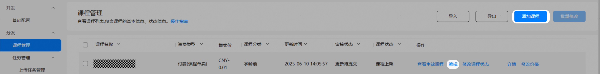

   * 当华为教育中心运营人员在运营管理台编辑课程并未审核完成（审核中）时，不允许开发者编辑此课程，如开发者在AGC点击“编辑”时，会提示如下信息：

     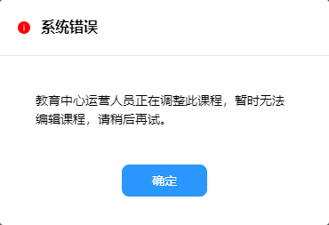
3. 在“新增课程”或者“编辑课程”页面，填写课程信息。根据是否有创建跳转类学习课程、创建跳转SDK类课程的权限，页面会有不同的显示。

   <strong>表1</strong> 课程信息表

   | 参数 | 说明 |
   | --- | --- |
   | 课程名称 | 必填。  您自定义的课程名称，最多50个字符，不区分中英文。  如果课程名称与已上架课程的名称相同，光标移出课程名称输入框后会提示“已有相同名称课程”。 |
   | 课程一句话简介 | 必填。  课程简要介绍，最多40个字符，不区分中英文。 |
   | 课程介绍 | 必填，课程的详细介绍。  最多2000个字符，不区分中英文。 |
   | 课程类型 | 取值范围：  * 视频课：可重复观看的视频课程 * 音频课：可重复听的音频课程 * 教材：依据课程标准编制的、系统反映学科内容的教学用书，按学年或学期分册 * 教辅：针对教材的内容进行的有针对性的具体指导，是授课的延续和补充 * 绘本：以绘画为主，并附有少量文字的强交互课程 * 其他类型：其他类型课程，包括AI交互课程 |
   | 教材推荐图片 | 教材封面，仅当课程类型为“教辅教材”时必填。  * 您可以选择“本地上传”或者在“素材中心”选择[素材管理](https://developer.huawei.com/consumer/cn/doc/content/educenter-material-0000001174571148)中已上传的文件。 * 图片规格(宽\*高)：405\*540像素 * 图片格式：JPG/PNG * 图片大小：最大2MB |
   | 课程封面图片 | 必填，课程在客户端呈现的封面图片。  * 您可以选择“本地上传”或者在“素材中心”选择[素材管理](https://developer.huawei.com/consumer/cn/doc/content/educenter-material-0000001174571148)中已上传的文件。 * 图片规格(宽\*高)：1280\*720像素 * 图片格式：JPG/PNG * 图片大小：最大2MB |
   | 课程介绍图片 | 展示在课程介绍页的图片，最多添加5张。  * 您可以选择“本地上传”或者在“素材中心”选择[素材管理](https://developer.huawei.com/consumer/cn/doc/content/educenter-material-0000001174571148)中已上传的文件。 * 图片规格：宽1080像素，高度最大4096像素 * 图片格式：JPG/PNG * 图片大小：最大2MB |
   | 课程宣传视频 | 用于课程宣传的视频，最多添加5个。  * 您可以选择“本地上传”或者在“素材中心”选择[素材管理](https://developer.huawei.com/consumer/cn/doc/content/educenter-material-0000001174571148)中已上传的文件。 * 视频支持MOV、MP4、AVI、WMV、FLV、RMVB、MKV格式，编码为H.264、 H.265、 MPEG-2、MPEG-4、MJPEG、WMV1/2/3、Proress422，分辨率(宽\*高) &gt;=640\*360且&lt;=3840\*2160，大小要求4GB以内。 * 您可以从视频预览中选择某一帧作为视频海报帧，如果选取海报帧无法使用，您可以选择“本地上传”或者在“素材中心”选择[素材管理](https://developer.huawei.com/consumer/cn/doc/content/educenter-material-0000001174571148)中已上传的文件。 |
   | 课程分类 | 必填。  可选择多个分类，请参见[课程分类ID](https://developer.huawei.com/consumer/cn/doc/AppGallery-connect-References/edukit-course_category_id-0000001051561184)。同一个二级分类下的三级分类个数有限制，以页面提示为准。 |
   | 课程标签 | 必填，最少填写2个标签，请参见[课程标签ID](https://developer.huawei.com/consumer/cn/doc/AppGallery-connect-References/edukit-course_tag_id-0000001051401239)。标签的个数上限为6个 |
   | 课程使用形式 | 仅当有创建跳转类学习课程的权限时显示  * 跳转APP使用：跳转到开发者的应用中学习课程，必须选择应用信息，展示在客户端课程详情页的来源字段中。 * 教育中心使用：在教育中心客户端学习课程。根据是否有创建跳转SDK类课程的权限，如果有，则显示“是否需要发货通知”，如果没有，则显示“课程来源名称” 已上架课程和沙盒测试状态的课程编辑时不可修改。 |
   | 是否需要发货通知 | 当只有创建跳转SDK类课程的权限或有创建跳转SDK类课程的权限且“课程使用形式”选择了“教育中心使用”时显示  * 需要：显示“课程归属应用”选择框，必须选择应用信息，展示在客户端课程详情页的来源字段中。 * 不需要：根据是否有创建跳转类学习课程的权限，如果有，则显示“课程来源名称”，如果没有，则不显示“课程来源名称” 已上架课程和沙盒测试状态的课程编辑时不可修改。 |
   | 课程来源名称 | 当既没有创建跳转APP类课程的权限，也没有创建跳转SDK课程的权限时显示；当有创建跳转类学习课程的权限，且“是否需要发货通知”选择了“不需要时”显示。  填写来源名称，最多20个字符，展示在客户端课程详情页的来源字段中。 |
   | 课程状态自动变更时间 | 设置某个时间变更课程到指定状态，可多选，时间不可相同。  * 课程上架 * 课程下架-用户可学 |
   | 备注 | 提供给审核人员查看的备注信息，最多500个字符。 |
4. 填写商品信息。

   <strong>表2</strong> 商品信息表

   | 参数 | 说明 |
   | --- | --- |
   | 资费类型 | 取值范围：  * 免费 * 付费（课程单卖）：课程只可以单独售卖 * 付费（套餐售卖）：课程可以加入到套餐权益，打包售卖，后续添加到[套餐权益管理](https://developer.huawei.com/consumer/cn/doc/content/educenter-package-0000001145436887)的相关课程需要勾选该选项。 * 付费（教育中心会员售卖）：课程可以加入到教育中心会员售卖 您可以同时选择“付费（课程单卖）”、“付费（套餐售卖）”和“付费（教育中心会员售卖）”三种形式，此时课程既可以单买也可以选择套餐权益购买，还可以选择教育中心会员售卖。如果只选择了“付费（套餐售卖）”，那么课程上架会只显示付费，没有价格，需要购买套餐权益。  已上架课程和沙盒测试状态的课程若勾选了“付费（课程单卖）”，则编辑时不可修改。  如果选择付费模式（课程单卖、套餐售卖或教育中心会员售卖），须确保开发者账号已完成[商户认证](https://developer.huawei.com/consumer/cn/doc/start/merchant-service-0000001053025967)，否则无法提交成功。 |
   | 接收发货通知地址 | 商品购买成功后的通知发货地址，同时选择“付费（课程单卖）”、“跳转APP使用”、“是否支持教育中心直购”-“是”时显示并且必填，同时选择“付费（课程单卖）”、“教育中心使用”、“是否需要发货通知”-“需要”时显示并且非必填，同时选择“付费（课程单卖）”、“是否需要发货通知”-“需要”时显示并且非必填。  用户在教育中心直购课程后，由数字商品服务通过该地址通知开发者服务器发放对应的数字商品。 |
   | 退款结果通知地址 | 商品退款处理完毕后的通知地址，同时选择“付费（课程单卖）”、“跳转APP使用”、“是否支持教育中心直购”-“是”时显示并且非必填，同时选择“付费（课程单卖）”、“教育中心使用”、“是否需要发货通知”-“需要”时显示并且非必填，同时选择“付费（课程单卖）”、“是否需要发货通知”-“需要”时显示并且非必填。  用户在通过退款接口或者运营人工操作发起的退款，处理完毕后，通过退款通知地址告知开发者退款结果，告知开发者解除订购关系。 |
   | 商品ID | 开发者侧的内部商品ID，同时选择“付费（课程单卖）”、“跳转APP使用”时显示且必填，。  已上架课程和沙盒测试状态的课程编辑时不可修改。 |
   | 订购跳转链接 | 当同时选择“付费（课程单卖）”、“跳转APP使用”、“是否支持教育中心直购”-“否”时显示并且非必填。用户在点击订购时客户端使用该链接跳转第三方APP购买页面 |
   | 售卖价格 | 实际用户下单付款的价格，取值范围0~100000，并且小于原价。  目前仅支持人民币（单位：元），最多可保留2位小数，如0.99。如后续价格有变，请及时更新价格。  已上架课程和沙盒测试状态的课程编辑时不可修改。  可在课程列表页点击“修改价格”直接修改。修改价格时若课程正在参与商品促销活动，售价和促销价的优惠幅度不能低于5%，其中优惠幅度=（售价-促销价）/售价。 |
   | 原价 | 可选，优惠前价格，取值范围0~100000，最多可保留2位小数，并且大于售卖价格。  已上架课程和沙盒测试状态的课程填写后不可修改。  可在课程列表页点击“修改价格”直接修改。 |
   | 是否支持教育中心直购 | 教育中心客户端内完成课程支付，同时选择“付费（课程单卖）”，“跳转APP使用”时显示。 |
   | 是否需要邮寄材料 | 如配有实体课件，需要用户在购买时填地址以便寄送教材，请配置为“是”。您可以在[发货信息](https://developer.huawei.com/consumer/cn/doc/content/educenter-deliveryinfo-0000001074015274)中查看教材发货信息。 |
   | 购买后有效期 | * 永久有效 * 按期限：选择“按天”、“按周”、“按月”、“按年”，并填写实际的数值。 |
5. 点击“保存” ，保存成功后跳转到课程列表。
   * 添加课程时，课程变为新建待提交。
   * 编辑课程时，课程保持编辑前状态。

## 添加章节

### 选择目录

添加章节时您可以选择“一级目录”或“多级目录”：

* 选择“一级目录”时，您可直接添加章节，所有章节在同一层级展示。具体的添加步骤，请参见[添加章节信息](#section92097131331)。

  教育中心客户端章节展示顺序默认为章节创建的顺序，支持手动调整章节顺序。在章节列表中，点击列表右侧的“调整至”，填写序号并点击“确定”，即可调整章节至指定位置。

  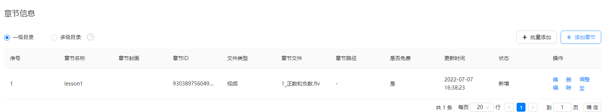
* 选择“多级目录”时，您需要先创建目录，然后在叶子目录下添加章节。
  1. 右键创建或者批量导入目录信息。
     + 右键创建目录信息：

       在“多级目录”下方空白处单击右键逐个添加目录信息，在已有目录上右键可以添加子节点或者上下方的节点。

       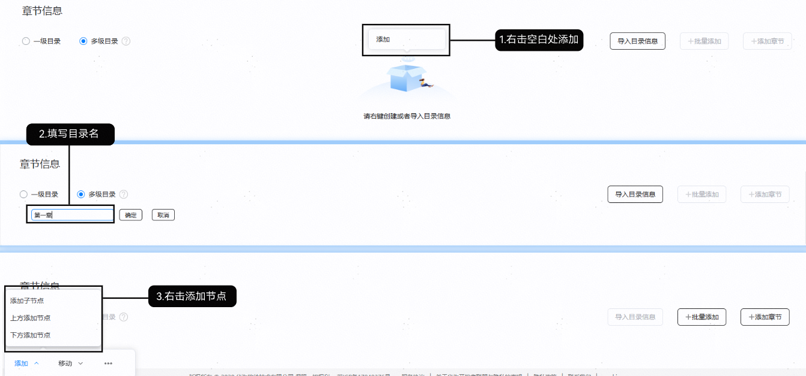
     + 批量导入目录信息：

       点击“导入目录信息”，在导入目录信息提示界面下载模板。按要求填写模板后导入。

       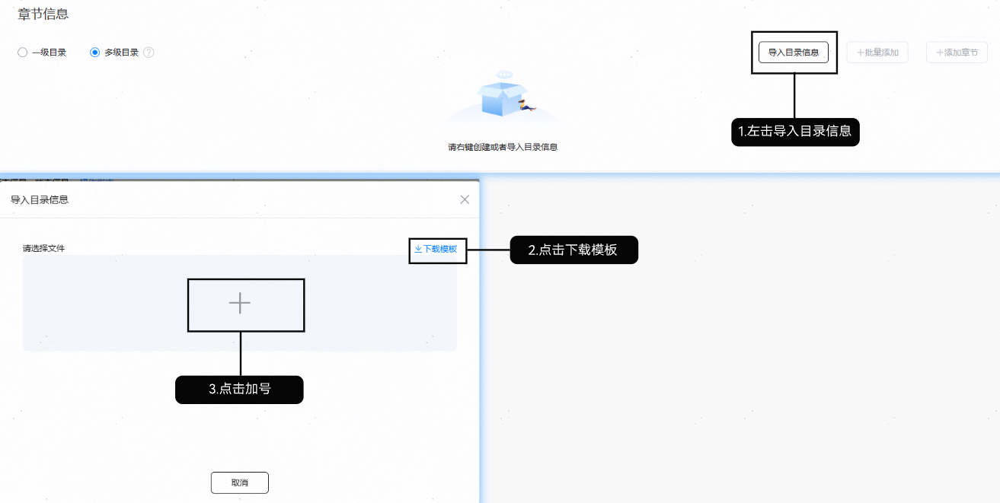
  2. 维护目录信息。

     目录添加后，你可以添加、移动、删除目录或者通过双击修改目录名称。

     

     + 移动目录时调整的为同级目录列表里的顺序。
     + 删除目录时会删除当前目录及其子目录，如果目录添加了章节，章节也会被删除。

     
  3. 选择目录叶子节点，您可直接添加章节。具体的添加步骤，请参见[添加章节信息](#section92097131331)。

### 添加章节信息

请点击界面右侧的“添加章节”，填写章节信息。如下以一级目录下新增章节为例，多级目录下仅目录叶子节点可以添加章节。

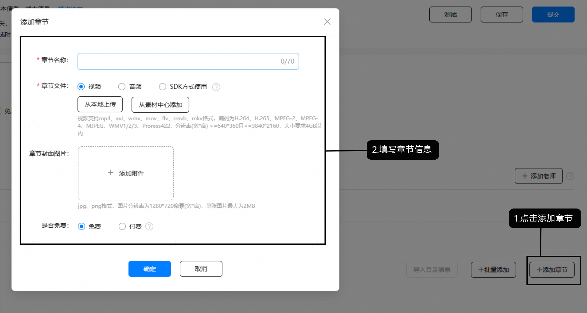

| 参数 | 说明 |
| --- | --- |
| 章节名称 | 必填。  最多70个字符。 |
| 章节文件 | 上传的文件名称不能包含如下字符：&&lt;&gt; []$ %+\/#`\*=^|   * 您可以选择“本地上传”或者在“素材中心”选择[素材管理](https://developer.huawei.com/consumer/cn/doc/content/educenter-material-0000001174571148)中已上传的文件。  * 视频：支持MOV、MP4、AVI、WMV、FLV、RMVB、MKV格式，编码为H.264、 H.265、 MPEG-2、MPEG-4、MJPEG、WMV1/2/3、Proress422，分辨率(宽\*高) &gt;=640\*360且&lt;=3840\*2160，大小要求4GB以内。当课程类型为视频时，显示视频类型或SDK方式使用。 * 音频：支持MP3、WAV格式，编码为MP3/AAC/WAV，大小要求1GB以内。当课程类型为音频时，显示音频类型或SDK方式使用。 * SDK方式使用：当课程的“使用形式”配置为“教育中心使用”且allowJumpToSdk=1即有创建SDK类型课程权限时，可选择“SDK方式使用”的文件类型。选择“SDK方式使用”时不需要上传文件。 |
| 章节封面图片 | 章节在客户端呈现的封面图片。   * 不支持音频课程的章节。 * 您可以选择“本地上传”或者在“素材中心”选择[素材管理](https://developer.huawei.com/consumer/cn/doc/content/educenter-material-0000001174571148)中已上传的文件。 * 图片规格(宽\*高)：1280\*720像素 * 图片格式：JPG/PNG。 * 图片大小：最大2MB。 |
| 章节路径 | 选择“跳转APP使用”时显示，如果当前章节是跳转APP上课，则需要填写章节在APP中的Deeplink路径以及参数，以便用户从教育中心直接进入章节界面。  Deeplink路径跳转到第三方APP的目标章节需要和教育中心的章节对应；点击教育中心的章节，要求直接跳到第三方 APP 的对应章节。 |
| 是否免费 | 课程为付费且课程包含章节时，至少有一个付费章节。  如果章节为付费类型，须确保开发者账号已完成[商户认证](https://developer.huawei.com/consumer/cn/doc/start/merchant-service-0000001053025967)，否则无法提交成功。 |

* 您可以编辑或者删除已添加的章节。对于已上架章节的编辑、删除可以回退，未上架的章节删除则是立即删除。
* 添加文件后，无需等待该章节文件上传完成后可直接点击“确定”，在[上传任务管理](https://developer.huawei.com/consumer/cn/doc/content/educenter-uploadtask-0000001052357079)可统一查看文件上传进度。

## 测试课程

如果需要在教育中心APP中看到沙盒测试的课程，需要首先添加您的测试帐号，请参见[管理测试帐号](https://developer.huawei.com/consumer/cn/doc/app/agc-help-testaccount-0000001146438651)。

新建或者编辑课程时，您可以点击“新增课程”或者“编辑课程”页面右上角的“测试”。点击测试成功后，您可以使用测试帐户在教育中心APP中查看沙盒测试状态的课程，方便您联调测试。

只有当课程审核状态是“新建待提交”，“新建审核撤销”或“新建审核驳回”时，编辑课程页面有“测试”按钮，可以进行测试。

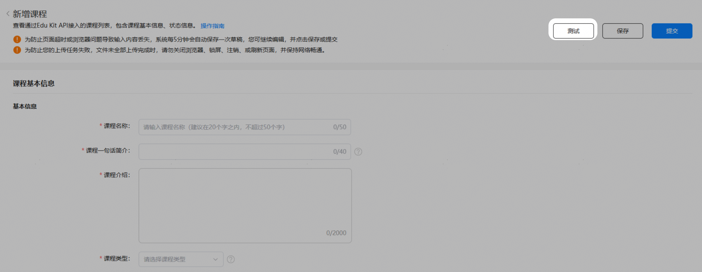

课程的必填信息全部填写，并且已填写信息正确才能够进行测试。点击测试成功后，所有数据被保存并跳转到课程列表页。

## 提交课程

编辑课程的过程中，如果华为运营人员对课程进行锁定。当您点击“提交”后，只会弹出相应的提示框，无法提交课程。

课程信息填写完成时，您可以点击“新增课程”或者“编辑课程”页面右上角的“提交”。

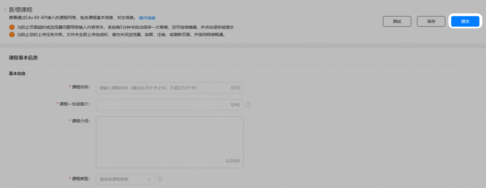

课程的必填信息全部填写，并且已填写信息正确才能够提交成功，提交成功后跳转到课程详情页面。

* 添加课程或编辑未上架课程时，提交成功后课程进入新建待审核状态。
* 编辑已上架课程，课程进入更新待审核状态。

## 删除课程

您可以在“课程管理”页面删除课程，仅当课程“审核状态”为“新建待提交”、“新建审核撤销”或“新建审核驳回”时可以删除。

若您的课程已提交沙盒测试，此时课程无法删除。

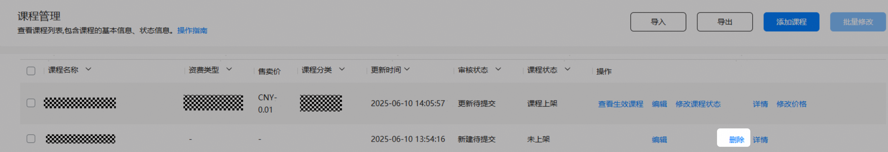

## 导出课程

在课程列表界面您可以点击“导出”，将符合当前搜索条件的课程信息导出并保存为Excel文件，最多导出5000条数据。

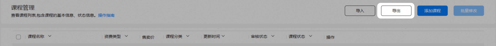

## 导入课程

在课程列表界面您可以点击“导入”，可以下载对应模板，批量添加符合要求的课程信息，导入Excel文件最大支持10MB。

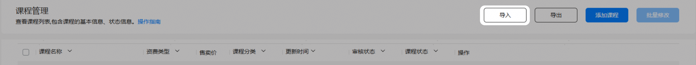

导入的课程有四种类型，分别为：无应用免费课程、有应用免费课程、无应用付费课程、有应用付费课程。允许根据课程不同，下载四种模板。

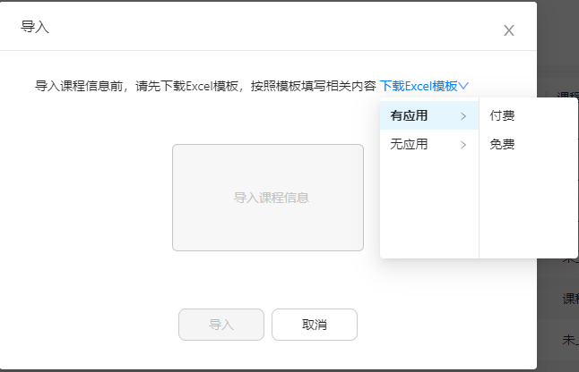

四种模板都需要在下载后将相关课程的内容填写进去，需要填写的内容分别如下:

无应用免费课程

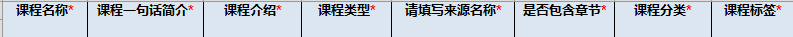

有应用免费课程

无应用付费课程

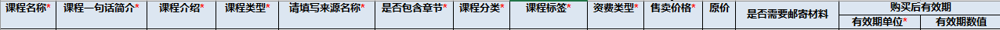

有应用付费课程

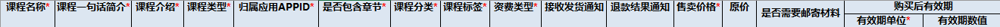

每个模板中都会有详细的华为教育中心课程分类，和华为教育中心课程标签。找到相对应的课程分类和课程标签填写到表格中去。

课程分类的格式为:一级分类\_二级分类\_三级分类\_三级分类ID。

课程标签的格式为：分类\_标签\_标签ID。

模板表格中的华为教育中心课程分类和华为教育中心课程标签两个工作表，我们需要为选中的课程分类和课程标签，在“是否选中”一栏选择“是”

对于所需填写的内容的要求，详情请参考[添加/编辑课程](#section182879453150)所列[课程信息表](#ZH-CN_TOPIC_0000001223784215__table16183134112718)和[商品信息表](#ZH-CN_TOPIC_0000001223784215__table12380355131819)。

在模板中填写完课程相关信息后，需要将模板另存为xlsx格式再导入。

上传Excel后，可以前往[导入课程信息管理](https://developer.huawei.com/consumer/cn/doc/content/educenter-importcourse-0000001211701354)页面查看相关信息

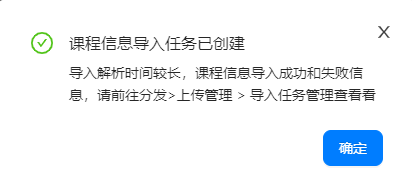

## 修改课程状态

当课程被华为运营人员锁定时，显示小锁头图标，不支持修改课程状态。

课程上架后，可以修改课程状态，提交后需要审核，修改通过审核后课程状态变更。

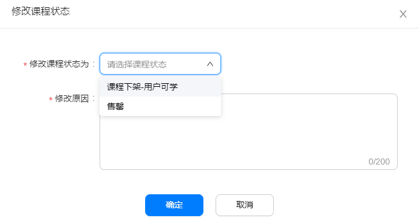

## 查看课程列表

您可以在“课程管理”页面查看课程列表：

| 课程信息 | 说明 |
| --- | --- |
| 课程名称 | 课程名称 |
| 资费类型 | * 免费 * 付费（课程单卖） * 付费（套餐售卖） |
| 售卖价 | 课程的售卖价格 |
| 课程分类 | 选择的课程分类中的第三级分类。 |
| 更新时间 | 最后一次编辑课程的时间。 |
| 审核状态 | 课程处于的审核状态。 |
| 课程状态 | * 未上架 * 课程上架 * 课程下架-用户可学 * 课程下架-用户不可学 * 沙盒测试 * 状态测试 * 售罄   说明：  上述用户指已购买课程的用户。 |
| 操作 | 当前课程可以执行的操作：  说明：  当课程被华为运营人员锁定时，显示小锁头图标，“编辑”、“修改课程状态”和“修改价格”操作项置灰。   * 查看生效课程：有上架版本的课程可查看已生效课程 * 编辑：进入编辑课程，审核状态的课程不可编辑 * 修改课程状态：变更课程状态 * 删除：新建待提交、新建审核撤销或新建审核驳回可删除课程 * 详情：方便查看已保存的课程信息 * 修改价格：快速修改课程价格，包括售卖价格和原价，修改课程价格时无需审核。 * 撤销：处于审核状态的课程可以撤销审核，重新编辑提交，无需等待审核通过或驳回。 |