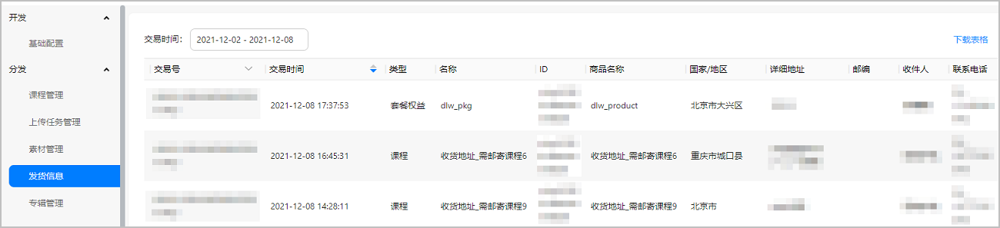

# 发货信息

当用户购买了“需要邮寄教材”的课程或套餐权益时，会在“发货信息”页面记录用户的发货信息。

* 发货信息查询页面默认展示近7天（包括今天）的发货信息，您可以自定义交易时间范围进行查询，最长查询近1年数据。
* 您可以通过交易号查询，只支持全量查询，请输入正确完整的交易号，否则可能查询不到数据。
* 您可以改变交易时间的排序，按时间从近到远或从远到近。
* 您可以点击“下载表格”将符合当前查询条件的所有数据导出为excel文件，方便本地查看数据。

