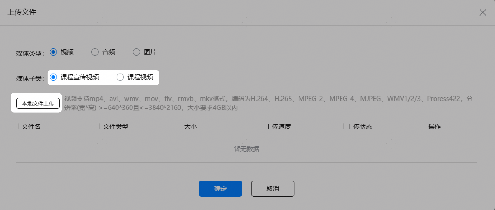
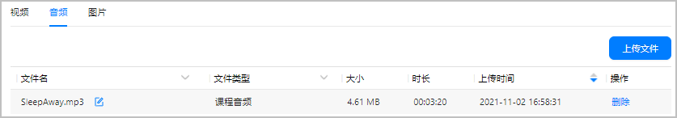

# 素材管理

## 上传素材

1. 登录[AppGallery Connect](https://developer.huawei.com/consumer/cn/service/josp/agc/index.html)，点击“教育”。
2. 选择“分发 &gt; 素材管理”。
3. 根据您的素材类型，选择“视频”、“音频”或者“图片”。
4. 选择“媒体子类”后，单击“本地文件上传”选择本地文件后上传。

   

   素材有多种媒体类型和子类，在您上传之前需要选择具体类型并满足素材的要求：

   | 媒体类型 | 媒体子类 | 素材要求 |
   | --- | --- | --- |
   | 视频 | 课程宣传视频 | 视频支持mp4、avi、wmv、mov、flv、rmvb、mkv格式，编码为H.264、H.265、MPEG-2、MPEG-4、MJPEG、WMV1/2/3、ProRes 422，分辨率(宽\*高) &gt;=640\*360且&lt;=3840\*2160，大小要求4GB以内 |
   | 课程视频 |
   | 音频 | 课程音频 | 音频支持mp3、wav格式，编码为MP3/AAC/WAV，大小要求1GB以内。 |
   | 图片 | 课程/章节封面图片 | jpg、png格式，图片分辨率为1280\*720像素(宽\*高)，单张图片最大为2MB。 |
   | 海报帧 |
   | 课程介绍图片 | jpg、png格式，图片分辨率为宽度1080像素，高度最大4096像素，单张图片最大为2MB。 |
   | 教师头像 | png格式，图片分辨率为312\*312像素，单张图片最大为500KB。 |
   | 课程竖版封面 | jpg、png格式，图片分辨率为405\*540像素(宽\*高)，单张图片最大为2MB。 |
   | 专辑横屏封面文件 | jpg、png格式，图片分辨率为1080\*360像素(宽\*高)，单张图片最大为2MB。 |

   

   * 文件可以多选，批量添加后上传。
   * 文件上传时，不可以关闭上传文件弹窗，否则所有未完成的上传都会被取消，点击取消或右上角关闭按钮，会二次提示确认。
   * 校验失败的文件无法上传。
   * 上传失败的文件可以点击再次上传进行重试。
   * 上传中的文件可以取消上传，取消后不可以再次上传。
5. 上传成功的文件会被添加到素材列表，上传全部结束后会显示总览，点击“确定”后返回列表页面查看新上传的文件。

## 查看素材

您可以在“素材管理”页面查看素材列表：

| 素材信息 | 说明 |
| --- | --- |
| 文件名 | 文件名支持模糊搜索，您也可以单击文件名后的图标，修改文件名。 |
| 文件类型 | 文件类型支持筛选。 |
| 大小 | 素材文件的大小。 |
| 时长 | 音视频文件显示文件的时长。 |
| 上传时间 | 素材的上传时间。 |
| 操作 | 当前素材可以执行的操作：   * 删除：删除不再需要的素材文件。 |