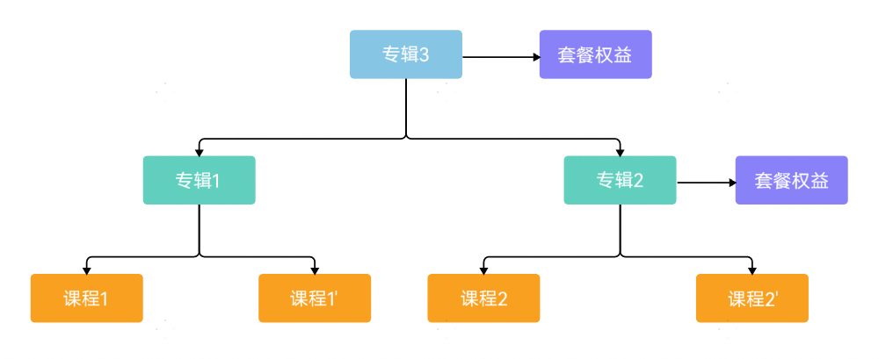
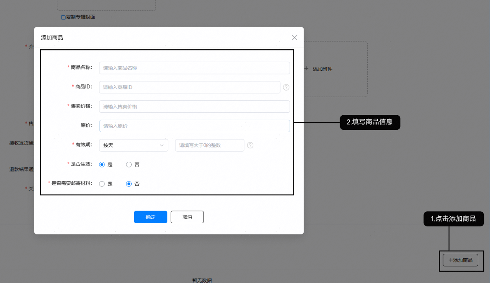
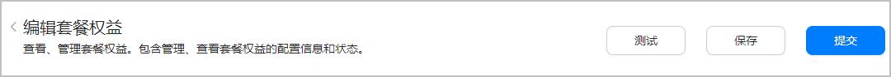
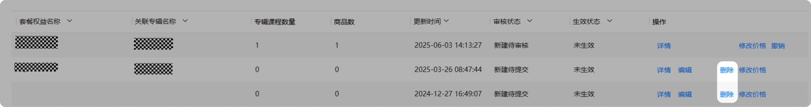
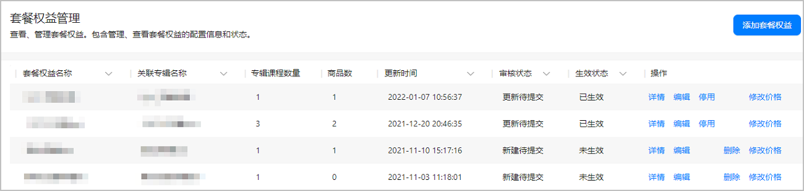

# 套餐权益管理

## 套餐权益模型

您可以在专辑的基础上关联使用套餐权益功能，通过添加套餐权益商品打包售卖课程。当用户在客户端打开套餐权益关联专辑中一个课程详情时，会有该套餐权益的推荐。关于套餐权益您还需了解：

* 套餐权益不能单独创建，必须关联专辑而不能直接关联课程，且一个套餐权益只允许关联一个专辑。
* 套餐权益下至少包含一个生效状态商品。
* 套餐权益与专辑之间的审核状态相互独立，互不影响。套餐权益关联的专辑在套餐权益上架之前可以修改，在上架之后不可以修改。
* 套餐权益若需要对用户可见需要满足如下条件：

  | 套餐权益关联的专辑类型 | 可见条件 |
  | --- | --- |
  | 非组合专辑 | 1. 套餐权益已生效 2. 套餐权益关联的专辑已生效 3. 套餐权益关联的专辑至少有1个在架课程 |
  | 组合专辑 | 1. 套餐权益已生效 2. 套餐权益关联的专辑已生效 3. 套餐权益关联的专辑至少有1个在架课程 4. 关联的专辑至少有一个下级专辑已生效 |

## 添加/编辑套餐权益

1. 登录[AppGallery Connect](https://developer.huawei.com/consumer/cn/service/josp/agc/index.html)，选择“教育”。
2. 选择“分发 &gt; 套餐权益管理”，点击界面右侧的“添加套餐权益”或点击套餐权益后的“编辑”。

   

   当华为教育中心运营人员在运营管理台编辑套餐权益并未审核完成时（审核中），不允许开发者编辑此套餐权益。
3. 在“新建套餐权益”或者“编辑套餐权益”页面，填写套餐权益信息。

   | 参数 | 说明 |
   | --- | --- |
   | 关联专辑 | 套餐权益必须关联专辑而不能直接关联课程，因此您需要先创建包含付费课程的专辑，再选择关联此专辑或者此专辑的父专辑。  选中后格式为“专辑名称\_专辑ID”，生效后不可修改。  * 当某个专辑已经关联至其他套餐权益时（无论是否审核通过），则此专辑不在下拉列表中显示。 * 当专辑既有生效版本，也有编辑版本时：显示生效版本中的名称。 * 当专辑仅有编辑版本时：显示编辑版本中的名称。 |
   | 套餐权益名称 | 必配，上限15个字符。展示在客户端上。  点击“复制专辑名称”，自动将专辑名称填在“套餐权益名称”中，您可继续编辑。 |
   | 套餐权益介绍 | 必配，上限2000个字符。展示在客户端上。  点击“复制专辑介绍”，自动将专辑名称填在“套餐权益介绍”中，您可继续编辑。 |
   | 套餐权益封面 | 必配，jpg、png格式，图片分辨率为1280\*720像素(宽\*高)，最大为2MB。封面会显示在客户端侧。  点击“复制专辑封面”，自动将专辑名称填在“套餐权益封面”中。  您也可以重新上传，选择“本地上传”或者在“素材中心”选择[素材管理](https://developer.huawei.com/consumer/cn/doc/content/educenter-material-0000001174571148)中已上传的文件。 |
   | 介绍图片 | 必配，最少1张，最多3张。宽1080像素，高度最大4096像素。JPG/PNG格式。每张图片最大2MB。  您可以选择“本地上传”或者在“素材中心”选择[素材管理](https://developer.huawei.com/consumer/cn/doc/content/educenter-material-0000001174571148)中已上传的文件。 |
   | 售卖方式 | 必配（生效后不可编辑），可选择“教育中心直购”或“跳转APP购买”，默认为“教育中心直购”。 |
   | 接收发货通知地址 | 仅当售卖方式为“教育中心直购”时，需要配置，非必填。  * 如果套餐权益关联的专辑中包含跳转APP学习的课程，请务必填写实际发货地址，否则会导致用户无法学习。 * 在教育中心学习时，不需要填写。 |
   | 退款结果通知地址 | 仅当售卖方式为“教育中心直购”时，需要配置。  * 在第三方应用内学习时，填写实际退款结果通知地址。 |
   | 关联应用 | * 在教育中心学习时，关联应用配置为“无应用”。   + 有APP时来源名称填写APP名称   + 无APP填写课程来源名称。 * 在第三方应用学习时，关联应用配置为“有应用”，来源名称选择APP名称。 |
   | 来源名称 |
4. 添加套餐权益时需要添加商品，请点击界面右侧的“添加商品”，填写商品信息。

   

   商品信息为套餐权益的售卖方式，将显示在套餐权益信息的权益介绍中，请参见[测试套餐权益](https://developer.huawei.com/consumer/cn/doc/content/educenter-sandtest-0000001060204148#ZH-CN_TOPIC_0000001223942667__section1728912537354)。

   

   

   * 您可以编辑或者删除已添加的商品。
   * 商品信息未审核通过时可以删除，商品信息审核通过后不允许删除。

   | 参数 | 说明 |
   | --- | --- |
   | 商品名称 | 必填，显示在客户端。上限30个字符。生效后允许修改，需审核通过后生效。 |
   | 商品ID | 必填，需要开发者自定义，建议使用您公司或APP的简称为前缀。所有开发者的套餐权益的商品ID不可重复。生效后不允许修改。  举例：testAPP001 |
   | Deeplink路径 | 售卖方式为“跳转APP购买”时，显示此配置项。必配。通过此deeplink直接进入第三方APP的套餐权益界面。生效后允许修改，需审核通过后生效。 |
   | 售卖价格 | 必填，套餐权益的售卖价格，最多可保留2位小数，例如9.99，上限100000元。货币单位默认为“元”。随时可修改，不需审核立即生效。 |
   | 原价 | 选填，最多可保留2位小数，例如9.99，上限100000元。货币单位默认为“元”。随时可修改，不需审核立即生效。 |
   | 有效期 | 必填，支持选择：按天/按周/按月/按年，配置具体数值。生效后允许修改，需审核通过后生效。 |
   | 是否生效 | 必选，可选择“是”或“否”。默认选择“是”，可修改。提交审核时，套餐权益必须至少有1个商品信息是“生效”的，否则不允许提交。 |
   | 是否需要邮寄材料 | 必选，可选择“是”或“否”。默认选择“否”，可修改。生效后允许修改，需审核通过后生效。 |
5. 填写完成后点击“保存” ，保存成功后跳转到套餐权益列表。

   

   * 添加套餐权益时，套餐权益状态为新建待提交。
   * 编辑套餐权益时，套餐权益保持编辑前状态。

   
6. 编辑完成后，您可点击“新建套餐权益”或者“编辑套餐权益”页面右上角的“提交”。

   

   套餐权益的必填信息全部填写，并且已填写信息正确才能够提交成功，提交成功后跳转到套餐权益列表页面。

   * 添加套餐权益或编辑未上架套餐权益时，提交成功后套餐权益进入新建待审核状态。
   * 编辑已上架套餐权益，套餐权益进入更新待审核状态。

## 测试套餐权益

如果需要在教育中心APP中看到沙盒测试的套餐权益，需要首先添加您的测试帐号，请参见[管理测试帐号](https://developer.huawei.com/consumer/cn/doc/app/agc-help-testaccount-0000001146438651)。

新建或者编辑套餐权益时，您可以点击页面右上角的“测试”。点击测试成功后，您可以使用测试帐号在教育中心APP中查看沙盒测试状态的套餐权益，方便您联调测试。

审核状态为“新建待提交”、“新建审核驳回”、“新建审核撤销”的套餐权益可以提交测试，提交后套餐权益生效状态为沙盒测试。

## 删除套餐权益

您可以在“套餐权益管理”页面点击操作栏的“删除”进行相关删除操作。

仅当套餐权益“审核状态”为“新建待提交”、“新建审核撤销”或“新建审核驳回”时才能进行删除操作。

## 查看套餐权益列表

您可以在“套餐权益管理”页面查看套餐权益列表：

| 套餐权益信息 | 说明 |
| --- | --- |
| 套餐权益名称 | 支持换行显示。支持模糊搜索 |
| 关联专辑名称 | 支持换行显示。支持模糊搜索   * 当专辑既有生效版本，也有编辑版本时：显示生效版本中的名称 * 当专辑仅有编辑版本时：显示编辑版本中的名称 |
| 专辑课程数量 | 去重显示专辑内所有关联关系生效的课程的数量（无论专辑是否生效，课程是否在架）。 |
| 更新时间 | 格式YYYY-MM-DD HH:MM:SS ，可按日期筛选 |
| 审核状态 | 显示当前的审核状态。 |
| 生效状态 | 显示当前的生效状态。   * 已生效 * 未生效 |
| 操作 | 当前套餐权益可以执行的操作：   * 编辑：进入编辑套餐权益，审核状态的套餐权益不可编辑 * 删除：新建待提交、新建审核撤销或新建审核驳回可删除套餐权益 * 详情：方便查看已保存的套餐权益信息 * 停用：将已生效套餐权益停用 * 撤销：处于审核状态的套餐权益可以撤销审核，重新编辑提交，无需等待审核通过或驳回。 |