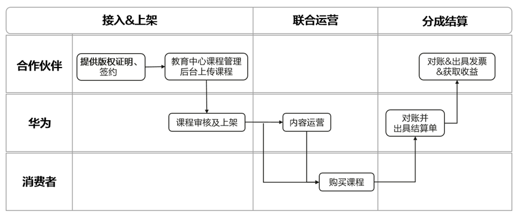

# 业务介绍

华为教育中心是以在线课程为主体的全学习周期智慧化教育服务平台，秉承“智慧学习，快乐成长”的理念，平台将持续依托HMS应用生态和“1+8+N”硬件生态所构建的全场景智慧生态矩阵，助力教育内容实现数字化转型，携手教育伙伴将优质内容高效分发给目标用户，共同构建教育商业生态闭环。

## 业务优势

### 多终端流量触达

华为教育中心借助华为自身的生态优势，实现全场景多终端同步学习的数字化教育体验，有效触达高质用户。

### 便捷的接入服务

通过详细清晰的指导文档&人工协助，帮助开发者快速入驻教育中心；课程管理后台上架课程操作简单快捷，省时省力；

### 高效的商业转化

通过技术和系统优势，在提高用户体验和学习效果的同时，也帮助合作伙伴精准获客、快速转化，实现商业价值的提升。

### 多样的营销活动

针对合作伙伴在华为教育中心上架的精品课程内容，开展形式丰富的福利活动及品牌宣传活动，实现品效双赢。

## 合作模式

* 模式一：用户在教育中心进行课程购买和学习，音视频课程接入建议采用此模式。
* 模式二：用户下载并跳转到第三方应用内进行课程购买和学习，此模式仅适用于与华为应用市场进行联运合作的应用。

## 合作流程

## 接入方式

通过教育中心课程管理后台上传课程，网页操作简单快捷。

## 耀星·火花激励计划

耀星·火花计划是面向与华为教育中心合作的合作伙伴开展的专项激励计划，通过给予华为教育中心专属流量和华为应用市场耀星流量券激励的方式，激励合作伙伴与教育中心达成技术及内容合作，丰富教育中心内容与服务，满足用户多元化学习需求。激励计划详情请点击：&lt;https://developer.huawei.com/consumer/cn/activity/yaoxingActivity/detail/617&gt;