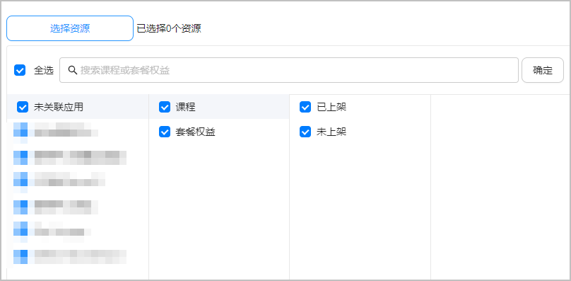
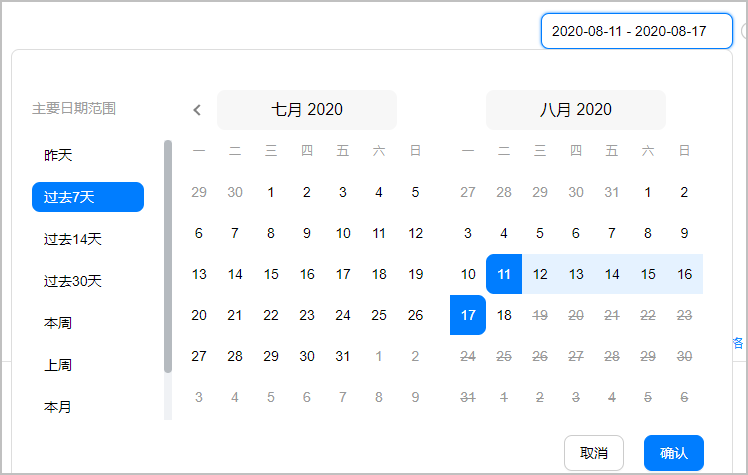
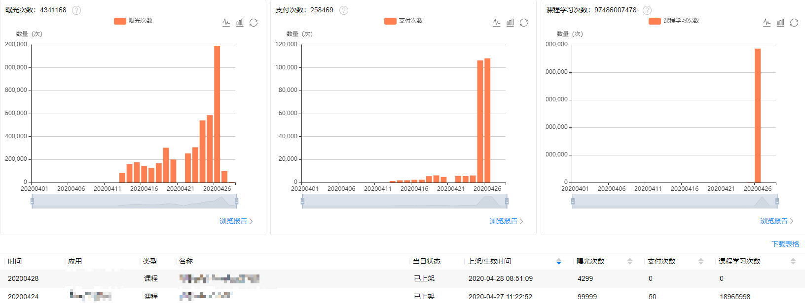
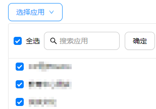
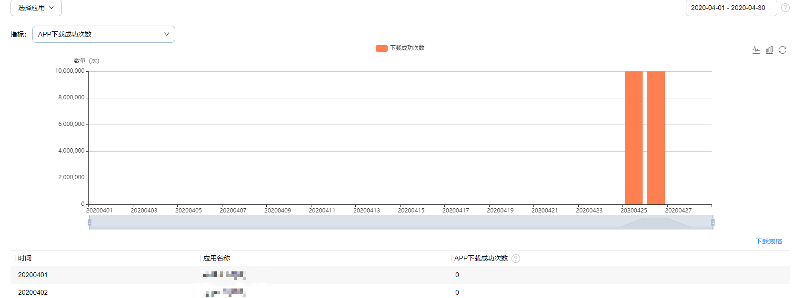
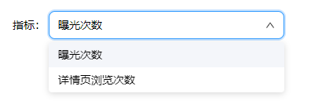
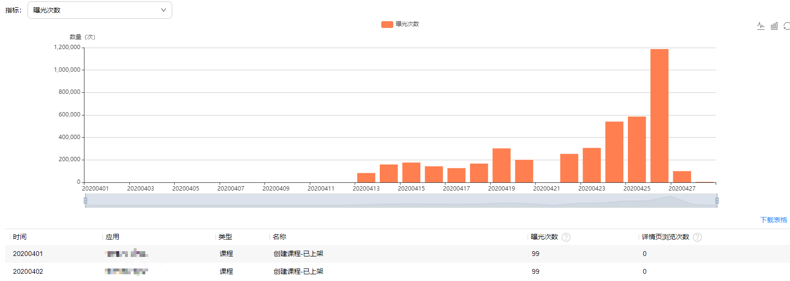
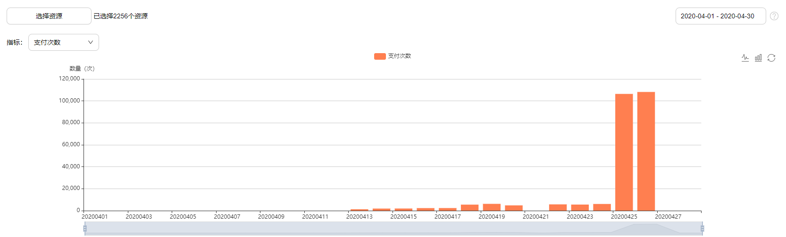
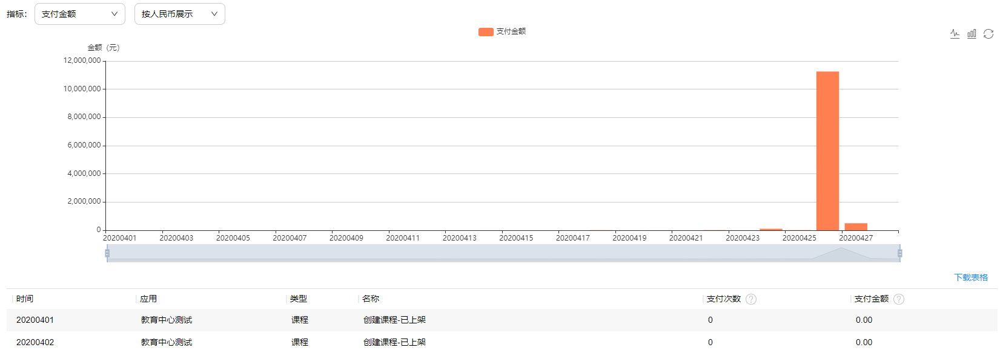
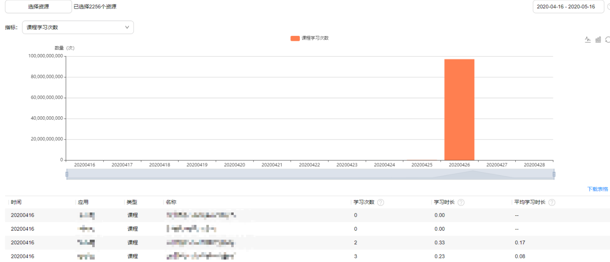

# 数据分析

数据分析为您提供报表能力和运营数据查看功能。您可以通过数据分析了解您的课程/套餐权益的分发数据、支付数据、课程学习情况和应用的下载成功次数。每日12：00完成今天0：00之前的数据同步。

## 概述

在概述页面默认展示曝光次数、支付次数、课程学习次数数据，您可以点击“选择资源”，通过应用、资源类型、上架状态、名称列表四级选项并选择“时间区间”进行筛选。

数据趋势图支持使用柱状图和折线图两种形式展示，详细数据展示在趋势图下方，您可以点击“下载表格”导出为Excel文件查看：

* 曝光次数：课程/套餐权益在华为教育中心推荐、排行榜、搜索等资源位被展示次数。点击“浏览报告”进入[分发](#section157125254220)页面。
* 支付次数：教育中心直购次数+跳转App内购买次数。点击“浏览报告”进入[支付](#section182881430927)页面。
  + 教育中心直购：用户在华为教育中心App内购买课程的次数。
  + 跳转App内购买：用户在您的App内购买课程的次数，App内购买的统计依赖于您同步课程订购记录到华为教育中心。
* 课程学习次数：课程被用户学习总次数。点击“浏览报告”进入[学情](#section1683512333213)页面。

## 下载

仅当您名下有已上架应用时展示“下载”页面。

你可以通过“选择应用”选择应用信息，并选择“时间区间”进行筛选。

“APP下载成功次数”为用户通过华为教育中心应用产生的下载成功总量，数据趋势图支持使用柱状图和折线图两种形式展示。详细数据展示在趋势图下方，您可以点击“下载表格”导出为Excel文件查看。

## 分发

您可以点击“选择资源”，通过应用、资源类型、上架状态、名称列表四级选项并选择“时间区间”进行筛选。

在“指标”后选择展示“曝光次数”或“详情页浏览次数”。

数据趋势图支持使用柱状图和折线图两种形式展示。详细数据展示在趋势图下方，您可以点击“下载表格”导出为Excel文件查看。

* 曝光次数：课程/套餐权益在华为教育中心推荐、排行榜、搜索等资源位被展示次数。
* 详情页浏览次数：详情页通过华为教育中心被浏览的次数。

## 支付

您可以点击“选择资源”，通过应用、资源类型、上架状态、名称列表四级选项并选择“时间区间”进行筛选。

数据趋势图支持使用柱状图和折线图两种形式展示。详细数据展示在趋势图下方，您可以点击“下载表格”导出为Excel文件查看。

* 支付次数：用户支付成功次数。
* 支付金额：用户付费总额，单位：元。

## 学情

您可以点击“选择资源”，通过应用、资源类型、上架状态、名称列表四级选项并选择“时间区间”进行筛选。

数据趋势图支持使用柱状图和折线图两种形式展示。详细数据展示在趋势图下方，您可以点击“下载表格”导出为Excel文件查看。

* 课程学习次数：课程被用户学习总次数。

