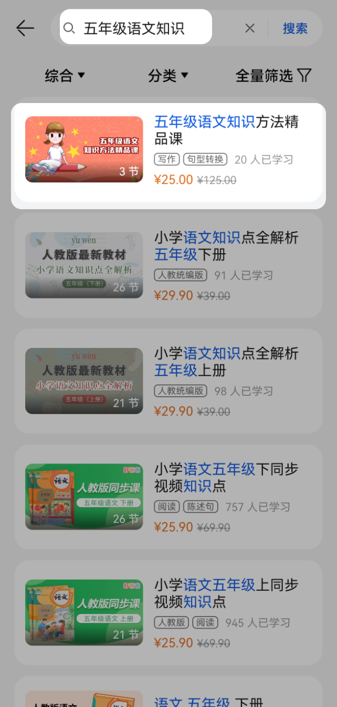

# 沙盒测试

在将课程、套餐权益和专辑提交教育中心正式审核前，您可以通过沙盒测试功能进行从发布到使用的端到端测试。您可以调试包括但不限于课程购买、课程跳转、账号引导绑定、学情同步等流程，调试效果与课程上架后的效果一致。

## 测试前准备

* 在进行测试前，您需要在AppGallery Connect中的用户与访问添加测试账号，这些测试账号都是真实的华为账号。具体请参见[管理测试账号](https://developer.huawei.com/consumer/cn/doc/app/agc-help-testaccount-0000001146438651)。
* 若您的课程需要跳转到您的应用内学习，但您的应用还未正式上架，您可以参考[开放式测试](https://developer.huawei.com/consumer/cn/doc/development/AppGallery-connect-Guides/agc-betatest-release-0000001071228673)上架测试版本进行沙盒测试的验证。

## 沙盒测试注意事项

| 测试内容 | 注意事项 |
| --- | --- |
| 测试课程 | * 课程一旦审核通过，就不可以再提交沙盒测试。 * 课程一旦提交测试就不能删除，可作为正式课程提交上架申请，因此在提交测试前请检查不可修改的字段是否填写正确，比如商品ID、课程所属应用在华为应用市场的AppID、是否在教育中心中学习、售卖模式。 * 沙盒测试时如果您的课程在教育中心直购，请把价格设置为0.01元，在支付的时候会实际产生费用。 * 课程提交沙盒测试后，如果修改课程名称，需要过20分钟才能在教育中心客户端搜索到修改后的课程名。 * 对课程、章节修改后要调用提交沙盒测试接口，否则修改会不生效。 * 售卖模式为套餐售卖时，必须关联专辑、套餐权益，且专辑、套餐权益的状态必须是沙盒测试或者已生效。 * 如果课程的视频格式非MP4或MOV，编码格式非H.264，客户端可能无法正常播放，但不影响其他展示。 |
| 测试专辑 | * 专辑一旦审核通过，就不可以再提交沙盒测试。 * 专辑一旦提交测试就不能删除，可作为正式专辑提交上架申请，因此在提交测试前请检查不可修改的字段是否填写正确。 * 如该专辑关联创建了子专辑或课程，在该专辑提交沙盒测试后，不能删除该专辑下的子专辑或课程。 * 更新专辑后要调用提交沙盒测试接口，否则修改会不生效。 |
| 测试套餐权益 | * 套餐权益一旦审核通过，就不可以再提交沙盒测试。 * 套餐权益一旦提交测试就不能删除，可作为正式套餐权益提交上架申请，因此在提交测试前请检查不可修改的字段是否填写正确。 * 如该套餐权益关联创建了套餐权益商品，在该套餐权益提交沙盒测试后，不能删除该套餐权益下的套餐权益商品。 * 更新套餐权益后要调用提交沙盒测试接口，否则修改会不生效。 |

## 在教育中心客户端查看测试效果

### 测试课程

沙盒测试课程需要通过搜索课程名的方式查看：

