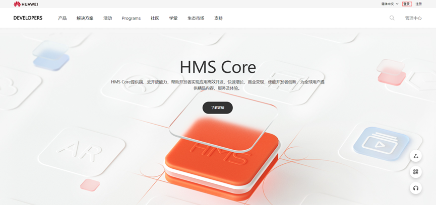
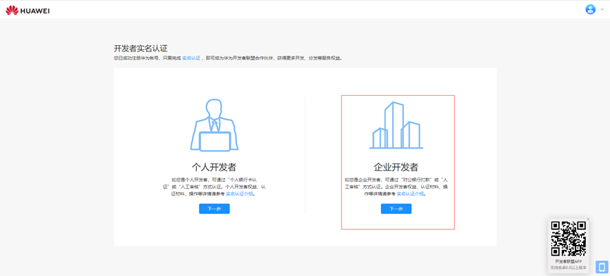
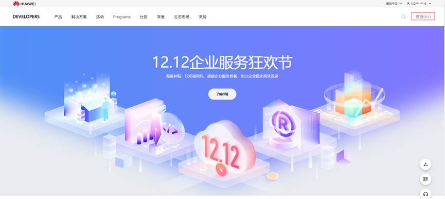
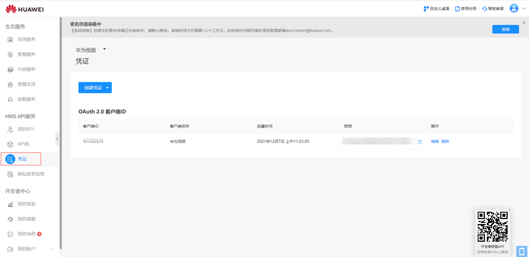
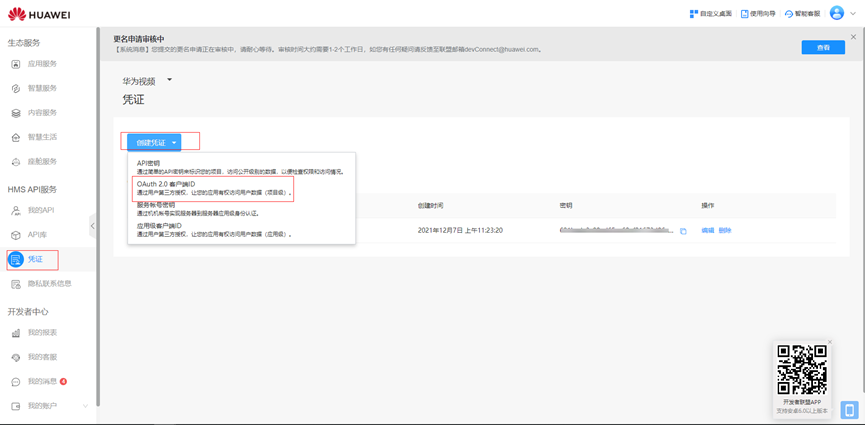
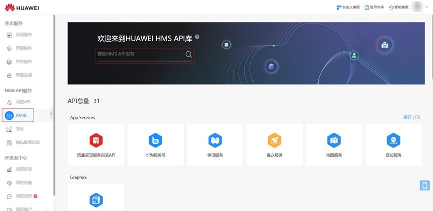
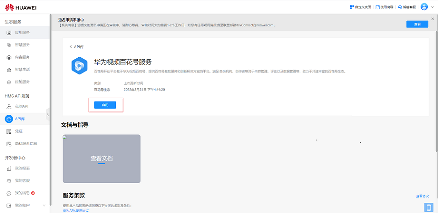

# 申请华为视频百花号开发

第一步：登陆华为开发者联盟，如未注册可点击[注册](https://id1.cloud.huawei.com/CAS/portal/userRegister/regbyemail.html?service=https://oauth-login1.cloud.huawei.com/oauth2/v2/login?access_type=offline&client_id=6099200&display=page&flowID=41d64dc6-f46e-410d-86c9-a8585d30f798&h=1648627332.7560&lang=zh-cn&redirect_uri=https%253A%252F%252Fdeveloper.huawei.com%252Fdevunion%252FopenPlatform%252Frefactor%252FhandleLogin.html&response_type=code&scope=openid%2Bhttps%253A%252F%252Fwww.huawei.com%252Fauth%252Faccount%252Fcountry%2Bhttps%253A%252F%252Fwww.huawei.com%252Fauth%252Faccount%252Fbase.profile%2Bhttps%253A%252F%252Fwww.huawei.com%252Fauth%252Faccount%252Floginid%2Bhttps%253A%252F%252Fwww.huawei.com%252Fauth%252Faccount%252Faccount.flags%2Bhttps%253A%252F%252Fwww.huawei.com%252Fauth%252Faccount%252Frealname%252Fstate%2Bhttps%253A%252F%252Fwww.huawei.com%252Fauth%252Faccount%252Frealname%252Fidentity%2Bhttps%253A%252F%252Fwww.huawei.com%252Fauth%252Faccount%252Frealname%252Fctf.type%2Bhttps%253A%252F%252Fwww.huawei.com%252Fauth%252Faccount%252Fstate.register&v=631a2b4fc4b432f1d16d644e8933749d0584b8eb6700c7943d956702f4a10f90&loginUrl=https://id1.cloud.huawei.com:443/CAS/portal/loginAuth.html&clientID=6099200&lang=zh-cn&display=page&device=null&state=null&loginChannel=89000000&reqClientType=89)进行注册。

地址：&lt;https://developer.huawei.com/consumer/cn/&gt;

第二步：如未进行实名认证需进行企业级实名认证。

第三步：进入管理中心。

成功通过申请的应用，client key，client secret，权限均可前往【管理中心】查看。

<strong>client secret</strong> <strong>切勿泄露</strong>。

如未创建应用可点击创建第三方应用。

第四步：搜索华为视频百花号，申请开放平台调用权限。

