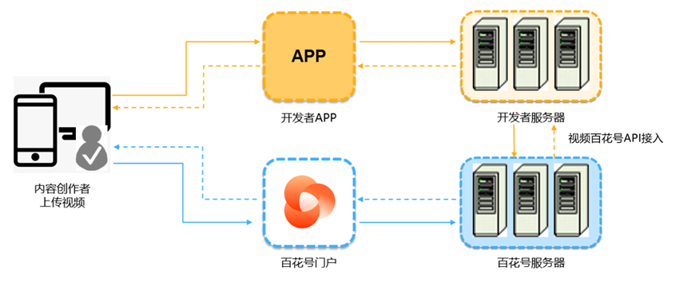
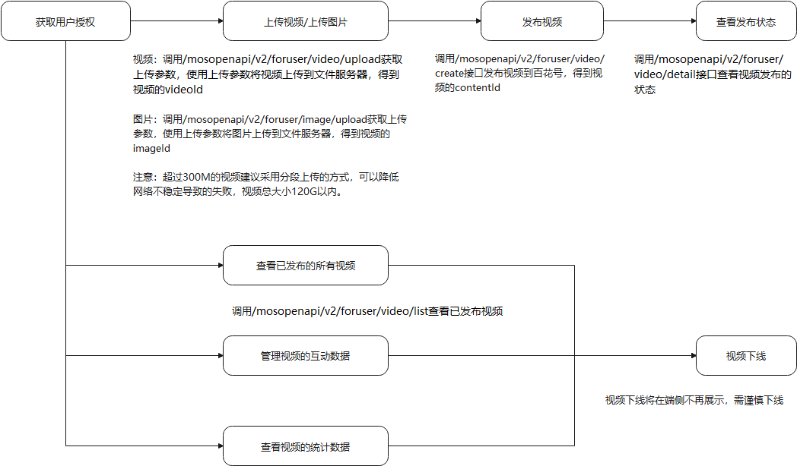

# 业务简介

华为视频百花号开放服务依托于华为视频百花号，向在开发者联盟中注册的的广大开发者提供视频管理、评论管理、数据统计等视频服务。和华为视频百花号建立合作关系的内容供给合作伙伴，可以通过华为视频百花号开放服务授权的三方应用，上传视频到华为视频百花号，并享受自助运营内容、发表和回复评论以及获取视频统计数据等配套服务，通过华为视频百花号多渠道分发和闭环商业。内容供给合作伙伴、开发者可以通过华为视频百花号开放服务与华为视频百花号共建健康的、可信的和可持续发展的华为视频内容生态。

主要功能

| 主要功能 | 功能描述 |
| --- | --- |
| 视频管理 | 您可以上传或者下线您创作的视频，视频类型包括横屏短视频和竖屏小视频。您可以对视频进行分类，给视频打上相关的标签，设定视频参加的运营活动以及其它的运营属性。 |

工作原理

华为视频百花号开放服务本次为开发者提供了Open API接入方式，Open API是华为视频百花号开放服务提供的一套RESTful API信息同步接口，提供简洁的方法供开发者调用。您可以直接调用华为视频百花号开放服务的Open API将您的视频内容同步给华为视频百花号。在视频内容同步到华为视频百花号后，用户可以在华为视频APP以及其它华为品牌的APP中使用您的视频内容，并同时按照您在华为视频百花号上签署的协议与华为分享收益。

实现流程

