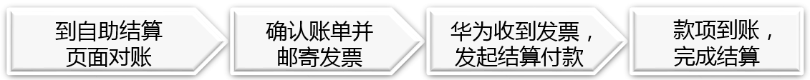

import MergeTable from '@site/src/components/MergeTable';

# 结算流程

该流程仅对注册地为中国大陆地区的开发者适用，注册地为中国大陆以外地区的开发者请参考英文文档。

## 1. 账单出具时间

接入华为支付的应用才涉及到结算，结算周期为月度，华为将在每个结算周期的第15天提供您上一个日历月应得收入的结算数据（“结算单”）。

## 2. 结算步骤

### 2.1 对账

(1)进入自助结算页面

登录[开发者联盟](https://developer.huawei.com/consumer/cn)，进入“管理中心”，单击“我的账户”，选择“收益”，进入自助结算页面查看结算单并确认结算单。

根据已签订的合作协议，合作伙伴可以在结算单出具后15个自然日内同华为对账并发起争议，如在15个自然日内未发起争议申请则视同无异议，系统自动进入支付处理流程（合作伙伴仍需提供发票）。

(2) 核对结算单

单击下载“结算单”或者“对账明细”，核对本月结算数据。

(3)确认结算单

如您对结算数据无异议，单击“确认结算单”提交结算申请，核对申付金额及收款银行等信息无误后，单击“提交”，提交后将无法取消。如需多个结算单合并开票，请确认同一个合同、同一业务类型相同的结算单方可进行合并开票（主题、主题会员不可合并开票）。

请务必先单击“确认结算单”，再邮寄发票和结算单，否则无法付款。

(4)打印结算单

单击“下载结算单”按钮，打印结算单第一页，企业开发者需加盖印章（公章或财务章），个人开发者需签字，连同发票一同寄给华为（邮寄地址在结算单上有说明）。

合并开票要逐个下载结算单。

### 2.2 发票开具与发送

(1)开具发票

按照确认的结算单金额开具发票，合并开票需将所选结算单中的“结算汇总信息-结算金额”加总，注意金额与发票金额要完全一致，不能有一分钱差异。

1.不同合同、不同业务类型不能合并开票， 比如“主题”不能与“主题会员”合并。

2.发票备注栏内需备注该张发票对应结算单的“结算期#业务类型”。例如：

单个结算期开票：“202303#主题”

连续结算期合并开票：如“202301~202304#主题会员”

不连续结算期合并开票：如“202301/202303/202304#主题”

(2)开票信息

对于企业开发者（一般纳税人或小规模纳税人），需开具增值税专用发票，不接受其他类型的发票。

对于个人开发者，需前往税务局申请代开增值税普通发票。开票内容应选“设计服务”。

<MergeTable
  headers={['华为公司开票信息', '']}
  rows={
    ['名称', '华为软件技术有限公司'],
    ['通讯地址', '南京市雨花台区软件大道101号'],
    ['邮编', '210012'],
    ['电话', '025-56621111'],
    ['传真', '025-56621111'],
    ['收款人名称', '华为软件技术有限公司'],
    ['开户银行', '中国工商银行股份有限公司南京三山街支行'],
    ['银行账号', '4301016539100121556'],
    ['税务登记号', '913201147770231720'],
    ['发票内容', '*设计服务']
  }
/>

开票信息上的银行账号不是回款账号，只供开票使用。

(3)发送方式

a.邮寄

邮寄所需材料：1.纸质发票；2.签字/盖章结算单

|  |  |
| --- | --- |
| 邮寄地址 | 中国四川省成都市高新西区西源大道1899号 |
| 邮编 | 611731 |
| 收件人 | 华为成都账务共享中心发票团队 |
| 电话 | 028-62844628 |

上述开票信息及发票邮寄信息在华为给开发者的结算单上也有说明，如与结算单上存在不一致，请以结算单信息为准。另，收件地址均不接收除发票、结算单之外的其他文件（如合同）。

b.邮箱发送(仅针对电子发票)

接收公邮：hwinvoice@huawei.com

附件材料要求：1.电子发票；2.结算单PDF附件；

|  |  |  |  |  |  |
| --- | --- | --- | --- | --- | --- |

<MergeTable
  headers={['标题', '华为软件技术有限公司发票+业务类型+结算期+实名名称', '', '', '', '']}
  rows={
    ['正文', '业务类型', '结算期', '发票号', '发票金额', '附件材料 电子发票 结算单PDF'],
    ['举例', '主题业务', '2022年12月', '12345678', '¥100', '附件材料： 2022年12月对应的电子发票与结算单PDF']
  }
/>

### 2.3 单据审核及付款

若您的付款单据被审核通过，结算页面的结算单状态会变为“付款中”（发起结算单付款）。

华为会收到合格有效的付款单据后30个自然日内付款。 若遇节假日可能顺延。付款完成后，结算单状态会变为“付款成功”。

### 2.4 完成结算

以发票签收时间起计算付款赎期，华为公司会在合同约定的付款赎期及时完成结算款项支付。

### 2.5 海外分发业务

如果您的产品分布在中国大陆以外的国家或地区，并且您已经与华为签订了在线协议，则无需开具发票。根据[《华为开发者商户服务协议》](https://developer.huawei.com/consumer/cn/doc/start/merchantserviceagreement-0000001052848245#section955516103403)附件C，华为将自行开票。

阿斯比格股份有限公司、华为服务（香港）有限公司结算流程：

1. 登录[开发者联盟](https://developer.huawei.com/consumer/cn/)，选择“管理中心&gt;我的账号&gt;收益”，查看结算单 ；
2. 下载并核对结算单。如您对结算单有异议，可以在合同约定的到期日之前提出争议。如在规定期限内未收到回复，本公司将视为您已同意结算金额。华为有权拒绝任何逾期的对账请求。
3. 确认结算单。同意结算数据后，点击“确认”按钮，提交结算申请。确认结算金额和收款银行无误后，点击确认。申请提交后不能撤回。
4. 付款。如结算单累积金额达200欧元，华为将在合同约定的赎期内完成结算金额的支付。

## 3. 其他注意事项

1. 所有账单数据以开发者联盟出具的结算单数据为准，因涉及到付费用户的多次下载及运营活动等，不以报表数据作为结算依据。
2. 涉及个人分成业务，付款时需由支付方代扣代缴个人所得税（即使个人开发者在当地税局开票时已经自主缴纳了个税，税局按照税法要求企业仍然需要代扣代缴；个人多缴部分，可由个人在做个税汇缴时申请退税）。
3. 累计几个月同时申请结算可能会导致多交税，由此产生的损失由开发者自行承担。
4. 如有疑问，请联系：付款咨询邮箱：hwconsulting@huawei.com；咨询热线028-62844628进行咨询。