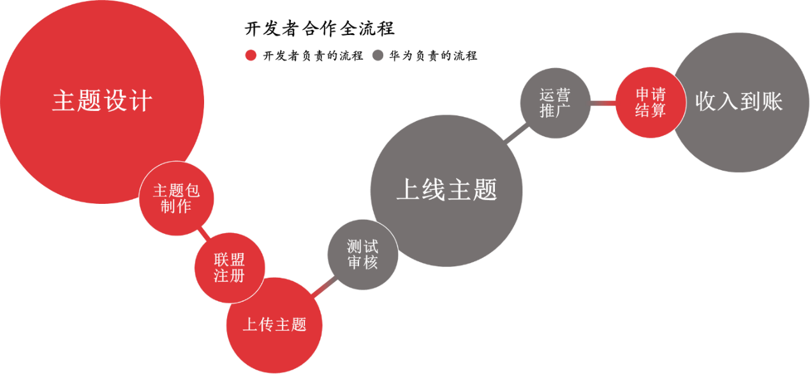

# 合作模式

## 合作范围

华为主题业务合作范围覆盖主题、字体、壁纸、动态壁纸、表盘、AOD熄屏主题、铃声、视频铃声、电子杂志、图文资讯等内容模块，企业或个人开发者设计开发出相关作品，上传到开发者联盟，测试审核通过后，上线至华为主题APP供全球消费者下载或购买。其中，字体、铃声、电子杂志、图文资讯合作目前只接受企业开发者入驻，电子杂志只接受高端杂志品牌伙伴入驻。

## 商务模式

按照主题版权归属、设计制作分工，付费免费等不同点，主要分为以下几种合作模式：

* 普通分成：普通开发者完成整个主题的设计开发，上线为付费主题，主题收入按照“华为:开发者=3:7”比例分成。
* 三方结算模式：三方模式指发布者上传版权方内容，且在上传时将版权方纳入结算分成主体之一，华为将主题收入分别结算给发布者和版权方。

实际分成比例以开发者上传作品时勾选比例为准。

## 合作流程

## 合作联系

个人/公司合作咨询，主题开发制作/测试相关咨询及投诉请联系邮箱：hwthemes@huawei.com；

邮件标题格式参考 ：【合作洽谈/问题咨询/侵权投诉】+设计师昵称