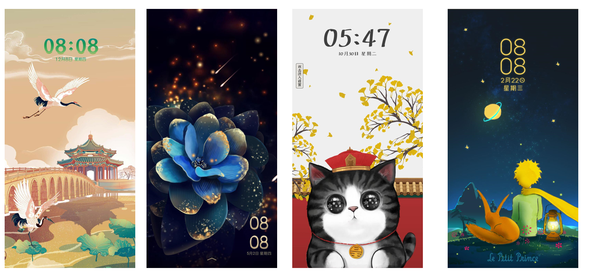
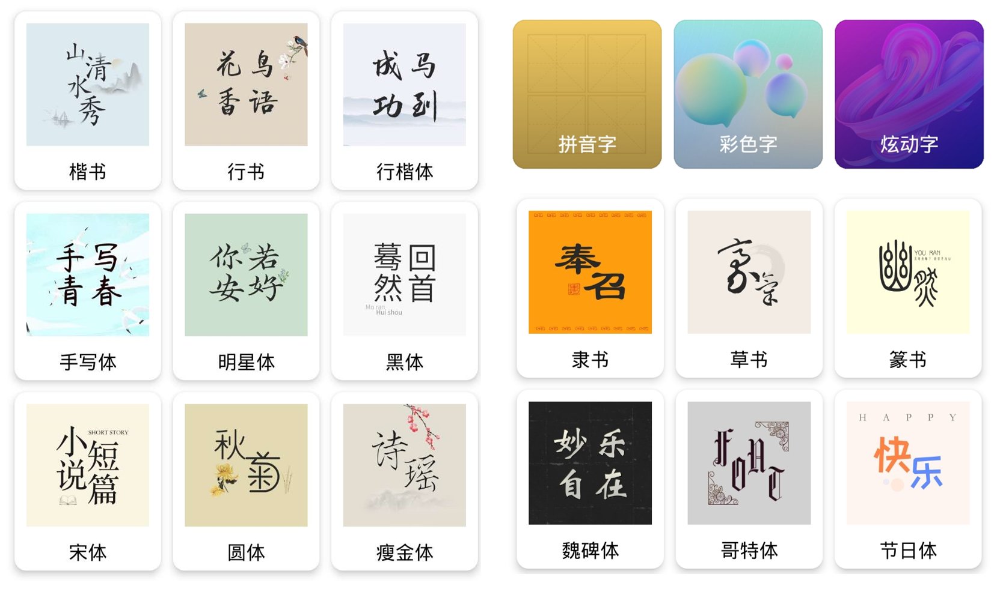
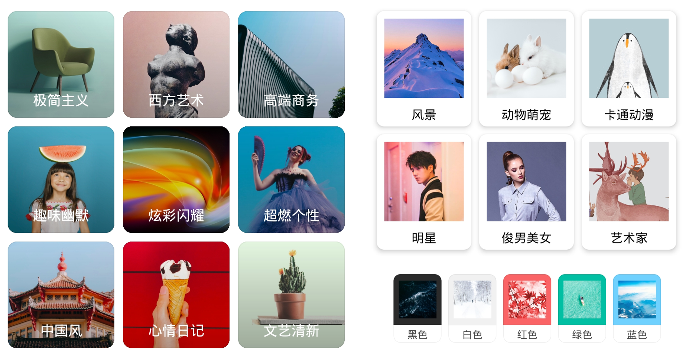
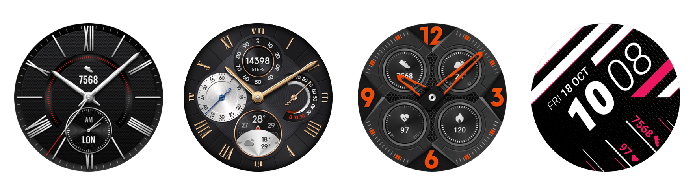
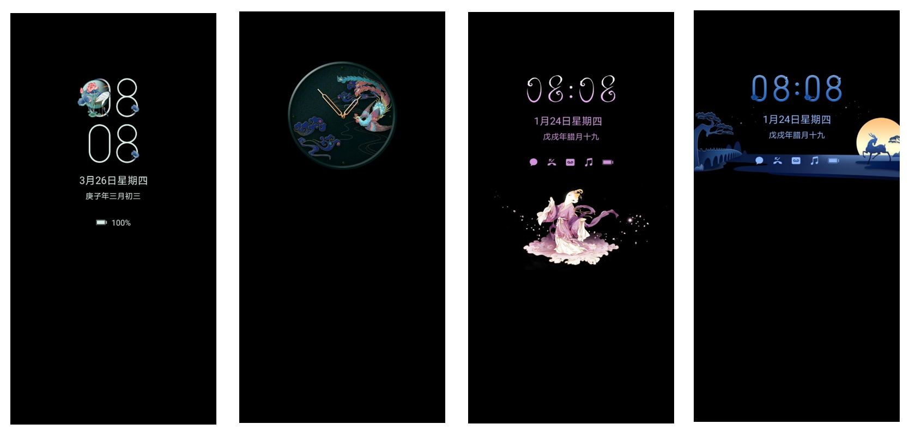

# 业务简介

华为主题是华为终端云服务体系核心应用之一，通过海量优质视觉内容，为消费者提供个性化的美学体验。作为华为相关系列产品用户界面情感化的重要组成部分，华为主题致力于为用户提供全场景个性化体验服务，目前已建成主题、字体、壁纸、动态壁纸、表盘、AOD熄屏显示、铃声、视频铃声、电子杂志、图文资讯等模块内容，覆盖华为相关系列产品。伴随着华为相关系列产品出货量的持续快速增长，华为主题的用户量也屡创新高。

## 主题

“主题”由企业或个人开发者设计开发，主要是对手机锁屏、壁纸、图标、通知栏、短信、拨号、联系人、设置等手机皮肤界面进行个性化设计。华为主题已上线海量优质主题内容，趣味交互、匠心设计、全景VR等各种进阶玩法尽显创造力。

## 字体

“字体”由专业字体厂商设计开发，是对手机界面所有可视文字进行美化。华为主题已上线各类精品字体，让不一样的文字之美，在用户指尖舞动。

## 壁纸

“壁纸”由企业或个人开发者设计开发，主要对手机锁屏及桌面背景进行美化设计。华为主题已上线多类风格精品壁纸库，世界影像，一手在握。

## 动态壁纸

“动态壁纸”由企业或个人开发者设计开发，是具备特殊动效的壁纸，创意新颖，更具灵动性。华为主题目前已上线海量精品动态壁纸，酷炫动效，新奇体验。

## 表盘

“表盘”由企业或个人开发者设计开发，是对华为系列手表以及手环界面进行美化设计。华为运动健康App目前已上线海量精品表盘主题，为用户提供个性化选择。

## AOD熄屏主题

“AOD熄屏主题”由企业或个人开发者设计开发，利用了OLED屏幕低功耗的特点，点亮时间和通知，方便至极。多彩AOD以不同时刻绚美多变的天色为灵感，随时间流转呈现多种颜色。华为主题提供了丰富的样式供用户选择。

## 铃声

“铃声”由专业铃声合作伙伴提供，为用户提供可设置为来电提醒、消息通知、闹钟响铃的手机音乐。华为主题已上线海量优质铃声资源，潮流音乐铃声每日更新，为用户提供悦耳享受。

## 视频铃声

“视频铃声”由企业或个人开发者设计开发，即附带背景音乐的动态视频，可设置为来电提示、锁屏或桌面背景。每一次来电提醒，都给用户带来视觉和听觉的双重享受，让来电更有趣。

## 电子杂志

华为主题杂志馆是华为主题推出的高端时尚内容聚合平台，汇聚高端品牌杂志，沉浸式创新体验形式，将精美的锁屏壁纸和高端电子刊资源进行整合，以杂志的形式进行呈现，给用户带来精致、高端的内容浏览体验。

## 图文资讯

华为主题为用户提供丰富的图文资讯内容，主要由旅行、汽车、明星、时尚、生活、体育、艺术和动漫等频道组成，为用户提供全屏图文的图流联动浏览方式，在观赏精美大图的同时阅读资讯。