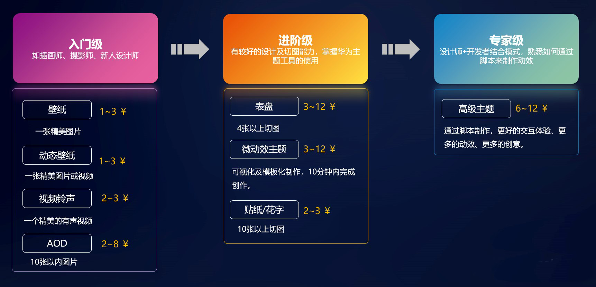
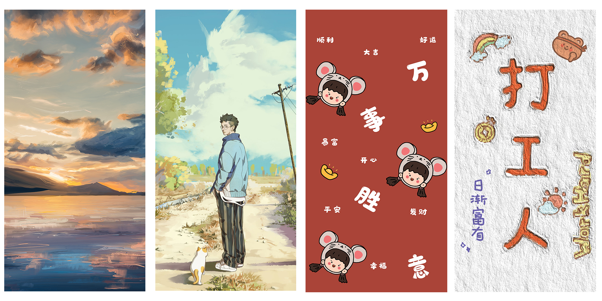
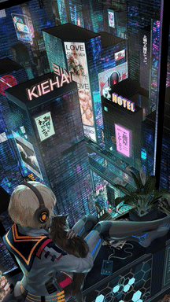
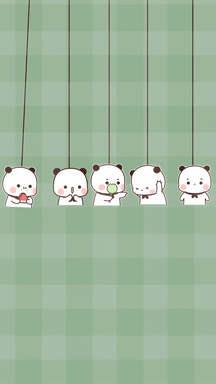
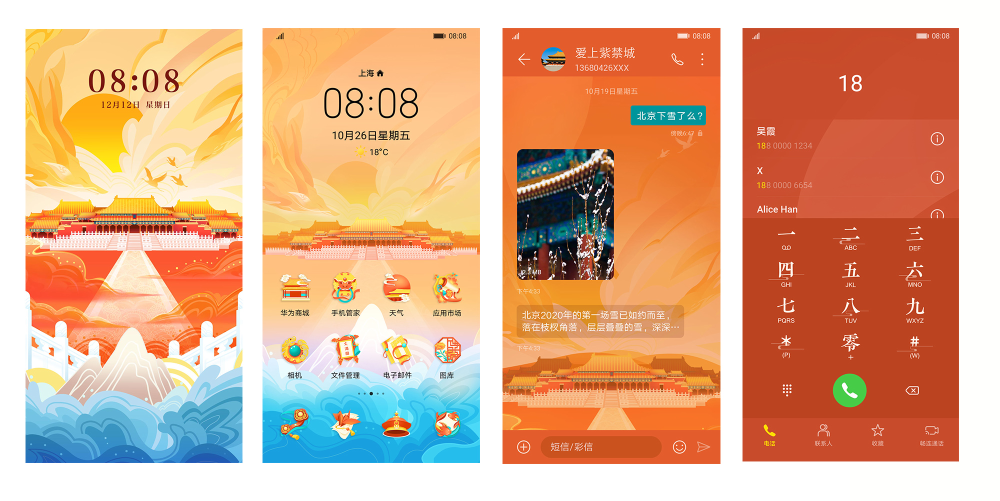
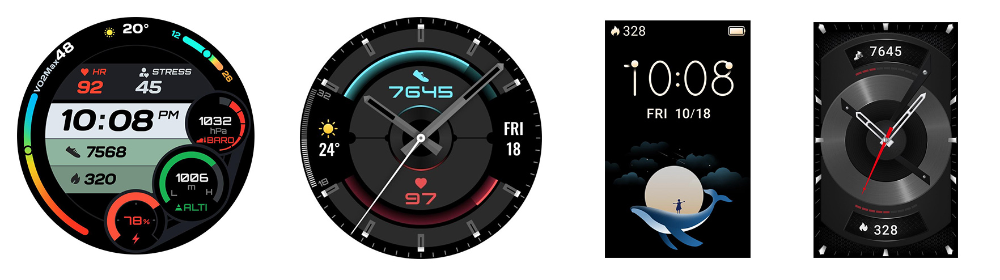

# 学习指导

在这里，将为您介绍怎么高效学习华为主题的整体业务，能找到合适的业务去输出产物。

## 1. 入门级

如果您是插画师，摄影师，新人设计师，拥有精美的图片设计能力，没有接触过主题业务，建议先了解这4方面内容，这些内容的素材数量少且易制作。

* 壁纸
* 动态壁纸
* 视频铃声
* AOD熄屏显示

### 1.1 壁纸

设计师可多种风格去设计壁纸。用户可在华为主题App里的壁纸栏目里挑选自己喜欢的壁纸，并可购买或免费下载，设置成自己手机的锁屏界面或者桌面背景，使手机更具有色彩性与多选择性。华为主题已上线多类风格精品壁纸库。

您只需要设计一张图就可以完成壁纸的制作。

学习建议：

a. 如果你想知道壁纸的制作规格是什么，可查看[壁纸规范](https://developer.huawei.com/consumer/cn/doc/distribution/content/wallpaper-specifications-0000001054789797)。

b. 如果你想知道制作好的壁纸是否符合规范，可查看[壁纸测试规范](https://developer.huawei.com/consumer/cn/doc/distribution/content/wallpaper-test-0000001057539336)。

c. 如果你想知道怎么上传壁纸 ，可查看[上传指南](/docs/distribute/content-dist/theme-center/content-release-0000001054679366/uploadguide-0000001054359939/wallpaper-upload-0000001055348466)。

### 1.2 动态壁纸

动态壁纸是具备特殊动效的壁纸，创意新颖。用户可在华为主题App里的动态壁纸栏目里挑选自己喜欢的动态壁纸，并可购买或免费下载，设置成自己手机的锁屏界面或者桌面背景，使手机更具有趣味性。华为主题目前已上线海量精品动态壁纸。您只需要准备一个MP4文件就可以制作动态壁纸了。

   

学习建议：

a. 如果你想知道动态壁纸的制作规格，可查看[动态壁纸规范](https://developer.huawei.com/consumer/cn/doc/distribution/content/livewallpaper-specifications-0000001055029722)。

b. 如果你想知道制作好的动态壁纸是否符合规范，可查看[动态壁纸测试规范](https://developer.huawei.com/consumer/cn/doc/distribution/content/livewallpaper-test-0000001057818928)。

c. 如果你想知道怎么上传动态壁纸，可查看[上传指南](/docs/distribute/content-dist/theme-center/content-release-0000001054679366/uploadguide-0000001054359939/livewallpaper-upload-0000001055068451)。

### 1.3 视频铃声

视频铃声是附带背景音乐的动态壁纸。用户可在华为主题App里的视频铃声栏目里挑选自己喜欢的视频铃声，可购买或免费下载，可设置成自己手机的来电铃声，锁屏界面或者桌面背景，使手机更具有好玩性。您只需要准备一个MP4文件就可以制作视频铃声了。

学习建议：

a. 如果你想知道视频铃声的制作规格，可查看[视频铃声规范](https://developer.huawei.com/consumer/cn/doc/distribution/content/video-ringtone-specifications-0000001054469755)。

b. 如果你想知道制作好的视频铃声是否符合规范，可查看[视频铃声测试规范](https://developer.huawei.com/consumer/cn/doc/distribution/content/videoringtone-test-0000001057258921)。

c. 如果你想知道怎么上传视频铃声，可查看[上传指南](/docs/distribute/content-dist/theme-center/content-release-0000001054679366/uploadguide-0000001054359939/livewallpaper-upload-0000001055068451)。

### 1.4 AOD熄屏显示

AOD熄屏显示是用图片设计成熄屏显示，点亮时间和通知，方便至极。用户可在华为主题App里的熄屏显示栏目挑选自己喜欢的AOD，可购买或者免费下载，并应用在熄屏上，为用户节约开手机看时间的时间成本以及亮屏动作，以及为用户的时间显示提供了多样性。华为主题提供了丰富的样式供用户选择。

您只需要设计时间/时钟图片/一张背景图就可以完成AOD的制作。

学习建议:

1. 如果你想知道AOD的制作规格是什么，可查看[AOD规范](/docs/distribute/content-dist/theme-center/development-tutorial-0000001054519376/aod-0000001054371157/aod-specification-0000001057549640)。
2. 如果你准备好资源了，想知道怎么用工具制作AOD，可查看[AOD视频教程](/docs/distribute/content-dist/theme-center/development-tutorial-0000001054519376/aod-0000001054371157/aod-video-0000001057311470)。工具：点击“[下载](https://developer.huawei.com/consumer/cn/doc/distribution/content/themes-design-tools-0000001054531194)”。

3. 如果你想知道制作好的AOD是否符合规范，可查看[AOD测试规范](https://developer.huawei.com/consumer/cn/doc/distribution/content/aod-test-0000001056821215)。
4. 如果你想知道怎么上传AOD，可查看[上传指南](/docs/distribute/content-dist/theme-center/content-release-0000001054679366/uploadguide-0000001054359939/themes-upload-0000001055029726)。

## 2. 进阶级

如果您是有较好的设计及切图能力，有使用编辑主题工具的经历，可以先了解这4个方面内容，这些内容需要耗费较多时间制作图片素材。

* 手机主题
* 表盘主题

### 2.1 手机主题

手机主题主要是对手机锁屏、壁纸、图标、通知栏、短信、拨号、联系人、设置等手机皮肤界面进行个性化设计。

用户可在华为主题App里的主题栏目挑选自己喜欢的主题，试用之后觉得满意的话，可购买或者免费下载其主题，手机的锁屏，桌面背景，图标等模块都会是新的模样，这使整部手机都焕然一新，具有吸引性。华为主题已上线海量优质主题内容。

您需要提前设计好锁屏图片，壁纸，图标，气泡等资源，设计好后就可以导入手机主题工具快速制作手机主题了。

手机主题根据EMUI系统可分为：

1. EMUI11.0手机主题
2. EMUI10.1升级11.0手机主题
3. EMUI9.1升级10.1手机主题
4. EMUI8.0升级9.1手机主题

学习建议：

a. 如果你想知道手机主题的制作规格是什么，可查看[手机主题规范](/docs/distribute/content-dist/theme-center/development-tutorial-0000001054519376/mobile-themes-0000001054531192/themes-specification-0000001160896163)。

b. 如果你准备好资源了，想知道怎么用工具制作手机主题，可查看[手机主题视频教程](/docs/distribute/content-dist/theme-center/development-tutorial-0000001054519376/mobile-themes-0000001054531192/themes-video-0000001061379764)。工具：点击“[下载](https://developer.huawei.com/consumer/cn/doc/distribution/content/themes-design-tools-0000001054531194)”。

c. 如果你想知道制作好的手机主题是否符合规范，可查看[主题测试审核规范](/docs/distribute/content-dist/theme-center/content-release-0000001054679366/content-review-specifications-0000001054679960/content-check-pecifications-0000001057301166/harmonyos5-theme-test-0000002318301165)。

d. 如果你想知道怎么上传手机主题，可查看[上传指南](/docs/distribute/content-dist/theme-center/content-release-0000001054679366/uploadguide-0000001054359939/themes-upload-0000001055029726)。

### 2.2 表盘主题

表盘主题是对华为系列手表以及手环界面进行美化设计。用户可在华为运动健康App里的表盘市场栏目里挑选自己喜欢的主题，购买或者免费下载，并应用在自己的手表或者手环上，为表上显示的信息多样化，并具有设计性。目前已上线海量精品表盘主题，为用户提供个性化选择。您需要提前设计好背景图，指针，时间切图等，设计好后这些资源就可以导入表盘工具快速制作表盘主题了。

表盘现在分为：

1. 智能手表
2. 通话手环
3. 运动手环

学习建议：

a. 如果你想知道表盘主题的制作规格是什么，可查看[表盘主题规范](/docs/distribute/content-dist/theme-center/development-tutorial-0000001054519376/watchface-0000001054571181/basic-concepts-0000001207883464/watch-face-introduction-0000001566918497)。

b. 如果你准备好资源了，想知道怎么用工具制作表盘主题，可查看[表盘主题制作教程](/docs/distribute/content-dist/theme-center/development-tutorial-0000001054519376/watchface-0000001054571181/watch-face-production-0000001573924705/preparation-0000001574244245)。工具：点击“[下载](https://developer.huawei.com/consumer/cn/doc/distribution/content/themes-design-tools-0000001054531194)”。

c. 如果你想知道制作好的表盘主题是否符合规范，可查看[表盘主题测试规范](/docs/distribute/content-dist/theme-center/content-release-0000001054679366/content-review-specifications-0000001054679960/content-check-pecifications-0000001057301166/sportwatch-test-0000001057059331)。

d. 如果你想知道怎么上传表盘主题，可查看[上传指南](/docs/distribute/content-dist/theme-center/content-release-0000001054679366/uploadguide-0000001054359939/sportwatch-upload-0000001054469759)。（智能表GT系列和智能手环band系列上传步骤一致）。

## 3. 专家级

如果您是设计师+开发者结合模式，熟悉如何通过xml脚本来制作动效，可以先了解这个方面，这个内容需要您熟悉华为官方主题引擎的基础功能，以便于将它们结合起来制作有创意的主题。

### 3.1 高级主题

高级主题是基于华为引擎制作的，使用xml用特定的语法描述锁屏界面。在一定需求下，在手机主题工具之上，运用引擎中的基础功能，动效和高级动效开发风格多变的用户界面。用户可在华为主题App里的主题栏目挑选自己喜欢的主题，试用之后觉得满意的话，可购买或者免费下载其主题，尤其是手机的锁屏，有解压类的，游戏类的，唯美类的等等，变得丰富动态化，也具有非常大的吸引力。

您需要提前准备好动态的切图资源，就可以用引擎的脚本编写你所想的动态效果。

a. 如果你想了解引擎是什么，可查看[引擎概述](https://developer.huawei.com/consumer/cn/doc/distribution/content/themes-engine-overview-0000001054588463)；

b. 怎么应用引擎的2D基础动效，可查看[详情文档](https://developer.huawei.com/consumer/cn/doc/distribution/content/alphaanimation-0000001073980103)；

2D基础动效在锁屏上可制作简单的动效，比如鸟儿飞翔，星星闪烁，大雾散去等场景。

c. 怎么应用引擎的2D高级动效，例如跟手粒子，可查看[详情文档](https://developer.huawei.com/consumer/cn/doc/distribution/content/particleview-0000001074104113)；

2D高级动效在锁屏上可制作有交互性的动效，比如点击水面，产生水波纹效果；擦拭屏幕，可显示最底层一张图等场景。

d. 怎么应用引擎的基础功能，可查看[详情文档](https://developer.huawei.com/consumer/cn/doc/distribution/content/text-0000001074068045)；

基础功能在锁屏上可制作多样式简单以及复杂的动效，比如随着时间流逝，锁屏图片不断更换；摇晃手机，播放锁屏上的动效等场景。