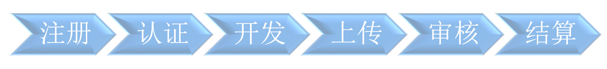
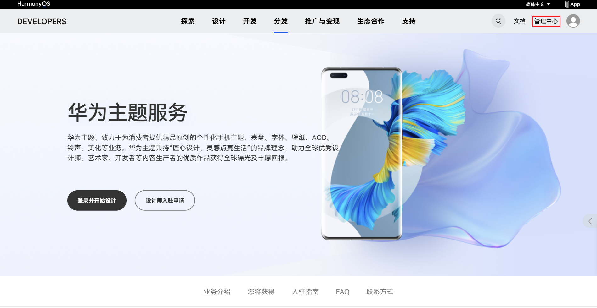
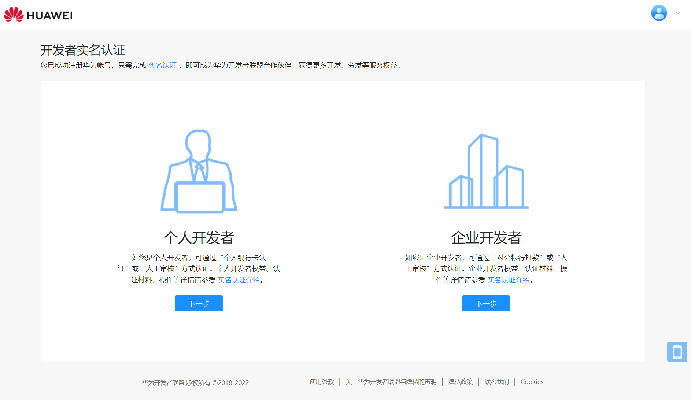
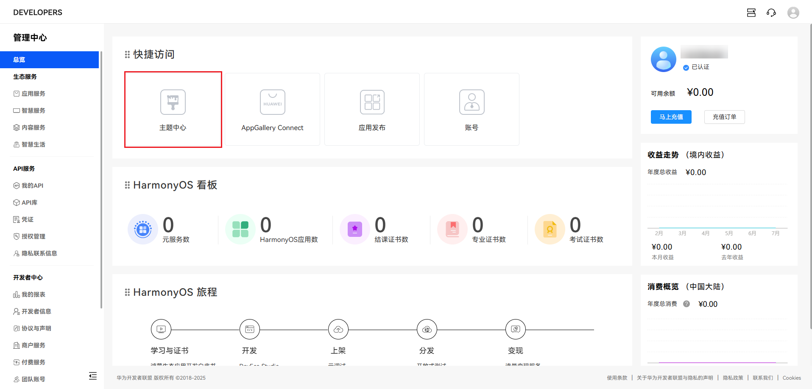
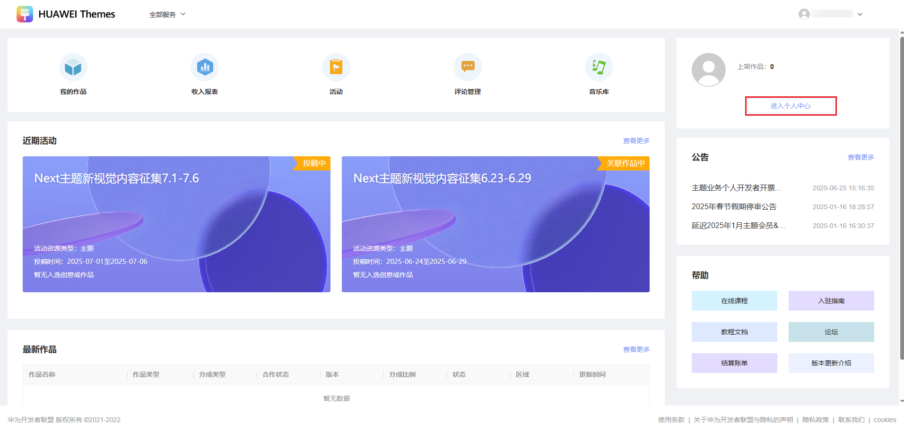
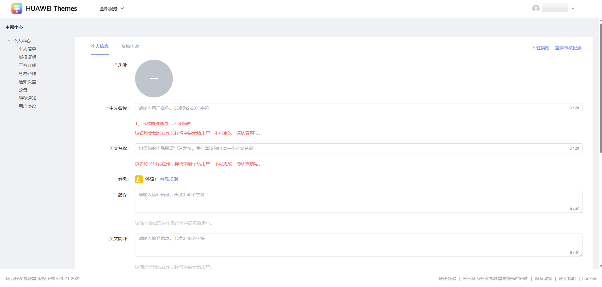
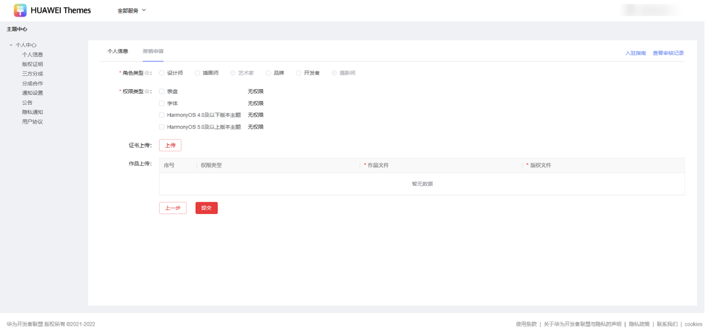
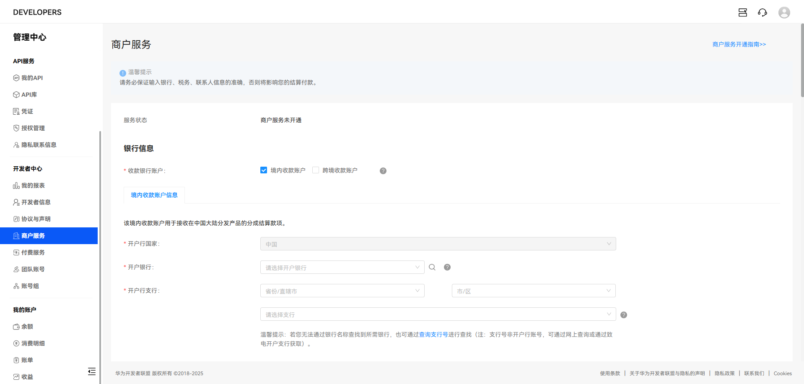

import MergeTable from '@site/src/components/MergeTable';

# 入驻指导

## 1. 开发者联盟注册指南

入驻华为主题需先注册华为开发者联盟账号，详见[注册认证](https://developer.huawei.com/consumer/cn/doc/start/registration-and-verification-0000001053628148)。

## 2. 华为主题认证设计师入驻申请

为了保障主题市场良性健康的发展，能够为用户提供更好更优质的主题作品，我们将对有意向入驻的设计师进行资格审核，通过的设计师我们将为您开通作品上传及分发权限，具体要求如下：

### 2.1 主题认证设计师入驻条件

(1) 个人设计师、设计公司、插画师、学生、在职人员均可。

(2) 具备优秀色彩搭配、高超审美水平、非凡创意及精湛手绘技能者优先。

(3) 具备一个或多个华为主题业务模块的作品设计、制作、开发能力，并提交完整作品、版权证明文件或作品源文件。

(4) 保证作品原创性，且可持续在平台提供优质作品，一旦发现作品侵权事件，平台将做封号处理，并追究相关法律责任。

<strong>角色类型：</strong>

| 角色类型 | 申请要求 |
| --- | --- |
| 设计师 | 具备基础设计、创作或开发等能力，有良好审美水平。 |
| 插画师 | 暂不接受入驻申请。 |
| 品 牌 | 暂不接受入驻申请。 |
| 开发者 | 暂不接受入驻申请。 |
| 摄影师 | 仅官方邀请者可申请。 |
| 艺术家 | 仅官方邀请者可申请。 |

<strong>权限对应能力及所需提交内容：</strong>

<MergeTable
  headers={['权限类型', '对应开放的能力', '所需提交内容', '作品文件包上传要求', '版权文件上传要求']}
  rows={
    ['HarmonyOS 4.0及以下版本主题', 'HarmonyO S 4.0及以下版本主题 壁纸 动态壁纸 AOD', '主题预览图、预览视频：2套及以上。 需包含：锁屏预览图、桌面预览图、图标设计图（至少包含25个图标）、预览视频', { text: '1、格式：zip格式文件包 2、大小：zip包＜50MB，解压后文件＜100MB ，文件个数＜50个 3、包内文件格式：仅支持JPG/PNG/MP4/PDF，MP4仅支持解编码H.264的文件。包内文件名称仅支持中英文及数字，不能使用特殊字符。', rowspan: 6, colspan: 1 }, { text: '1、格式：zip格式文件包 2、大小：zip包＜50MB，解压后文件＜100MB ，文件个数＜15个 3、包内文件格式：仅支持JPG/PNG/MP4/PDF，MP4仅支持解编码H.264的文件。包内文件名称仅支持中英文及数字，不能使用特殊字符。', rowspan: 6, colspan: 1 }],
    ['HarmonyOS 5.0及以上版本主题', 'HarmonyOS 5.0及以上版本主题 壁纸 动态壁纸 AOD 耳机弹窗 百变卡片 Next图标', '主题权限： 1套主题的创意提案PDF和预览视频 (创意提案需包含：创意简介、交互说明、AOD、锁屏、桌面、图标、耳机弹窗、充电特效，三种设备类型展示，请参考模板： 创意提案示例.pptx ) Next图标权限： 1套图标作品包含100个图标；或是2-3套不同风格的图标作品，每套10-20个图标。（此权限申请通过后仅能上传Next图标，无法上传主题）', null, null],
    ['表盘', '表盘', '表盘预览图、预览视频：5套及以上。 每套需至少包含作品预览图、预览视频1个。', null, null],
    ['字体', '静态字体', '字体作品案例：40套及以上 版权证明：需提供公司相关介绍、资质（营业执照）、字体库总量信息及不少于40套字体作品案例及作品对应的版权证书。 说明： 在版权文件上传处上传包含上述要求的PDF合集文件。', null, null],
    ['百变卡片', '百变卡片', '提交4张百变卡片的预览图，不限制卡片规格。', null, null],
    ['输入法皮肤', '输入法皮肤', '2套输入法皮肤预览图，每套包含1个9键和1个26键的视觉预览。', null, null]
  }
/>

<strong>HarmonyOS 4.0及以下版本主题权限、HarmonyOS 5.0及以上版本主题权限，勾选任一个，都会同时选中，且HarmonyOS 4.0及以下版本主题权限不可再单独申请</strong>。

<strong>作品及版权证明文件要求：</strong>

1. 不可使用无版权/免版权/AI生成素材。
2. 所有作品申请均需提供作品对应的设计源文件工作界面截图，需清楚看到关键图层信息（最好提供PSD文件录屏mp4），Theme Studio/Theme Studio Pro操作界面截图不能作为原创证明文件。
3. 涉及IP类作品需提供版权证明文件或授权证明文件。
4. 可在版权文件上传处提供个人介绍或简历（如有商业合作案例请在简历中展示），社媒账号界面截图或者网址链接（站酷/涂鸦王国/微博/小红书/ins等等）。

<strong>其他说明：</strong>

1. <strong>以下操作或将导致申请驳回：</strong>在“作品上传”入口上传非作品预览图的内容，包括但不限于：版权文件、原创证明、个人简历等。
2. 限制申请：审核被驳回后，审核意见中如有注明间隔期，请按审核意见执行。间隔期内多次以相同作品申请会被判定为恶意申请，可能会被限制申请功能（1~3个月）。
3. 包含商业化/广告信息的作品资源，不属于内容合作范畴，请联系[鲸鸿动能广告](https://developer.huawei.com/consumer/cn/doc/distribution/promotion/ads_lxwm01-0000001192387242)沟通合作详情。

### 2.2 入驻方式

（1）注册开发者联盟账号并完成实名认证，详见：[注册认证](https://developer.huawei.com/consumer/cn/doc/start/registration-and-verification-0000001053628148)。

（2）登录开发者联盟账号后，单击右上角“管理中心”。

（3）选择开发者主体完善信息后进行实名认证。

（4）认证后进入以下页面单击左侧任务栏“内容服务”选项后，单击进入“主题中心”，完善“个人信息”和“资格申请”并提交。

进入设计师权限申请界面：

完善“个人信息”：

选择所需开通的权限，提交“资格申请”：

（5）完成“开发者实名认证”、“个人信息”、“资格申请”后，请确认商户服务认证是否已开通，确认路径：设置-&gt;商户服务。如果您的商户服务认证状态如下图所示，则需完成商户服务认证申请，详情参考：[商户服务](https://developer.huawei.com/consumer/cn/doc/start/merchant-service-0000001053025967)。

（6）完成个人信息、资格申请、商户服务认证申请后，请耐心等待审核。个人信息和资格申请审核一般需要10个工作日，商户服务认证审核一般需要3-5个工作日。审核通过后即可上传并分发内容。

## 3. 开发

学习开发设计规范，下载[开发工具](/docs/distribute/content-dist/theme-center/development-tutorial-0000001054519376/themes-tools-0000001104440212/themes-design-tools-0000001054531194)，详见[开发教程](/docs/distribute/content-dist/theme-center/development-tutorial-0000001054519376/mobile-themes-0000001054531192/themes-specification-0000001160896163)。

## 4. 上传

详见内容上架-&gt;[内容上架流程](/docs/distribute/content-dist/theme-center/content-release-0000001054679366/content-listing-0000001054519978)、[内容上传指南](/docs/distribute/content-dist/theme-center/content-release-0000001054679366/uploadguide-0000001054359939/themes-upload-0000001055029726)。

## 5. 审核

详见内容上架-&gt;[审核规范](/docs/distribute/content-dist/theme-center/content-release-0000001054679366/content-review-specifications-0000001054679960/content-pricing-specifications-0000001096951357)。

## 6. 结算

详见新手指南-&gt;[结算流程](/docs/distribute/content-dist/theme-center/beginner-guide-0000001054200638/checkout-process-0000001055868899)。

-&gt;[设计师入驻常见FAQ](https://developer.huawei.com/consumer/cn/doc/distribution/content/faq-0000001055159128)