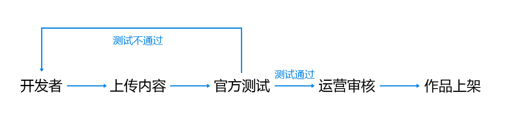

# 内容上架流程

## 1. 上架流程

1.1 开发者通过开发者联盟上传作品。

1.2 官方团队对作品质量与内容进行测试审核。

1.3 运营团队对作品的内容质量进一步审核。

1.4 作品质量与内容审核测试过关便可上架。

## 2. 角色

| 角色 | 说明 |
| --- | --- |
| 开发者 | 作品提供方，负责提供内容资源。 |
| 官方测试 | 官方的测试人员，负责对开发者上传的内容进行测试反馈。 |
| 运营审核 | 官方的审核团队，负责对开发者上传的内容进行初审、终审、上架。 |