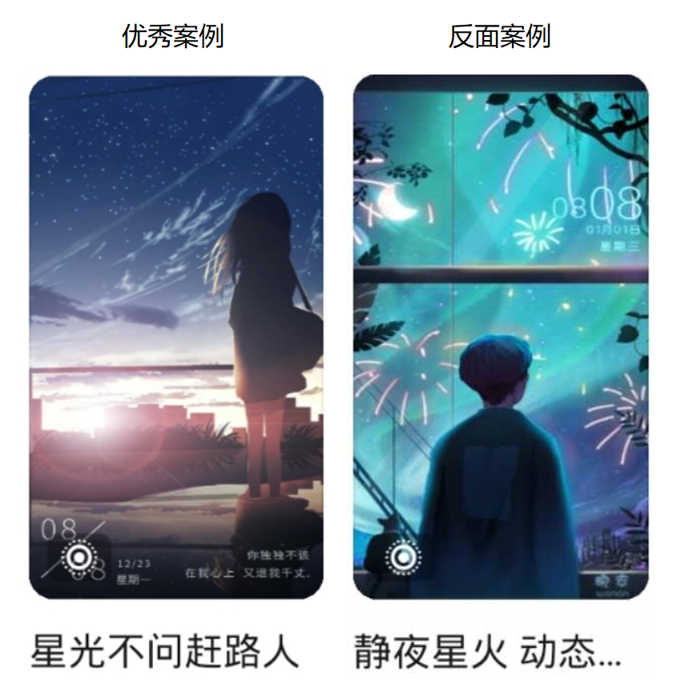
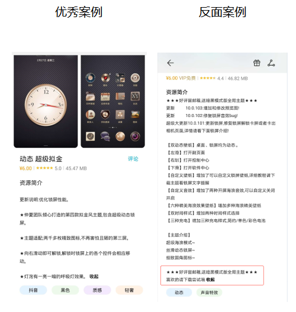
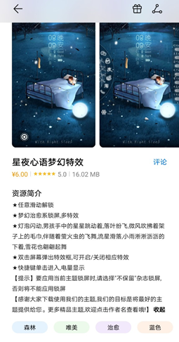
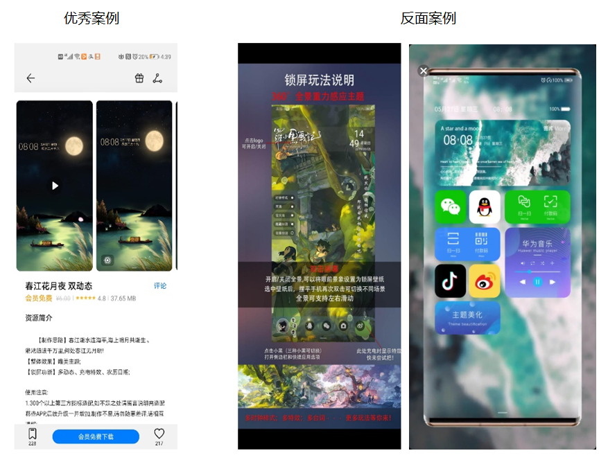
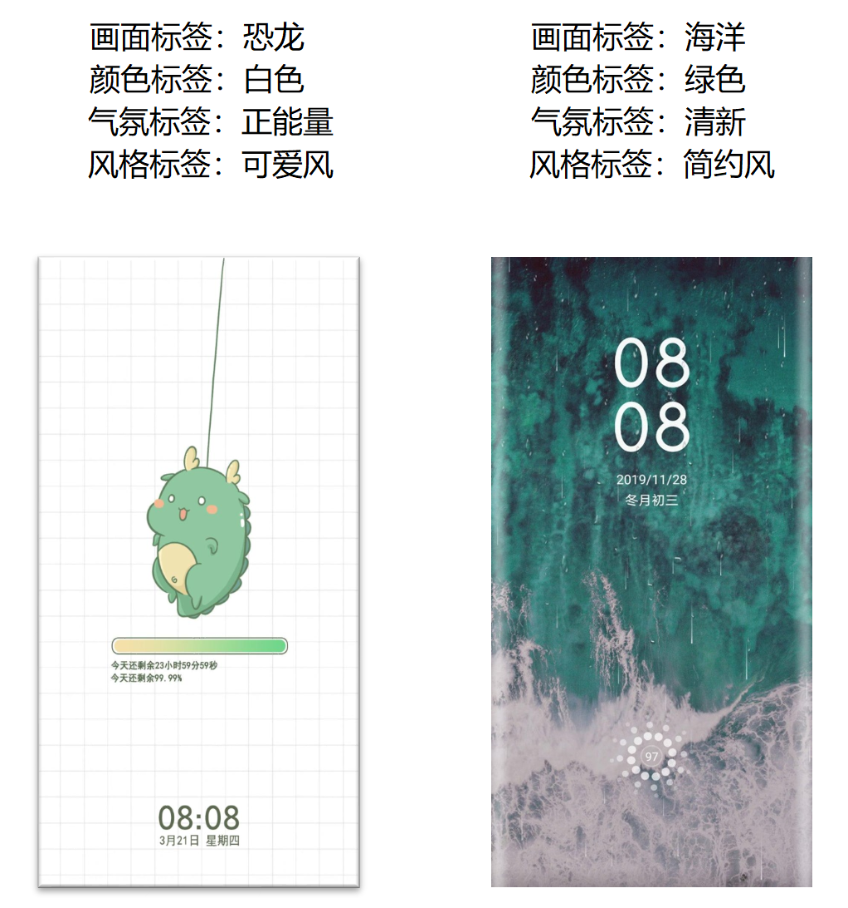

# 内容信息规范

## 1. 资源命名规范

(1)资源名称符合信、达、雅的要求，以文雅、简洁为佳，名称字数不超过10个中文字（含标点、空格）；

(2)资源名称不可包含特殊符号、敏感词汇、不可与官方资源名称雷同、不可包含第三方广告信息。

## 2. 资源简介规范

（1）建议从“创意介绍”“功能介绍”“更新日志”三个维度对资源进行介绍；简介中不可出现福利、返现、赠送等诱导用户购买或下载的内容；不可出现联系方式、个人信息等字眼。

（2）为更好地向用户推荐不同的主题资源，建议您可在简介中多描述关于画面所传递出来的气氛、情感等信息。

优秀案例：

## 3. 资源预览图规范

(1) 建议采用小视频的方式向用户展示资源特色，视频要求：大小不超过10M， 尺寸：1080\*1920或1080\*2340。

(2)为保证用户的良好体验，请尽量减少使用“说明书式”的预览图。

(3)为保持页面体验的一致性，不可制作“带手机”样式的cover图和预览视频。

(4)为保持合规性，画面、图标等内容均不可带有“金钱元素或货币符号”。

(5)预览图要保持完整，尺寸要符合规范，切图不能有大片的留白。

(6) 上传地图、地球元素时，不能出现明显能分辨国家地区轮廓的地图、地球等设计。

(7) 图片，内容中不可含有低俗及辱骂性语言。

## 4. 关键词规范

（1）关键词分为“画面标签”“颜色标签”“气氛标签”“风格标签”4个维度，您可根据主题资源进行关键词勾选。关键词包含但不限于以下标签，详见联盟管理台标签体系。

（2）设计师在上传作品时，根据以下要求对画面主体打标签。

| 标签 | 必打个数 |
| --- | --- |
| 画面标签 | 1个 |
| 气氛标签 | 1个 |
| 风格标签 | 1个 |
| 颜色标签 | 1个 |

（3）为提升标签的准确度，建议您不要打同义词标签和无意义标签。

（4）资源类型名称（例如：表盘，壁纸，锁屏，主题等），不能作为内容标签进行勾选。

## 5. 其他规范

(1)主题包内不可带广告apk，锁屏不可带外部链接，不可在主题包内放置任何与主题无关的营销内容。

(2)游戏、影视和明星以上三类资源，上架需进行统一评审，评审通过后方可上架。

(3)不可上传生肖及百家姓系列相关资源，如有需求平台会进行征集。

(4)视频铃声和动态壁纸不能是同一素材上传。

(5)不可在作品名字中描述功能或版本。