# 设计元素规范

## 1. 主题、锁屏、壁纸资源设计规范

华为主题致力于传达生活美学，享受美好生活的理念，欢迎设计师提供文雅、商务等风格的优质资源。

优秀案例：

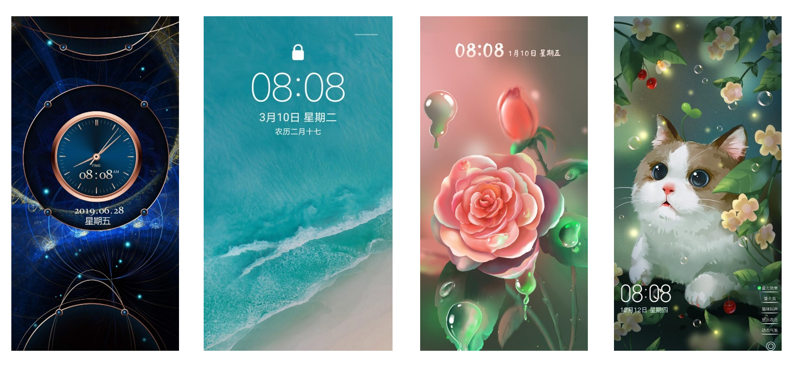

建议设计尽量遵守以下原则：

* <strong>风格协调性</strong>

壁纸、图标的整体风格需要一致，例如：商务风格图标不可结合卡通类壁纸上架。

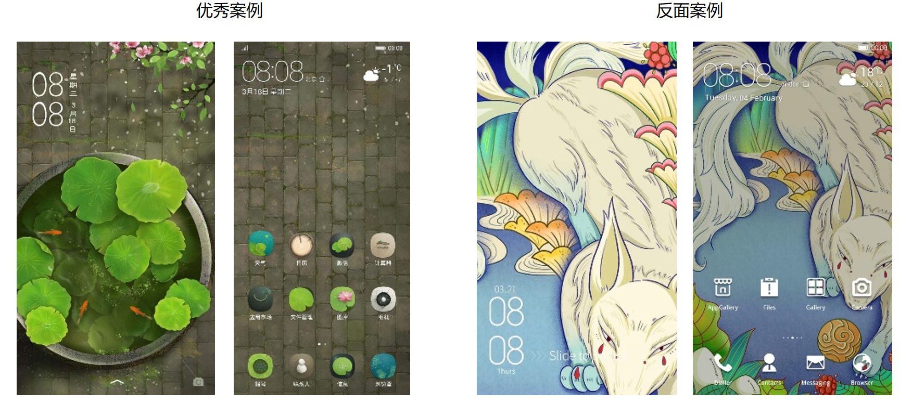

* <strong>图标可识别性</strong>

在保证整体和谐前提下，建议图标、文字颜色与壁纸颜色有一定区别，清晰可识别。

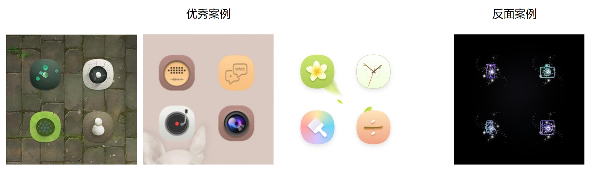

* <strong>交互准确性</strong>

实际应用效果、预览图应与描述说明一致，交互类不可出现bug，例如：离高考还剩\*\*天，具体剩下时间却不显示或显示错误。

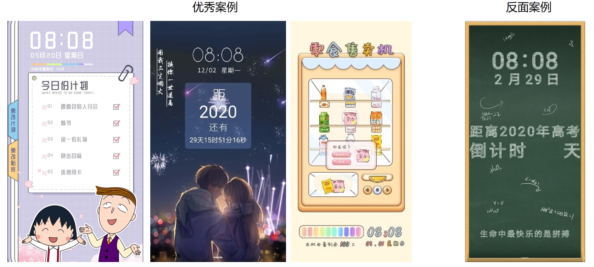

* <strong>色彩合理性</strong>

色彩搭配和谐，不建议出现视觉上会引起不适感的配色。

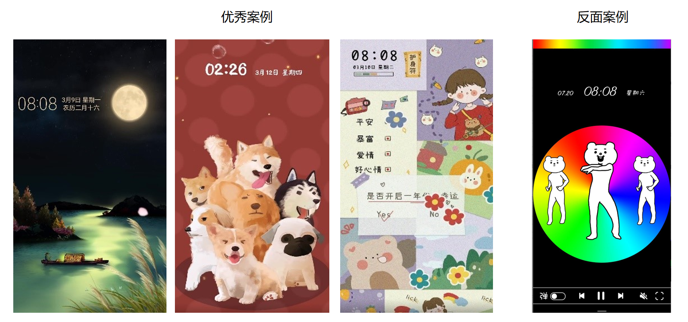

* <strong>搭配创意性</strong>

不建议使用简单拼凑、无美感的图片。

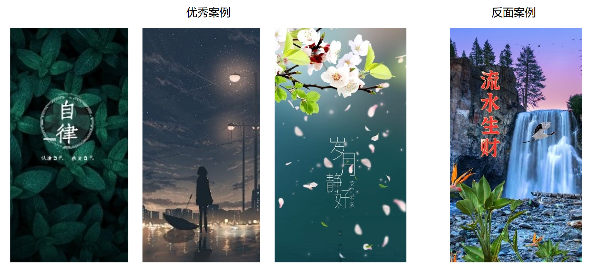

* <strong>构图美观性</strong>

不建议使用画面变形杂乱、马赛克等素材，保持画面简洁清晰。

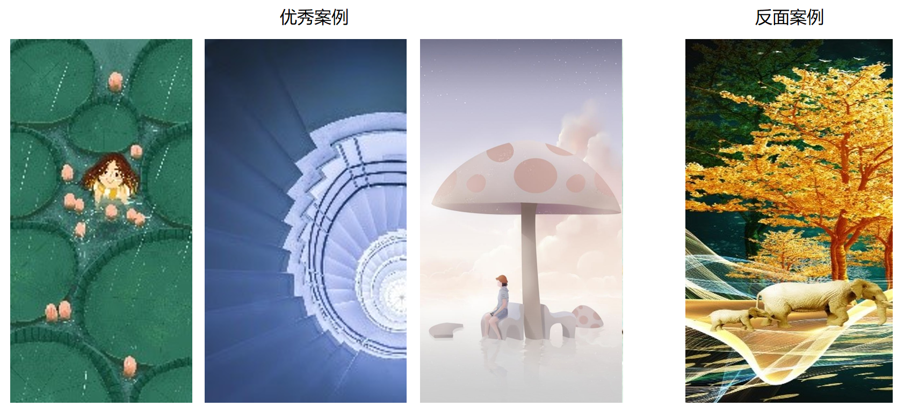

* <strong>壁纸清晰度</strong>

不建议使用模糊图片，否则影响用户视觉体验。

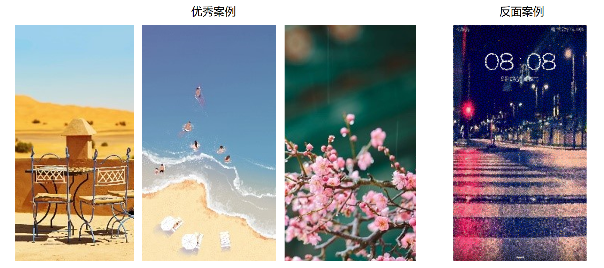

* <strong>避免同质化</strong>

避免上传同质程度过高的内容，不能仅修改颜色、个别元素、动效后再次上传；

常见误区：百家姓内容（仅改变姓氏字及画面颜色）、星座内容（仅改变星座图及动态效果）等。

反面案例：

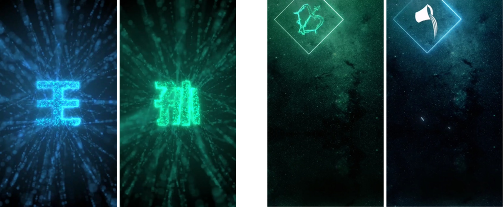

## 2.字体资源规范

建议字体资源遵守以下原则：

* <strong>风格协调性</strong>

建议封面图风格与字体风格保持一致，例如：书法字体不建议使用卡通可爱的设计背景。

优秀案例：

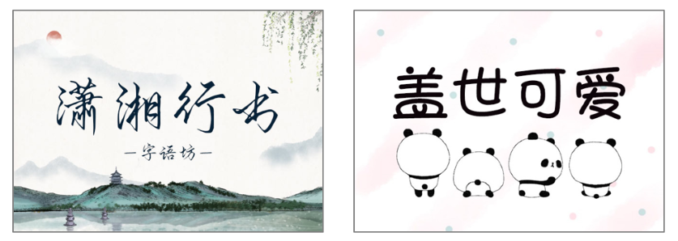

* <strong>可识别性</strong>

封面背景设计不建议与字体颜色相近，否则影响文字的识别。

优秀案例：

* <strong>准确性</strong>

预览图设计不建议采用夸张的设计效果，否则与实际字体效果不符。

优秀案例：

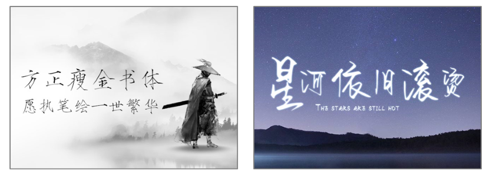

* <strong>色彩合理性</strong>

色彩搭配和谐，不建议出现视觉上会引起不适感的配色。

优秀案例：

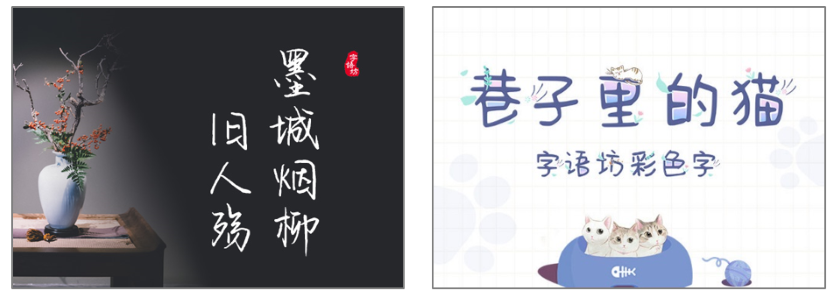

* <strong>搭配创意性</strong>

背景图不建议使用简单拼凑、无美感的图片。

优秀案例：

* <strong>构图美观性</strong>

背景图形象建议保持简洁清晰。

优秀案例：

* <strong>视觉清晰性</strong>

建议文案字号大小合理，清晰可识别。

优秀案例：

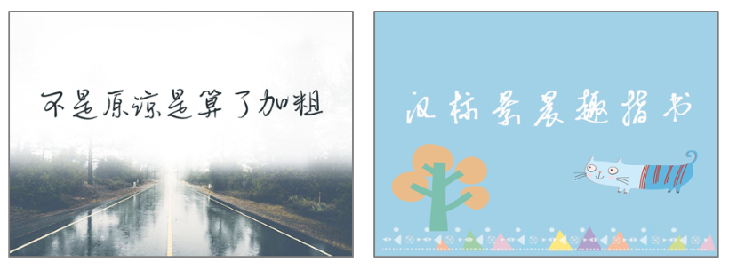

* <strong>差异性</strong>

  建议每个CP上传相同字形的资源不多于3个，每个资源要体现明显的粗细变化或颜色变化。

* <strong>字体预览图</strong>

  设计尺寸：

  640x 458px；640 x 640PX

  要求：

  1、字数要求在8字以内

  每排字数要求在4字以内 超出另起一排

  2、装饰画面内容需要在安全区外进行创作，需要保证不影响文字内容

  3、若背景为照片等整幅内容 需要添加半径不低于2px高斯模糊滤镜

  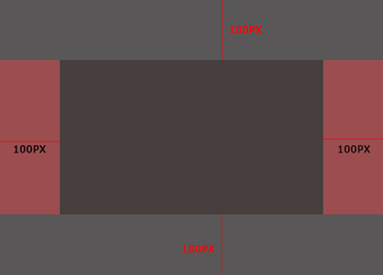 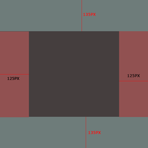

## 3.表盘资源规范

建议表盘资源遵守以下原则：

* <strong>风格协调性</strong>

背景、时间（指针/数字时间）、数据显示的整体风格需要一致，例如：商务风格背景不可结合卡通类指针上架。

优秀案例：

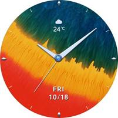 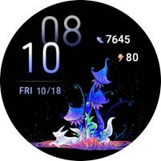

* <strong>可识别性</strong>

在保证整体和谐前提下，建议时间、数据显示与表盘背景颜色有一定区别，清晰可识别。

优秀案例：

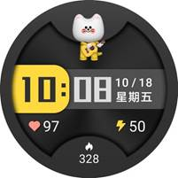 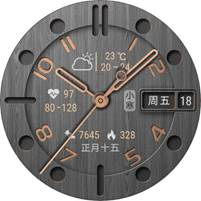

* <strong>准确性</strong>

实际应用效果、预览图应与描述说明一致，交互类不可出现bug，例如：实际时间为10:08，表盘应用后时间不显示或显示错误。

优秀案例：

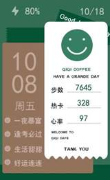 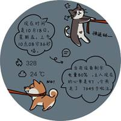

* <strong>色彩合理性</strong>

色彩搭配和谐，不建议出现视觉上会引起不适感的配色。

优秀案例：

 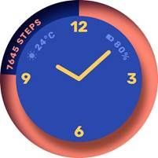

* <strong>搭配创意性</strong>

不建议使用简单拼凑、无美感的图片。

优秀案例：

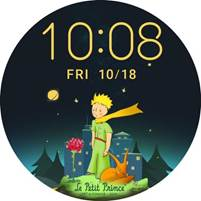 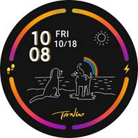

* <strong>构图美观性</strong>

不建议使用画面变形杂乱、马赛克等素材，保持画面简洁清晰。

优秀案例：

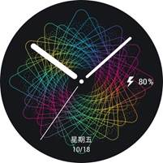 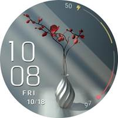

* <strong>视觉清晰性</strong>

不建议使用模糊图片，否则影响用户视觉体验。

优秀案例：

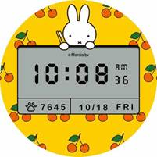 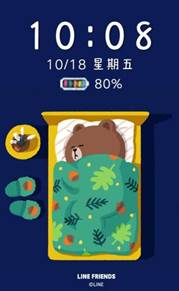

## 4.AOD熄屏显示资源规范

建议AOD资源遵守以下原则：

* <strong>风格协调性</strong>

画面、数字时间的整体风格需要一致，例如：商务风格画面不可结合卡通类时间样式上架。

优秀案例：

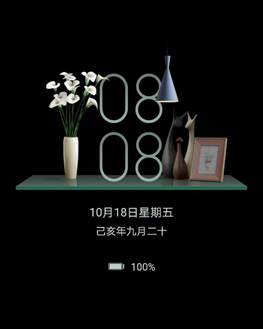 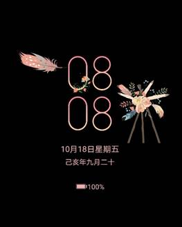

* <strong>可识别性</strong>

在保证整体和谐前提下，建议时间与画面颜色有一定区别，清晰可识别。

优秀案例：

 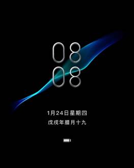

* <strong>准确性</strong>

预览图设计不建议采用夸张的设计效果，需与实际AOD应用效果相符。

优秀案例：

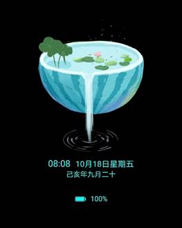 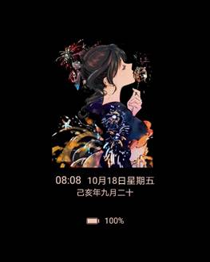

* <strong>色彩合理性</strong>

色彩搭配和谐，不建议出现视觉上会引起不适感的配色。

优秀案例：

 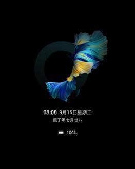

* <strong>搭配创意性</strong>

不建议使用简单拼凑、无美感的图片。

优秀案例：

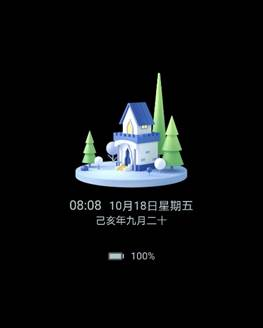 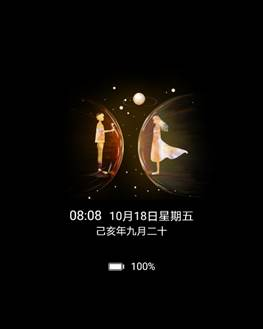

* <strong>构图美观性</strong>

不建议使用画面变形杂乱、马赛克等素材，保持画面简洁清晰。

优秀案例：

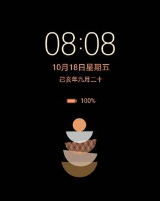 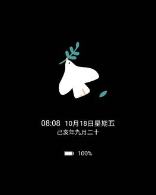

* <strong>视觉清晰性</strong>

不建议使用模糊图片，否则影响用户视觉体验。

优秀案例：

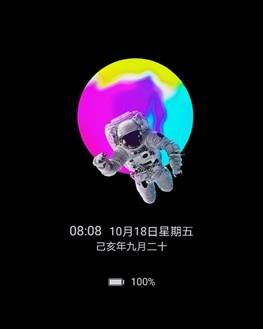 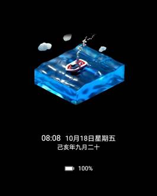