# 字体

## 1. 字体上传

第一次上传字体，请按以下操作：

1. 点击“作品上传”，左侧导航栏选择字体，点击“创建作品”，选择字体类型，完善字体基本信息，点击“确定”。

   

   

   

   可变字体与静态字体上传方式一致。
2. 点击“上传字体包”， 上传字体包，完善字体包信息，点击“确定”。

   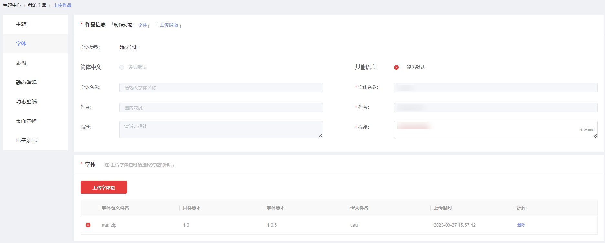
3. 选中成功上传的字体包，上传版权文件。

   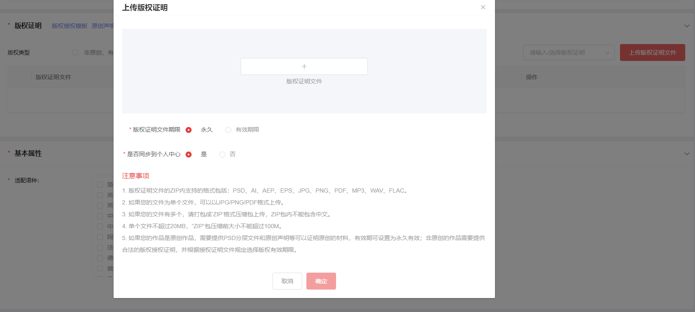
4. 填写基本属性、付费设置、分发国家及区域、标签设置、发布等信息，点击下一步。

   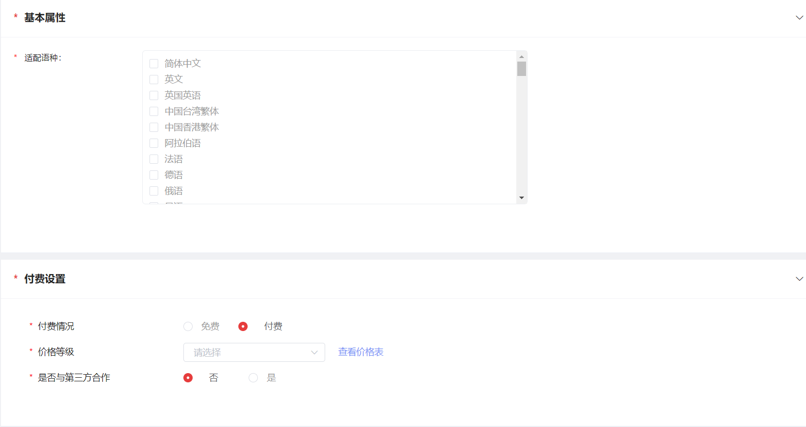

   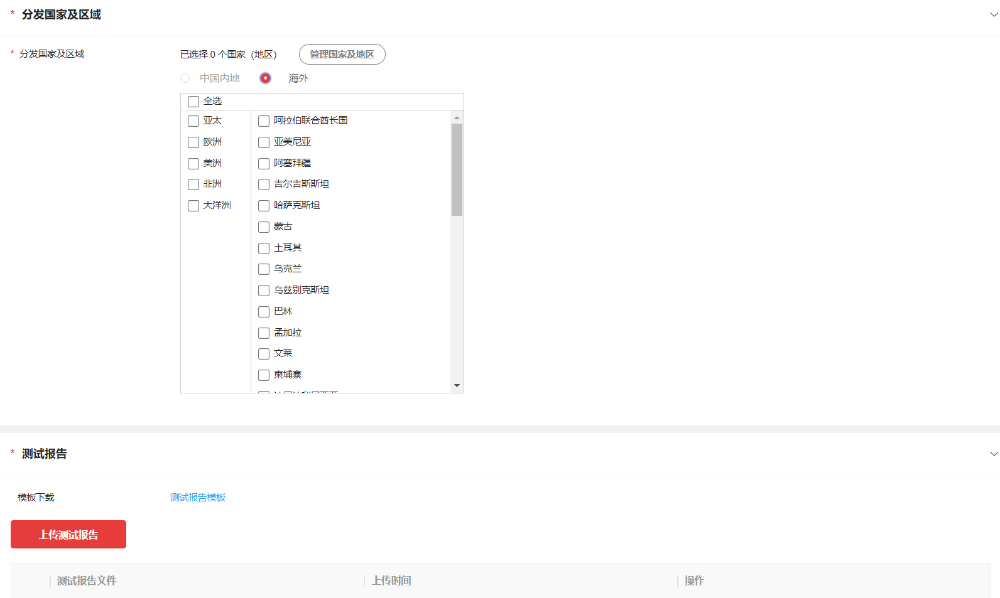

   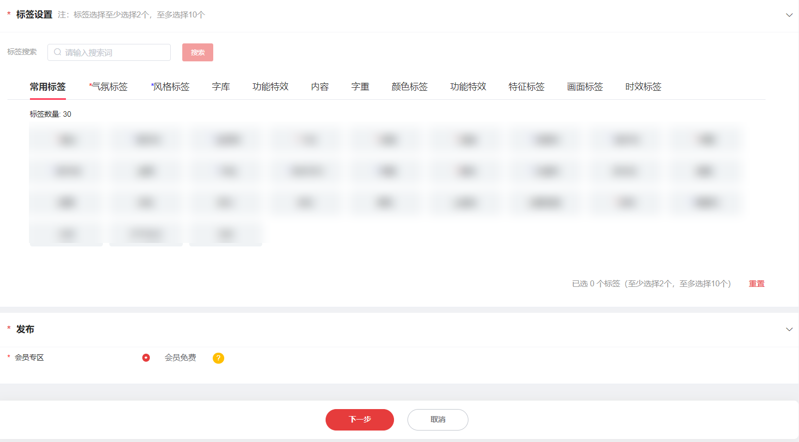
5. 信息确认无误后，点击“提交”。

   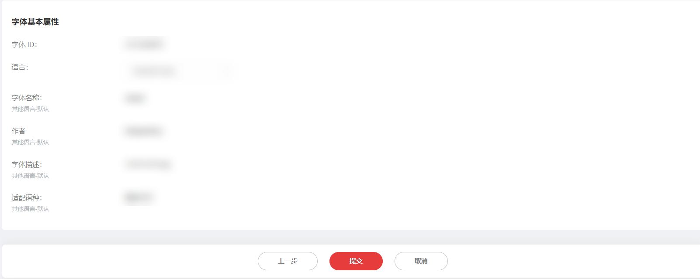
6. 作品列表页对应作品的状态显示为“审核中”，表示上传成功。

   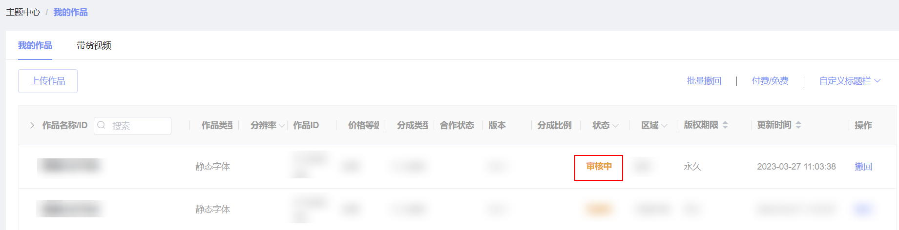

## 2. 字体升级

1. 在“我的作品”页找到需要升级的字体作品，点击“升级”。

   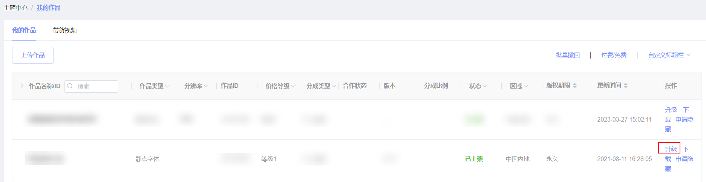
2. 点击“上传字体包”，上传准备好的字体包。

   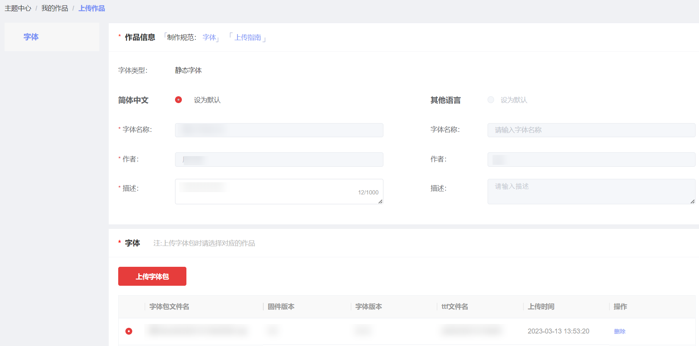
3. 上传成功后，选中新上传的字体包，付费设置不允许修改，勾选更新类型，点击“下一步”。

   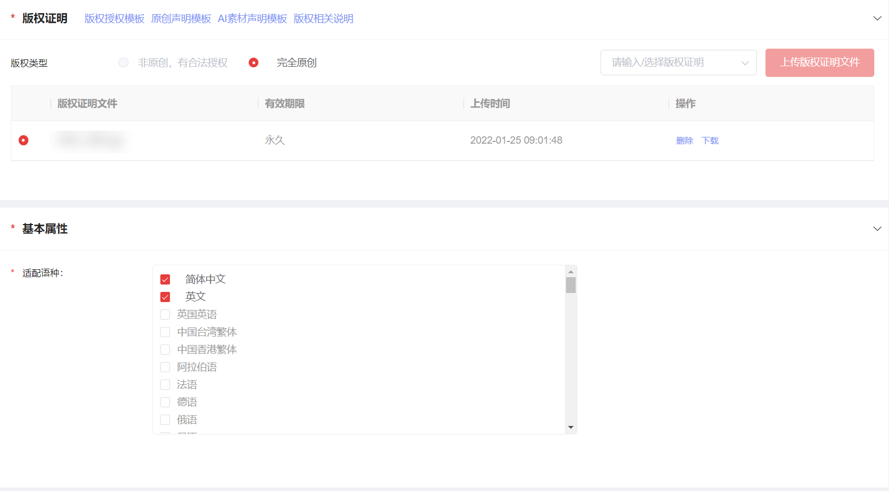

   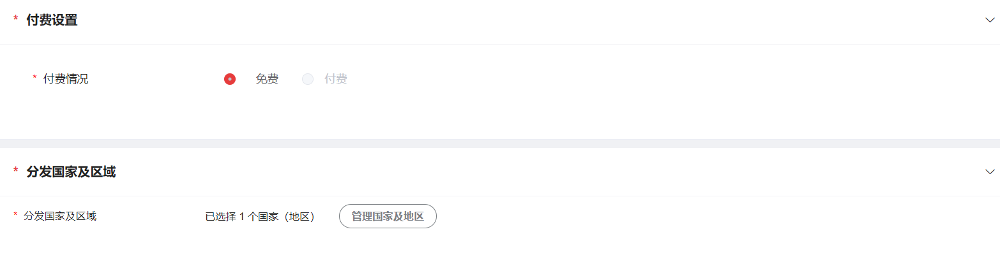

   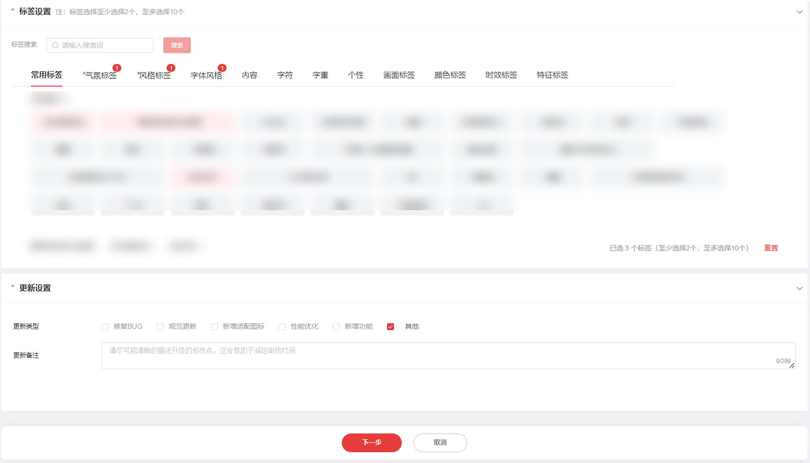
4. 信息确认无误后，点击“提交”。

   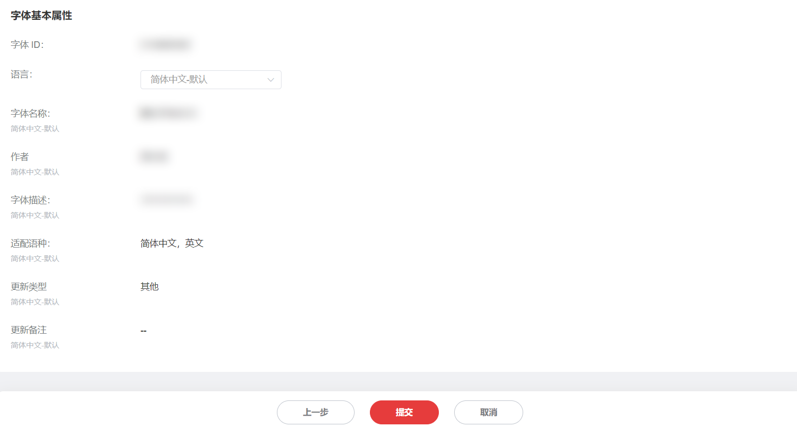
5. 作品页对应作品的状态显示为“升级中”，表示上传成功。

   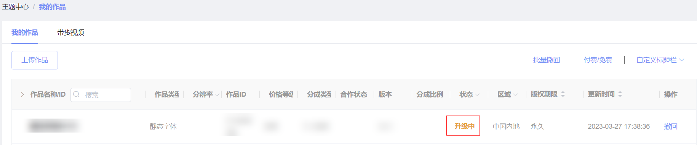